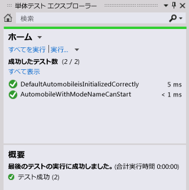

# チュートリアル: 使用法から生成機能のテスト ファースト開発

このトピックでは、テスト ファースト開発をサポートする[使用法から生成](../ide/visual-csharp-intellisense.md#generate-from-usage)機能の使用方法について説明します。

 *テスト ファースト開発* は、最初に製品仕様に基づいて単体テストを記述してから、テストが成功するために必要なソース コードを記述するソフトウェア設計の方法です。 Visual Studio は、新しい型とメンバーを定義する前に、テスト ケースで最初にこれらを参照するときにソース コードに生成することで、テスト ファースト開発をサポートします。

 Visual Studio では、新しい型とメンバーを生成する際、ワークフローへの割り込みは最小限に抑えられます。 現在のコード位置から離れずに、型、メソッド、プロパティ、フィールド、またはコンストラクターのスタブを作成できます。 ダイアログ ボックスを開いて型生成のオプションを指定すると、ダイアログ ボックスを閉じたときに、現在開いているファイルにフォーカスがすぐに戻ります。

 **使用法から生成**機能は、Visual Studio と統合されるテスト フレームワークで使用することができます。 このトピックでは、Microsoft 単体テスト フレームワークについて説明します。

[!INCLUDE[note_settings_general](../data-tools/includes/note_settings_general_md.md)]

### Windows クラス ライブラリ プロジェクトとテスト プロジェクトを作成する

1. [!INCLUDE[csprcs](../data-tools/includes/csprcs_md.md)] または [!INCLUDE[vbprvb](../code-quality/includes/vbprvb_md.md)] で、新しい **Windows クラス ライブラリ** プロジェクトを作成します。 使用している言語に応じて `GFUDemo_VB` または `GFUDemo_CS`という名前を付けます。

2. **ソリューション エクスプローラー**の上部にあるソリューション アイコンを右クリックし、**[追加]** を選択してから **[新しいプロジェクト]** を選択します。 **[新しいプロジェクト]** ダイアログ ボックスの左ペインで、**[テスト]** を選択します。

3. 中央のペインで、**[単体テスト プロジェクト]** を選択し、`UnitTestProject1` の既定の名前をそのまま使用します。 [!INCLUDE[csprcs](../data-tools/includes/csprcs_md.md)] で表示されるダイアログ ボックスを次の図に示します。 [!INCLUDE[vbprvb](../code-quality/includes/vbprvb_md.md)] のダイアログ ボックスも同様です。

    ![[新しいテスト プロジェクト] ダイアログ](../ide/media/newproject_test.png)

4. **[OK]** を選択して、**[新しいプロジェクト]** ダイアログ ボックスを閉じます。

### クラス ライブラリ プロジェクトに参照を追加する

1.  **ソリューション エクスプローラー**で、単体クラス プロジェクトの **[参照]** エントリを右クリックし、**[参照の追加]** を選択します。

2.  **[参照マネージャー]** ダイアログ ボックスで、**[プロジェクト]** を選択してからクラス ライブラリ プロジェクトを選択します。

3.  **[OK]** を選択して **[参照マネージャー]** ダイアログ ボックスを閉じます。

4.  ソリューションを保存します。 これで、テストの記述を開始できるようになりました。

### 単体テストから新しいクラスを生成する

1. テスト プロジェクトには、*UnitTest1* という名前のファイルが含まれています。 **ソリューション エクスプローラー** でこのファイルをダブルクリックして、コード エディターで開きます。 テスト クラスとテスト メソッドが生成されています。

2. クラス `UnitTest1` の宣言を検索して、この名前を `AutomobileTest`に変更します。

   > [!NOTE]
   >  現在、IntelliSense では、IntelliSense のステートメント入力候補に対して、 *完了モード* と *提案モード*の 2 つの方法を提供しています。 まだ定義していないクラスやメンバーを使用する場合は、提案モードを使用します。 **IntelliSense** ウィンドウが開いているときに、**Ctrl**+**Alt**+**Space** キーを押すと、完了モードと提案モードを切り替えることができます。 詳細については、[IntelliSense の使用](../ide/using-intellisense.md)に関するページを参照してください。 提案モードは、次の手順で「 `Automobile` 」と入力する際に役立ちます。

3. `TestMethod1()` メソッドを検索して、この名前を `DefaultAutomobileIsInitializedCorrectly()`に変更します。 次のスクリーンショットに示されているように、このメソッド内に `Automobile` というクラスの新しいインスタンスを作成します。 コンパイル時のエラーを示す波下線が表示され、[クイック アクション](../ide/quick-actions.md)のエラー電球が左の余白に表示されるか、カーソルを移動すると波線の下に直接表示されます。

    

    

4. **クイック アクション** (電球) を選択するかクリックします。 `Automobile` 型が定義されていないことを示すエラー メッセージが表示されます。 ソリューションもいくつか表示されます。

5. **[新しい型の生成]** をクリックして、**[型の生成]** ダイアログ ボックスを開きます。 このダイアログ ボックスでは、別のプロジェクトでの型の生成を含むオプションが提供されます。

6. **[プロジェクト]** の一覧で、**[GFUDemo\_VB]** または **[GFUDemo_CS]** をクリックして、テスト プロジェクトではなくクラス ライブラリ プロジェクトにファイルを追加するように Visual Studio に指示します。 **[新しいファイルの作成]** がまだ選択されていない場合は選択し、*Automobile.cs* または *Automobile.vb* という名前を付けます。

     ![[新しい型の生成] ダイアログ ボックス](../ide/media/genotherdialog.png)

7. **[OK]** をクリックしてダイアログ ボックスを閉じ、新しいファイルを作成します。

8. **ソリューション エクスプローラー**で、**GFUDemo_VB** または **GFUDemo_CS** プロジェクト ノードの下に新しい *Automobile.vb* または *Automobile.cs* ファイルが存在することを確認します。 コード エディターでは、まだ `AutomobileTest.DefaultAutomobileIsInitializedCorrectly` にフォーカスがあり、中断を最小限に抑えて、テストの記述を続行できます。

### プロパティ スタブを生成する
`Automobile` クラスに `Model` と `TopSpeed`という 2 つのパブリック プロパティがあることを示す製品仕様があるとします。 これらのプロパティは、既定のコンストラクターによって、 `"Not specified"` と `-1` の既定値で初期化されている必要があります。 次の単体テストでは、既定のコンストラクターが適切な既定値にプロパティを設定することを検証します。

1. `DefaultAutomobileIsInitializedCorrectly` テスト メソッドに次のコード行を追加します。

     [!code-csharp[VbTDDWalkthrough#1](../ide/codesnippet/CSharp/walkthrough-test-first-support-with-the-generate-from-usage-feature_1.cs)]
     [!code-vb[VbTDDWalkthrough#1](../ide/codesnippet/VisualBasic/walkthrough-test-first-support-with-the-generate-from-usage-feature_1.vb)]

2. コードは `Automobile` の 2 つの未定義プロパティを参照するため、`Model` と `TopSpeed` の下に波下線が表示されます。 `Model` にカーソルを移動し、**クイック アクション**のエラー電球を選択してから、**[プロパティ 'Automobile.Model' を生成します]** を選択します。

3. `TopSpeed` プロパティのプロパティ スタブも同様に生成します。

     `Automobile` クラスでは、新しいプロパティの型はコンテキストから正しく推定されます。

### 新しいコンストラクターのスタブを生成する
ここでは、`Model` および `TopSpeed` プロパティを初期化するコンストラクター スタブを生成するテスト メソッドを作成します。 後でコードを追加してテストを完成させます。

1. 次の追加のテスト メソッドを `AutomobileTest` クラスに追加します。

     [!code-csharp[VbTDDWalkthrough#2](../ide/codesnippet/CSharp/walkthrough-test-first-support-with-the-generate-from-usage-feature_2.cs)]
     [!code-vb[VbTDDWalkthrough#2](../ide/codesnippet/VisualBasic/walkthrough-test-first-support-with-the-generate-from-usage-feature_2.vb)]

2.  赤い波線の下にある**クイック アクション**のエラー電球をクリックしてから、**['Automobile' にコンストラクターを生成します]** をクリックします。

     `Automobile` クラス ファイルで、新しいコンストラクターがコンストラクター呼び出しで使用されているローカル変数の名前を調べ、 `Automobile` クラスで同じ名前のプロパティを見つけ、 `Model` および `TopSpeed` プロパティに引数値を格納するためのコードをコンストラクター本体に指定に指定したことがわかります

3.  新しいコンストラクターを生成すると、 `DefaultAutomobileIsInitializedCorrectly`の既定のコンストラクター呼び出しの下に波線が表示されます。 `Automobile` クラスには、0 個の引数を受け取るコンストラクターがないことを示すエラー メッセージが表示されます。 パラメーターを持たない明示的な既定のコンストラクターを生成するには、**クイック アクション**のエラー電球をクリックし、**['Automobile' にコンストラクターを生成します]** をクリックします。

### メソッドのスタブを生成する
仕様で、`Model` および `TopSpeed` プロパティが既定値以外に設定されている場合は、新しい `Automobile` を `IsRunning` 状態にできることが示されているとします。

1. 次の行を `AutomobileWithModelNameCanStart` メソッドに追加します。

     [!code-csharp[VbTDDWalkthrough#3](../ide/codesnippet/CSharp/walkthrough-test-first-support-with-the-generate-from-usage-feature_3.cs)]
     [!code-vb[VbTDDWalkthrough#3](../ide/codesnippet/VisualBasic/walkthrough-test-first-support-with-the-generate-from-usage-feature_3.vb)]

2.  `myAuto.Start` メソッド呼び出しの**クイック アクション**のエラー電球をクリックしてから、**[メソッド 'Automobile.Start' を生成します]** をクリックします。

3.  `IsRunning` プロパティの**クイック アクション** (電球) をクリックしてから、**[プロパティ 'Automobile.IsRunning' を生成します]** をクリックします。

     これで、`Automobile` クラスに `Start()` という名前のメソッドと `IsRunning` という名前のプロパティが含まれるようになりました。

### テストを実行

1.  **[テスト]** メニューで **[実行]** > **[すべてのテスト]** を選びます。

     **[実行]** > **[すべてのテスト]** コマンドは、現在のソリューション用に作成されたテスト フレームワークですべてのテストを実行します。 この場合、2 つのテストがありますが、どちらも失敗することが予想されます。 `DefaultAutomobileIsInitializedCorrectly` テストは、 `Assert.IsTrue` 条件が `False`を返すため失敗します。 `AutomobileWithModelNameCanStart` テストは、 `Start` クラスの `Automobile` メソッドが例外をスローするため失敗します。

     次の図に **[テスト結果]** ウィンドウを示します。

     

2.  **[テスト結果]** ウィンドウで、各テスト結果の行をダブルクリックして、各テストの場所に移動します。

### ソース コードを実装する

1.  次のコードを既定のコンストラクターに追加して、`Model`、`TopSpeed` および `IsRunning` のプロパティがすべて `"Not specified"`、`-1` および `False` (C# の場合は `false`) の適切な既定値に初期化されるようにします。

     [!code-csharp[VbTDDWalkthrough#5](../ide/codesnippet/CSharp/walkthrough-test-first-support-with-the-generate-from-usage-feature_5.cs)]
     [!code-vb[VbTDDWalkthrough#5](../ide/codesnippet/VisualBasic/walkthrough-test-first-support-with-the-generate-from-usage-feature_5.vb)]

2.  `Start` メソッドが呼び出されたときに、 `IsRunning` または `Model` プロパティが既定値以外に設定されている場合にのみ `TopSpeed` フラグを true に設定する必要があります。 メソッド本体から `NotImplementedException` を削除して次のコードを追加します。

     [!code-csharp[VbTDDWalkthrough#6](../ide/codesnippet/CSharp/walkthrough-test-first-support-with-the-generate-from-usage-feature_6.cs)]
     [!code-vb[VbTDDWalkthrough#6](../ide/codesnippet/VisualBasic/walkthrough-test-first-support-with-the-generate-from-usage-feature_6.vb)]

### テストをもう一度実行する

- **[テスト]** メニューの **[実行]** をポイントし、**[すべてのテスト]** をクリックします。

     今回はテストに合格します。 次の図に **[テスト結果]** ウィンドウを示します。

     

## 関連項目

- [使用法から生成](../ide/visual-csharp-intellisense.md#generate-from-usage)
- [コード エディターの機能](../ide/writing-code-in-the-code-and-text-editor.md)
- [IntelliSense を使用する](../ide/using-intellisense.md)
- [コードの単体テスト](../test/unit-test-your-code.md)
- [クイック アクション](../ide/quick-actions.md)