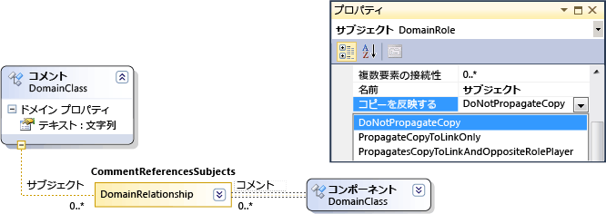
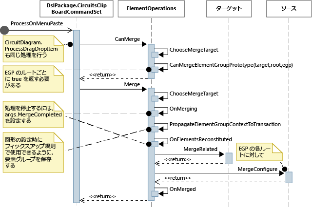

# コピー動作のカスタマイズ
[!INCLUDE[vs2017banner](../code-quality/includes/vs2017banner.md)]

[!INCLUDE[vsprvs](../code-quality/includes/vsprvs_md.md)] Visualization and Modeling SDK を使用して作成したドメイン固有言語 \(DSL\) で、ユーザーが要素のコピーと貼り付けを実行する際の動作を変更できます。  
  
## コピーと貼り付けの標準動作  
 コピーを有効にするには、DSL エクスプローラーで、**\[エディター\]** ノードの **\[コピー貼り付けの有効化\]** プロパティを設定します。  
  
 既定では、ユーザーが要素をクリップボードにコピーすると、次の要素もコピーされます。  
  
-   選択した要素の埋め込まれた子。  \(つまり、コピーした要素をソースとする埋め込みリレーションシップのターゲットである要素\)。  
  
-   コピーした要素間のリレーションシップ リンク。  
  
 この規則はコピーした要素およびリンクに再帰的に適用されます。  
  
   
  
 コピーした要素およびリンクはシリアル化され、<xref:Microsoft.VisualStudio.Modeling.ElementGroupPrototype> \(EGP\) に格納されて、クリップボードに配置されます。  
  
 コピーした要素のイメージもクリップボードに配置されます。  これにより、ユーザーは Word など、他のアプリケーションに貼り付けることができます。  
  
 ユーザーはコピーした要素を、DSL 定義に従って要素を受け入れることが可能なターゲットに貼り付けることができます。  たとえば、コンポーネント ソリューション テンプレートから生成された DSL で、ユーザーはポートをコンポーネントに貼り付けることができますが、図に貼り付けることはできません。また、コンポーネントを図に貼り付けることができますが、他のコンポーネントに貼り付けることはできません。  
  
## コピーと貼り付け動作のカスタマイズ  
 プログラム コードを使用したモデルのカスタマイズの詳細については、「[プログラム コードにおけるモデル内の移動およびモデルの更新](../modeling/navigating-and-updating-a-model-in-program-code.md)」を参照してください。  
  
 **コピー、切り取り、および貼り付けを有効または無効にします。**  
 DSL エクスプローラーで、**\[エディター\]** ノードの **\[コピー貼り付けの有効化\]** プロパティを設定します。  
  
 **リンクを同じターゲットにコピーします。**たとえば、コピーしたコメント ボックスを同じ件名の要素にリンクします。  
 ロールの **\[コピーの伝達\]** プロパティを **\[コピーをリンクのみに伝達\]** に設定します。  詳細については、「[リンク コピー動作のカスタマイズ](#customizeLinks)」を参照してください。  
  
 リンクされた要素をコピーします。たとえば、新しい要素をコピーすると、リンクされたすべてのコメント ボックスのコピーも作成されます。  
 ロールの **\[コピーの伝達\]** プロパティを **\[コピーをリンクおよび反対のロール プレーヤーに伝達\]** に設定します。  詳細については、「[リンク コピー動作のカスタマイズ](#customizeLinks)」を参照してください。  
  
 **コピーと貼り付けにより要素をすばやく複製します。**通常、コピーしたばかりの項目はまだ選択されており、そこに同じ種類の要素を貼り付けることはできません。  
 ドメイン クラスに要素マージ ディレクティブを追加し、マージを親クラスに転送するように設定します。  これはドラッグ操作に同じ効果を持ちます。  詳細については、「[要素作成処理および要素移動処理のカスタマイズ](../modeling/customizing-element-creation-and-movement.md)」を参照してください。  
  
 または  
  
 `ClipboardCommandSet.ProcessOnPasteCommand()` をオーバーライドすることにより、要素を貼り付ける前に図を選択します。  DslPackage プロジェクト内のカスタム ファイルに次のコードを追加します。  
  
```c#  
namespace Company.MyDsl {  
using System.Linq;  
using Microsoft.VisualStudio.Modeling.Diagrams;   
using Microsoft.VisualStudio.Modeling.Shell;  
partial class MyDslClipboardCommandSet  
{  
  protected override void ProcessOnMenuPasteCommand()  
  {  
 // Deselect the current selection after copying:  
 Diagram diagram = (this.CurrentModelingDocView as SingleDiagramDocView).Diagram;  
    this.CurrentModelingDocView  
     .SelectObjects(1, new object[] { diagram }, 0);  
  }  
} }  
  
```  
  
 **選択したターゲットにユーザーが貼り付けるときに追加のリンクを作成します。**たとえば、要素にコメント ボックスが貼り付けられると、それらの間にリンクが作成されます。  
 ターゲット ドメイン クラスに要素マージ ディレクティブを追加し、リンクを追加することでマージを処理するように設定します。  これはドラッグ操作に同じ効果を持ちます。  詳細については、「[要素作成処理および要素移動処理のカスタマイズ](../modeling/customizing-element-creation-and-movement.md)」を参照してください。  
  
 または  
  
 `ClipboardCommandSet.ProcessOnPasteCommand()` をオーバーライドし、基本のメソッドを呼び出した後で、追加のリンクを作成します。  
  
 外部アプリケーションに**要素がコピーされる形式をカスタマイズ**します \(たとえば、ビットマップ フォームへの枠の追加など\)。  
 DslPackage プロジェクト内の *MyDsl*`ClipboardCommandSet.ProcessOnMenuCopyCommand()` をオーバーライドします。  
  
 **コピー コマンドにより要素がクリップボードにコピーされる動作をカスタマイズします \(ドラッグ操作は対象外\)。**  
 DslPackage プロジェクト内の *MyDsl*`ClipboardCommandSet.CopyModelElementsIntoElementGroupPrototype()` をオーバーライドします。  
  
 **コピーと貼り付けを通して、図形レイアウトを保持します。**  
 ユーザーが複数の図形をコピーする場合、それらが貼り付けられるときの相対位置を保持できます。  この手法は「[VMSDK: 回路図のサンプル](http://go.microsoft.com/fwlink/?LinkId=213879)」の例で示されています。  
  
 この効果を得るには、コピーした ElementGroupPrototype に図形とコネクタを追加します。  オーバーライドする最も便利なメソッドは ElementOperations.CreateElementGroupPrototype\(\) です。  そのためには、次のコードを Dsl プロジェクトに追加します。  
  
```c#  
  
public class MyElementOperations : DesignSurfaceElementOperations  
{  
  // Create an EGP to add to the clipboard.  
  // Called when the elements to be copied have been  
  // collected into an ElementGroup.  
 protected override ElementGroupPrototype CreateElementGroupPrototype(ElementGroup elementGroup, ICollection<ModelElement> elements, ClosureType closureType)  
  {  
 // Add the shapes and connectors:  
 // Get the elements already in the group:  
    ModelElement[] mels = elementGroup.ModelElements  
        .Concat(elementGroup.ElementLinks) // Omit if the paste target is not the diagram.  
        .ToArray();  
 // Get their shapes:  
    IEnumerable<PresentationElement> shapes =   
       mels.SelectMany(mel =>   
            PresentationViewsSubject.GetPresentation(mel));  
    elementGroup.AddRange(shapes);  
  
 return base.CreateElementGroupPrototype  
           (elementGroup, elements, closureType);  
  }  
  
 public MyElementOperations(IServiceProvider serviceProvider, ElementOps1Diagram diagram)  
      : base(serviceProvider, diagram)  
  { }  
}  
  
// Replace the standard ElementOperations  
// singleton with your own:  
partial class MyDslDiagram // EDIT NAME  
{  
 /// <summary>  
 /// Singleton ElementOperations attached to this diagram.  
 /// </summary>  
 public override DesignSurfaceElementOperations ElementOperations  
  {  
 get  
    {  
 if (singleton == null)  
      {  
        singleton = new MyElementOperations(this.Store as IServiceProvider, this);  
      }  
 return singleton;  
    }  
  }  
 private MyElementOperations singleton = null;  
}  
  
```  
  
 **現在のカーソル位置など、選択した場所に図形を貼り付けます。**  
 ユーザーが複数の図形をコピーする場合、それらが貼り付けられるときの相対位置を保持できます。  この手法は「[VMSDK: 回路図のサンプル](http://go.microsoft.com/fwlink/?LinkId=213879)」の例で示されています。  
  
 この効果を得るには、`ClipboardCommandSet.ProcessOnMenuPasteCommand()` をオーバーライドし、`ElementOperations.Merge()` の場所固有のバージョンを使用します。  そのためには、次のコードを DslPackage プロジェクトに追加します。  
  
```c#  
  
partial class MyDslClipboardCommandSet // EDIT NAME  
{  
   /// <summary>  
    /// This method assumes we only want to paste things onto the diagram  
    /// - not onto anything contained in the diagram.  
    /// The base method pastes in a free space on the diagram.  
    /// But if the menu was used to invoke paste, we want to paste in the cursor position.  
    /// </summary>  
    protected override void ProcessOnMenuPasteCommand()  
    {  
  
  NestedShapesSampleDocView docView = this.CurrentModelingDocView as NestedShapesSampleDocView;  
  
      // Retrieve data from clipboard:  
      System.Windows.Forms.IDataObject data = System.Windows.Forms.Clipboard.GetDataObject();  
  
      Diagram diagram = docView.CurrentDiagram;  
      if (diagram == null) return;  
  
      if (!docView.IsContextMenuShowing)  
      {  
        // User hit CTRL+V - just use base method.  
  
        // Deselect anything that's selected, otherwise  
        // pasted item will be incompatible:  
        if (!this.IsDiagramSelected())  
        {  
          docView.SelectObjects(1, new object[] { diagram }, 0);  
        }  
  
        // Paste into a convenient spare space on diagram:  
    base.ProcessOnMenuPasteCommand();  
      }  
      else  
      {  
        // User right-clicked - paste at mouse position.  
  
        // Utility class:  
        DesignSurfaceElementOperations op = diagram.ElementOperations;  
  
        ShapeElement pasteTarget = diagram;  
  
        // Check whether what's in the paste buffer is acceptable on the target.  
        if (pasteTarget != null && op.CanMerge(pasteTarget, data))  
        {  
  
        // Although op.Merge would be a no-op if CanMerge failed, we check CanMerge first  
          // so that we don't create an empty transaction (after which Undo would be no-op).  
          using (Transaction t = diagram.Store.TransactionManager.BeginTransaction("paste"))  
          {  
            PointD place = docView.ContextMenuMousePosition;  
            op.Merge(pasteTarget, data, PointD.ToPointF(place));  
            t.Commit();  
          }  
        }  
      }  
    }  
  }  
```  
  
 **ユーザーが要素をドラッグ アンド ドロップ可能にします。**  
 「[方法: ドラッグ アンド ドロップ ハンドラーを追加する](../modeling/how-to-add-a-drag-and-drop-handler.md)」を参照してください。  
  
##  <a name="customizeLinks"></a> リンク コピー動作のカスタマイズ  
 ユーザーが要素をコピーするときの標準動作は埋め込まれたすべての要素もコピーされることです。  このコピー標準動作は変更できます。  DSL 定義で、リレーションシップの片側でロールを選択し、\[プロパティ\] ウィンドウで **\[コピーの伝達\]** 値を設定します。  
  
   
  
 次の 3 つの値があります。  
  
-   コピーを伝達しない  
  
-   コピーをリンクのみに伝達する \- グループを貼り付けると、このリンクの新しいコピーは、リンクの他端の既存の要素を参照します。  
  
-   コピーをリンクおよび反対のロール プレーヤーに伝達する \- コピーしたグループにリンクの他端の要素のコピーが含まれます。  
  
   
  
 変更内容はコピーする要素とイメージの両方に影響します。  
  
## コピーと貼り付け動作のプログラミング  
 オブジェクトのコピー、貼り付け、作成、および削除に関する DSL の動作の多くの側面は、図に結合されている <xref:Microsoft.VisualStudio.Modeling.ElementOperations> のインスタンスにより規定されます。  <xref:Microsoft.VisualStudio.Modeling.ElementOperations> から独自のクラスを導出し、図のクラスの <xref:Microsoft.VisualStudio.Modeling.Diagrams.Diagram.ElementOperations%2A> プロパティをオーバーライドすることにより、DSL の動作を変更できます。  
  
> [!TIP]
>  プログラム コードを使用したモデルのカスタマイズの詳細については、「[プログラム コードにおけるモデル内の移動およびモデルの更新](../modeling/navigating-and-updating-a-model-in-program-code.md)」を参照してください。  
  
   
  
   
  
#### 独自の ElementOperations を定義するには  
  
1.  DSL プロジェクト内の新しいファイルに、<xref:Microsoft.VisualStudio.Modeling.Diagrams.DesignSurfaceElementOperations> から派生するクラスを作成します。  
  
2.  図のクラス用に部分クラス定義を追加します。  このクラスの名前は **Dsl\\GeneratedCode\\Diagrams.cs** で確認できます。  
  
     図のクラスで、<xref:Microsoft.VisualStudio.Modeling.Diagrams.Diagram.ElementOperations%2A> をオーバーライドし、ElementOperations サブクラスのインスタンスを返します。  呼び出しのたびに同じインスタンスを返す必要があります。  
  
 DslPackage プロジェクト内のカスタム コード ファイルに次のコードを追加します。  
  
```c#  
  
using Microsoft.VisualStudio.Modeling;  
using Microsoft.VisualStudio.Modeling.Diagrams;  
using Microsoft.VisualStudio.Modeling.Diagrams.ExtensionEnablement;  
  
  public partial class MyDslDiagram  
  {  
    public override DesignSurfaceElementOperations ElementOperations  
    {  
      get  
      {  
        if (this.elementOperations == null)  
        {  
          this.elementOperations = new MyElementOperations(this.Store as IServiceProvider, this);  
        }  
        return this.elementOperations;  
      }  
    }  
    private MyElementOperations elementOperations = null;  
  }  
  
  public class MyElementOperations : DesignSurfaceElementOperations  
  {  
    public MyElementOperations(IServiceProvider serviceProvider, MyDslDiagram diagram)  
      : base(serviceProvider, diagram)  
    { }  
    // Overridden methods follow  
  }  
  
```  
  
## 他のモデルからドラッグした項目の受信  
 ElementOperations を使用して、コピー、移動、削除、およびドラッグ アンド ドロップの動作を定義することもできます。  ElementOperations の使用デモとして、ここに示す例はドラッグ アンド ドロップのカスタム動作を定義します。  ただし、この目的ではより拡張性のある、「[方法: ドラッグ アンド ドロップ ハンドラーを追加する](../modeling/how-to-add-a-drag-and-drop-handler.md)」で説明している代替方法を検討できます。  
  
 ElementOperations クラスに次の 2 つのメソッドを定義します。  
  
-   ソース要素をターゲットの図形、コネクタ、または図にドラッグ可能かどうかを決定する `CanMerge(ModelElement targetElement, System.Windows.Forms.IDataObject data)`。  
  
-   ソース要素をターゲットに結合する `MergeElementGroupPrototype(ModelElement targetElement, ElementGroupPrototype sourcePrototype)`。  
  
### CanMerge\(\)  
 `CanMerge()` は、マウスが図の上を移動するときにユーザーに示されるフィードバックを決定するために呼び出されます。  メソッドへのパラメーターは、マウスを置く要素とドラッグ操作が実行されたソースに関するデータです。  ユーザーは画面上の任意の場所からドラッグできます。  したがって、ソース オブジェクトとして多数の種類が考えられ、さまざまな形式でシリアル化されます。  ソースが DSL または UML モデルの場合、データ パラメーターは <xref:Microsoft.VisualStudio.Modeling.ElementGroupPrototype> のシリアル化です。  ドラッグ、コピー、およびツールボックス操作は ElementGroupPrototypes を使用してモデルの断片を表します。  
  
 要素グループ プロトタイプは任意の数の要素およびリンクを含むことができます。  要素の種類はその GUID により識別できます。  GUID はドラッグした図形のものであり、基になるモデル要素のものではありません。  次の例で、`CanMerge()` は、クラスの図形を UML 図からこの図にドラッグした場合に true を返します。  
  
```c#  
public override bool CanMerge(ModelElement targetShape, System.Windows.Forms.IDataObject data)  
 {  
  // Extract the element prototype from the data.  
  ElementGroupPrototype prototype = ElementOperations.GetElementGroupPrototype(this.ServiceProvider, data);  
  if (targetShape is MyTargetShape && prototype != null &&  
        prototype.RootProtoElements.Any(rootElement =>   
          rootElement.DomainClassId.ToString()   
          ==  "3866d10c-cc4e-438b-b46f-bb24380e1678")) // Guid of UML Class shapes  
          // or SourceClass.DomainClassId  
        return true;  
   return base.CanMerge(targetShape, data);  
 }  
  
```  
  
## MergeElementGroupPrototype\(\)  
 このメソッドは、ユーザーが要素を図、図形、またはコネクタにドロップすると呼び出されます。  ドラッグしたコンテンツはターゲット要素にマージされます。  この例で、コードはターゲットとプロトタイプの種類の組み合わせを認識するかどうかを決定します。認識した場合、メソッドはドラッグした要素を、モデルに追加される要素のプロトタイプに変換します。  基本のメソッドは、変換された要素または変換されない要素のいずれかのマージを実行するために呼び出されます。  
  
```c#  
public override void MergeElementGroupPrototype(ModelElement targetShape, ElementGroupPrototype sourcePrototype)  
{  
  ElementGroupPrototype prototypeToMerge = sourcePrototype;  
  MyTargetShape pel = targetShape as MyTargetShape;  
  if (pel != null)  
  {  
    prototypeToMerge = ConvertDraggedTypeToLocal(pel, sourcePrototype);  
  }  
  if (prototypeToMerge != null)  
    base.MergeElementGroupPrototype(targetShape, prototypeToMerge);  
}  
  
```  
  
 この例は UML クラス図からドラッグした UML クラス要素を扱います。  この DSL は UML クラスを直接保管するように設計されていませんが、ドラッグした各 UML クラスについて DSL 要素を作成します。  これはたとえば、DSL がインスタンス図の場合に便利な場合があります。  ユーザーはクラスを図にドラッグし、それらのクラスのインスタンスを作成できます。  
  
```c#  
  
private ElementGroupPrototype ConvertDraggedTypeToLocal (MyTargetShape snapshot, ElementGroupPrototype prototype)  
{  
  // Find the UML project:  
  EnvDTE.DTE dte = snapshot.Store.GetService(typeof(EnvDTE.DTE)) as EnvDTE.DTE;  
  foreach (EnvDTE.Project project in dte.Solution.Projects)  
  {  
    IModelingProject modelingProject = project as IModelingProject;  
    if (modelingProject == null) continue; // not a modeling project  
    IModelStore store = modelingProject.Store;  
    if (store == null) continue;  
    // Look for the shape that was dragged:  
    foreach (IDiagram umlDiagram in store.Diagrams())  
    {  
      // Get modeling diagram that implements UML diagram:  
      Diagram diagram = umlDiagram.GetObject<Diagram>();  
      Guid elementId = prototype.SourceRootElementIds.FirstOrDefault();  
      ShapeElement shape = diagram.Partition.ElementDirectory.FindElement(elementId) as ShapeElement;  
      if (shape == null) continue;  
      IClass classElement = shape.ModelElement as IClass;  
      if (classElement == null) continue;  
  
      // Create a prototype of elements in my DSL, based on the UML element:  
      Instance instance = new Instance(snapshot.Store);  
      instance.Type = classElement.Name;  
      // Pack them into a prototype:  
      ElementGroup group = new ElementGroup(instance);  
      return group.CreatePrototype();  
    }  
  }  
  return null;  
}  
  
```  
  
## コピーの標準動作  
 このセクションのコードは、コピー動作を変更するためにオーバーライド可能なメソッドを示しています。  独自のカスタマイズを実現する方法を説明するために、このセクションでは、コピーに関するメソッドをオーバーライドしながら、標準の動作を変更しないコードを示します。  
  
 ユーザーが CTRL\+C キーを押すか、またはコピー メニュー コマンドを使用すると、メソッド <xref:Microsoft.VisualStudio.Modeling.Shell.ClipboardCommandSet.ProcessOnMenuCopyCommand%2A> が呼び出されます。  セットアップ方法は「**DslPackage\\Generated Code\\CommandSet.cs**」で確認できます。  コマンドのセットアップ方法の詳細については、「[方法: ショートカット メニューにコマンドを追加する](../Topic/How%20to:%20Add%20a%20Command%20to%20the%20Shortcut%20Menu.md)」を参照してください。  
  
 DslPackage プロジェクト内に *MyDsl*`ClipboardCommandSet` の部分クラス定義を追加することにより、ProcessOnMenuCopyCommand をオーバーライドできます。  
  
```c#  
using System.Collections.Generic;  
using System.Drawing;  
using System.Windows.Forms;  
using Microsoft.VisualStudio.Modeling;  
using Microsoft.VisualStudio.Modeling.Diagrams;  
  
partial class MyDslClipboardCommandSet  
{  
  /// <summary>  
  /// Override ProcessOnMenuCopyCommand() to copy elements to the  
  /// clipboard in different formats, or to perform additional tasks  
  /// before or after copying – for example deselect the copied elements.  
  /// </summary>  
  protected override void ProcessOnMenuCopyCommand()  
  {  
    IList<ModelElement> selectedModelElements = this.SelectedElements;  
    if (selectedModelElements.Count == 0) return;  
  
    // System container for clipboard data.  
    // The IDataObject can contain data in several formats.  
    IDataObject dataObject = new DataObject();  
  
    Bitmap bitmap = null; // For export to other programs.  
    try  
    {  
      #region Create EGP for copying to a DSL.  
      this.CopyModelElementsIntoElementGroupPrototype  
                     (dataObject, selectedModelElements);  
      #endregion  
  
      #region Create bitmap for copying to another application.   
      // Find all the shapes associated with this selection:  
      List<ShapeElement> shapes = new List<ShapeElement>(  
        this.ResolveExportedShapesForClipboardImages  
              (dataObject, selectedModelElements));  
  
      bitmap = this.CreateBitmapForClipboard(shapes);  
      if (bitmap != null)  
      {  
        dataObject.SetData(DataFormats.Bitmap, bitmap);  
      }  
      #endregion   
  
      // Add the data to the clipboard:  
      Clipboard.SetDataObject(dataObject, true, 5, 100);  
    }  
    finally  
    {  
      // Dispose bitmap after SetDataObject:  
      if (bitmap != null) bitmap.Dispose();  
    }  
  }  
/// <summary>  
/// Override this to customize the element group that is copied to the clipboard.  
/// </summary>  
protected override void CopyModelElementsIntoElementGroupPrototype(IDataObject dataObject, IList<ModelElement> selectedModelElements)  
{  
  return this.ElementOperations.Copy(dataObject, selectedModelElements);  
}  
}  
```  
  
 各図は ElementOperations の単一インスタンスを含みます。  独自の派生物を供給できます。  このファイルは DSL プロジェクト内に配置可能で、オーバーライドするコードと同じように動作します。  
  
```c#  
using System;  
using System.Collections.Generic;  
using System.Linq;  
using Microsoft.VisualStudio.Modeling;  
using Microsoft.VisualStudio.Modeling.Diagrams;  
  
namespace Company.MyDsl  
{  
  partial class MyDslDiagram  
  {  
    /// <summary>  
    /// Singleton ElementOperations attached to this diagram.  
    /// </summary>  
    public override DesignSurfaceElementOperations ElementOperations  
    {  
      get  
      {  
        if (this.elementOperations == null)  
        {  
          this.elementOperations = new MyElementOperations(this.Store as IServiceProvider, this);  
        }  
        return this.elementOperations;  
      }  
    }  
    private MyElementOperations elementOperations = null;  
  }  
  
  // Our own version of ElementOperations so that we can override:  
  public class MyElementOperations : DesignSurfaceElementOperations  
  {  
    public MyElementOperations(IServiceProvider serviceProvider, ElementOps1Diagram diagram)  
      : base(serviceProvider, diagram)  
    { }  
  
    /// <summary>  
    /// Copy elements to the clipboard data.  
    /// Provides a hook for adding custom data.  
    /// </summary>  
    public override void Copy(System.Windows.Forms.IDataObject data,   
      ICollection<ModelElement> elements,   
      ClosureType closureType,   
      System.Drawing.PointF sourcePosition)  
    {  
      if (CanAddElementGroupFormat(elements, closureType))  
      {  
        AddElementGroupFormat(data, elements, closureType);   
      }  
  
      // Override these to store additional data:  
      if (CanAddCustomFormat(elements, closureType))  
      {  
        AddCustomFormat(data, elements, closureType, sourcePosition);  
      }  
    }  
  
    protected override void AddElementGroupFormat(System.Windows.Forms.IDataObject data, ICollection<ModelElement> elements, ClosureType closureType)  
    {  
      // Add the selected elements and those implied by the propagate copy rules:  
      ElementGroup elementGroup = this.CreateElementGroup(elements, closureType);  
  
      // Mark all the elements that are not embedded under other elements:  
      this.MarkRootElements(elementGroup, elements, closureType);  
  
      // Store in the clipboard data:  
      ElementGroupPrototype elementGroupPrototype = this.CreateElementGroupPrototype(elementGroup, elements, closureType);  
      data.SetData(ElementGroupPrototype.DefaultDataFormatName, elementGroupPrototype);  
    }  
  
    /// <summary>  
    /// Override this to store additional elements in the element group:  
    /// </summary>  
    protected override ElementGroupPrototype CreateElementGroupPrototype(ElementGroup elementGroup, ICollection<ModelElement> elements, ClosureType closureType)  
    {  
      ElementGroupPrototype prototype = new ElementGroupPrototype(this.Partition, elementGroup.RootElements, elementGroup);  
      return prototype;  
    }  
  
    /// <summary>  
    /// Create an element group from the given starting elements, using the   
    /// copy propagation rules specified in the DSL Definition.  
    /// By default, this includes all the embedded descendants of the starting elements,  
    /// and also includes reference links where both ends are already included.  
    /// </summary>  
    /// <param name="startElements">model elements to copy</param>  
    /// <param name="closureType"></param>  
    /// <returns></returns>  
    protected override ElementGroup CreateElementGroup(ICollection<ModelElement> startElements, ClosureType closureType)  
    {  
      // ElementClosureWalker finds all the connected elements,   
      // according to the propagate copy rules specified in the DSL Definition:  
      ElementClosureWalker walker = new ElementClosureWalker(this.Partition,   
        closureType, // Normally ClosureType.CopyClosure  
        startElements,   
        true, // Do not load other models.  
        null, // Optional list of domain roles not to traverse.  
        true); // Include relationship links where both ends are already included.  
  
      walker.Traverse(startElements);  
      IList<ModelElement> closureList = walker.ClosureList;  
      Dictionary<object, object> closureContext = walker.Context;  
  
      // create a group for this closure  
      ElementGroup group = new ElementGroup(this.Partition);  
      group.AddRange(closureList, false);  
  
      // create the element group prototype for the group  
      foreach (object key in closureContext.Keys)  
      {  
        group.SourceContext.ContextInfo[key] = closureContext[key];  
      }  
  
      return group;  
    }  
  }  
}  
  
```  
  
## 参照  
 [要素作成処理および要素移動処理のカスタマイズ](../modeling/customizing-element-creation-and-movement.md)   
 [方法: ドラッグ アンド ドロップ ハンドラーを追加する](../modeling/how-to-add-a-drag-and-drop-handler.md)   
 [削除動作のカスタマイズ](../modeling/customizing-deletion-behavior.md)   
 [サンプル: VMSDK 回路図のサンプル](http://go.microsoft.com/fwlink/?LinkId=213879)