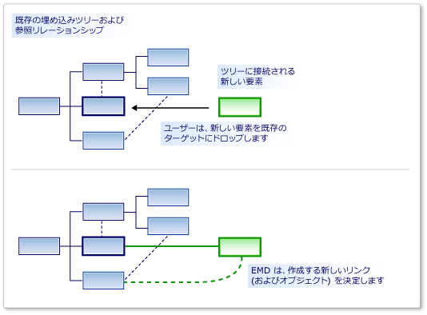

# <a name="customizing-element-creation-and-movement"></a>要素作成処理および要素移動処理のカスタマイズ

ツールボックスから、または貼り付けまたは移動操作で、要素を別のものにドラッグできます。 指定したリレーションシップを使用して、移動された要素をターゲット要素にリンクすることができます。

要素マージ ディレクティブ (EMD) では、あるモデル要素が別のモデル要素に "*マージ*" された場合の動作を指定します。 これは次の場合に発生します。

- ユーザーがツールボックスから図またはシェイプにドラッグします。

- ユーザーがエクスプローラーまたはコンパートメント シェイプの [追加] メニューを使用して要素を作成します。

- ユーザーがあるスイムレーンから別のものに項目を移動します。

- ユーザーが要素を貼り付けます。

- プログラム コードで、要素マージ ディレクティブを呼び出します。

作成操作はコピー操作とは異なるように見えるかもしれませんが、実際には同じ動作です。 たとえば、ツールボックスから要素が追加されると、そのプロトタイプがレプリケートされます。 プロトタイプは、モデルの別の部分からコピーされた要素と同じ方法で、モデルにマージされます。

EMD の役割は、オブジェクトまたはオブジェクトのグループをモデル内の特定の場所にマージする方法を決定することです。 具体的には、マージされたグループをモデルにリンクするためにインスタンス化する必要があるリレーションシップを決定します。 また、カスタマイズして、プロパティを設定したり追加のオブジェクトを作成したりすることもできます。



埋め込みリレーションシップを定義すると、EMD が自動的に生成されます。 この既定の EMD では、ユーザーが新しい子インスタンスを親に追加するときに、リレーションシップのインスタンスを作成します。 たとえば、カスタムコードを追加するなどして、これらの既定値を変更できます。

DSL 定義に独自の EMD を追加して、マージされたクラスと受信するクラスのさまざまな組み合わせをユーザーがドラッグまたは貼り付けられるようになります。

## <a name="defining-an-element-merge-directive"></a>要素マージ ディレクティブの定義

要素マージ ディレクティブは、ドメイン クラス、ドメイン リレーションシップ、シェイプ、コネクタ、および図に追加できます。 DSL エクスプローラーの受信側ドメイン クラスの下で、追加または検索できます。 受信側クラスは、モデル内に既に存在する要素のドメイン クラスであり、新しいまたはコピーされる要素がマージされます。

![[インデックス作成クラス] に ExampleElement が選択され、[サブクラスに適用] オプションがオンになっている状態で、EMD が追加されていることを示す DSL エクスプローラーのスクリーンショット。](../modeling/media/dsl-emd_details.png)

**[インデックス作成クラス]** は、受信側クラスのメンバーにマージできる要素のドメイン クラスです。 **[サブクラスに適用]** をオフに設定しない限り、インデックス作成クラスのサブクラスのインスタンスもこの EMD によってマージされます。

2 種類のマージ ディレクティブがあります。

- **マージ処理** ディレクティブでは、新しい要素がツリーにリンクされるリレーションシップを指定します。

- **マージ転送** ディレクティブでは、新しい要素を別の受信側要素 (通常は親) にリダイレクトします。

マージ ディレクティブには、カスタム コードを追加できます。

- **[カスタム承認を使用]** を設定し、インデックス作成要素の特定インスタンスをターゲット要素にマージするかどうかを決定する独自のコードを追加します。 ユーザーがツールボックスからドラッグするときに、コードでマージを許可しない場合は、"無効" のポインターが表示されます。

   たとえば、受信側要素が特定の状態にある場合にのみ、マージを許可できます。

- **[カスタム マージを使用]** を設定し、マージの実行時にモデルに加えられる変更を定義する独自のコードを追加します。

   たとえば、モデル内の新しい場所からのデータを使用して、マージされた要素のプロパティを設定できます。

> [!NOTE]
> カスタム マージ コードを記述する場合は、この EMD を使用して実行されたマージのみが影響を受けます。 同じ型のオブジェクトをマージする他の EMD がある場合、または EMD を使用せずにこれらのオブジェクトを作成する他のカスタム コードがある場合は、カスタム マージ コードによる影響を受けません。
>
> 新しい要素または新しいリレーションシップが必ずカスタム コードによって処理されるようにするには、埋め込みリレーションシップで `AddRule` を、要素のドメイン クラスで `DeleteRule` 定義することを検討します。 詳細については、「[ルールによってモデル内の変更が反映される](../modeling/rules-propagate-changes-within-the-model.md)」を参照してください。

## <a name="example-defining-an-emd-without-custom-code"></a>例: カスタム コードを使用せずに EMD を定義する

次の例では、ユーザーがツールボックスから既存のシェイプにドラッグして、要素とコネクタを同時に作成できるようにします。 この例では、DSL 定義に EMD を追加します。 この変更を行う前に、ユーザーはツールを図にドラッグできますが、既存のシェイプにはできません。

ユーザーは、要素を他の要素に貼り付けることもできます。

### <a name="to-let-users-create-an-element-and-a-connector-at-the-same-time"></a>ユーザーが要素とコネクタを同時に作成できるようにするには

1. **[最小言語]** ソリューション テンプレートを使用して、新しい DSL を作成します。

    この DSL を実行すると、シェイプと、シェイプ間にコネクタを作成できるようになります。 新しい **ExampleElement** シェイプは、ツールボックスから既存のシェイプにドラッグできません。

2. ユーザーが要素を `ExampleElement` シェイプにマージできるようにするには、`ExampleElement` ドメイン クラスで新しい EMD を作成します。

   1. **DSL エクスプローラー** で、 **[ドメイン クラス]** を展開します。 `ExampleElement` を右クリックし、 **[新しい要素マージ ディレクティブの追加]** をクリックします。

   2. **[DSL の詳細]** ウィンドウが開いていることを確認します。これにより、新しい EMD の詳細を確認できます (メニュー: **[表示]** 、 **[その他のウィンドウ]** 、 **[DSL の詳細]** )。

3. [DSL の詳細] ウィンドウで **[インデックス作成クラス]** を設定し、`ExampleElement` オブジェクトにマージできる要素のクラスを定義します。

    この例では、[`ExampleElements`] を選択して、ユーザーが新しい要素を既存の要素にドラッグできるようにします。

    インデックス作成クラスが DSL エクスプローラーで EMD の名前になることに注意してください。

4. **[リンクを作成してマージを処理]** で、2 つのパスを追加します。

   - 一方のパスでは、新しい要素を親モデルにリンクします。 入力が必要なパス式では、既存の要素から埋め込みリレーションシップを通じて親モデルまで移動します。 最後に、新しい要素が割り当てられる新しいリンク内のロールを指定します。 パスは次のとおりです。

      `ExampleModelHasElements.ExampleModel/!ExampleModel/.Elements`

   - もう一方のパスでは、新しい要素を既存の要素にリンクします。 パス式では、参照リレーションシップと、新しい要素が割り当てられるロールを指定します。 このパスは次のとおりです。

      `ExampleElementReferencesTargets.Sources`

      パス ナビゲーション ツールを使用して、各パスを作成できます。

      1. **[パスにリンクを作成してマージを処理]** で、 **[\<add path>]** をクリックします。

      2. 一覧項目の右側にあるドロップダウン矢印をクリックします。 ツリー ビューが表示されます。

      3. ツリー内のノードを展開して、指定するパスを形成します。

5. DSL をテストします。

   1. **F5** キーを押して、ソリューションをリビルドおよび実行します。

        生成されるコードは新しい DSL 定義に準拠するようにテキスト テンプレートから更新されるため、リビルドには通常よりも長い時間がかかります。

   2. Visual Studio の実験用インスタンスが起動したら、DSL のモデル ファイルを開きます。 いくつかのサンプル要素を作成します。

   3. **[サンプル要素]** ツールから既存のシェイプにドラッグします。

        新しいシェイプが表示され、コネクタを使用して既存のシェイプにリンクされます。

   4. 既存のシェイプをコピーします。 別のシェイプを選択して貼り付けます。

        最初のシェイプのコピーが作成されます。  新しい名前が付けられ、コネクタを使用して 2 番目のシェイプにリンクされます。

この手順では、次の点に注意してください。

- 要素マージ ディレクティブを作成することにより、要素の任意のクラスで他のものを受け入れることができるようになります。 EMD が受信側ドメインクラスに作成され、承認されたドメイン クラスが **[インデックス作成クラス]** フィールドに指定されます。

- パスを定義することで、新しい要素を既存のモデルに接続するために使用するリンクを指定できます。

     指定するリンクには、埋め込みリレーションシップが 1 つ含まれている必要があります。

- EMD は、ツールボックスからの作成と貼り付け操作の両方に影響します。

     新しい要素を作成するカスタムコードを記述する場合は、`ElementOperations.Merge` メソッドを使用して明示的に EMD を呼び出すことができます。 これにより、コードでは、他の操作と同じ方法で新しい要素をモデルにリンクします。 詳細については、「[コピー動作のカスタマイズ](../modeling/customizing-copy-behavior.md)」を参照してください。

## <a name="example-adding-custom-accept-code-to-an-emd"></a>例: カスタム承認コードを EMD に追加する

カスタム コードを EMD に追加することで、より複雑なマージ動作を定義できます。 この単純な例では、ユーザーが一定数以上の要素を図に追加できないようにしています。 この例では、埋め込みリレーションシップに付随する既定の EMD を変更します。

### <a name="to-write-custom-accept-code-to-restrict-what-the-user-can-add"></a>ユーザーが追加できる内容を制限するカスタム承認コードを記述するには

1. **[最小言語]** ソリューション テンプレートを使用して、DSL を作成します。 DSL 定義図を開きます。

2. DSL エクスプローラーで、 **[ドメイン クラス]** 、[`ExampleModel`]、 **[要素マージ ディレクティブ]** の順に展開します。 `ExampleElement` という名前の要素マージ ディレクティブを選択します。

     この EMD では、ユーザーがたとえばツールボックスからドラッグして、モデル内に新しい `ExampleElement` オブジェクトを作成する方法を制御します。

3. **[DSL の詳細]** ウィンドウで、 **[カスタム承認を使用]** を選択します。

4. ソリューションをリビルドします。 生成されたコードはモデルから更新されるため、この処理には通常より長い時間がかかります。

     "Company.ElementMergeSample.ExampleElement 要素には、CanMergeExampleElement 要素の定義が含まれていません..." というようなビルド エラーが報告されます。

     `CanMergeExampleElement` メソッドを実装する必要があります。

5. **Dsl** プロジェクトで新しいコード ファイルを作成します。 その内容を次のコードに置き換え、名前空間をプロジェクトの名前空間に変更します。

    ```csharp
    using Microsoft.VisualStudio.Modeling;

    namespace Company.ElementMergeSample // EDIT.
    {
      partial class ExampleModel
      {
        /// <summary>
        /// Called whenever an ExampleElement is to be merged into this ExampleModel.
        /// This happens when the user pastes an ExampleElement
        /// or drags from the toolbox.
        /// Determines whether the merge is allowed.
        /// </summary>
        /// <param name="rootElement">The root element in the merging EGP.</param>
        /// <param name="elementGroupPrototype">The EGP that the user wants to merge.</param>
        /// <returns>True if the merge is allowed</returns>
        private bool CanMergeExampleElement(ProtoElementBase rootElement, ElementGroupPrototype elementGroupPrototype)
        {
          // Allow no more than 4 elements to be added:
          return this.Elements.Count < 4;
        }
      }
    }
    ```

    この単純な例では、親モデルにマージできる要素の数を制限しています。 より興味深い条件として、このメソッドでは、受信側オブジェクトのあらゆるプロパティとリンクを検査できます。 また、<xref:Microsoft.VisualStudio.Modeling.ElementGroupPrototype> に含まれるマージ要素のプロパティを検査することもできます。 `ElementGroupPrototypes` の詳細については、「[コピー動作のカスタマイズ](../modeling/customizing-copy-behavior.md)」を参照してください。 モデルを読み取るコードを記述する方法の詳細については、「[プログラム コードにおけるモデル内の移動およびモデルの更新](../modeling/navigating-and-updating-a-model-in-program-code.md)」を参照してください。

6. DSL をテストします。

    1. **F5** キーを押して、ソリューションをリビルドします。 Visual Studio の実験用インスタンスが開いたら、DSL のインスタンスを開きます。

    2. 新しい要素をいくつかの方法で作成します。

        - **[サンプル要素]** ツールから図にドラッグします。

        - **[モデル エクスプローラーの例]** で、ルート ノードを右クリックし、 **[新しいサンプル要素の追加]** をクリックします。

        - 要素をコピーして図に貼り付けます。

    3. これらの方法のいずれかを使用して、モデルに 4 つ以上の要素を追加できないことを確認します。 これは、これらすべてで要素マージ ディレクティブを使用するためです。

## <a name="example-adding-custom-merge-code-to-an-emd"></a>例: カスタム マージ コードを EMD に追加する

カスタム マージ コードでは、ユーザーがツールをドラッグしたとき、または要素に貼り付けたときの動作を定義できます。 カスタム マージを定義するには 2 つの方法があります。

1. **[カスタム マージを使用]** を設定し、必要なコードを提供します。 このコードで生成されたマージ コードが置き換えられます。 このオプションは、マージの動作を完全に再定義する場合に使用します。

2. `MergeRelate` メソッド、および必要に応じて `MergeDisconnect` メソッドをオーバーライドします。 これを行うには、ドメイン クラスの **[2 つの派生を生成する]** プロパティを設定する必要があります。 コードでは、基本クラスで生成されたマージコードを呼び出すことができます。 マージの実行後に追加の操作を実行する場合は、このオプションを使用します。

   これらの方法は、この EMD を使用して実行されるマージにのみ影響します。 マージされた要素を作成するすべての方法に影響させる場合は、埋め込みリレーションシップで `AddRule` を定義する方法と、マージされたドメイン クラスで `DeleteRule` を定義する方法があります。 詳細については、「[ルールによってモデル内の変更が反映される](../modeling/rules-propagate-changes-within-the-model.md)」を参照してください。

### <a name="to-override-mergerelate"></a>MergeRelate をオーバーライドするには

1. DSL 定義で、コードを追加する EMD を定義していることを確認します。 必要に応じて、前のセクションで説明したように、パスを追加し、カスタム承認コードを定義できます。

2. DslDefinition 図で、マージの受信側クラスを選択します。 通常は、埋め込みリレーションシップでソース エンドのクラスです。

     たとえば、[最小言語] ソリューションから生成された DSL では、[`ExampleModel`] を選択します。

3. **[プロパティ]** ウィンドウで、 **[2 つの派生を生成する]** を **true** に設定します。

4. ソリューションをリビルドします。

5. **Dsl\Generated Files\DomainClasses.cs** のコンテンツを検査します。 `MergeRelate` という名前のメソッドを検索し、そのコンテンツを確認します。 これは、独自のバージョンを記述するのに役立ちます。

6. 新しいコード ファイルで、受信側クラスの部分クラスを記述し、`MergeRelate` メソッドをオーバーライドします。 基本メソッドを必ず呼び出してください。 次に例を示します。

    ```csharp
    partial class ExampleModel
    {
      /// <summary>
      /// Called when the user drags or pastes an ExampleElement onto the diagram.
      /// Sets the time of day as the name.
      /// </summary>
      /// <param name="sourceElement">Element to be added</param>
      /// <param name="elementGroup">Elements to be merged</param>
      protected override void MergeRelate(ModelElement sourceElement, ElementGroup elementGroup)
      {
        // Connect the element according to the EMD:
        base.MergeRelate(sourceElement, elementGroup);

        // Custom actions:
        ExampleElement mergingElement = sourceElement as ExampleElement;
        if (mergingElement != null)
        {
          mergingElement.Name = DateTime.Now.ToLongTimeString();
        }
      }
    }
    ```

### <a name="to-write-custom-merge-code"></a>カスタム マージ コードを記述するには

1. **Dsl\Generated Code\DomainClasses.cs** で、`MergeRelate` という名前のメソッドを検査します。 これらのメソッドでは、新しい要素と既存のモデル間のリンクを作成します。

    また、`MergeDisconnect` という名前のメソッドを検査します。 これらのメソッドでは、要素を削除するときに、その要素をモデルからリンク解除します。

2. **DSL エクスプローラー** で、カスタマイズする要素マージ ディレクティブを選択または作成します。 **[DSL の詳細]** ウィンドウで、 **[カスタム マージを使用]** を設定します。

    このオプションを設定した場合、**マージ処理** オプションと **マージ転送** オプションは無視されます。 代わりに、コードが使用されます。

3. ソリューションをリビルドします。 生成されたコード ファイルはモデルから更新されるため、この処理には通常より長い時間がかかります。

    エラー メッセージが表示されます。 エラー メッセージをダブルクリックすると、生成されたコードの指示が表示されます。 これらの手順では、`MergeRelate`*YourDomainClass* と `MergeDisconnect`*YourDomainClass* の 2 つのメソッドを指定するように求められます。

4. 部分クラス定義内のメソッドを別のコード ファイルに記述します。 必要なものは前に検査した例で示唆されているはずです。

   カスタム マージ コードは、オブジェクトとリレーションシップを直接作成するコードには影響しません。また、他の EMD には影響しません。 要素の作成方法に関係なく、追加の変更が実装されていることを確認するには、`AddRule` と `DeleteRule` の作成を検討します。 詳細については、「[ルールによってモデル内の変更が反映される](../modeling/rules-propagate-changes-within-the-model.md)」を参照してください。

## <a name="redirecting-a-merge-operation"></a>マージ操作をリダイレクトする

転送マージ ディレクティブは、マージ操作のターゲットをリダイレクトします。 通常、新しいターゲットは、初期ターゲットの埋め込み親です。

たとえば、コンポーネント図テンプレートを使用して作成された DSL では、ポートがコンポーネントに埋め込まれます。 ポートは、コンポーネント シェイプの境界上にある小さなシェイプとして表示されます。 ユーザーは、[ポート] ツールをコンポーネント シェイプにドラッグして、ポートを作成します。 ただし、ユーザーが [ポート] ツールをコンポーネントではなく既存のポートに誤ってドラッグすることがあると、操作が失敗します。 これは、既存のポートが複数存在する場合に陥りやすい誤りです。 このような問題を回避するため、既存のポートにポートをドラッグしても、そのアクションは親コンポーネントにリダイレクトされるようにすることができます。 この操作では、ターゲット要素がコンポーネントであるかのように動作します。

転送マージ ディレクティブは、[コンポーネント モデル] ソリューションで作成できます。 元のソリューションをコンパイルして実行すると、ユーザーが **ツールボックス** から任意の数の **入力ポート** または **出力ポート** 要素を **コンポーネント** 要素にドラッグできることがわかります。 ただし、既存のポートにポートをドラッグすることはできません。 使用不可ポインターによって、この移動が有効ではないことが警告されます。 ただし、転送マージ ディレクティブを作成して、既存の **入力ポート** で意図せず削除されたポートが **コンポーネント** 要素に転送されるようにすることができます。

### <a name="to-create-a-forward-merge-directive"></a>転送マージ ディレクティブを作成するには

1. [コンポーネント モデル] テンプレートを使用して、[!INCLUDE[dsl](../modeling/includes/dsl_md.md)] ソリューションを作成します。

2. DslDefinition.dsl を開き、**DSL エクスプローラー** を表示します。

3. **DSL エクスプローラー** で、 **[ドメイン クラス]** を展開します。

4. **ComponentPort** 抽象ドメイン クラスは、**InPort** と **OutPort** の両方の基本クラスです。 **[ComponentPort]** を右クリックし、 **[新しい要素マージ ディレクティブの追加]** をクリックします。

    **[要素マージ ディレクティブ]** ノードの下に、新しい **[要素マージ ディレクティブ]** ノードが表示されます。

5. **[要素マージ ディレクティブ]** ノードを選択し、 **[DSL の詳細]** ウィンドウを開きます。

6. [インデックス作成クラス] 一覧で、 **[ComponentPort]** を選択します。

7. **[別のドメイン クラスにマージを転送]** を選択します。

8. パス選択一覧で、 **[ComponentPort]** 、 **[ComponentHasPorts]** の順に展開し、 **[Component]** を選択します。

    新しいパスは次のようになります。

    **ComponentHasPorts.Component/!Component**

9. ソリューションを保存し、**ソリューション エクスプローラー** ツールバーの右端にあるボタンをクリックしてテンプレートを変換します。

10. ソリューションをビルドして実行します。 Visual Studio の新しいインスタンスが表示されます。

11. **ソリューション エクスプローラー** で、Sample.mydsl を開きます。 図と **ComponentLanguage ツールボックス** が表示されます。

12. **ツールボックス** から **入力ポート** を別の **入力ポート** にドラッグします。 次に、**OutputPort** を **InputPort** にドラッグしてから、別の **OutputPort** にドラッグします。

     使用不可ポインターは表示されません。また、新しい **入力ポート** を既存のものにドロップできます。 新しい **入力ポート** を選択し、**コンポーネント** 上の別のポイントにドラッグします。

## <a name="see-also"></a>関連項目

- [プログラム コードにおけるモデル内の移動およびモデルの更新](../modeling/navigating-and-updating-a-model-in-program-code.md)
- [ツールおよびツールボックスのカスタマイズ](../modeling/customizing-tools-and-the-toolbox.md)
- [回路図のサンプル DSL](https://code.msdn.microsoft.com/Visualization-Modeling-SDK-763778e8)
