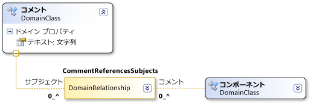

# ドメイン パス構文
DSL 定義は XPath に似た構文を使用して、モデル内の特定の要素を見つけます。

 通常、この構文を直接扱う必要はありません。 DSL 詳細またはプロパティ ウィンドウで、下向き矢印をクリックし、パス エディターを使用できます。 ただし、パスがこの形式でフィールドに表示されるのは、エディターを使用した後です。

 ドメイン パスは次のような形式になります。

 *RelationshipName.PropertyName/!Role*

 

 構文はモデルのツリーを走査します。 たとえば、上の図のドメイン リレーションシップ **CommentReferencesSubjects** には **Subjects** ロールがあります。 パス セグメント **/!Subjectt** は、パスが **Subjects** ロールによりアクセスされる要素で終わることを示します。

 各セグメントの先頭はドメイン リレーションシップの名前になっています。 走査対象が要素からリレーションシップの場合、パス セグメントは *Relationship.PropertyName* となります。 ホップがリンクから要素の場合、パス セグメントは *Relationship/!RoleName* となります。

 スラッシュはパスの構文を区切ります。 各パス セグメントは要素からリンク (リレーションシップのインスタンス) へのホップか、リンクから要素へのホップのどちらかです。 パス セグメントは多くの場合、ペアで表示されます。 1 つのパス セグメントは要素からリンクへのホップを表し、次のセグメントはリンクから他端の要素へのホップを表します。 (どのリンクもリレーションシップ自体のソースまたはターゲットになりえます)。

 要素からリンクへのホップに対して使用する名前はロールの `Property Name` の値です。 リンクから要素へのホップに対して使用する名前はターゲットのロール名です。

## 関連項目

- [モデル、クラス、およびリレーションシップについて](../modeling/understanding-models-classes-and-relationships.md)
