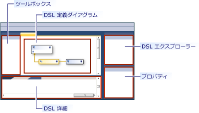

# <a name="get-started-with-domain-specific-languages"></a>ドメイン固有言語の概要

このトピックでは、Modeling SDK for Visual Studio で作成されたドメイン固有言語 (DSL) の定義と使用に関する基本的な概念について説明します。

> [!NOTE]
> Text Template Transformation SDK と Visual Studio Modeling SDK は、Visual Studio の特定の機能をインストールすると自動的にインストールされます。 詳しくは、[このブログ投稿](https://devblogs.microsoft.com/devops/the-visual-studio-modeling-sdk-is-now-available-with-visual-studio-2017/)をご覧ください。

DSL を初めて使用する場合は、**DSL ツール ラボ** で学習することをお勧めします。このラボは、[視覚化と Modeling SDK](https://code.msdn.microsoft.com/Visualization-and-Modeling-313535db) に関するサイトで見つかります

## <a name="what-can-you-do-with-a-domain-specific-language"></a>ドメイン固有言語でできること

ドメイン固有言語は、特定の目的に使用するために設計された、通常はグラフィカルな表記です。 これに対して、UML などの言語は汎用的なものです。 DSL では、モデル要素の種類とそれらの関係、およびそれらを画面に表示する方法を定義できます。

設計した DSL は、Visual Studio Integration Extension (VSIX) パッケージの一部として配布できます。 ユーザーは、Visual Studio で DSL を使用します。


この表記は DSL の一部にすぎません。 この表記に加えて、VSIX パッケージには、ユーザーがモデルから素材を編集および生成するために適用できるツールが含まれています。

DSL の主要な適用方法の 1 つは、プログラム コード、構成ファイル、その他の成果物を生成することです。 特に、製品の複数のバリエーションが作成される大規模なプロジェクトと製品ラインでは、DSL からさまざまな可変要素を生成すると信頼性が大きく向上し、要件の変化に非常に迅速に対応できます。

この概要の残りの部分では、Visual Studio でドメイン固有言語を作成および使用するための基本的な操作について説明します。

## <a name="prerequisites"></a>前提条件

DSL を定義するには、以下のコンポーネントをインストールしておく必要があります。

| コンポーネント | リンク |
|-|-|
| Visual Studio | [http://go.microsoft.com/fwlink/?LinkId=185579](https://visualstudio.microsoft.com) |
| [!INCLUDE[vssdk_current_short](../modeling/includes/vssdk_current_short_md.md)] | [https://go.microsoft.com/fwlink/?linkid=2166172](../extensibility/visual-studio-sdk.md) |
| Modeling SDK for Visual Studio | |

[!INCLUDE[modeling_sdk_info](includes/modeling_sdk_info.md)]

## <a name="create-a-dsl-solution"></a>DSL ソリューションを作成する

新しいドメイン固有言語を作成するには、ドメイン固有言語プロジェクト テンプレートを使用して新しい Visual Studio ソリューションを作成します。

1. **[ファイル]** メニューの **[新規作成]** をポイントし、 **[プロジェクト]** をクリックします。

2. **[プロジェクトの種類]** の **[その他のプロジェクトの種類]** ノードを展開し、 **[機能拡張]** をクリックします。

3. **[ドメイン固有言語デザイナー]** をクリックします。

     

4. **[名前]** ボックスに「**FamilyTree**」と入力します。 **[OK]** をクリックします。

     **ドメイン固有言語ウィザード** が開き、テンプレート DSL ソリューションの一覧が表示されます。

     各テンプレートをクリックして説明を参照します。

     テンプレートは、出発点として便利です。 それぞれで完全に機能する DSL が提供されており、必要に応じてそれを編集できます。 通常は、作成するものに最も近いテンプレートを選択します。

5. このチュートリアルでは、**最小言語** テンプレートを選択します。

6. 該当するウィザード ページに DSL のファイル名拡張子を入力します。 これは、DSL インスタンスを含むファイルに使用される拡張子です。

    - 使用しているコンピューター、または DSL をインストールするコンピューター上のどのアプリケーションにも関連付けられていない拡張子を選択します。 たとえば、**docx** や **htm** はファイ名拡張子として使用できません。

    - 入力した拡張子が DSL として使用されている場合は、ウィザードから警告が出されます。 別のファイル名拡張子の使用を検討してください。 また、古い実験デザイナーをクリアするために Visual Studio SDK 実験用インスタンスをリセットできます。 **[スタート]** をクリックし、 **[すべてのプログラム]** 、 **[Microsoft Visual Studio 2010 SDK]** 、 **[ツール]** 、 **[Visual Studio 2010 の実験的なインスタンスをリセットする]** の順にクリックします。

7. 他のページを調べて、 **[完了]** をクリックします。

     2 つのプロジェクトが含まれるソリューションが生成されます。 それらは Dsl および DslPackage という名前です。 DslDefinition.dsl という名前のダイアグラム ファイルが開きます。

    > [!NOTE]
    > 2 つのプロジェクトのフォルダーに表示されるほとんどのコードは、DslDefinition.dsl から生成されたものです。 このため、DSL に対するほとんどの変更は、このファイルで行います。

ユーザー インターフェイスは次の図のようになります。



このソリューションはドメイン固有言語を定義します。 詳細については、「[ドメイン固有言語ツールのユーザー インターフェイスの概要](../modeling/overview-of-the-domain-specific-language-tools-user-interface.md)」を参照してください。

## <a name="the-important-parts-of-the-dsl-solution"></a>DSL ソリューションの重要な部分

新しいソリューションでは、次の点に注意してください。

- **Dsl\DslDefinition.dsl** これは、DSL ソリューションを作成するときに表示されるファイルです。 ソリューション内のほとんどすべてのコードがこのファイルから生成され、DSL 定義に対する変更のほとんどはここで行われれます。 詳細については、「[DSL 定義図の使用](../modeling/working-with-the-dsl-definition-diagram.md)」を参照してください。

- **Dsl プロジェクト** このプロジェクトには、ドメイン固有言語を定義するコードが含まれています。

- **DslPackage プロジェクト** このプロジェクトには、DSL のインスタンスを Visual Studio で開いて編集できるようにするためのコードが含まれています。

## <a name="running-the-dsl"></a><a name="Debugging"></a> DSL の実行

DSL ソリューションを作成したら、すぐに実行できます。 後で、DSL 定義を少しずつ変更し、変更するたびにもう一度ソリューションを実行できます。

### <a name="to-experiment-with-the-dsl"></a>DSL を試してみるには

1. **ソリューション エクスプローラー** のツール バーで **[すべてのテンプレートの変換]** をクリックします。 これにより、ほとんどのソース コードが DslDefinition.dsl から再生成されます。

    > [!NOTE]
    > *DslDefinition.dsl* を変更するたび、ソリューションをリビルドする前に **[すべてのテンプレートの変換]** をクリックする必要があります。 このステップは自動化できます。 詳細については、「[方法: すべてのテンプレートを自動変換する](/previous-versions/visualstudio/visual-studio-2012/ff521399\(v\=vs.110\))」を参照してください。

2. **F5** キーを押すか、または **[デバッグ]** メニューの **[デバッグ開始]** をクリックします。

     DSL は、Visual Studio の実験用インスタンスでビルドされ、そこにインストールされます。

     Visual Studio の実験用インスタンスが開始します。 実験用インスタンスの設定はレジストリの別のサブツリーから取得され、そこには Visual Studio の拡張機能がデバッグのために登録されています。 Visual Studio の通常のインスタンスには、そこに登録されている拡張機能へのアクセス権はありません。

3. Visual Studio の実験用インスタンスで、**ソリューション エクスプローラー** から **Test** という名前のモデル ファイルを開きます。

     \- または

     Debugging プロジェクトを右クリックし、 **[追加]** をポイントして、 **[項目]** をクリックします。 **[項目の追加]** ダイアログ ボックスで、DSL のファイルの種類を選択します。

     空のダイアグラムとしてモデル ファイルが開きます。

     ツールボックスが開き、ダイアグラムの種類に適したツールが表示されます。

4. ツールを使用て、ダイアグラムにシェイプとコネクタを作成します。

    1. シェイプを作成するには、例のシェイプ ツールからダイアグラムにドラッグします。

    2. 2 つのシェイプを接続するには、例のコネクタ ツールをクリックし、1 番目のシェイプをクリックしてから、2 番目のシェイプをクリックします。

5. シェイプのラベルをクリックして変更します。

実験用の Visual Studio は、次の例のようになります。


### <a name="the-content-of-a-model"></a>モデルの内容

DSL のインスタンスであるファイルの内容は、"*モデル*" と呼ばれます。 モデルには、"*モデル*<em>要素</em>" と要素間の "*リンク*" が含まれています。 DSL 定義により、モデル内に存在できるモデル要素とリンクの種類が指定されています。 たとえば、最小言語テンプレートから作成された DSL には、1 種類のモデル要素と 1 種類のリンクがあります。

DSL 定義では、モデルをダイアグラムに表示する方法を指定できます。 さまざまなスタイルのシェイプとコネクタから選択できます。 一部のシェイプが他のシェイプの中に表示されるように指定できます。

モデルを編集するときに、 **[エクスプローラー]** ビューでモデルをツリーとして表示できます。 ダイアグラムにシェイプを追加すると、モデル要素もエクスプローラーに表示されます。 ダイアグラムがない場合でも、エクスプローラーを使用できます。

Visual Studio のデバッグ インスタンスにエクスプローラーが表示されない場合は、 **[表示]** メニューの **[その他のウィンドウ]** をポイントし、 **[ *\<Your Language>* エクスプローラー]** をクリックします。

### <a name="the-api-of-your-dsl"></a>DSL の API

DSL によって生成される API を使用すると、DSL のインスタンスであるモデルの読み取りと更新を行うことができます。 API を使用して、たとえば、モデルからテキスト ファイルを生成します。 詳細については、「[T4 テキスト テンプレートを使用したデザイン時コード生成](../modeling/design-time-code-generation-by-using-t4-text-templates.md)」を参照してください。

Debugging ソリューションで、拡張子が ".tt" のテンプレート ファイルを開きます。 これらのサンプルを使用すると、モデルからテキストを生成する方法がわかり、DSL の API をテストできます。 サンプルの 1 つは [!INCLUDE[vbprvb](../code-quality/includes/vbprvb_md.md)] で記述されており、他は [!INCLUDE[csprcs](../data-tools/includes/csprcs_md.md)] で記述されています。

各テンプレート ファイルの下にあるのは、それによって生成されたファイルです。 ソリューション エクスプローラーでテンプレート ファイルを展開し、生成されたファイルを開きます。

テンプレート ファイルには、モデル内のすべての要素の一覧を取得する短いコード セグメントが含まれています。

生成されたファイルに結果が含まれます。

モデル ファイルを変更すると、ファイルを再生成した後で、生成されるファイルに対応する変更が反映されます。

#### <a name="to-regenerate-text-files-after-you-change-the-model-file"></a>モデル ファイルを変更した後でテキスト ファイルを再生成するには

1. Visual Studio の実験用インスタンスで、モデル ファイルを保存します。

2. 各 .tt ファイルのファイル名パラメーターで、実験に使用しているモデル ファイルが参照されていることを確認します。 .tt ファイルを保存します。

3. **ソリューション エクスプローラー** のツール バーで、 **[すべてのテンプレートの変換]** をクリックします。

     \- または

     再生成するテンプレートを右クリックし、 **[カスタム ツールの実行]** をクリックします。

任意の数のテキスト テンプレート ファイルをプロジェクトに追加できます。 テンプレートごとに 1 つの結果ファイルが生成されます。

> [!NOTE]
> DSL 定義を変更したときは、それを更新しない限り、サンプル テキスト テンプレートのコードは機能しません。

詳細については、「[ドメイン固有言語からのコード生成](../modeling/generating-code-from-a-domain-specific-language.md)」と「[ドメイン固有言語をカスタマイズするコードの記述](../modeling/writing-code-to-customise-a-domain-specific-language.md)」を参照してください。

## <a name="customizing-the-dsl"></a>DSL のカスタマイズ

DSL 定義を変更するときは、実験用インスタンスを閉じ、Visual Studio のメイン インスタンスで定義を更新します。

> [!NOTE]
> DSL 定義を変更した後は、以前のバージョンを使用して作成したテスト モデルの情報が失われる可能性があります。  たとえば、デバッグ ソリューションに含まれる Sample という名前のファイルには、いくつかのシェイプとコネクタが含まれています。 DSL 定義の開発を始めると、それらは表示されなくなり、ファイルを保存すると失われます。

DSL には、さまざまな拡張機能を作成できます。 以下の例を見ると、何ができるかがわかります。

各変更を行った後で、DSL 定義を保存し、**ソリューション エクスプローラー** の **[すべてのテンプレートの変換]** をクリックしてから、**F5** キーを押して変更した DSL を試します。

### <a name="rename-the-types-and-tools"></a>型とツールの名前を変更する

既存のドメイン クラスとリレーションシップの名前を変更します。 たとえば、最小言語テンプレートから作成された DSL 定義から始めて、次の名前変更操作を実行し、DSL がファミリ ツリーを表すようにすることができます。

#### <a name="to-rename-domain-classes-relationships-and-tools"></a>ドメイン クラス、リレーションシップ、ツールの名前を変更するには

1. DslDefinition ダイアグラムで、**ExampleModel** を **FamilyTreeModel** に、**ExampleElement** を **Person** に、**Targets** を **Parents** に、**Sources** を **Children** に、それぞれ名前を変更します。 各ラベルをクリックして変更することができます。

     

2. 要素とコネクタ ツールの名前を変更します。

    1. ソリューション エクスプローラーの下にあるタブをクリックして、[DSL エクスプローラー] ウィンドウを開きます。 表示されない場合は、 **[表示]** メニューの **[その他のウィンドウ]** をポイントし、 **[DSL エクスプローラー]** をクリックします。 DSL エクスプローラーは、DSL 定義ダイアグラムがアクティブなウィンドウである場合にのみ表示されます。

    2. プロパティ ウィンドウを開き、[DSL エクスプローラー] と [プロパティ] が同時に見えるように配置します。

    3. [DSL エクスプローラー] で、 **[エディター]** 、 **[ツールボックス タブ]** 、 *\<your DSL>* 、 **[ツール]** の順に展開します。

    4. **ExampleElement** をクリックします。 これは、要素の作成に使用されるツールボックス項目です。

    5. プロパティ ウィンドウで、 **[Name]** プロパティを「**Person**」に変更します。

         **[Caption]** プロパティも変更されることに注意してください。

    6. 同様に、**ExampleConnector** ツールの名前を **ParentLink** に変更します。 Name プロパティのコピーではないように、 **[Caption]** プロパティを変更します。 たとえば、「**Parent Link**」と入力します。

3. DSL をリビルドします。

    1. DSL 定義ファイルを保存します。

    2. ソリューション エクスプローラーのツール バーで、 **[すべてのテンプレートの変換]** をクリックします

    3. F5 キーを押す。 Visual Studio の実験用インスタンスが表示されるまで待ちます。

4. Visual Studio の実験用インスタンスの Debugging ソリューションで、テスト モデル ファイルを開きます。 ツールボックスからそれに要素をドラッグします。 [DSL エクスプローラー] でツールのキャプションと型の名前が変更されることに注意してください。

5. モデル ファイルを保存します。

6. .tt ファイルを開き、古い型とプロパティの名前が使用されている箇所を新しい名前に置き換えます。

7. .tt ファイルで指定されているファイル名で、テスト モデルが指定されていることを確認します。

8. .tt ファイルを保存します。 生成されたファイルを開き、.tt ファイルのコードを実行した結果を確認します。 それが正しいことを確認します。

### <a name="add-domain-properties-to-classes"></a>クラスにドメイン プロパティを追加する
 ドメイン クラスにプロパティを追加します。たとえば、Person の生年と没年を表します。

 新しいプロパティがダイアグラムに表示されるようにするには、モデル要素を表示するシェイプに "*デコレーター*" を追加する必要があります。 また、プロパティをデコレーターにマップする必要があります。

##### <a name="to-add-properties-and-display-them"></a>プロパティを追加して表示するには

1. プロパティを追加します。

   1. DSL 定義ダイアグラムで、**Person** ドメイン クラスを右クリックし、 **[追加]** をポイントして、 **[ドメイン プロパティ]** をクリックします。

   2. 新しいプロパティ名の一覧を入力します (**Birth** や **Death** など)。 それぞれの後で **Enter** キーを押します。

2. シェイプにプロパティを表示するデコレーターを追加します。

   1. Person ドメイン クラスからダイアグラムの他の側まで延びている灰色の線をたどります。 これは、ダイアグラムの要素マップです。 それにより、ドメイン クラスがシェイプ クラスにリンクされます。

   2. このシェイプ クラスを右クリックし、 **[追加]** をポイントして、 **[Text Decorator]** をクリックします。

   3. **BirthDecorator** や **DeathDecorator** といった名前の 2 つのデコレーターを追加します。

   4. 新しい各デコレーターを選択し、プロパティ ウィンドウで **[Position]** フィールドを設定します。 これにより、シェイプでドメイン プロパティの値が表示される場所が決まります。 たとえば、**InnerBottomLeft** と **InnerBottomRight** を設定します。

        

3. デコレーターをプロパティにマップします。

   1. [DSL Details] (DSL の詳細) ウィンドウを開きます。 通常は、[出力] ウィンドウの横にあるタブに表示されます。 表示されない場合は、 **[表示]** メニューの **[その他のウィンドウ]** をポイントし、 **[DSL の詳細]** をクリックします。

   2. DSL 定義ダイアグラムで、**Person** ドメイン クラスをシェイプ クラスに接続する線をクリックします。

   3. **[DSL の詳細]** の **[デコレーター マップ]** タブで、マップされていないデコレーターのチェック ボックスをオンにします。 **[表示プロパティ]** で、マップ先のドメイン プロパティを選択します。 たとえば、**BirthDecorator** を **Birth** にマップします。

4. DSL を保存し、[すべてのテンプレートの変換] をクリックして、F5 キーを押します。

5. サンプル モデル ダイアグラムで、選択した位置をクリックして値を入力できることを確認します。 さらに、**Person** シェイプを選択すると、プロパティ ウィンドウに新しいプロパティ Birth と Death が表示されます。

6. .tt ファイルでは、各ユーザーのプロパティを取得するコードを追加できます。

   

### <a name="define-new-classes"></a>新しいクラスを定義する
 モデルにドメイン クラスとリレーションシップを追加できます。 たとえば、町を表す新しいクラスを作成し、ある人がある町に住んでいたことを表す新しいリレーションシップを作成することができます。

 モデル ダイアグラムで異なる型を個別に作成するには、ドメイン クラスを異なる種類のシェイプ、つまり異なるジオメトリと色を持つシェイプにマップできます。

##### <a name="to-add-and-display-a-new-domain-class"></a>新しいドメイン クラスを追加して表示するには

1. ドメイン クラスを追加し、それをモデル ルートの子にします。

    1. DSL 定義ダイアグラムで、 **[埋め込みリレーションシップ]** ツールをクリックし、ルート クラス **FamilyTreeModel** をクリックしてから、ダイアグラムの空いている部分をクリックします。

         新しいドメイン クラスが表示され、埋め込みリレーションシップで FamilyTreeModel に接続されます。

         その名前を設定します (**Town** など)。

        > [!NOTE]
        > モデルのルート以外のすべてのドメイン クラスは、1 つ以上の埋め込みリレーションシップのターゲットであるか、または埋め込みのターゲットであるクラスから継承しているクラスである必要があります。 このため、埋め込みリレーションシップ ツールを使用してドメイン クラスを作成すると便利な場合がよくあります。

    2. 新しいクラスにドメイン プロパティを追加します (**Name** など)。

2. Person と Town の間に参照リレーションシップを追加します。

    1. **[参照リレーションシップ]** ツールをクリックし、Person をクリックしてから、Town をクリックします。

         

        > [!NOTE]
        > 参照リレーションシップは、モデル ツリーのある部分から別の部分への相互参照を表します。

3. モデル ダイアグラムで町を表すシェイプを追加します。

    1. **[ジオメトリ シェイプ]** をツールボックスからダイアグラムにドラッグし、名前を変更します (たとえば、**TownShape**)。

    2. プロパティ ウィンドウで、新しいシェイプの Appearance のフィールドを設定します (Fill Color や Geometry など)。

    3. 町の名前を表示するデコレーターを追加し、名前を NameDecorator に変更します。 その Position プロパティを設定します。

4. Town ドメイン クラスを TownShape にマップします。

    1. **[ダイアグラム要素マップ]** ツールをクリックし、Town ドメイン クラスをクリックしてから、TownShape シェイプ クラスをクリックします。

    2. マップ コネクタが選択されている **[DSL の詳細]** ウィンドウの **[デコレーター マップ]** タブで、NameDecorator を確認し、 **[表示プロパティ]** を Name に設定します。

5. Person と Towns の間のリレーションシップを表示するためのコネクタを作成します。

    1. コネクタをツールボックスからダイアグラムにドラッグします。 名前を変更し、その外観プロパティを設定します。

    2. **[ダイアグラム要素マップ]** ツールを使用して、新しいコネクタを Person と Town の間のリレーションシップにリンクします。

         

6. 新しい Town を作るための要素ツールを作成します。

    1. **[DSL エクスプローラー]** で、 **[エディター]** 、 **[ツールボックス タブ]** の順に展開します。

    2. *\<your DSL>* を右クリックし、 **[Add New Element Tool]\(新しい要素ツールの追加\)** をクリックします。

    3. 新しいツールの **Name** プロパティを設定し、その **Class** プロパティを Town に設定します。

    4. **[Toolbox Icon]** プロパティを設定します。 **[...]** をクリックし、 **[ファイル名]** フィールドでアイコン ファイルを選択します。

7. 町と人の間にリンクを作成するためのコネクタ ツールを作成します。

    1. *\<your DSL>* を右クリックし、 **[Add New Connector Tool]\(新しいコネクタ ツールの追加\)** をクリックします。

    2. 新しいツールの Name プロパティを設定します。

    3. **ConnectionBuilder** プロパティで、Person-Town リレーションシップの名前が含まれているビルダーを選択します。

    4. **[Toolbox Icon]** を設定します。

8. DSL 定義を保存し、 **[すべてのテンプレートの変換]** をクリックしてから、**F5** キーを押します。

9. Visual Studio の実験用インスタンスで、テスト モデル ファイルを開きます。 新しいツールを使用して、町や、町と人との間のリンクを作成します。 正しい型の要素の間にだけ、リンクを作成できることに注意してください。

10. 各人が住んでいる町の一覧を取得するコードを作成します。 テキスト テンプレートは、そのようなコードを実行できる場所の 1 つです。 たとえば、Debugging ソリューションの既存の Sample.tt ファイルを変更して、次のコードが含まれるようにすることができます。

    ```
    <#@ template inherits="Microsoft.VisualStudio.TextTemplating.VSHost.ModelingTextTransformation" debug="true" #>
    <#@ output extension=".txt" #>
    <#@ FamilyTree processor="FamilyTreeDirectiveProcessor" requires="fileName='Sample.ftree'" #>

    <#
      foreach (Person person in this.FamilyTreeModel.People)
      {
    #>
        <#= person.Name #><#if (person.Town != null) {#> of <#= person.Town.Name #> <#}#>

    <#
          foreach (Person child in person.Children)
      {
    #>
                <#= child.Name #>
    <#
      }
      }
    #>

    ```

     *.tt ファイルを保存すると、人とその居住地の一覧が含まれる従属ファイルが作成されます。 詳細については、「[ドメイン固有言語からのコード生成](../modeling/generating-code-from-a-domain-specific-language.md)」を参照してください。

## <a name="validation-and-commands"></a>検証とコマンド
 検証制約を追加することで、この DSL をさらに開発できます。 これらの制約は、モデルが正しい状態であることを確認するために定義できるメソッドです。 たとえば、子の生年月日が親のそれより後であることを確認するための制約を定義できます。 DSL ユーザーがいずれかの制約に違反するモデルを保存しようとすると、検証機能によって警告が表示されます。 詳細については、「[ドメイン固有言語における検証](../modeling/validation-in-a-domain-specific-language.md)」を参照してください。

 ユーザーが呼び出すことのできるメニュー コマンドを定義することもできます。 コマンドを使用してモデルを変更できます。 また、Visual Studio 内の他のモデルや外部リソースと対話することもできます。 詳細については、「[方法: 標準のメニュー コマンドを修正する](../modeling/how-to-modify-a-standard-menu-command-in-a-domain-specific-language.md)」を参照してください。

## <a name="deploying-the-dsl"></a>DSL の配置
 他のユーザーがドメイン固有言語を使用できるようにするには、Visual Studio 拡張機能 (VSIX) ファイルを配布します。 これは、DSL ソリューションをビルドすると作成されます。

 ソリューションの bin フォルダーで .vsix ファイルを見つけます。 それを、インストールするコンピューターにコピーします。 そのコンピューターで、VSIX ファイルをダブルクリックします。 そのコンピューター上の Visual Studio のすべてのインスタンスで、その DSL を使用できます。

 同じ手順を使用して、自分のコンピューターに DSL をインストールすることにより、Visual Studio の実験用インスタンスを使用する必要がないようにすることができます。

 詳細については、「[ドメイン固有言語ソリューションの配置](msi-and-vsix-deployment-of-a-dsl.md)」を参照してください。

## <a name="removing-old-experimental-dsls"></a><a name="Reset"></a> 古い実験用 DSL の削除
 作成した実験用 DSL が不要になった場合は、Visual Studio の実験用インスタンスをリセットすることで、それらをコンピューターから削除できます。

 これにより、すべての実験用 DSL とその他の実験用の Visual Studio 拡張機能がすべて、コンピューターから削除されます。 これらは、デバッグ モードで実行されている拡張機能です。

 この手順により、VSIX ファイルを実行することによって完全にインストールされた DSL や他の Visual Studio 拡張機能が削除されることはありません。

#### <a name="to-reset-the-visual-studio-experimental-instance"></a>Visual Studio の実験用インスタンスをリセットするには

1. **[スタート]** をクリックし、 **[すべてのプログラム]** 、 **[Microsoft Visual Studio 2010 SDK]** 、 **[ツール]** 、 **[Visual Studio 2010 の実験的なインスタンスをリセットする]** の順にクリックします。

2. 引き続き使用する実験用 DSL またはその他の実験用 Visual Studio 拡張機能をリビルドします。

## <a name="see-also"></a>こちらもご覧ください

- [モデル、クラス、およびリレーションシップについて](../modeling/understanding-models-classes-and-relationships.md)
- [方法: ドメイン固有言語を定義する](../modeling/how-to-define-a-domain-specific-language.md)
