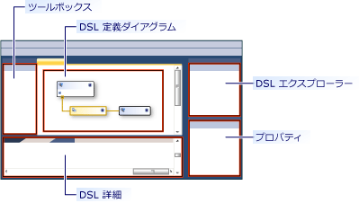
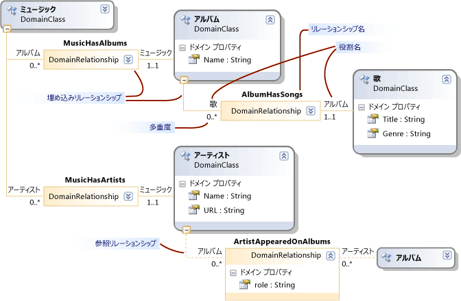
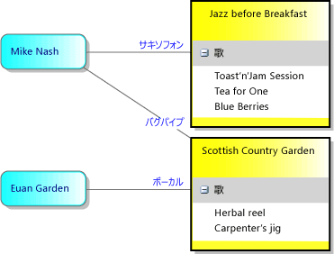
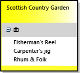

# 方法: ドメイン固有言語を定義する
ドメイン固有言語 (DSL) を定義するには、テンプレートから Visual Studio ソリューションを作成します。 ソリューションの主要な機能は DSL 定義図です。これは DslDefinition.dsl に保存されています。 DSL 定義は、DSL のクラスとシェイプを定義します。 これらの要素を変更および追加した後で、プログラム コードを追加して DSL を詳細にカスタマイズできます。

DSL を初めて使用する場合は、**DSL ツール ラボ** で学習することをお勧めします。このラボは、[視覚化と Modeling SDK](https://code.msdn.microsoft.com/Visualization-and-Modeling-313535db) に関するサイトで見つかります

##  テンプレート ソリューションの選択

DSL を定義するには、以下のコンポーネントをインストールしておく必要があります。

- Visual Studio
- Visual Studio 拡張機能の開発ワークロード (Visual Studio SDK を含む)
- モデリング SDK (Visual Studio で個別のコンポーネントとしてインストールする)

[!INCLUDE[modeling_sdk_info](includes/modeling_sdk_info.md)]

新しいドメイン固有言語を作成するには、ドメイン固有言語プロジェクト テンプレートを使用して新しい Visual Studio ソリューションを作成します。

### DSL ソリューションを作成するには

1. 新しい **ドメイン固有言語** プロジェクトを作成します。

   ::: moniker range="vs-2017"

    

   ::: moniker-end

    **ドメイン固有言語ウィザード** が開き、テンプレート DSL ソリューションの一覧が表示されます。

2. 各テンプレートをクリックして説明を参照します。 作成したい内容に最も近いソリューションを選択します。

    各 DSL テンプレートは、機能する基本的な DSL を定義します。 この DSL を編集して、各自の要件に合わせて調整します。

    詳細については、各サンプルをクリックしてください。

   - スイムレーンが含まれている DSL を作成するには、 **[タスク フロー]** を選択します。 スイムレーンとは、図上の垂直方向または水平方向のパーティションです。

   - ポートを備えた DSL を作成するには、 **[コンポーネント モデル]** を選択します。 ポートとは、大きなシェイプの境界上にある小さなシェイプです。

   - コンパートメント シェイプを含む DSL を定義するには、 **[クラス ダイアグラム]** を選択します。 コンパートメント シェイプには、項目のリストが含まれています。

   - 上記以外の場合、または確定していない段階では **[最小言語]** を選択します。

   - Windows Forms または WPF サーフェイスに表示する DSL を作成するには、 **[最小 WinForm デザイナー]** または **[最小 WPF デザイナー]** を選択します。 エディターを定義するコードを記述する必要があります。 詳細については、次のトピックを参照してください。

        [Windows フォームに基づくドメイン固有言語の作成](../modeling/creating-a-windows-forms-based-domain-specific-language.md)

        [WPF に基づくドメイン固有言語の作成](../modeling/creating-a-wpf-based-domain-specific-language.md)

3. 該当するウィザード ページに DSL のファイル名拡張子を入力します。 これは、DSL インスタンスを含むファイルに使用される拡張子です。

   - ご使用のコンピューター、または DSL をインストールするコンピューター上のどのアプリケーションにも関連付けられていないファイル名拡張子を選択してください。 たとえば、**docx** や **htm** はファイル名拡張子として使用できません。

   - 入力した拡張子が DSL として使用されている場合は、ウィザードから警告が出されます。 別のファイル名拡張子の使用を検討してください。 また、古い実験デザイナーをクリアするために Visual Studio SDK 実験用インスタンスをリセットできます。 **[スタート]** をクリックし、 **[すべてのプログラム]** 、 **[Microsoft Visual Studio 2010 SDK]** 、 **[ツール]** 、 **[Visual Studio 2010 の実験的なインスタンスをリセットする]** の順にクリックします。

4. 他のページの設定を調整するか、または既定値のままにしておくことができます。

5. **[完了]** をクリックします。

    ウィザードにより、2 つまたは 3 つのプロジェクトを含むソリューションが作成され、DSL 定義からコードが生成されます。

   ユーザー インターフェイスは次の図のようになります。

   

   このソリューションはドメイン固有言語を定義します。 詳細については、「[ドメイン固有言語ツールのユーザー インターフェイスの概要](../modeling/overview-of-the-domain-specific-language-tools-user-interface.md)」を参照してください。

### ソリューションのテスト
 テンプレート ソリューションは、機能する DSL を提供します。この DSL を変更するか、またはそのまま使用できます。

 ソリューションをテストするには、F5 キーを押すか、または Ctrl キーを押しながら F5 キーを押します。 Visual Studio の新しいインスタンスが実験用モードで開きます。

 Visual Studio の新しいインスタンスのソリューション エクスプローラーで Sample ファイルを開きます。 このファイルは図として開き、ツールボックスが表示されます。

 **最小言語** のテンプレートから作成したソリューションを実行すると、実験用の Visual Studio は次の例のようになります。

 

 ツールを試してみます。 要素を作成して接続します。

 Visual Studio の実験用インスタンスを終了します。

> [!NOTE]
> DSL を変更した場合は、Sample テスト ファイルにシェイプが表示されなくなります。 ただし、新しい要素を作成できます。

### テンプレート DSL の変更
 テンプレート DSL 定義のすべてまたは一部のドメイン クラスとシェイプ クラスの名前を変更して保持します。 新しいクラス名として、スペースと句読点のない有効な CLR 名を使用してください。

 これは特に次のクラスを保持するときに役立ちます。

- ルート クラスは DSL 定義図の左上、 **[クラスとリレーションシップ]** の下に表示されます。 その名前を変更し、DSL とは異なる名前を付けてください。 たとえば、**MusicLibrary** という名前の DSL では、**Music** という名前のルート クラスを持つかもしれません。

- 図クラスは DSL 定義図の右下、 **[図の要素]** 列に表示されます。 この列を表示するために、右へスクロールしなければならない場合があります。 通常これは _YourDsl_**Diagram** という名前です。

- **タスク フロー** のテンプレートを使用しており、スイムレーンを含む図を作成する場合は、Actor ドメイン クラスと ActorSwimlane シェイプを保持して名前を変更します。

  その他のクラスは、実際の要件に合わせて削除または名前変更します。

##  DSL を定義するためのパターン
 DSL を開発するときには、一度に 1 ～ 2 つの機能を追加または調整することをお勧めします。 機能を追加し、DSL を実行してテストしてから、1 つまたは 2 つの機能を追加します。 DSL の一般的な機能は次のようになります。

- ドメイン クラス、要素をモデルに接続する埋め込みリレーションシップ、ドメイン クラスの要素を図に表示するために必要なシェイプ、およびユーザーが要素を作成するための要素ツール。

- ドメイン クラスのドメイン プロパティと、シェイプにそれらを表示するデコレータ。

- 参照リレーションシップ、図に参照リレーションシップを表示するコネクタ、ユーザーがリンクを作成するためのコネクタ ツール。

- プログラム コードを必要とするカスタマイズ (検証制約やメニュー コマンドなど)。

  以降のセクションでは、最も有用な DSL 機能の作成方法について説明します。 DSL を作成できるパターンは他にもありますが、これらは最もよく使用されるパターンです。

> [!NOTE]
> 機能を追加したら、DSL をビルドおよび実行する前に、ソリューション エクスプローラーのツールバーで **[すべてのテンプレートの変換]** を必ずクリックしてください。

 次の図に、このトピックで例として使用する DSL のクラスとリレーションシップの部分を示します。

 

 次の図は、この DSL のモデル例です。

 

> [!NOTE]
> "モデル" は、ユーザーが作成する DSL のインスタンスを指し、通常は図として表示されます。 このトピックでは、DSL を使用するときに表示される DSL 定義図とモデル図の両方について説明します。

##  ドメイン クラスの定義
 ドメイン クラスは DSL の概念を表します。 インスタンスは *モデル要素* です。 例では、**MusicLibrary** という名前の DSL に、**Album** や **Song** という名前のドメイン クラスが含まれています。

 ドメイン クラスを作成するには、 **[名前付きドメイン クラス]** ツールから図にクラスをドラッグし、クラスの名前を変更します。

 詳細については、「[ドメイン クラスのプロパティ](../modeling/properties-of-domain-classes.md)」を参照してください。

### ドメイン クラスごとに埋め込みリレーションシップを作成します。
 ルート クラス以外のすべてのドメイン クラスは、1 つ以上の埋め込みリレーションシップのターゲットであるか、または埋め込みリレーションシップのターゲットであるクラスから継承しているクラスである必要があります。

 モデルのすべてのモデル要素は、埋め込みリレーションシップの単一ツリー内のノードです。 埋め込みリレーションシップのソースとターゲットは、親と子と呼ばれることがよくあります。

 ドメイン クラスの親の選択は、要素の有効期間を他の要素にどのように依存させるかによります。 ツリーのノードが削除されると、そのサブツリーも通常削除されます。 したがって独立した要素のクラスは、ルート クラスの直下に埋め込まれます。

 通常、表示する要素が別の要素内部に含まれている場合は、所有者リレーションシップを示すことがあります。 この場合、最も適切な親クラスはコンテナーのクラスです。 例外として、コンテナー内部に含まれている項目が、実際には独立要素への参照リンクである場合があります。 この場合、コンテナーを削除すると参照も削除されますが、参照のターゲットは削除されません。

 このトピックで説明する DSL 定義パターンでは、コンテナーが削除されるとコンテナー内部に表示される要素も削除されることを前提としています。 より複雑な構成も可能です。そのためには規則を定義します。

|要素の表示方法|親 (埋め込み) クラス|DSL ソリューション テンプレートの例|
|-|-|-|
|図のシェイプ。   スイムレーン。|DSL のルート クラス。|最小言語。   タスク フロー: Actor クラス。|
|スイムレーンのシェイプ。|スイムレーンとして表示される要素のドメイン クラス。|タスク フロー: Task クラス。|
|シェイプ内のリストの項目。コンテナーが削除されると、項目も削除されます。   シェイプの境界上のポート。|コンテナー シェイプにマップされるドメイン クラス。|クラス図: Attribute クラス。   コンポーネント図: Port クラス。|
|リストの項目。コンテナーが削除されても、項目は削除されません。|DSL のルート クラス。   リストには参照リンクが表示されます。||
|直接表示されません。|パーツを構成するクラス。||

 Music Library の例では、Album は四角形として表示され、この四角形の中に Song のタイトルがリストされます。 したがって Album の親がルート クラス Music であり、Song の親が Album です。

 ドメイン クラスとその埋め込みを同時に作成するには、 **[埋め込みリレーションシップ]** ツールをクリックし、親クラスをクリックします。次に図の空白部分をクリックします。

 埋め込みリレーションシップの名前とそのロールは、クラス名を自動的に追跡するため、通常はこれらの名前とロールを調整する必要はありません。

 詳細については、「[ドメイン リレーションシップのプロパティ](../modeling/properties-of-domain-relationships.md)」および「[ドメイン ロールのプロパティ](../modeling/properties-of-domain-roles.md)」を参照してください。

> [!NOTE]
> 埋め込みは継承とは異なります。 埋め込みリレーションシップの子は、親の機能を継承しません。

### 各ドメイン クラスへのドメイン プロパティの追加
 ドメイン プロパティには値が格納されます。 例えば、Name、Title、Publication Date などです。

 クラスの **[ドメイン プロパティ]** をクリックして Enter キーを押し、プロパティ名を入力します。 ドメイン プロパティの既定の型は String です。 型を変更するには、ドメイン プロパティを選択し、 **[プロパティ]** ウィンドウで **[型]** を設定します。 必要な型がドロップダウン リストに表示されない場合は、「[プロパティの型の追加](#addTypes)」を参照してください。

 **Element Name プロパティを設定します。** 言語エクスプローラーで要素を識別するために使用できるドメイン プロパティを選択します。 たとえば Song ドメイン クラスでは Title ドメイン プロパティを選択できます。 **[プロパティ]** ウィンドウで、 **[Is Element Name]** を `true` に設定します。

### 派生ドメイン クラスの作成
 ドメイン クラスに、そのプロパティとリレーションシップを継承するバリアントを作成するには、そのドメイン クラスから派生するクラスを作成します。 たとえば Album には WMA、MP3 といった派生クラスを作成できます。

 **[ドメイン クラス]** ツールを使用して派生クラスを作成します。

 **[継承]** ツールをクリックして、派生クラス、基底クラスの順にクリックします。

 基底クラスの **[継承修飾子]** を **abstract** に設定することを検討してください。 基底クラスのインスタンスが必要であると思われる場合は、それらのインスタンスに対して個別の派生クラスを作成することを検討してください。

 派生クラスは基底クラスのプロパティとロールを継承します。

### DSL 定義図の整理
 リレーションシップを追加すると、いくつかのクラスが複数の個所に表示されます。 表示される箇所を減らし、図を広くするには、リレーションシップのターゲット クラスを右クリックして **[ツリーをここに移動]** をクリックします。 これとは逆の効果が必要な場合は、リレーションシップのターゲット クラスを右クリックして **[ツリーの分割]** をクリックします。 メニュー コマンドが表示されない場合は、ドメイン クラスだけが選択されていることを確認してください。

 ドメイン クラスとシェイプ クラスを移動するには、CTRL+Up と CTRL+Down を使用します。

### ドメイン クラスのテスト

##### 新しいドメイン クラスをテストするには

1. DSL デザイナー コードを生成するため、ソリューション エクスプローラーのツールバーにある **[すべてのテンプレートの変換]** をクリックします。 このステップは自動化できます。 詳細については、「[方法: すべてのテンプレートを自動変換する](/previous-versions/visualstudio/visual-studio-2012/ff521399\(v\=vs.110\))」を参照してください。

2. **DSL をビルドして実行します。** F5 キーを押すか、または CTRL+F5 を押して、Visual Studio の新しいインスタンスを実験モードで実行します。 Visual Studio の実験用インスタンスで、DSL のファイル名拡張子が付いているファイルを開くかまたは作成します。

3. **Explorer を開きます。** 図の端に言語エクスプローラー ウィンドウが表示されます。この名前は通常 *YourLanguage* Explorer です。 このウィンドウが表示されない場合は、ソリューション エクスプローラーの下のタブに表示されている可能性があります。 見つからない場合は、 **[表示]** メニューの **[その他のウィンドウ]** をポイントし、 *[YourLanguage* **Explorer]** をクリックします。

     エクスプローラーにはモデルのツリー ビューが表示されます。

4. **新しい要素を作成します。** 上部のルート ノードを右クリックし、 **[新しい** _YourClass_ の追加]を選択します。

     クラスの新しいインスタンスが言語エクスプローラーに表示されます。

5. 新しいインスタンスを作成するときに、各インスタンスに異なる名前が付いていることを確認します。 これは、ドメイン プロパティで **Is Element Name** フラグを設定している場合にのみ行われます。

6. **ドメインのプロパティを確認します。クラスのインスタンスを選択して、** プロパティ ウィンドウを調べます。 このドメイン クラスに定義したドメイン プロパティが表示されます。

7. **ファイルを保存して閉じてから、もう一度開きます**。 ノードを展開すると、作成したすべてのインスタンスがエクスプローラーに表示されるはずです。

##  図のシェイプの定義
 図に四角形、楕円、またはアイコンとして表示する要素のクラスを定義できます。

#### 図にシェイプとして表示する要素のクラスを定義するには

1. 「[ドメイン クラスの定義](#classes) **」の説明に従ってドメイン クラスを定義してテストします** **。**

   - クラスの親はルート クラスである必要があります。 つまり、ルート クラスと新しいドメイン クラスの間に埋め込みリレーションシップが存在している必要があります。

   - 図にスイムレーンがある場合は、スイムレーンにマップされるドメイン クラスを親にすることができます。 この手順を続行する前に、「[スイムレーンを持つ DSL の定義](#swimlanes)」を参照してください。

2. モデル図の要素を表す **シェイプ クラスを追加します**。 次のいずれかのツールから DSL 定義図にドラッグします。

   - **[ジオメトリ シェイプ]** は四角形または楕円を提供します。

   - **[イメージ シェイプ]** は、指定したイメージを表示します。

   - **[コンパートメント シェイプ]** は、1 つ以上の項目リストが含まれている四角形です。

     シェイプ クラスの名前を変更します。シェイプ クラスは DSL 定義図の右側、[Shapes and Connectors] (シェイプとコネクタ) の下に表示されます。

3. **イメージ シェイプを作成した場合は、イメージを定義します**。

   1. 任意のサイズのイメージ ファイルを作成します。 BMP、JPEG、GIF、および EMF 形式がサポートされています。

   2. ソリューション エクスプローラーで、Dsl\Resources の下のソリューションにファイルを追加します。

   3. DSL 定義図に戻り、新しいイメージ シェイプ クラスを選択します。

   4. [プロパティ] ウィンドウで、 **[イメージ]** プロパティをクリックします。

   5. **[イメージの選択]** ダイアログ ボックスで、 **[ファイル名]** の下のドロップダウン メニューをクリックし、イメージを選択します。

4. **ドメイン プロパティを表示するため、テキスト デコレータをシェイプに追加します。**

    モデル要素の名前またはタイトルを表示するには、少なくとも 1 つのテキスト デコレータを追加する必要があります。

    シェイプ クラスのヘッダーを右クリックして **[追加]** をポイントし、 **[テキスト デコレータ]** をクリックします。 デコレータの名前を設定し、[プロパティ] ウィンドウでその **[位置]** を設定します。

5. **図要素マップを使用して各シェイプを表示するドメイン クラスに接続します**。

    **[図要素マップ]** ツール、ドメイン クラス、シェイプ クラスの順にクリックします。

6. **プロパティをテキスト デコレータにマップします。**

   1. ドメイン クラスとシェイプ クラスの間の、図要素マップを表す灰色の線を選択します。

   2. **[DSL の詳細]** ウィンドウで、 **[デコレータ マップ]** タブをクリックします。 **[DSL の詳細]** ウィンドウが表示されない場合は、 **[表示]** メニューの **[その他のウィンドウ]** をポイントし、 **[DSL の詳細]** をクリックします。 すべての内容を確認するために、頻繁にこのウィンドウの上部を引き上げる必要があります。

   3. デコレータの名前を選択します。 **[表示プロパティ]** でドメイン クラスのプロパティの名前を選択します。 デコレータごとにこの手順を繰り返します。

       関連する要素のプロパティを表示するには、 **[表示プロパティのパス]** の下のドロップダウン ツリー ナビゲーターをクリックします。

   4. 各デコレータ名の横にチェック マークが表示されていることを確認します。

      ![図形のマップと [DSL 詳細] ウィンドウ](../modeling/media/dsldetailswindow.png)

7. **ドメイン クラスの要素を作成するためのツールボックス項目を作成します。**

   1. **DSL エクスプローラー** で、 **[エディター]** ノードとそのすべてのサブノードを展開します。

   2. **[ツールボックス タブ]** の下で、DSL と同じ名前のノード (例: MusicLibrary) を右クリックします。 **[要素ツールの追加]** をクリックします。

       > [!NOTE]
       > **[ツール]** ノードを右クリックした場合、 **[要素ツールの追加]** は表示されません。 代わりに、その上のノードをクリックします。

   3. [プロパティ] ウィンドウで新しい要素ツールが選択された状態で、 **[クラス]** を最近追加したドメイン クラスに設定します。

   4. **[キャプション]** と **[ツールヒント]** を設定します。

   5. **[ツールボックス アイコン]** を、ツールボックスに表示するアイコンに設定します。 別のツールで既に使用されているアイコンまたは新しいアイコンに設定できます。

        新しいアイコンを作成するには、**ソリューション エクスプローラー** で Dsl/Resources を開きます。 既存の要素ツールの BMP ファイルのいずれかをコピーして貼り付けます。 貼り付けたコピーの名前を変更して、ダブルクリックして編集します。

        DSL 定義図に戻り、ツールを選択し、[プロパティ] ウィンドウの **[ツールボックス アイコン]** の **[...]** をクリックします。 **[ビットマップの選択]** ダイアログ ボックスで、ドロップダウン メニューから .BMP ファイルを選択します。

   詳細については、「[ジオメトリ シェイプのプロパティ](../modeling/properties-of-geometry-shapes.md)」と「[イメージ シェイプのプロパティ](../modeling/properties-of-image-shapes.md)」を参照してください。

#### シェイプをテストするには

1. DSL デザイナー コードを生成するため、ソリューション エクスプローラーのツールバーにある **[すべてのテンプレートの変換]** をクリックします。

2. **DSL をビルドして実行します。** F5 キーを押すか、または CTRL+F5 を押して、Visual Studio の新しいインスタンスを実験モードで実行します。 Visual Studio の実験用インスタンスで、DSL のファイル名拡張子が付いているファイルを開くかまたは作成します。

3. **要素ツールがツールボックスに表示されることを確認します。**

4. シェイプをツールからモデル図にドラッグしてシェイプを作成します。シェイプをツールからモデル図にドラッグして **シェイプを作成します**。

5. **各テキスト デコレータが表示されることを確認し、** また次の事項を確認します。

   1. ドメイン プロパティで **Is UI Read Only** フラグを設定していない場合は編集可能です。

   2. [プロパティ] ウィンドウまたはデコレータでプロパティを編集すると、他のビューが更新される。

   シェイプを初めてテストした後に、シェイプのプロパティをいくつか調整し、拡張機能を追加する必要がある場合があります。 詳細については、[ドメイン固有言語のカスタマイズと拡張](../modeling/customizing-and-extending-a-domain-specific-language.md)に関するページを参照してください。

##  参照リレーションシップの定義
 ソース ドメイン クラスとターゲット ドメイン クラスの間に参照リレーションシップを定義できます。 通常、参照リレーションシップは図ではコネクタ (シェイプ間の線) として表示されます。

 たとえば音楽の Album と Artist が図上にシェイプとして表示される場合、Artist と、そのアーティストが参加した Album を関連付ける ArtistsAppearedOnAlbums というリレーションシップを定義できます。 次の図に示す例を参照してください。

 

 参照リレーションシップは、同じ型の要素をリンクすることもできます。 たとえば家系図を表す DSL で、親とその子の間のリレーションシップは、Person から Person への参照リレーションシップです。

### 参照リレーションシップを定義する
 [Reference Relationship] (参照リレーションシップ) ツール、リレーションシップのソース ドメイン クラス、ターゲット ドメイン クラスの順にクリックします。 ターゲット クラスとソース クラスを同一にできます。

 各リレーションシップには 2 つのロールがあり、各ロールはリレーションシップ ボックスの各側から伸びる線として表現されます。 各ロールを選択し、[プロパティ] ウィンドウでロールのプロパティを設定できます。

 **ロールの名前を変更することを検討してください**。 たとえば、Person と Person の間のリレーションシップでは、既定の名前を Parents と Children、Manager と Subordinates、Teacher と Student などに変更することができます。

 必要に応じて、**各ロールの多重度を調整します**。 各 Person に最大で １ つの Manager を設定するには、図の [Manager] ラベルの下に表示される多重度を 0..1 に設定します。

 **リレーションシップにドメイン プロパティを追加します。** 次の図では、Artist-Album リレーションシップにロールのプロパティが設定されています。

 モデル要素の同一ペア間で同一クラスのリンクが複数存在している場合は、**リレーションシップの [重複許可] プロパティを設定します**。 たとえば、Teacher が同一 Student に複数の Subject を指導できるように設定できます。

 

 詳細については、「[ドメイン リレーションシップのプロパティ](../modeling/properties-of-domain-relationships.md)」および「[ドメイン ロールのプロパティ](../modeling/properties-of-domain-roles.md)」を参照してください。

### リレーションシップを表示するコネクタの定義
 コネクタは、モデル図の 2 つのシェイプを結ぶ線を表示します。

 **[コネクタ]** ツールを DSL 定義図にドラッグします。

 コネクタにラベルを表示する場合は、テキスト デコレータを追加します。 それらの位置を設定します。 ユーザーがテキスト デコレータを移動できるようにするには、その **[移動可能]** プロパティを設定します。

 **[図要素マップ]** ツールを使用して、参照リレーションシップにコネクタをリンクします。

 図要素マップが選択された状態で **[DSL の詳細]** ウィンドウを開き、 **[デコレータ マップ]** タブを開きます。

 各 **デコレータ** を選択し、 **[表示プロパティ]** を正しいドメイン プロパティに設定します。

 **[デコレータ]** リストの各項目の横にチェック マークが表示されていることを確認します。

### 接続ビルダー ツールを定義する
 **[DSL エクスプローラー]** ウィンドウで、 **[エディター]** ノードとそのすべてのサブノードを展開します。

 DSL と同じ名前のノードを右クリックし、 **[新規接続ツールの追加]** をクリックします。

 新しいツールが選択されている状態で、[プロパティ] ウィンドウで次の操作を行います。

- **[キャプション]** と **[ツールヒント]** を設定します。

- **[接続ビルダー]** をクリックし、新しいリレーションシップに適切なビルダーを選択します。

- **[ツールボックス アイコン]** を、ツールボックスに表示するアイコンに設定します。 別のツールで既に使用されているアイコンまたは新しいアイコンに設定できます。

     新しいアイコンを作成するには、**ソリューション エクスプローラー** で Dsl/Resources を開きます。 既存の要素ツールの BMP ファイルのいずれかをコピーして貼り付けます。 貼り付けたコピーの名前を変更して、ダブルクリックして編集します。

     DSL 定義図に戻り、ツールを選択し、[プロパティ] ウィンドウの **[ツールボックス アイコン]** の **[...]** をクリックします。 **[ビットマップの選択]** ダイアログ ボックスで、ドロップダウン メニューから .BMP ファイルを選択します。

##### 参照リレーションシップとコネクタをテストするには

1. DSL デザイナー コードを生成するため、ソリューション エクスプローラーのツールバーにある **[すべてのテンプレートの変換]** をクリックします。

2. **DSL をビルドして実行します。** F5 キーを押すか、または CTRL+F5 を押して、Visual Studio の新しいインスタンスを実験モードで実行します。 Visual Studio の実験用インスタンスで、DSL のファイル名拡張子が付いているファイルを開くかまたは作成します。

3. **接続ツールがツールボックスに表示されることを確認します。**

4. シェイプをツールからモデル図にドラッグしてシェイプを作成します。シェイプをツールからモデル図にドラッグして **シェイプを作成します**。

5. シェイプ間の **接続を作成します**。 接続ツールをクリックし、シェイプをクリックし、別のシェイプをクリックします。

6. **不適切なクラス間では接続を作成できないことを確認します。** たとえば Album と Artist の間のリレーションシップの場合、Artist 同士をリンクすることはできません。

7. **複数要素の接続性が正しいことを確認します。たとえば、1 人のユーザーを複数のマネージャーに接続できないことを確認します。**

8. **各テキスト デコレータが表示されることを確認し、** また次の事項を確認します。

   1. ドメイン プロパティで **Is UI Read Only** フラグを設定していない場合は編集可能です。

   2. [プロパティ] ウィンドウまたはデコレータでプロパティを編集すると、他のビューが更新される。

   コネクタを初めてテストした後に、コネクタのプロパティをいくつか調整し、拡張機能を追加する必要がある場合があります。 詳細については、[ドメイン固有言語のカスタマイズと拡張](../modeling/customizing-and-extending-a-domain-specific-language.md)に関するページを参照してください。

##  リストを含むシェイプの定義: コンパートメント シェイプ
 コンパートメント シェイプには、1 つ以上の項目リストが含まれています。 たとえば Music Library DSL では、コンパートメント シェイプを使用して Album (音楽) を表すことができます。 各 Album には Song のリストがあります。

 

 DSL 定義でこれを実現する最も簡単な方法は、コンテナーのドメイン クラスを １ つ定義し、各リストを表すドメイン クラスを 1 つずつ定義する方法です。 コンテナー クラスはコンパートメント シェイプにマップされます。

 

 詳細については、「[コンパートメント シェイプのプロパティ](../modeling/properties-of-compartment-shapes.md)」を参照してください。

#### コンパートメント シェイプを定義するには

1. **コンテナー ドメイン クラスを作成します**。 **[埋め込みリレーションシップ]** ツールをクリックし、モデルのルート クラスをクリックします。次に DSL 定義図の空白部分をクリックします。 これにより、例の図に示すように Album という名前のドメイン クラスが作成されます。

     あるいはルート クラスに埋め込む代わりに、スイムレーンにマップされるドメイン クラスにコンテナーを埋め込むことができます。

     Name などのドメイン プロパティをクラスに追加し、[プロパティ] ウィンドウでその **Is Element Name** フラグを設定します。

2. **リスト項目のドメイン クラスを作成します**。 **[埋め込みリレーションシップ]** ツールをクリックし、コンテナー クラス (Album) をクリックします。次に図の空白部分をクリックします。 これにより、例の図に示すように Song という名前のドメイン クラスが作成されます。

     Title などのドメイン プロパティをクラスに追加し、その **Is Element Name** フラグを設定します。

     その他のドメイン プロパティを追加します。

     表示するリストごとに、別のリスト項目ドメイン クラスを追加します。

3. **リストにさまざまな種類の項目を混在させるには**、リスト クラスから継承するクラスを作成します。 リスト クラスを抽象化するため、その **継承修飾子** を設定します。

     たとえば、アーティストではなく作曲家に基づいてクラシック音楽をソートする場合は、Song のサブクラスとして ClassicalSong と NonClassicalSong という 2 つのサブクラスを作成します。

4. **コンパートメント シェイプを作成します**。 **[コンパートメント シェイプ]** ツールから DSL 定義図にドラッグします。

     テキスト デコレータを追加し、その名前を設定します。

     コンパートメントを追加し、その名前を設定します。

5. ユーザーがリスト コンパートメントを非表示にできるようにするには、コンパートメント シェイプ クラスのヘッダーを右クリックして **[追加]** をポイントし、 **[デコレータの展開/折りたたみ]** をクリックします。 [プロパティ] ウィンドウで、デコレータの位置を設定します。

6. **[図要素マップ]** ツールをクリックし、コンテナー ドメイン クラスをクリックします。次にコンパートメント シェイプをクリックします。

7. ドメイン クラスとシェイプの間の図要素マップ リンクを選択します。 **[DSL の詳細]** ウィンドウで次の手順に従います。

    1. **[デコレータ]** タブをクリックします。デコレータの名前をクリックし、 **[表示プロパティ]** の下で適切な項目を選択します。 デコレータの名前の横にチェック マークが表示されていることを確認します。

    2. **[コンパートメント マップ]** タブをクリックします。

         コンパートメントの名前をクリックします。

         **[表示されている要素のコレクション パス]** の下で、リスト要素クラス (Song) に移動します。 ナビゲーター ツールを使用するにはドロップダウン矢印をクリックします。

         **[表示プロパティ]** の下で、リストに表示するプロパティを選択します。 この例では Title です。

> [!NOTE]
> [デコレータ マップ] フィールドと [コンパートメント マップ] フィールドの [パス] フィールドを使用して、ドメイン クラスとコンパートメント シェイプ間により複雑なリレーションシップを作成できます。

#### シェイプ作成ツールを定義するには

1. **ドメイン クラスの要素を作成するためのツールボックス項目を作成します。**

2. **DSL エクスプローラー** で、 **[エディター]** ノードとそのすべてのサブノードを展開します。

3. **[ツールボックス タブ]** の下で、DSL と同じ名前のノード (例: MusicLibrary) を右クリックします。 **[要素ツールの追加]** をクリックします。

    > [!NOTE]
    > **[ツール]** ノードを右クリックした場合、 **[要素ツールの追加]** は表示されません。 代わりに、その上のノードをクリックします。

4. [プロパティ] ウィンドウで新しい要素ツールが選択された状態で、 **[クラス]** を最近追加したドメイン クラスに設定します。

5. **[キャプション]** と **[ツールヒント]** を設定します。

6. **[ツールボックス アイコン]** を、ツールボックスに表示するアイコンに設定します。 別のツールで既に使用されているアイコンまたは新しいアイコンに設定できます。

     新しいアイコンを作成するには、**ソリューション エクスプローラー** で Dsl/Resources を開きます。 既存の要素ツールの .BMP ファイルのいずれかをコピーして貼り付けます。 貼り付けたコピーの名前を変更して、ダブルクリックして編集します。

     DSL 定義図に戻り、ツールを選択し、[プロパティ] ウィンドウの **[ツールボックス アイコン]** の **[...]** をクリックします。 **[ビットマップの選択]** ダイアログ ボックスで、ドロップダウン メニューから BMP ファイルを選択します。

#### コンパートメント シェイプをテストするには

1. DSL デザイナー コードを生成するため、ソリューション エクスプローラーのツールバーにある **[すべてのテンプレートの変換]** をクリックします。

2. **DSL をビルドして実行します。** F5 キーを押すか、または CTRL+F5 を押して、Visual Studio の新しいインスタンスを実験モードで実行します。 Visual Studio の実験用インスタンスで、DSL のファイル名拡張子が付いているファイルを開くかまたは作成します。

3. **ツールがツールボックスに表示されることを確認します。**

4. ツールをモデル図にドラッグします。 シェイプが作成されます。

    要素の名前が表示され、既定の値に自動的に設定されることを確認します。

5. 新しいシェイプのヘッダーを右クリックして、 *[リスト項目の追加]* をクリックします。 この例では、このコマンドは [Song の追加] です。

    リストに項目が表示され、その項目に新しい名前が設定されていることを確認します。

6. リスト項目の 1 つをクリックし、[プロパティ] ウィンドウの内容を確認します。 リスト項目のプロパティが表示されます。

7. 言語エクスプローラーを開きます。 リスト項目ノードが含まれているコンテナー ノードが表示されることを確認します。

   

   コンパートメント シェイプを初めてテストした後に、シェイプのプロパティをいくつか調整し、拡張機能を追加したい場合があります。 詳細については、[ドメイン固有言語のカスタマイズと拡張](../modeling/customizing-and-extending-a-domain-specific-language.md)に関するページを参照してください。

### コンパートメント内の参照リンクの表示
 通常、コンパートメントに表示する要素は、コンパートメント シェイプで表される要素の子です。 ただし場合によっては、参照リレーションシップによってリンクされている要素を表示することがあります。

 たとえば、Album にリンクされている Artist のリストを表示する Album Shape に、 2 番目のコンパートメントを追加する場合などです。

 この場合は、コンパートメントに参照要素ではなくリンクを表示する必要があります。 これは、ユーザーがコンパートメント内の項目を選択して DELETE キーを押した場合、参照先要素ではなくリンクを削除するように設定したいからです。

 ただし、コンパートメントには参照要素の名前を表示できます。

 次の手順では、ドメイン クラス、参照リレーションシップ、コンパートメント シェイプ、および図要素マップが、このセクションの前述の説明に従って既に作成されていることを前提としています。

##### コンパートメント内に参照リンクを表示するには

1. **コンパートメント シェイプにコンパートメントを追加します**。 DSL 定義図でコンパートメント シェイプ クラスを右クリックして、 **[追加]** をポイントし、 **[コンパートメント]** をクリックします。

2. ターゲット要素ではなくリンクに移動するように、**表示されている要素のコレクション パス** を設定します。 ドロップダウン メニューをクリックし、ツリー ビューでターゲットではなく参照リレーションシップを選択します。 この例では、リレーションシップは **ArtistAppearedOnAlbums** です。

3. リンクからターゲット要素に移動するように、 **[表示プロパティのパス]** を設定します。 この例では **Artist** です。

4. **[表示プロパティ]** に、ターゲット要素の適切なプロパティ (**Name** など) を設定します。

5. **すべてのテンプレートを変換し**、DSL をビルドして実行し、テスト モデルを開きます。

6. モデル図で、シェイプの適切なクラスを作成し、その名前を設定し、クラス間のリンクを作成します。 コンパートメント シェイプに、リンク要素の名前が表示されます。

7. コンパートメント シェイプでリンクまたは項目のいずれかを選択します。 リンクも項目も非表示になります。

##  別のシェイプの境界上のポートの定義
 ポートは、別のシェイプの境界上に位置するシェイプです。

 ポートを使用して、別のシェイプへの固定接続ポイントを作成することもできます。ユーザーはこの接続ポイントへのコネクタを描画できます。 この場合、ポート シェイプを透明にできます。

 ポートを使用する例を参照するには、新しい DSL ソリューションの作成時に **[コンポーネント図]** テンプレートを選択してください。 この例は、ポートを定義する際に検討する要点を示します。

- ポートのコンテナーを表すドメイン クラス (`Component`) があります。

- ポートを表すドメイン クラスがあります。 この例では、これは `ComponentPort` です。

- コンテナー ドメイン クラスからポート ドメイン クラスへの埋め込みリレーションシップがあります。 詳細については、「[ドメイン クラスの定義](#classes)」を参照してください。

- 同一コンテナーに異なる種類のポートを混在させる場合は、ポート ドメイン クラスのサブクラスを作成できます。 この例では、`InPort` と `OutPort` は `ComponentPort` を継承します。

- コンテナー ドメイン クラスは任意の種類のシェイプにマップできます。 この例では `ComponentShape` が該当します。 詳細については、[シェイプの定義](#shapes)に関するセクションを参照してください。

- ポート ドメイン クラスはポート シェイプにマップされます。 派生クラスを個別のポート シェイプ クラスにマップするか、または基底クラスを 1 つのポート シェイプ クラスにマップできます。

  その他の点では、ポート シェイプは[シェイプの定義](#shapes)に関するセクションでの説明のとおりに動作します。

  詳細については、「[ポート シェイプのプロパティ](../modeling/properties-of-port-shapes.md)」を参照してください。

##  スイムレーンを持つ DSL の定義
 スイムレーンとは、図の垂直方向または水平方向のパーティションです。 各スイムレーンはモデル要素に対応しています。 DSL 定義では、スイムレーン要素に対して 1つのドメイン クラスが必要です。

 スイムレーンを持つ DSL を作成する最適な方法は、新しい DSL ソリューションを作成し、タスク フローのソリューション テンプレートを選択する方法です。 DSL 定義では、Actor クラスはスイムレーンにマップされているドメイン クラスです。 プロジェクトに合わせて、このクラスと他のクラスの名前を変更します。

 スイムレーン内にシェイプとして表示するクラスを追加するには、スイムレーン クラスと新しいクラスの間に埋め込みリレーションシップを作成します。 ユーザーはスイムレーン間で要素をドラッグできますが、各要素は常に特定のスイムレーン内に位置しています。 タスク フローのソリューション テンプレートでは、FlowElement がスイムレーン クラスの子です。

 スイムレーンとは関係なくシェイプとして表示するクラスを追加するには、ルート クラスと新しいクラスの間に埋め込みリレーションシップを作成します。 ユーザーは図上の任意の位置 （スイムレーンの境界上、スイムレーン外部を含む） に、これらのシェイプを配置できます。 タスク フローのソリューション テンプレートでは、Comment がルート クラスの子です。

 詳細については、「[スイムレーンのプロパティ](../modeling/properties-of-swimlanes.md)」を参照してください。

##  プロパティの型の追加

### ドメイン列挙型とリテラル
 ドメイン列挙型は、複数のリテラル値を使用する型です。

 ドメイン列挙型を追加するには、**DSL エクスプローラー** でモデルのルートを右クリックし、 **[新規ドメイン列挙型の追加]** をクリックします。 要素は、 **[ドメインの型]** ノードの下の **DSL エクスプローラー** に表示されます。 この要素は図には表示されません。

 列挙型リテラルをドメイン列挙型に追加するには、**DSL エクスプローラー** でドメイン列挙型を右クリックし、**ドメイン列挙型の新規リテラルの追加** をクリックします。

 既定では、列挙型のプロパティには、列挙値を一度に 1 つだけ設定できます。 ユーザーとプログラマーが任意の値の組み合わせ (ビット フィールド) を設定できるようにするには、列挙型の **IsFlags** プロパティを設定します。

### 外部型
 ドメイン プロパティの型を設定するときに、設定したい型が **[型]** ドロップダウン リストにない場合は、外部の型を追加できます。 たとえば、リストに **System.Drawing.Color** という型を追加できます。

 型を追加するには、DSL エクスプローラーでモデルのルートを右クリックし、 **[新規外部型の追加]** をクリックします。 [プロパティ] ウィンドウで、[名前] を「**Color**」に設定し、名前空間を「**System.Drawing**」に設定します。 この型が、 **[ドメインの型]** の下の DSL エクスプローラーに表示されます。 ドメイン プロパティの型を設定するときには常にこの型を選択できます。

##  DSL のカスタマイズ
 このトピックで説明する手法を使用すると、図の表記法、読み取り可能な XML フォーム、およびコードやその他の成果物の生成に必要な基本ツールを使用して、DSL を迅速に作成できます。

 DSL 定義は 2 とおりの方法で拡張できます。

1. DSL 定義のさまざまな機能を使用して DSL を細かく調整する。 たとえば、複数の種類のコネクタを作成できるコネクタ ツールを 1 つ作成し、1 つの要素を削除すると関連要素も削除されるという規則を制御できます。 ほとんどの場合この手法は、DSL 定義で値を設定することで実現しますが、場合によってはプログラム コードを数行記述する必要があります。

     詳細については、[ドメイン固有言語のカスタマイズと拡張](../modeling/customizing-and-extending-a-domain-specific-language.md)に関するページを参照してください。

2. より高度な効果を実現するプログラム コードを使用して、モデリング ツールを拡張する。 たとえば、モデルを変更できるメニュー コマンドを作成し、2 つ以上の DSL を統合するツールを作成することができます。 VMSDK は特に、DSL 定義から生成されるコードにより、拡張機能を容易に統合できるようにすることを目的としています。  詳細については、[ドメイン固有言語をカスタマイズするコードの記述](../modeling/writing-code-to-customise-a-domain-specific-language.md)に関するページを参照してください。

### DSL 定義の変更
 DSL 定義で項目を作成すると、多くの既定値が自動的に設定されます。 設定された既定値は変更できます。 これにより DSL の開発が簡素化され、かつ強力なカスタマイズが可能となります。

 たとえばシェイプを要素にマップすると、ドメイン クラスの埋め込みリレーションシップに基づいて、マッピングの親要素パスが自動的に設定されます。 ただし、埋め込みリレーションシップを後で変更しても、親要素のパスは自動的には変更されません。

 したがって、DSL 定義で一部のリレーションシップを変更するときには、定義の保存時またはすべてのテンプレートの変換時に、エラーが報告されることがよくある点に注意してください。 ほとんどのエラーは容易に修正できます。 エラーの発生場所を確認するには、エラー レポートをダブルクリックします。

 また、「[方法: ドメイン固有言語の名前空間を変更する](../modeling/how-to-change-the-namespace-of-a-domain-specific-language.md)」も参照してください。

##  トラブルシューティング
 次の表に、DSL の設計時によく発生する問題を示し、併せて解決策を提示します。 詳細については、「[視覚化ツールの拡張性に関するフォーラム](https://social.msdn.microsoft.com/Forums/vstudio/en-US/home?forum=dslvsarchx)」を参照してください。

| 問題 | 提案される解決策 |
|-|-|
| DSL 定義ファイルで行った変更が反映されない。 | ソリューション エクスプローラーの上にあるツールバーの **[すべてのテンプレートの変換]** をクリックし、ソリューションをリビルドします。 |
| シェイプにプロパティ値ではなくデコレータ名が表示される。 | デコレータ マッピングを設定します。 DSL 定義図で図要素マップをクリックします。図要素マップは、ドメイン クラスとシェイプ クラスの間に表示される灰色の線です。   **[DSL の詳細]** ウィンドウを開きます。 表示されない場合は、[表示] メニューの **[その他のウィンドウ]** をポイントし、 **[DSL の詳細]** をクリックします。   **[デコレータ マップ]** タブをクリックします。デコレータの名前を選択します。 その横のボックスがオンになっていることを確認します。 **[表示プロパティ]** でドメイン プロパティの名前を選択します。   詳細については、「[図のシェイプ](#shapes)」を参照してください。 |
| DSL Explorer (DSL エクスプローラー) でコレクションに追加できない。 たとえば、［ツール］ を右クリックしてもメニューに ［Add Tool］ (ツールの追加) コマンドが表示されない。   DSL のエクスプローラーで要素をリストに追加できない。 | 追加するノードの上にある項目を右クリックします。 リストに追加する場合、［追加］ コマンドはリスト ノードではなくその所有者に表示されます。 |
| ドメイン クラスを作成したが、言語エクスプローラーでインスタンスを作成できない。 | ルートを除くすべてのドメイン クラスは、埋め込みリレーションシップのターゲットである必要があります。 |
| DSL のエクスプローラーで、要素がその型の名前でのみ表示される。 | DSL 定義でクラスのドメイン プロパティを選択し、[プロパティ] ウィンドウで **[Is Element Name]** を true に設定します。 |
| DSL が常に XML エディタで開かれる。 | これは、ファイルの読み取り中に発生したエラーが原因で起こります。 ただし、そのエラーを修正した後でも、エディターを DSL デザイナーに明示的にリセットする必要があります。   プロジェクト項目を右クリックし、 **[ファイルを開くアプリケーションを選択]** をクリックし、 **[YourLanguage デザイナー (既定)]** を選択します。 |
| アセンブリ名を変更した後に、DSL のツールボックスが表示されない。 | **DslPackage\GeneratedCode\Package.tt** の検証と更新を行います。詳細については、「[方法: ドメイン固有言語の名前空間を変更する](../modeling/how-to-change-the-namespace-of-a-domain-specific-language.md)」を参照してください。 |
| アセンブリ名を変更していないのに、DSL のツールボックスが表示されない。   あるいは、拡張機能の読み込みに失敗したことを示すメッセージ ボックスが表示される。 | 実験用インスタンスをリセットして、ソリューションをリビルドします。   1. Windows の [スタート] メニューの **[すべてのプログラム]** で [!INCLUDE[vssdk_current_long](../misc/includes/vssdk_current_long_md.md)] を展開し、次に **[ツール]** を展開し、 **[Microsoft Visual Studio 実験用インスタンスのリセット]** をクリックします。 2. **[ビルド]** メニューで、 **[ソリューションのリビルド]** をクリックします。 |

## 関連項目

- [ドメイン固有言語の概要](../modeling/getting-started-with-domain-specific-languages.md)
- [Windows フォームに基づくドメイン固有言語の作成](../modeling/creating-a-windows-forms-based-domain-specific-language.md)
- [WPF に基づくドメイン固有言語の作成](../modeling/creating-a-wpf-based-domain-specific-language.md)
