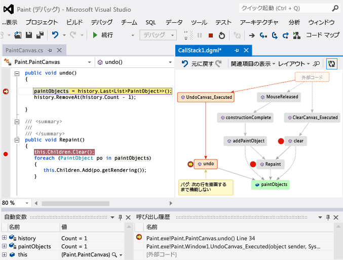
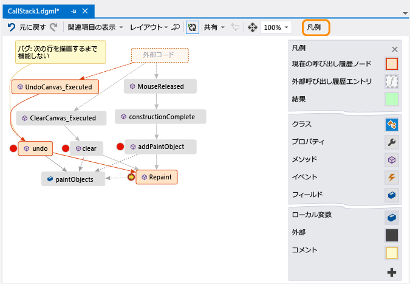

# Visual Studio でデバッグを行うときの呼び出し履歴に対するメソッドのマップ

デバッグ中に呼び出し履歴を視覚的にトレースするためのコード マップを作成します。 コメントをマップに追加することでバグの発見に重点を置いてコードの動作を追跡できます。

 

 要件:

 ::: moniker range="vs-2017"

- [Visual Studio Enterprise](https://visualstudio.microsoft.com/vs/older-downloads/?utm_medium=microsoft&utm_source=docs.microsoft.com&utm_campaign=vs+2017+download)

::: moniker-end

::: moniker range="vs-2019"

- [Visual Studio Enterprise](https://visualstudio.microsoft.com/downloads)

::: moniker-end

- デバッグできるコード (Visual C#、Visual Basic、 C++、JavaScript、X + + など)

  参照トピック

- [ビデオ: コードマップデバッガーの統合を使用して視覚的にデバッグする (Channel 9)](https://channel9.msdn.com/Series/Visual-Studio-2012-Premium-and-Ultimate-Overview/Visual-Studio-Ultimate-2012Debug-visually-with-Code-Map-debugger-integration)

- [呼び出し履歴をマップする](#MapStack)

- [コードに関するメモを作成する](#MakeNotes)

- [次の呼び出し履歴でマップを更新します](#UpdateMap)

- [関連するコードをマップに追加する](#AddRelatedCode)

- [マップを使用してバグを見つける](#FindBugs)

- [Q & A](#QA)

  コードマップを操作するときに使用できるコマンドとアクションの詳細については、「[コードマップの参照および再配置](../modeling/browse-and-rearrange-code-maps.md)」を参照してください。

## 呼び出し履歴でマップを作成する

1. デバッグを開始します。 (キーボード: **F5**)

2. アプリが中断モードになった後、または関数にステップインする場合は、 **[コードマップ]** を選択します。 (キーボード: **Ctrl**  + **Shift**  +  **`** )

     

     現在の呼び出し履歴は新しいコード マップ上にオレンジ色で表示されます。

     

     デバッグを継続している間、マップは自動的に更新されます。 「[次の呼び出し履歴でマップを更新する」を](#UpdateMap)参照してください。

## コードに関するコメントを追加する

 コメントを追加して、コードの動作を追跡します。 コメントに新しい行を追加するには、Shift キーを押し**ながら Return**キーを押します。

 

## 次の呼び出し履歴でマップを更新する

 アプリを次のブレークポイントまで実行するか、関数にステップ インします。 マップに新しい呼び出し履歴が追加されます。

 

## 関連するコードをマップに追加する

 これでマップが作成されるようになりました。次は何ですか? または Visual Basic でC#作業している場合は、フィールド、プロパティ、その他のメソッドなどの項目を追加して、コードの動作を追跡します。

 メソッドのコード定義を表示するには、そのメソッドをダブルクリックするか、そのメソッドのショートカット メニューを使用します。 (キーボード: マップでメソッドを選択し、 **F12**キーを押します)

 

 マップで追跡する項目を追加します。

 

> [!NOTE]
> 既定では、マップに項目を追加すると、クラス、名前空間、アセンブリなどの親グループのノードも追加されます。 これは便利ですが、マップのツールバーの **[親を含める]** ボタンを使用するか、項目を追加するときに**CTRL**キーを押して、この機能をオフにすることで、マップを単純にすることができます。

 

 ここでは、同じフィールドを使用するメソッドを簡単に表示できます。 追加された最新の項目は緑色で表示されます。

 コードのさらに多くの項目を表示するには、マップの作成を続けます。

 

 

## マップを使用してバグを見つける

 コードの視覚化はバグをよりすばやく見つけるために役立ちます。 たとえば、描画プログラムのバグを調査しているとします。 直線を描画して元に戻そうとしても、別の直線を描画するまで何も起こりません。

 そのため、`clear`、`undo`、および `Repaint` メソッドにブレークポイントを設定し、デバッグを開始して、次のようなマップを作成します。

 

 マップ上のすべてのユーザー ジェスチャーが、`Repaint` を除いて、`undo` を呼び出していることがわかります。 これが原因で `undo` がすぐに動作しない可能性があります。

 バグを修正してプログラムの実行を続けると、マップに `undo` から `Repaint` への新しい呼び出しが追加されます。

 

##  Q & A

- **すべての呼び出しがマップに表示されるわけではありません。なぜでしょうか。**

   既定では、ユーザー自身のコードだけがマップに表示されます。 外部コードを表示するには、 **[呼び出し履歴]** ウィンドウで有効にします。

   ![[呼び出し履歴] ウィンドウを使用して外部コードを表示](../debugger/media/debuggermap_callstackmenu.png)

   または、Visual Studio のデバッグオプションで **[マイコードのみを有効にする]** をオフにします。

   ![[オプション] ダイアログ ボックスを使用して、外部コードを表示](../debugger/media/debuggermap_debugoptions.png)

- **マップを変更してもコードに影響はありますか。**

   マップを変更しても、コードには影響しません。 マップでの名前変更、移動、削除は自由に行うことができます。

- **このメッセージの意味は、「図は古いバージョンのコードに基づいている可能性がある」ということです。**

   マップを最後に更新してからコードが変更されている可能性があります。 たとえば、マップ上の呼び出しがコードに存在しなくなった可能性があります。 メッセージを閉じてから、マップを再び更新する前にソリューションをリビルドしてみます。

- **マップのレイアウトを制御操作方法には**

   マップツールバーの **[レイアウト]** メニューを開きます。

  - 既定のレイアウトを変更します。

  - マップの自動調整を停止するには、[**デバッグ時に自動的にレイアウト**を無効にする] をオンにします。

  - 項目を追加するときにできるだけ少ない方法でマップを再配置するには、 **[インクリメンタルレイアウト]** をオフにします。

- **他のユーザーとマップを共有することはできますか。**

   マップをエクスポートしたり、Microsoft Outlook を使用している場合は他のユーザーに送信したりできます。また、ソース管理にチェックインできるように、ソリューションに保存することもできます。

   

- **新しい呼び出し履歴を自動的に追加しないようにマップを停止操作方法ますか?**

   マップツールバー &#45;の ![] ボタンをクリックして、[コードマップに呼び出し履歴を自動的に表示](../debugger/media/debuggermap_automaticupdateicon.gif)ます。 現在の呼び出し履歴をマップに手動で追加するには、 **ctrl**  + **Shift**  +  **`** を押します。

   マップは、デバッグ中にマップ上の既存の呼び出し履歴を強調表示し続けます。

- **項目のアイコンと矢印は何を意味するのでしょうか。**

   項目に関する詳細情報を取得するには、その項目の上にマウスポインターを移動し、項目のツールヒントを確認します。 また、**凡例**を見て、各アイコンの意味を理解することもできます。

   

  参照トピック

- [呼び出し履歴をマップする](#MapStack)

- [コードに関するメモを作成する](#MakeNotes)

- [次の呼び出し履歴でマップを更新します](#UpdateMap)

- [関連するコードをマップに追加する](#AddRelatedCode)

- [マップを使用してバグを見つける](#FindBugs)

## 関連項目

- [ソリューション間の依存関係をマップする](../modeling/map-dependencies-across-your-solutions.md)
- [コード マップを使用してアプリケーションをデバッグする](../modeling/use-code-maps-to-debug-your-applications.md)
- [コード マップ アナライザーを使用して潜在的な問題を検索する](../modeling/find-potential-problems-using-code-map-analyzers.md)
- [コード マップの参照および再配置](../modeling/browse-and-rearrange-code-maps.md)
