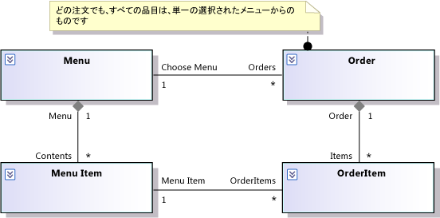

# ユーザー要件のモデリング

Visual Studio を使用すると、ユーザーの目標達成を支援する際に、彼らのアクティビティやシステムが果たしている役割に関する図を描画することで、ユーザー ニーズを理解し、検討し、やり取りすることができます。 要求モデルとはこのような一連の図のことで、それぞれの図では、ユーザー ニーズの異なる側面に注目しています。 ビデオ デモについては、「 [ビジネス ドメインのモデリング](http://channel9.msdn.com/posts/clinted/UML-with-VS-2010-Part-3-Modeling-the-Business-Domain/)」を参照してください。

 どのバージョンの Visual Studio が各モデルの種類をサポートしているかについては、「 [Version support for architecture and modeling tools](../modeling/what-s-new-for-design-in-visual-studio.md#VersionSupport)」を参照してください。

 要求モデルの特長:

-   システムの内部の設計とは別に、システムの外部動作に焦点を当てます。

-   自然言語を使用した場合と比べて、ユーザーのニーズと利害関係者のニーズをより明確に記述します。

-   ユーザー、開発者、テスト担当者が使用できる、一貫した用語集を定義します。

-   要求と照らし合わせた際のギャップと不整合を軽減します。

-   要求の変更に応答するために必要な作業を削減します。

-   機能の開発順序を計画します。

-   システム テストのベースとしてモデルを使用して、テストと要求間の関係を明確にします。 要求が変更された場合、この関係により、テストを正しく更新できます。 これにより、システムが新しい要求を満たしていることを確認します。

 要求モデルは、ユーザーまたはユーザーの代表者との話し合いに集中する場合や、各反復処理の開始時に再検討する場合に使用すると、最大のメリットが得られます。 コードを作成する前に、要求モデルを細部まで完成させる必要はありません。 通常、非常に簡略化された状態で部分的にしか動作していないアプリケーションでも、ユーザーと要求について検討する場合に、非常に効果の上がるベースとなります。 このモデルは、これらの話し合いの結果を要約する効果的な方法です。 詳細については、次を参照してください。[モデルを使用して、開発工程で](../modeling/use-models-in-your-development-process.md)です。

> [!NOTE]
> これらのトピックでは、"システム" という用語は、開発中のシステムまたはアプリケーションを意味します。 システムは、数多くのソフトウェアおよびハードウェア コンポーネントが大規模に収集されたものを指す場合があります。また、1 つのアプリケーションの場合もあれば、大規模なシステム内の 1 つのソフトウェア コンポーネントを指すこともあります。 いずれの場合でも、要求モデルは、ユーザー インターフェイスを使用するか、API を使用するかにかかわらず、システムの外側から確認できる動作を記述します。

## 一般的なタスク

ユーザー要求について、複数の異なるビューを作成することができます。  各ビューは、特定の種類の情報を提供します。  これらのビューを作成するときは、頻繁にビューを切り替えることをお勧めします。 任意のビューから開始することができます。

|図またはドキュメント|要求モデルに記載されている内容|セクション|
|-------------------------|-----------------------------------------------|-------------|
|概念クラス図|要求の記述に使用する型の用語集。システムのインターフェイスで確認できる型。||
|追加のドキュメントまたは作業項目|パフォーマンス、セキュリティ、使いやすさ、および信頼性の条件。|[サービス品質要求の記述](#QoSRequirements)|
|追加のドキュメントまたは作業項目|特定のユース ケースに固有でない制約とルール|[ビジネス ルールの表示](#BusinessRules)|

 ほとんどの種類の図が、他の目的に使用できることに注意してください。 ダイアグラムの種類の概要については、次を参照してください。[アプリのモデルを作成](../modeling/create-models-for-your-app.md)です。

##   Showing Business Rules

ビジネス ルールとは、特定のユース ケースに関連付けられておらず、システム全体で認められる要求です。

 多くのビジネス ルールは、概念クラス間の関係に関する制約です。 これらを記述することができます*静的 * * ビジネス ルール*概念クラス ダイアグラムで、関連するクラスに関連付けられているコメントとして。 例えば:

 

 *動的ビジネス ルール* は、イベントの許容可能なシーケンスを制約します。 たとえば、シーケンス図やアクティビティ図を使って、ユーザーがシステムにログインしてから他の操作を実行する必要があることを示すとします。

 しかし、多くの動的ルールは、より効果的かつ一般的に静的ルールに書き換えることができます。 たとえば、概念クラス モデルのクラスに 'Logged In' ブール値属性を追加することができます。 Log in ユース ケースの事後条件として Logged In を追加し、他のほとんどのユース ケースには事前条件としてそれを追加します。 この方法を使用すると、イベントのシーケンスのすべての可能な組み合わせを定義する必要はなくなります。 また、新しいユース ケースをモデルに追加する場合に、柔軟性も向上します。

 ここでの選択は、要求をどのように定義するかということであり、これはプログラム コードへの要求の実装方法とは無関係であることに注意してください。

 詳細については、次のトピックを参照してください。

|詳細|読み取り|
|--------------------|----------|
|ビジネス ルールに準拠しているコードを開発する方法|[アプリのアーキテクチャをモデル化する](../modeling/model-your-app-s-architecture.md)|

##   Describing Quality of Service Requirements

サービス品質要求には、いくつかのカテゴリがあります。 次に例を示します。

-   パフォーマンス

-   セキュリティ

-   使用性

-   信頼性

-   保全性

これらの要求のいくつかを、特定のユース ケースの説明に含めることができます。 その他の要求は、ユース ケースに固有のものではなく、個別のドキュメントに記載することが最も効果的です。 可能であれば、要求モデルで定義されているボキャブラリに準拠すると便利です。 次の例では、要求で使用されている主な単語が、前のイラストのアクターのタイトル、ユース ケース、およびクラスである点に注意してください。

Customer が Meal を Ordering 中に、Restaurant が Menu Item を削除すると、その Menu Item を参照する Order Item が赤色で表示されます。

参照してください[アプリのアーキテクチャをモデル](../modeling/model-your-app-s-architecture.md)をサービス品質要求に準拠するコードを開発する方法を参照してください。

## 関連項目

- [開発プロセス内でのモデルの使用](../modeling/use-models-in-your-development-process.md)
- [アプリのアーキテクチャをモデル化する](../modeling/model-your-app-s-architecture.md)
