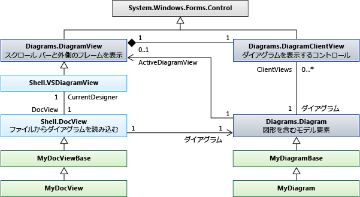

# <a name="navigate-and-update-a-model-in-program-code"></a>プログラム コードのモデル内を移動し、モデルを更新する

モデル要素の作成と削除、そのプロパティの設定、要素間のリンクの作成と削除を行うコードを記述することができます。 すべての変更は、トランザクション内で行う必要があります。 図に要素が表示されている場合、ダイアグラムはトランザクションの終了時に自動的に "修正" されます。

## <a name="an-example-dsl-definition"></a><a name="example"></a> DSL 定義の例
 これは、このトピックの例で使用する DslDefinition.dsl の主要な部分です。

 

 このモデルは、この DSL のインスタンスです。

 

### <a name="references-and-namespaces"></a>参照と名前空間
 このトピックのコードを実行するには、次を参照する必要があります。

 `Microsoft.VisualStudio.Modeling.Sdk.11.0.dll`

 コードでは、次の名前空間を使用します。

 `using Microsoft.VisualStudio.Modeling;`

 さらに、DSL が定義されているものとは別のプロジェクトでコードを記述する場合は、DSL プロジェクトによってビルドされたアセンブリをインポートする必要があります。

## <a name="navigating-the-model"></a><a name="navigation"></a> モデル内の移動

### <a name="properties"></a>Properties
 DSL 定義で定義したドメイン プロパティは、プログラムのコードでアクセスできるプロパティになります。

 `Person henry = ...;`

 `if (henry.BirthDate < 1500) ...`

 `if (henry.Name.EndsWith("VIII")) ...`

 プロパティを設定する場合は、[トランザクション](#transaction)内で行う必要があります。

 `henry.Name = "Henry VIII";`

 DSL 定義で、プロパティの **Kind** が **Calculated** になっている場合、それを設定することはできません。 詳細については、「[Calculated および Custom Storage プロパティ](../modeling/calculated-and-custom-storage-properties.md)」を参照してください。

### <a name="relationships"></a>リレーションシップ
 DSL 定義で定義したドメイン リレーションシップは、リレーションシップの各端のクラスに 1 つずつあるプロパティのペアになります。 プロパティの名前は DslDefinition ダイアグラムに表示され、リレーションシップの各側でのロールを示すラベルが付きます。 ロールのカーディナリティに応じて、プロパティの型は、リレーションシップのもう一方の端のクラス、またはそのクラスのコレクションのいずれかになります。

 `foreach (Person child in henry.Children) { ... }`

 `FamilyTreeModel ftree = henry.FamilyTreeModel;`

 リレーションシップの反対側のプロパティは常に逆になります。 リンクが作成または削除されると、両方の要素のロール プロパティが更新されます。 次の式 (`System.Linq` の拡張機能を使用) は、この例の ParentsHaveChildren リレーションシップに対して常に true です。

 `(Person p) => p.Children.All(child => child.Parents.Contains(p))`

 `&& p.Parents.All(parent => parent.Children.Contains(p));`

 **ElementLinks**。 リレーションシップは、ドメイン リレーションシップ型のインスタンスである "*リンク*" と呼ばれるモデル要素によっても表されます。 リンクには、常に、1 つのソース要素と 1 つのターゲット要素があります。 ソース要素とターゲット要素は同じでもかまいません。

 リンクとそのプロパティにアクセスできます。

 `ParentsHaveChildren link = ParentsHaveChildren.GetLink(henry, edward);`

 `// This is now true:`

 `link == null || link.Parent == henry && link.Child == edward`

 既定では、モデル要素のペアをリレーションシップの複数のインスタンスでリンクすることはできません。 ただし、DSL 定義でリレーションシップの `Allow Duplicates` フラグが true になっている場合は、複数のリンクが存在する可能性があり、`GetLinks` を使用する必要があります。

 `foreach (ParentsHaveChildren link in ParentsHaveChildren.GetLinks(henry, edward)) { ... }`

 リンクにアクセスするには他の方法もあります。 次に例を示します。

 `foreach (ParentsHaveChildren link in     ParentsHaveChildren.GetLinksToChildren(henry)) { ... }`

 **非表示のロール。** DSL 定義で特定のロールの **Is Property Generated** が **false** の場合、そのロールに対応するプロパティは生成されません。 ただし、その場合でも、リレーションシップのメソッドを使用してリンクにアクセスし、リンクを横断することはできます。

 `foreach (Person p in ParentsHaveChildren.GetChildren(henry)) { ... }`

 最もよく使用される例は <xref:Microsoft.VisualStudio.Modeling.Diagrams.PresentationViewsSubject> リレーションシップであり、これはモデル要素とそれをダイアグラムに表示するシェイプをリンクします。

 `PresentationViewsSubject.GetPresentation(henry)[0] as PersonShape`

### <a name="the-element-directory"></a>要素ディレクトリ
 要素ディレクトリを使用して、ストア内のすべての要素にアクセスできます。

 `store.ElementDirectory.AllElements`

 要素を検索するためのメソッドもあります。次に例を示します。

 `store.ElementDirectory.FindElements(Person.DomainClassId);`

 `store.ElementDirectory.GetElement(elementId);`

## <a name="accessing-class-information"></a><a name="metadata"></a> クラス情報へのアクセス
 クラス、リレーションシップ、および DSL 定義のその他の部分に関する情報を取得できます。 次に例を示します。

 `DomainClassInfo personClass = henry.GetDomainClass();`

 `DomainPropertyInfo birthProperty =`

 `personClass.FindDomainProperty("BirthDate")`

 `DomainRelationshipInfo relationship =`

 `link.GetDomainRelationship();`

 `DomainRoleInfo sourceRole = relationship.DomainRole[0];`

 モデル要素の先祖クラスは次のとおりです。

- ModelElement - すべての要素とリレーションシップは ModelElement です

- ElementLink - すべてのリレーションシップは ElementLink です

## <a name="perform-changes-inside-a-transaction"></a><a name="transaction"></a> トランザクション内で変更を実行する
 プログラムのコードでストア内の何かを変更するときは常に、トランザクション内で行う必要があります。 これは、すべてのモデル要素、リレーションシップ、シェイプ、ダイアグラム、およびそれらのプロパティに適用されます。 詳細については、「<xref:Microsoft.VisualStudio.Modeling.Transaction>」を参照してください。

 トランザクションを管理する最も便利な方法は、`try...catch` ステートメントの中で `using` ステートメントを使用することです。

```
Store store; ...
try
{
  using (Transaction transaction =
    store.TransactionManager.BeginTransaction("update model"))
    // Outermost transaction must always have a name.
  {
    // Make several changes in Store:
    Person p = new Person(store);
    p.FamilyTreeModel = familyTree;
    p.Name = "Edward VI";
    // end of changes to Store

    transaction.Commit(); // Don't forget this!
  } // transaction disposed here
}
catch (Exception ex)
{
  // If an exception occurs, the Store will be
  // rolled back to its previous state.
}
```

 1 つのトランザクション内で任意の数の変更を行うことができます。 アクティブなトランザクション内で新しいトランザクションを開くことができます。

 変更を永続的なものにするには、トランザクションが破棄される前にトランザクションの `Commit` を実行する必要があります。 トランザクション内でキャッチされない例外が発生した場合、ストアは変更前の状態にリセットされます。

## <a name="creating-model-elements"></a><a name="elements"></a> モデル要素の作成
 この例では、既存のモデルに要素を追加します。

```csharp
FamilyTreeModel familyTree = ...; // The root of the model.
using (Transaction t =
    familyTree.Store.TransactionManager
    .BeginTransaction("update model"))
{
  // Create a new model element
  // in the same partition as the model root:
  Person edward = new Person(familyTree.Partition);
  // Set its embedding relationship:
  edward.FamilyTreeModel = familyTree;
          // same as: familyTree.People.Add(edward);
  // Set its properties:
  edward.Name = "Edward VII";
  t.Commit(); // Don't forget this!
}
```

 この例では、要素の作成に関する重要なポイントが示されています。

- ストアの特定のパーティションに新しい要素を作成します。 モデル要素とリレーションシップの場合は、通常、これは既定のパーティションです。ただし、シェイプではそうではありません。

- 埋め込みリレーションシップのターゲットにします。 この例の DslDefinition で、各Person は埋め込みリレーションシップ FamilyTreeHasPeople のターゲットである必要があります。 これを実現するには、Person オブジェクトの FamilyTreeModel role プロパティを設定するか、FamilyTreeModel オブジェクトの People ロール プロパティに Person を追加します。

- 新しい要素のプロパティを設定します (具体的には、DslDefinition で `IsName` が true に設定されているプロパティ)。 このフラグにより、所有者内で要素を一意に識別するプロパティがマークされます。 この例では、Name プロパティにそのフラグが指定されています。

- この DSL の DSL 定義が、ストアに読み込まれている必要があります。 メニュー コマンドなどの拡張機能を作成する場合は、通常、これが既に true になっています。 それ以外の場合は、明示的にモデルをストアに読み込むか、[ModelBus](/previous-versions/ee904639(v=vs.140)) を使用してそれを読み込むことができます。 詳細については、「[方法: プログラム コード内のファイルからモデルを開く](../modeling/how-to-open-a-model-from-file-in-program-code.md)」を参照してください。

  この方法で要素を作成すると、シェイプが自動的に作成されます (DSL にダイアグラムがある場合)。 既定のシェイプ、色、その他の特徴で、自動的に割り当てられる場所に表示されます。 関連付けられたシェイプが表示される場所と方法を制御する必要がある場合は、「[要素とそのシェイプの作成](#merge)」を参照してください。

## <a name="creating-relationship-links"></a><a name="links"></a> リレーションシップのリンクの作成
 例の DSL 定義では、2 つのリレーションシップが定義されています。 それぞれのリレーションシップで、リレーションシップの各端のクラスに "*ロール プロパティ*" が定義されています。

 リレーションシップのインスタンスを作成するには 3 つの方法があります。 これら 3 つのメソッドは、それぞれ同じ効果を持ちます。

- ソース ロール プレーヤーのプロパティを設定します。 次に例を示します。

  - `familyTree.People.Add(edward);`

  - `edward.Parents.Add(henry);`

- ターゲット ロール プレーヤーのプロパティを設定します。 次に例を示します。

  - `edward.familyTreeModel = familyTree;`

       このロールのカーディナリティは `1..1` であるため、値を割り当てます。

  - `henry.Children.Add(edward);`

       このロールのカーディナリティは `0..*` であるため、コレクションに追加します。

- リレーションシップのインスタンスを明示的に構築します。 次に例を示します。

  - `FamilyTreeHasPeople edwardLink = new FamilyTreeHasPeople(familyTreeModel, edward);`

  - `ParentsHaveChildren edwardHenryLink = new ParentsHaveChildren(henry, edward);`

  最後のメソッドは、リレーションシップ自体にプロパティを設定する場合に便利です。

  この方法で要素を作成すると、ダイアグラムにコネクタが自動的に作成されますが、シェイプ、色、その他の特徴は既定のものです。 関連付けられているコネクタの作成方法を制御するには、「[要素とそのシェイプの作成](#merge)」を参照してください。

## <a name="deleting-elements"></a><a name="deleteelements"></a> 要素の削除

要素を削除するには、`Delete()` を呼び出します。

`henry.Delete();`

この操作により、次のものも削除されます。

- 要素との間のリレーションシップ リンク。 たとえば、`edward.Parents` には `henry` が含まれなくなります。

- `PropagatesDelete` フラグが true になっているロールの要素。 たとえば、要素を表示するシェイプは削除されます。

既定では、すべての埋め込みリレーションシップのターゲット ロールでは、`PropagatesDelete` が true に設定されています。 `henry` を削除しても `familyTree` は削除されませんが、`familyTree.Delete()` を削除すると、すべての `Persons` が削除されます。

既定では、参照リレーションシップのロールに対する `PropagatesDelete` は true ではありません。

オブジェクトを削除するとき、削除規則を使用して、特定の反映を除外することができます。 これは、ある要素を別の要素に置換する場合に便利です。 削除を反映しない 1 つまたは複数のロールの GUID を指定します。 GUID は、リレーションシップ クラスから取得できます。

`henry.Delete(ParentsHaveChildren.SourceDomainRoleId);`

(この特定の例の場合は、`PropagatesDelete` が `ParentsHaveChildren` リレーションシップのロールに対して `false` であるため、効果はありません)。

場合によっては、その要素または伝達によって削除される要素にロックが存在することで、削除が妨げられることがあります。 `element.CanDelete()` を使用すると、要素を削除できるかどうかを確認できます。

## <a name="deleting-relationship-links"></a><a name="deletelinks"></a> リレーションシップのリンクの削除
 ロールのプロパティから要素を削除することによって、リレーションシップのリンクを削除できます。

 `henry.Children.Remove(edward); // or:`

 `edward.Parents.Remove(henry);  // or:`

 また、リンクを明示的に削除することもできます。

 `edwardHenryLink.Delete();`

 これら 3 つのメソッドは、すべて同じ効果を持ちます。 これらのうちの 1 つのみを使用する必要があります。

 ロールのカーディナリティが 0..1 または 1..1 の場合は、それを `null` または別の値に設定できます。

 `edward.FamilyTreeModel = null;` // または:

 `edward.FamilyTreeModel = anotherFamilyTree;`

## <a name="re-ordering-the-links-of-a-relationship"></a><a name="reorder"></a> リレーションシップのリンクの並べ替え
 特定のモデル要素をソースまたはターゲットとする特定のリレーションシップのリンクには、特定のシーケンスがあります。 それらは、追加された順序で表示されます。 たとえば、次のステートメントからは、常に同じ順序で子が生成されます。

 `foreach (Person child in henry.Children) ...`

 リンクの順序は変更できます。

 `ParentsHaveChildren link = GetLink(henry,edward);`

 `ParentsHaveChildren nextLink = GetLink(henry, elizabeth);`

 `DomainRoleInfo role =`

 `link.GetDomainRelationship().DomainRoles[0];`

 `link.MoveBefore(role, nextLink);`

## <a name="locks"></a><a name="locks"></a> ロック
 ロックによって変更が妨げられる可能性があります。 ロックは、個々の要素、パーティション、およびストアで設定できます。 これらのレベルのいずれかに、行いたい変更の種類を妨げるロックがある場合、実行しようとすると例外がスローされることがあります。 ロックが設定されているかどうかは、element.GetLocks() を使用して確認できます。これは、<xref:Microsoft.VisualStudio.Modeling.Immutability> 名前空間で定義されている拡張メソッドです。

 詳細については、「[ロック ポリシーの定義と読み取り専用セグメントの作成](../modeling/defining-a-locking-policy-to-create-read-only-segments.md)」を参照してください。

## <a name="copy-and-paste"></a><a name="copy"></a> コピーと貼り付け
 要素または要素のグループを <xref:System.Windows.Forms.IDataObject> にコピーできます。

```csharp
Person person = personShape.ModelElement as Person;
Person adopter = adopterShape.ModelElement as Person;
IDataObject data = new DataObject();
personShape.Diagram.ElementOperations
      .Copy(data, person.Children.ToList<ModelElement>());
```

 要素は、シリアル化された要素グループとして格納されます。

 IDataObject の要素をモデルにマージできます。

```csharp
using (Transaction t = targetDiagram.Store.
        TransactionManager.BeginTransaction("paste"))
{
  adopterShape.Diagram.ElementOperations.Merge(adopter, data);
}
```

 `Merge ()` は、`PresentationElement` または `ModelElement` を受け入れることができます。 `PresentationElement` をそれに渡す場合、3 番目のパラメーターとしてターゲット ダイアグラム上の位置を指定することもできます。

## <a name="navigating-and-updating-diagrams"></a><a name="diagrams"></a> ダイアグラムのナビゲートと更新
 DSL において、Person や Song などの概念を表すドメイン モデル要素は、ダイアグラムに表示される内容を表すシェイプ要素とは別のものです。 ドメイン モデル要素には、概念の重要なプロパティとリレーションシップが格納されます。 シェイプ要素には、ダイアグラム上でのオブジェクトのビューのサイズ、位置、色、およびそのコンポーネント パーツのレイアウトが格納されます。

### <a name="presentation-elements"></a>プレゼンテーション要素
 

 DSL 定義では、指定した各要素によって、次のいずれかの標準クラスから派生するクラスが作成されます。

|要素の種類|基本クラス|
|-|-|
|ドメイン クラス|<xref:Microsoft.VisualStudio.Modeling.ModelElement>|
|ドメイン リレーションシップ|<xref:Microsoft.VisualStudio.Modeling.ElementLink>|
|図形|<xref:Microsoft.VisualStudio.Modeling.Diagrams.NodeShape>|
|コネクタ|<xref:Microsoft.VisualStudio.Modeling.Diagrams.BinaryLinkShape>|
|ダイアグラム|<xref:Microsoft.VisualStudio.Modeling.Diagrams.Diagram>|

 通常は、ダイアグラムの要素によってモデル要素が表されます。 通常 (常にではありません)、<xref:Microsoft.VisualStudio.Modeling.Diagrams.NodeShape> はドメイン クラスのインスタンスを表し、<xref:Microsoft.VisualStudio.Modeling.Diagrams.BinaryLinkShape> はドメイン リレーションシップのインスタンスを表します。 <xref:Microsoft.VisualStudio.Modeling.Diagrams.PresentationViewsSubject> リレーションシップにより、ノードまたはリンク シェイプが、それによって表されるモデル要素にリンクされます。

 すべてのノードまたはリンク シェイプは、1 つのダイアグラムに属しています。 バイナリ リンク シェイプにより、2 つのノード シェイプが接続されます。

 シェイプは、2 つのセットに子シェイプを持つことができます。 `NestedChildShapes` セット内のシェイプは、その親の境界ボックスに限定されます。 `RelativeChildShapes` リスト内のシェイプは、親の境界の外側または一部だけ外側に表示できます (たとえば、ラベルやポートなど)。 ダイアグラムには、`RelativeChildShapes` と `Parent` はありません。

### <a name="navigating-between-shapes-and-elements"></a><a name="views"></a> シェイプと要素間のナビゲーション
 ドメイン モデル要素とシェイプ要素は、<xref:Microsoft.VisualStudio.Modeling.Diagrams.PresentationViewsSubject> リレーションシップによって関連付けられます。

```csharp
// using Microsoft.VisualStudio.Modeling;
// using Microsoft.VisualStudio.Modeling.Diagrams;
// using System.Linq;
Person henry = ...;
PersonShape henryShape =
  PresentationViewsSubject.GetPresentation(henry)
    .FirstOrDefault() as PersonShape;
```

 同じリレーションシップによって、複数のリレーションシップがダイアグラム上のコネクタにリンクされます。

```
Descendants link = Descendants.GetLink(henry, edward);
DescendantConnector dc =
   PresentationViewsSubject.GetPresentation(link)
     .FirstOrDefault() as DescendantConnector;
// dc.FromShape == henryShape && dc.ToShape == edwardShape
```

 このリレーションシップにより、モデルのルートもダイアグラムにリンクされます。

```
FamilyTreeDiagram diagram =
   PresentationViewsSubject.GetPresentation(familyTree)
      .FirstOrDefault() as FamilyTreeDiagram;
```

 シェイプによって表されるモデル要素を取得するには、以下を使用します。

 `henryShape.ModelElement as Person`

 `diagram.ModelElement as FamilyTreeModel`

### <a name="navigating-around-the-diagram"></a>ダイアグラム内のナビゲーション
 一般に、ダイアグラム上のシェイプとコネクタの間を移動することはお勧めしません。 ダイアグラムの外観を操作する必要がある場合にのみ、モデル内のリレーションシップ上をナビゲートして、シェイプとコネクタの間を移動することをお勧めします。 これらのメソッドを使用すると、各端のシェイプにコネクタがリンクされます。

 `personShape.FromRoleLinkShapes, personShape.ToRoleLinkShapes`

 `connector.FromShape, connector.ToShape`

 多くの図形は複合型であり、親図形と子の 1 つ以上のレイヤーで構成されます。 別のシェイプを基準にして配置されたシェイプは、"*子*" と呼ばれます。 親シェイプが移動すると、子もそれと共に移動します。

 "*相対的な子*" は、親シェイプの境界ボックスの外側に表示できます。 "*入れ子になった*" 子は、親の境界内だけに表示されます。

 ダイアグラムの最上位のシェイプのセットを取得するには、以下を使用します。

 `Diagram.NestedChildShapes`

 シェイプとコネクタの先祖クラスは次のとおりです。

 <xref:Microsoft.VisualStudio.Modeling.ModelElement>

 -- <xref:Microsoft.VisualStudio.Modeling.Diagrams.PresentationElement>

 -- <xref:Microsoft.VisualStudio.Modeling.Diagrams.ShapeElement>

 ----- <xref:Microsoft.VisualStudio.Modeling.Diagrams.NodeShape>

 ------- <xref:Microsoft.VisualStudio.Modeling.Diagrams.Diagram>

 ------- *YourShape*

 ----- <xref:Microsoft.VisualStudio.Modeling.Diagrams.LinkShape>

 ------- <xref:Microsoft.VisualStudio.Modeling.Diagrams.BinaryLinkShape>

 --------- *YourConnector*

### <a name="properties-of-shapes-and-connectors"></a><a name="shapeProperties"></a> シェイプとコネクタのプロパティ
 ほとんどの場合、シェイプを明示的に変更する必要はありません。 モデル要素を変更すると、"修正" ルールによってシェイプとコネクタが更新されます。 詳細については、[変更内容への対応および変更内容の反映](../modeling/responding-to-and-propagating-changes.md)に関するページを参照してください。

 ただし、モデル要素に依存しないプロパティでシェイプを明示的に変更すると便利です。 たとえば、次のプロパティを変更できます。

- <xref:Microsoft.VisualStudio.Modeling.Diagrams.NodeShape.Size%2A> - シェイプの高さと幅を決定します。

- <xref:Microsoft.VisualStudio.Modeling.Diagrams.NodeShape.Location%2A> -親のシェイプまたはダイアグラムを基準にした位置

- <xref:Microsoft.VisualStudio.Modeling.Diagrams.ShapeElement.StyleSet%2A> - シェイプまたはコネクタの描画に使用されるペンとブラシのセット

- <xref:Microsoft.VisualStudio.Modeling.Diagrams.ShapeElement.Hide%2A> - シェイプを非表示にします

- <xref:Microsoft.VisualStudio.Modeling.Diagrams.ShapeElement.Show%2A> - `Hide()` の後でシェイプを表示します

### <a name="creating-an-element-and-its-shape"></a><a name="merge"></a> 要素とそのシェイプの作成

要素を作成し、埋め込みリレーションシップのツリーにそれをリンクすると、シェイプが自動的に作成されて、それに関連付けられます。 これは、トランザクションの最後に実行される "修正" 規則によって行われます。 ただし、シェイプは自動的に割り当てられた場所に表示され、その図形、色、その他の特徴には既定値が設定されます。 シェイプの作成方法を制御するには、マージ機能を使用します。 まず、追加する要素を ElementGroup に追加してから、そのグループをダイアグラムにマージする必要があります。

このメソッドは以下の操作を行います。

- プロパティを要素名として割り当てた場合は、名前が設定されます。

- DSL 定義で指定したすべての要素マージ ディレクティブが監視されます。

この例では、ユーザーがダイアグラムをダブルクリックすると、マウスの位置にシェイプが作成されます。 このサンプルの DSL 定義では、`ExampleShape` の `FillColor` プロパティが公開されています。

```csharp
using Microsoft.VisualStudio.Modeling;
using Microsoft.VisualStudio.Modeling.Diagrams;
partial class MyDiagram
{
  public override void OnDoubleClick(DiagramPointEventArgs e)
  {
    base.OnDoubleClick(e);

    using (Transaction t = this.Store.TransactionManager
        .BeginTransaction("double click"))
    {
      ExampleElement element = new ExampleElement(this.Store);
      ElementGroup group = new ElementGroup(element);

      { // To use a shape of a default size and color, omit this block.
        ExampleShape shape = new ExampleShape(this.Partition);
        shape.ModelElement = element;
        shape.AbsoluteBounds = new RectangleD(0, 0, 1.5, 1.0);
        shape.FillColor = System.Drawing.Color.Azure;
        group.Add(shape);
      }

      this.ElementOperations.MergeElementGroupPrototype(
        this,
        group.CreatePrototype(),
        PointD.ToPointF(e.MousePosition));
      t.Commit();
    }
  }
}
```

 複数のシェイプを指定する場合は、`AbsoluteBounds` を使用してそれらの相対位置を設定します。

 コネクタの色やその他の公開プロパティも、この方法を使用して設定できます。

### <a name="use-transactions"></a>トランザクションを使用する
 シェイプ、コネクタ、ダイアグラムは、<xref:Microsoft.VisualStudio.Modeling.ModelElement> のサブタイプであり、ストア内に存在します。 したがって、それらの変更はトランザクション内でのみ行う必要があります。 詳細については、「[方法: トランザクションを使用してモデルを更新する](../modeling/how-to-use-transactions-to-update-the-model.md)」を参照してください。

## <a name="document-view-and-document-data"></a><a name="docdata"></a> ドキュメント ビューとドキュメント データ
 

## <a name="store-partitions"></a>パーティションを格納する
 モデルが読み込まれると、付随するダイアグラムも同時に読み込まれます。 一般に、モデルは Store.DefaultPartition に読み込まれ、ダイアグラムの内容は別のパーティションに読み込まれます。 通常、各パーティションの内容が読み込まれて、個別のファイルに保存されます。

## <a name="see-also"></a>こちらもご覧ください

- <xref:Microsoft.VisualStudio.Modeling.ModelElement>
- [ドメイン固有言語における検証](../modeling/validation-in-a-domain-specific-language.md)
- [ドメイン固有言語からのコード生成](../modeling/generating-code-from-a-domain-specific-language.md)
- [方法: トランザクションを使用してモデルを更新する](../modeling/how-to-use-transactions-to-update-the-model.md)
- [Visual Studio Modelbus によるモデルの統合](../modeling/integrating-models-by-using-visual-studio-modelbus.md)
- [変更内容への対応および変更内容の反映](../modeling/responding-to-and-propagating-changes.md)
