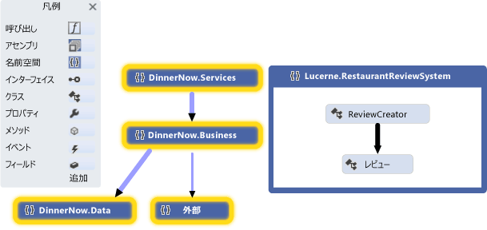
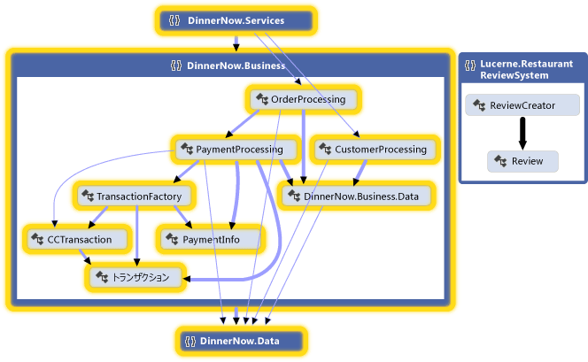
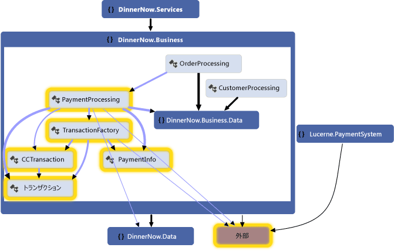
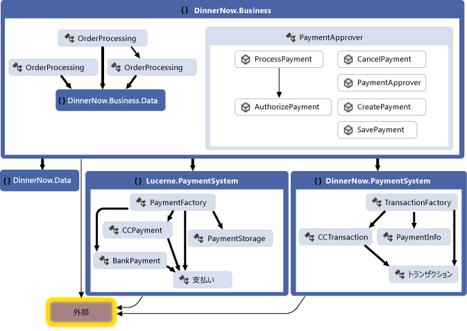
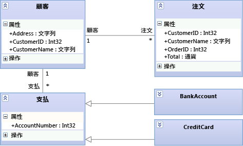
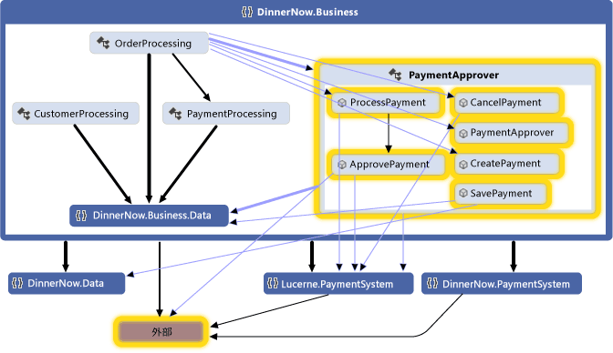

# シナリオ: 視覚化およびモデリングを使用したデザインの変更
ソフトウェア システムがユーザーのニーズを確実に満たすようにするには、Visual Studio の視覚化およびモデリング ツールを使用します。
コード マップ、依存関係図、およびクラス図などのツールを使用します。  
  
 どのバージョンの Visual Studio が各ツールをサポートしているかについては、「 [Version support for architecture and modeling tools](../modeling/what-s-new-for-design-in-visual-studio.md#VersionSupport)」を参照してください。  
  
-   ユーザーの要求およびビジネス プロセスを明らかにする。  
  
-   既存のコードを視覚化して精査する。  
  
-   既存のシステムに対する変更を記述する。  
  
-   システムが要求を満たしていることを確認する。  
  
-   コードと設計の一致を維持する。  
  
 このチュートリアルでは、以下が扱われます。  
  
-   これらのツールをソフトウェア プロジェクトで使用する利点を説明します。  
  
-   開発方法に関係なく、これらのツールを使用する方法をサンプル シナリオを使って示します。  
  
 これらのツールの詳細およびサポートされるシナリオについては、以下のトピックを参照してください。  
  
-   [アーキテクチャの分析およびモデリング](../modeling/analyze-and-model-your-architecture.md)  
  
-   [コードの視覚化](../modeling/visualize-code.md)  
  
##   シナリオの概要  
 このシナリオでは、Dinner Now と Lucerne Publishing という 2 つの架空の企業のソフトウェア開発ライフサイクルの事例について説明します。 Dinner Now は、シアトルで Web ベースの料理宅配サービスを提供しています。 顧客は、Dinner Now の Web サイトで料理を注文し、料金を支払うことができます。 注文は最寄りのレストランに送信され、そこから料理が配達されます。 ニューヨークを拠点とする Lucerne Publishing は、オフラインとオンラインでさまざまなビジネスを展開しています。 その 1 つに、顧客がレストランのレビューを投稿できる Web サイトがあります。  
  
 先ごろ Dinner Now を買収した Lucerne は、現在次のような変更を計画しています。  
  
-   Dinner Now にレストランのレビューの機能を追加して両社の Web サイトを統合する。  
  
-   Dinner Now の支払いシステムを Lucerne のシステムに置き換える。  
  
-   Dinner Now のサービスを地域全体に拡大する。  
  
 Dinner Now では、スクラムとエクストリーム プログラミングを使用しています。 テスト カバレッジは非常に高く、サポートされていないコードはほとんどありません。 また、小規模な作業バージョンのシステムを作成して徐々に機能を追加することにより、リスクを最小限に抑えています。 さらに、短い頻繁なイテレーションでコードを開発することにより、 システム変更時の信頼性の確保、コードの頻繁なリファクタリング、および "Big Design Up Front (最初に大規模な設計を行うこと)" の回避を実現しています。  
  
 一方、Lucerne のシステムははるかに大規模で複雑です。中には 40 年以上前のシステムもあります。 Lucerne は、広範囲にわたる複雑なレガシ コードがあるために変更に対してはきわめて慎重で、 ソリューションの詳細な設計や開発中の設計および変更の記録を重視する、より厳格な開発プロセスに従っています。  
  
 Dinner Now と Lucerne はどちらも、ユーザーのニーズを満たすシステムを開発するために Visual Studio のモデル図を使用しています。 また、作業の計画、整理、および管理のために、Team Foundation Server を他のツールと共に使用しています。  
  
 Team Foundation Server の詳細については、次のトピックを参照してください。  
  
-   [作業の計画および追跡](#PlanningTracking)  
  
-   [更新されたコードのテスト、検証、およびチェックイン](#TestValidateCheckInCode)  
  
##   ソフトウェア開発におけるアーキテクチャ図とモデル図の役割  
 ソフトウェア開発ライフサイクルのさまざまなステージにおけるこれらのツールの役割を次の表に示します。  
  
||**ユーザー要求のモデリング**|**ビジネス プロセスのモデリング**|**システムのアーキテクチャと設計**|**コードの視覚化と精査**|**検証**|  
|------|------------------------------------|-----------------------------------|--------------------------------------|------------------------------------------|----------------------|  
|ドメイン固有言語 (DSL) 図|はい|はい|はい|||  
|依存関係図、レイヤー検証|||はい|はい|はい|  
|コード マップ|||はい|はい|はい|  
|クラス デザイナー (コード ベース)||||はい||  
  
依存関係図を描画するには、既存のソリューションまたは新しいダッシュ ボードの一部としてモデリング プロジェクトを作成する必要があります。 これらの図はモデリング プロジェクト内に生成する必要があります。
依存関係図の項目が、モデリング プロジェクト内にあるが、共通モデルには格納されません。 コードから作成されたコード マップおよび .NET クラス図は、モデリング プロジェクトに含まれません。  
  
 参照トピック  
  
-   [コードからの依存関係図の作成](../modeling/create-layer-diagrams-from-your-code.md)  
  
-   [ソリューション間の依存関係をマップする](../modeling/map-dependencies-across-your-solutions.md)  
  
-   [方法: プロジェクトにクラス ダイアグラムを追加する (クラス デザイナー)](../ide/how-to-add-class-diagrams-to-projects-class-designer.md)  
  
-   [Modeling SDK for Visual Studio - ドメイン固有言語](../modeling/modeling-sdk-for-visual-studio-domain-specific-languages.md)  

[!INCLUDE[modeling_sdk_info](includes/modeling_sdk_info.md)]
  
 また、両方のチームでは依存関係の検証を使用して、開発中のコードが設計との一貫性のあることを確認してください。  
  
 参照トピック  
  
-   [コードと設計の一致の維持](#ValidatingCode)  
  
-   [論理アーキテクチャの記述: 依存関係図](#DescribeLayers)  
  
-   [依存関係図を使用したコードの検証](../modeling/validate-code-with-layer-diagrams.md)  
  
    > [!NOTE]
    >  Visual Studio のバージョンによっては、視覚化およびモデリングの依存関係の検証およびコード マップの読み取り専用のバージョンをサポートします。 この機能をサポートする Visual Studio のバージョンを確認するには、「 [Version support for architecture and modeling tools](../modeling/what-s-new-for-design-in-visual-studio.md#VersionSupport)」を参照してください。  
  
##   システムに関する情報の把握と伝達  
 Visual Studio のモデリング図は、使用する順番は特に決まっていません。したがって、それぞれのニーズや方法に合わせて使用できます。 モデルは通常、プロジェクト全体を通じて繰り返し頻繁に参照されます。 図にはそれぞれ長所があるため、さまざまな図を使用することにより、開発中のシステムのさまざまな側面を把握、記述、および伝達できます。  
  
 Dinner Now と Lucerne は、プロジェクトに関するコミュニケーションのための共通の言語として図を使用しています。 たとえば、Dinner Now では次のような作業に図を使用しています。  
  
-   既存のコードの視覚化。  
  
-   新しいユーザー ストーリーや更新されたユーザー ストーリーの伝達。  
  
-   新しいユーザー ストーリーや更新されたユーザー ストーリーをサポートするために必要な変更の特定。  
  
 Lucerne では、次のような作業に図を使用しています。  
  
-   Dinner Now のビジネス プロセスの特定。  
  
-   システムの設計の把握。  
  
-   新しいユーザー要求や更新されたユーザー要求の伝達。  
  
-   システムの更新の記録。  
  
 これらの図は Team Foundation Server と統合されているため、Dinner Now と Lucerne にとっては作業の計画、管理、および追跡がより簡単になります。 たとえば、モデルを使用してテスト ケースと開発タスクを特定し、必要な作業を見積もることができます。 Lucerne では、進行状況を監視したり、システムがユーザーの要求を満たしていることを確認したりできるように、Team Foundation Server の作業項目をモデル要素にリンクしています。 たとえば、ユース ケースをテスト ケース作業項目にリンクして、すべてのテストに成功するとユース ケースが満たされたことがわかるようにしています。  
  
 チームがその変更をチェックインする前に依存関係の検証と自動テストを含むビルドを実行して、テストと設計に照らし合わせてコードを検証します。 これにより、更新されたコードが設計に矛盾していないこと、動作する既存の機能に悪影響を与えないことを確認できます。  
  
 参照トピック  
  
-   [既存のシステムに対する変更の特定](#DeterminingChanges)  
  
-   [Keeping code consistent with the design](#ValidatingCode)  
  
-   [モデルの生成と使用に関する一般的なヒント](#GeneralTips)  
  
-   [作業の計画および追跡](#PlanningTracking)  
  
-   [更新されたコードのテスト、検証、およびチェックイン](#TestValidateCheckInCode)  

###   Identifying Changes to the Existing System  
 Dinner Now では、新しい要求を満たすためのコストを見積もる必要があります。 これは、その変更がシステムの他の部分にどのくらい影響するかによって違ってきます。 そのため、Dinner Now の開発者の 1 人が、既存のコードから次のマップと図を作成しました。  
  
|**マップまたは図**|**表示される内容**|  
|------------------------|---------------|  
|*コード マップ*   参照トピック   -   [ソリューション間の依存関係をマップします。](../modeling/map-dependencies-across-your-solutions.md) -   [参照およびコード マップを再配置](../modeling/browse-and-rearrange-code-maps.md) -   [DGML ファイルを編集してコード マップをカスタマイズします。](../modeling/customize-code-maps-by-editing-the-dgml-files.md)|コード内の依存関係とその他の関係。   たとえば、Dinner Now はまず、アセンブリのコード マップでアセンブリとその依存関係の概要を確認するとします。 そのとき、マップの詳細を表示してそれらのアセンブリの名前空間やクラスを調べることができます。   さらに、コードの特定の領域やその他の種類のリレーションシップを調べるためのマップを生成することもできます。 対象となる領域やリレーションシップを見つけて選択するにはソリューション エクスプローラーを使用します。|  
|*コード ベースのクラス図*   「 [How to: Add Class Diagrams to Projects (Class Designer)](../ide/how-to-add-class-diagrams-to-projects-class-designer.md)」を参照してください。|コード内の既存のクラス。|  
  
 たとえば、開発者はコード マップを作成します。 新しいシナリオの影響を受ける領域に合わせてスコープを調整します。 次のマップでは、それらの領域が選択されて強調表示されています。  
  
   
  
 **名前空間のコード マップ**  
  
 選択した名前空間を展開すると、その名前空間のクラス、メソッド、および関係が表示されます。  
  
   
  
 **展開された名前空間のコード マップ (グループ間リンクが表示されています)**  
  
 こうしてコードを調べることにより、影響を受けるクラスとメソッドを見つけることができます。 それらに加えた変更による影響を確認するには、それぞれの変更後にコード マップを再生成します。 参照してください[コードの視覚化](../modeling/visualize-code.md)です。  
  
 コンポーネントや相互作用など、システムの他の部分に対する変更を記述するには、それらの要素をホワイトボードに描くこともできますが、 Visual Studio で以下の図を描画すると、Dinner Now と Lucerne の双方で詳細を記録、管理、および把握できます。  
  
|**図**|**記述する内容**|  
|------------------|-------------------|  
|*コード ベースのクラス図*   「 [How to: Add Class Diagrams to Projects (Class Designer)](../ide/how-to-add-class-diagrams-to-projects-class-designer.md)」を参照してください。|コード内の既存のクラス。|  
  
###   コードと設計の一致の維持  
 Dinner Now では、更新されたコードが設計と一致していることを確認する必要があります。 それらは、システムの機能のレイヤーを記述、それらのレイヤーをおよび関連付けのソリューションの成果物の間で許容される依存関係を指定する依存関係図を生成します。  
  
|**図**|**記述する内容**|  
|-----------------|-------------------|  
|*依存関係図*   参照トピック   -   [コードから依存関係のダイアグラムを作成します。](../modeling/create-layer-diagrams-from-your-code.md) -   [依存関係図: リファレンス](../modeling/layer-diagrams-reference.md) -   [依存関係図: ガイドライン](../modeling/layer-diagrams-guidelines.md) -   [依存関係のダイアグラムのコードを検証します。](../modeling/validate-code-with-layer-diagrams.md)|コードの論理アーキテクチャ。   依存関係ダイアグラムを整理およびマップ内の成果物、[!INCLUDE[vsprvs](../code-quality/includes/vsprvs_md.md)]と呼ばれるグループを抽象化するソリューション*レイヤー*です。 これらのレイヤーは、それらの成果物がシステムで実行するロール、タスク、または機能を識別します。   レイヤー図は、必要とされるシステムの設計を記述し、コードの変更をその設計に照らし合わせて検証するのに便利です。   レイヤーを作成するには、ソリューション エクスプローラー、コード マップ、クラス ビュー、およびオブジェクト ブラウザーから項目をドラッグします。 新しいレイヤーを描画するには、ツールボックスを使用するか、図の画面を右クリックします。   既存の依存関係を表示するには、レイヤー図の画面を右クリックし、 **[依存関係の生成]**をクリックします。 必要とされる依存関係を指定するには、新しい依存関係を描画します。|  
  
 たとえば、次の依存関係図では、各レイヤーに関連付けられている成果物の数とレイヤー間の依存関係について説明します。  
  
   
  
 **依存関係図**  
  
 設計との競合コードの開発中に発生しないように確認するには、ビルドで依存関係検証チームの使用は、Team Foundation ビルドで実行されます。 また、そのチェックイン操作で依存関係の検証を要求するカスタム MSBuild タスクを作成します。 ビルド レポートを使用して検証エラーを収集しています。  
  
 参照トピック  
  
-   [ビルド プロセスの定義](http://msdn.microsoft.com/Library/61593e10-d24b-492f-b19a-af4d85abea6b)  
  
-   [変更内容を検証するためのゲート チェックイン ビルド プロセスの定義](http://msdn.microsoft.com/Library/9cfc8b9c-1023-40fd-8ab5-1b1bd9c172ec)  
  
-   [ビルド プロセス テンプレートのカスタマイズ](http://msdn.microsoft.com/Library/b94c58f2-ae6f-4245-bedb-82cd114f6039)  
  
###   General Tips for Creating and Using Models  
  
-   ほとんどの図は、線で接続された一連のノードで構成されています。 図の種類ごとに異なるノードと線がツールボックスに表示されます。  
  
     ツールボックスを開くには、 **[表示]** メニューの **[ツールボックス]**をクリックします。  
  
-   ノードを生成するには、ツールボックスから図にノードをドラッグします。 既存のノードにドラッグする必要がある種類のノードもあります。 たとえば、コンポーネント図では、新しいポートは既存のコンポーネントに追加する必要があります。  
  
-   線 (接続) を生成するには、ツールボックスで適切なツールをクリックし、ソース ノードをクリックしてから、ターゲット ノードをクリックします。 特定の種類のノードの間にしか生成できない線もあります。 ソースまたはターゲットにするノードをポイントすると、接続を生成できるかどうかが示されます。  
  
###   Planning and Tracking Work  
 Visual Studio のモデリング図は Team Foundation Server と統合されているため、Dinner Now と Lucerne にとって作業の計画、管理、および追跡がより簡単になります。 Dinner Now と Lucerne はどちらも、モデルを使用してテスト ケースと開発タスクを特定し、必要な作業を見積もることができます。 Lucerne では、Team Foundation Server の作業項目を作成し、ユース ケースやコンポーネントなどのモデル要素にリンクしています。 これにより、作業の進行状況を監視したり、関連するユーザーの要求を見直して、 変更後も引き続きそれらの要求が満たされていることを確認したりできます。  
  
 Dinner Now と Lucerne は、作業の進行に伴って、タスクに費やされた時間を反映して作業項目を更新できます。 また、Team Foundation Server の以下の機能を使用して、作業の状況を監視および報告できます。  
  
-   計画された作業を予定どおりに完了できるかどうかを示す日次 *バーンダウン レポート* 。 Team Foundation Server で他の同様のレポートを生成してバグの状況を追跡することもできます。  
  
-   Microsoft Excel を使用してチームのメンバーの作業負荷を監視および調整できる *イテレーション ワークシート* 。 このワークシートは Team Foundation Server にリンクされており、進行状況に関する定例会議で資料として使用できます。  
  
-   Office Project を使用してプロジェクトに関する重要な情報をチームに伝える *開発ダッシュボード* 。  
  
 参照トピック  
  
-   [Visual Studio Team Services または Team Foundation Server を使用した作業の追跡](http://msdn.microsoft.com/Library/52aa8bc9-fc7e-4fae-9946-2ab255ca7503)  
  
-   [Visual Studio ALM のグラフ、ダッシュボード、およびレポート](http://msdn.microsoft.com/Library/1f28ba6c-c5e5-46d3-9209-ede24ae78e48)  
  
-   [Project を使用したバックログとタスクの作成](http://msdn.microsoft.com/Library/be5cef4f-755f-4ffe-8dd7-876d1e02c330)  
  
###   コードのテスト、検証、およびチェックイン  
 Dinner Now と Lucerne は、作業が完了するたびにコードを Team Foundation バージョン管理にチェックインします。その作業を忘れると、Team Foundation Server から通知されます。 Team Foundation Server でチェックインが受け入れられるため、チームは、単体テストとコードをテスト_ケースと設計に照らし合わせて検証する依存関係の検証を実行します。 Team Foundation Server を使用して、ビルドを実行し、自動化された単体テスト、および依存関係の検証を定期的にします。 これにより、コードが以下の基準を満たしていることを確認できます。  
  
-   正常に動作する。  
  
-   既存の動作するコードを破損させない。  
  
-   設計と一致している。  
  
 Dinner Now には数多くの自動テストがあり、そのほとんどを引き続き適用できるため、Lucerne でそれらを再利用することができます。 新しい機能をカバーするために、それらのテストに変更を加えたり、新しいテストを追加したりすることもできます。 Dinner Now と Lucerne の両方で Visual Studio による手動テストも実行されます。  
  
 コードが設計に準拠していることを確認するには、チームは、Team Foundation ビルドで依存関係の検証を含めるのビルドを構成します。 競合が発生した場合は、詳細なレポートが生成されます。  
  
 参照トピック  
  
-   [アプリケーションのテスト](https://www.visualstudio.com/docs/test/overview)  
  
-   [開発時のシステムの検証](../modeling/validate-your-system-during-development.md)  
  
-   [バージョン管理の使用](http://go.microsoft.com/fwlink/?LinkID=525605)  
  
-   [アプリケーションのビルド](http://msdn.microsoft.com/Library/a971b0f9-7c28-479d-a37b-8fd7e27ef692)  
  
##   Updating the System Using Visualization and Modeling  
 Lucerne と Dinner Now は、支払いシステムを統合する必要があります。 以降では、この作業に役立つ Visual Studio のモデル図について説明します。  
  
-   [既存のコードの視覚化: コード マップ](#VisualizeCode)  
  
-   [型の用語集の定義: クラス図](#DefineClasses)  
  
-   [論理アーキテクチャの記述: 依存関係図](#DescribeLayers)  
  
 参照トピック  
  
-   [コードの視覚化](../modeling/visualize-code.md)  
  
-   [開発プロセス内でのモデルの使用](../modeling/use-models-in-your-development-process.md)  
  
-   [アプリのアーキテクチャをモデル化する](../modeling/model-your-app-s-architecture.md)  
 
###   既存のコードの視覚化: コード マップ  
 コード マップは、コード内の現在の編成やリレーションシップを示します。 マップの *ノード* によって項目が表され、 *リンク*によってリレーションシップが表されます。 コード マップは次のような作業に役立ちます。  
  
-   よく知らないコードを調べる。  
  
-   提案された変更が既存のコードのどこにどのような影響を与えるのかを把握する。  
  
-   複雑さ、自然な依存関係、パターンなどの領域または改善の余地がある他の領域を検索します。  
  
 たとえば、Dinner Now では PaymentProcessing コンポーネントの更新のコストを見積もる必要があります。 これは、その変更がシステムの他の部分にどのくらい影響するかによって違ってきます。 そのため、Dinner Now の開発者の 1 人がコードからコード マップを生成し、変更の影響を受ける領域に合わせてスコープを調整しました。  
  
 次のマップは、PaymentProcessing クラスと Dinner Now システムの他の部分との依存関係を示しています。該当する箇所が選択されています。  
  
   
  
 **Dinner Now の支払いシステムのコード マップ**  
  
 開発者はこのマップを調べるために、PaymentProcessing クラスを展開してそのメンバーを選択します。これにより、影響を受ける可能性がある領域が表示されます。  
  
   
  
 **PaymentProcessing クラス内のメソッドとその依存関係**  
  
 さらに、Lucerne Payment System のクラス、メソッド、および依存関係を調べるために次のマップを生成しました。 これにより、Dinner Now のその他のパートと相互作用するためには Lucerne のシステムにも手を加える必要があることがわかりました。  
  
   
  
 **Lucerne の支払いシステムのコード マップ**  
  
 Dinner Now と Lucerne は協力して、2 つのシステムを統合するのに必要な変更を特定しました。 その結果、一部のコードを更新しやすくするためにリファクタリングすることになりました。 まず、PaymentApprover クラスを DinnerNow.Business 名前空間に移動します。新しいメソッドをいくつか追加する必要もあります。 また、トランザクションを処理する Dinner Now のクラスに固有の名前空間を割り当てます。 さらに、作業の計画、整理、および追跡のための作業項目を作成し、 それらの作業項目を必要に応じてモデル要素にリンクします。  
  
 コードの再構成が完了したら、2 つのチームは新しいコード マップを生成して、更新された構造とリレーションシップを確認します.  
  
   
  
 **再構成されたコードを含むコード マップ**  
  
 このマップから、PaymentApprover クラスが DinnerNow.Business 名前空間に移動され、新しいメソッドがいくつか追加されたことがわかります。 また、Dinner Now のトランザクション関連のクラスに、PaymentSystem という固有の名前空間が新たに割り当てられています。これにより、これらのコードが扱いやすくなります。  
  
#### コード マップの作成  
  
-   ソース コードの概要をすばやく確認するには、次の手順に従ってコード マップを生成します。  
  
     **[アーキテクチャ]** メニューで、 **[ソリューションのコード マップを生成]**をクリックします。  
  
     コンパイル済みコードの概要をすばやく確認するには、空のコード マップを生成し、アセンブリ ファイルまたはバイナリ ファイルをそのマップにドラッグします。  
  
-   特定のコードまたはソリューション項目について調べるには、ソリューション エクスプローラーを使用して、視覚化する項目およびリレーションシップを選択し、 新しいマップを生成するか、選択した項目を既存のマップに追加します。 参照してください[ソリューション間の依存関係をマップする](../modeling/map-dependencies-across-your-solutions.md)です。  
  
-   マップを調べる際には、実行する作業に合わせてレイアウトを再配置することができます。  
  
     たとえば、コードのレイヤーを視覚化するにはツリー レイアウトを選択します。 参照してください[参照およびコード マップの再配置](../modeling/browse-and-rearrange-code-maps.md)です。  
  
#### まとめ: コード マップの長所  
 コード マップは次のような作業に役立ちます。  
  
-   既存のコード内の編成や関係を把握する。  
  
-   提案された変更によって影響を受ける可能性がある領域を特定する。  
  
-   複雑な領域、パターン、レイヤーなど、コードの保守、変更、および再利用を容易にするために改良できる領域を見つける。  
  
#### 他の図との関係  
  
|**図**|**記述する内容**|  
|-----------------|-------------------|  
|依存関係図|システムの論理アーキテクチャ。 依存関係の検証を使用して、コードが設計と一致するかどうかを確認します。   既存 dependencys または目的の dependencys を識別するために、コード マップを作成し、関連するアイテムをグループ化します。 依存関係ダイアグラムを作成するには、次を参照してください。   -   [コードから依存関係のダイアグラムを作成します。](../modeling/create-layer-diagrams-from-your-code.md) -   [依存関係図: ガイドライン](../modeling/layer-diagrams-guidelines.md)|  
|クラス図 (コード ベース)|特定のプロジェクトに対するコード内の既存のクラス。   コード内の既存のクラスを視覚化して変更するには、クラス デザイナーを使用します。   「 [How to: Add Class Diagrams to Projects (Class Designer)](../ide/how-to-add-class-diagrams-to-projects-class-designer.md)」を参照してください。|  
  
###   型の用語集の定義: クラス図  
 クラス図は、システムに参加するエンティティ、用語、または概念と、それらの関係を定義します。 たとえば、開発中にこれらの図を使用すると、各クラスの属性と操作を、実装の言語やスタイルに関係なく記述できます。  
  
 Lucerne は、Process Payment ユース ケースに参加するエンティティを記述し、それについて議論するために、次のようなクラス図を描画しました。  
  
   
  
 **クラス図の Process Payment のエンティティ**  
  
 この図から、Customer が複数の注文と支払い方法を持てること、 BankAccount と CreditCard が Payment を継承していることがわかります。  
  
 開発中に次のようなクラス図を使用することにより、各クラスの詳細を記述し、それについて議論することができます。  
  
   
  
 **クラス図の Process Payment の詳細**  
    
#### クラス図の描画  
 クラス図の主な機能を以下に示します。  
  
-   クラス、インターフェイス、列挙などの型:  
  
    -   *クラス* とは、特定の構造上または振る舞い上の特性を共有するオブジェクトの定義です。  
  
    -   *インターフェイス* は、外部から見えるオブジェクトの振る舞いの一部を定義します。  
  
    -   *列挙* とは、リテラル値のリストを含む分類子です。  
  
-   *属性* とは、 *分類子*の各インスタンスを記述する特定の型の値です。 分類子とは、型、コンポーネント、ユース ケース、およびアクターの総称です。  
  
-   *操作* とは、分類子のインスタンスが実行できるメソッドまたは関数です。  
  
-   *関連* は、2 つの分類子の間の何らかの関係を表します。  
  
    -   *集約* とは、分類子間の共有所有権を表す関連です。  
  
    -   *コンポジション* とは、分類子間の全体 - 部分の関係を表す関連です。  
  
     集約やコンポジションを示すには、関連の **Aggregation** プロパティを設定します。 **Shared** は集約を示し、 **Composite** はコンポジションを示します。  
  
-   *依存関係* は、ある分類子の定義を変更すると別の分類子の定義が変更される可能性があることを表します。  
  
-   *汎化* は、特定の分類子の定義の一部が一般的な分類子から継承されていることを表します。 *実現* は、インターフェイスによって提供された操作および属性をクラスで実装することを表します。  
  
     これらの関係を生成するには、**継承** ツールを使用します。 実現は、 *ロリポップ*として表すこともできます。  
  
-   *パッケージ* とは、分類子、関連、生存線、コンポーネント、および他のパッケージのグループです。 *インポート* の関係は、あるパッケージが別のパッケージのすべての定義を含むことを表します。  
  
 クラス デザイナーを使用すると、既存のクラスについての調査や議論の開始点としてコードからクラス図を生成できます。  
  
-   [方法: プロジェクトにクラス ダイアグラムを追加する (クラス デザイナー)](../ide/how-to-add-class-diagrams-to-projects-class-designer.md)  
  
#### まとめ: クラス図の長所  
 クラス図を使用すると、以下の要素を定義できます。  
  
-   ユーザーのニーズやシステムに参加するエンティティについて議論する際に使用する用語の共通用語集。 参照してください[ユーザー要件をモデリング](../modeling/model-user-requirements.md)です。  
  
-   システムのパート (コンポーネントなど) によって使用される型。実装に関係なく定義できます。 参照してください[アプリのアーキテクチャをモデル](../modeling/model-your-app-s-architecture.md)です。  
  
-   型の間の関係 (依存関係など)。 たとえば、ある型を別の型の複数のインスタンスに関連付けられることを示すことができます。  
  
#### 他の図との関係  
  
|**図**|**説明**|  
|-----------------|---------------------|  
|依存関係図|クラスに関連するシステムの論理アーキテクチャを定義します。   依存関係の検証を使用して、コードが設計と一致するかどうかを確認します。   参照トピック   -   [コードから依存関係のダイアグラムを作成します。](../modeling/create-layer-diagrams-from-your-code.md) -   [依存関係図: リファレンス](../modeling/layer-diagrams-reference.md) -   [依存関係図: ガイドライン](../modeling/layer-diagrams-guidelines.md) -   [依存関係のダイアグラムのコードを検証します。](../modeling/validate-code-with-layer-diagrams.md)|  
|コード マップ|既存のコード内の編成や関係を視覚化します。   クラスとその関係およびメソッドを特定するには、それらの要素を示すコード マップを生成します。   参照トピック   -   [ソリューション間の依存関係をマップします。](../modeling/map-dependencies-across-your-solutions.md)|  
  
###  論理アーキテクチャの記述: 依存関係図  
 依存関係の図は、抽象的なグループに、ソリューションの成果物を整理することによって、システムの論理アーキテクチャを記述または*レイヤー*です。 成果物には、名前空間、プロジェクト、クラス、メソッドなど、さまざまなものがあります。 レイヤーは、それらの成果物がシステムで実行するロールやタスクを表します。 コードが設計と一致していることを確認するために、ビルドやチェックイン操作にレイヤー検証を組み込むこともできます。  
  
 整合性を維持するコードが設計と、Dinner Now と Lucerne はようコードを検証するのに次の依存関係図を使用します。  
  
   
  
 **Lucerne と統合された Dinner Now の依存関係図**  
  
 この図のレイヤーは、Dinner Now と Lucerne の対応するソリューション成果物にリンクされています。 たとえば、Business レイヤーは DinnerNow.Business 名前空間とそのメンバー (新しい PaymentApprover クラスも含まれています) にリンクされており、 Resource Access レイヤーは DinnerNow.Data 名前空間にリンクされています。 図の矢印 ( *依存関係*) は、Resource Access レイヤーの機能を使用できるのは Business レイヤーだけであることを示しています。 コードを更新する過程で定期的にレイヤー検証を実行することにより、発生した競合をその場で検出して速やかに解決できます。  
  
 互いに協力して 2 つのシステムの統合とテストを徐々に進めることにした Lucerne と Dinner Now は、 PaymentProcessing の作業に入る前に、PaymentApprover と Dinner Now のその他の部分とのやり取りが正常に動作するかどうかを確認しました。  
  
 次のコード マップは、Dinner Now と PaymentApprover の間の新しい呼び出しを示しています。  
  
   
  
 **更新されたメソッド呼び出しを含んだコード マップ**  
  
 システムが正常に動作することを確認した後、Dinner Now の PaymentProcessing のコードをコメント アウトしました。 その結果、レイヤー検証でエラーは報告されず、コード マップに PaymentProcessing の依存関係が存在しなくなりました。  
  
   
  
 **PyamentProcessing を含まないコード マップ**  
  
#### 依存関係図の描画  
 依存関係のダイアグラムには、次の主な機能があります。  
  
-   *レイヤー* は、成果物の論理グループを記述します。  
  
-   *リンク* とは、レイヤーと成果物の間の関連です。  
  
     成果物からレイヤーを作成するには、ソリューション エクスプローラー、コード マップ、クラス ビュー、またはオブジェクト ブラウザーから項目をドラッグします。 新しいレイヤーを描画して成果物にリンクするには、ツールボックスを使用するか図の画面を右クリックしてレイヤーを生成し、そこに項目をドラッグします。  
  
     レイヤーの数字は、レイヤーにリンクされている成果物の数を示します。 このような成果物には、名前空間、プロジェクト、クラス、メソッドなどがあります。 レイヤーの成果物の数を解釈するときには、次の点に注意してください。  
  
    -   1 つのレイヤーが他の成果物を含む 1 つの成果物にリンクされているが、他の成果物に直接リンクされていない場合、その数字にはリンクされた成果物のみが含まれます。 ただし、レイヤー検証時の分析にはそれらの他の成果物も含まれます。  
  
         たとえば、1 つのレイヤーが 1 つの名前空間にリンクされている場合、その名前空間に複数のクラスが含まれていても、リンクされた成果物の数は 1 です。 レイヤーに名前空間の各クラスへのリンクもある場合、その数字にはリンクされたクラスが含まれます。  
  
    -   1 つのレイヤーに成果物にリンクされた他のレイヤーが含まれている場合は、そのコンテナー レイヤーの数字にそれらの成果物が含まれていなくても、コンテナー レイヤーはそれらの成果物にリンクされます。  
  
     レイヤーにリンクされている成果物を表示するには、依存関係を右クリックし、をクリックして**ビュー リンク**を開くには**レイヤー エクスプ ローラー**です。  
  
-   *依存関係* は、あるレイヤーが別のレイヤーの機能を使用することはできても、その逆はできないことを示します。 *双方向の依存関係* は、あるレイヤーが別のレイヤーの機能を使用でき、その逆もできることを示します。  
  
     依存関係図上の既存の依存関係を表示するにダイアグラム サーフェイスを右クリックし、をクリックして**依存関係の生成**です。 必要とされる依存関係を記述するには、新しい依存関係を描画します。  
  
 参照トピック  
  
-   [コードからの依存関係図の作成](../modeling/create-layer-diagrams-from-your-code.md)  
  
-   [依存関係図: リファレンス](../modeling/layer-diagrams-reference.md)  
  
-   [依存関係図: ガイドライン](../modeling/layer-diagrams-guidelines.md)  
  
-   [依存関係図を使用したコードの検証](../modeling/validate-code-with-layer-diagrams.md)  
  
#### まとめ: 依存関係図の長所  
 依存関係図を使用します。  
  
-   成果物の機能に従ってシステムの論理アーキテクチャを記述する。  
  
-   開発中のコードが指定された設計に準拠していることを確認する。  
  
#### 他の図との関係  
  
|**図**|**説明**|  
|-----------------|---------------------|  
|コード マップ|既存のコード内の編成や関係を視覚化します。   レイヤーを作成するには、コード マップを生成し、レイヤーにするマップ項目をグループ化して、 グループをマップから依存関係のダイアグラムにドラッグします。   参照トピック   -   [ソリューション間の依存関係をマップします。](../modeling/map-dependencies-across-your-solutions.md) -   [参照およびコード マップを再配置](../modeling/browse-and-rearrange-code-maps.md)|  
  
## 外部リソース  
  
|**カテゴリ**|**Links**|  
|------------------|---------------|  
|**フォーラム**|-   [Visual Studio の視覚化ツールとモデリング ツール](http://go.microsoft.com/fwlink/?LinkId=184720) -   [Visual Studio の視覚化およびモデリング SDK (DSL ツール)](http://go.microsoft.com/fwlink/?LinkId=184721)|  
  
## 関連項目  
 [コードを視覚化します。](../modeling/visualize-code.md)   
 [モデルを使用して、開発工程で](../modeling/use-models-in-your-development-process.md)   
 [アジャイル開発モデルを使用してください。](http://msdn.microsoft.com/en-us/592ac27c-3d3e-454a-9c38-b76658ed137f)   
 [開発時のシステムの検証](../modeling/validate-your-system-during-development.md)   

[!INCLUDE[modeling_sdk_info](includes/modeling_sdk_info.md)]
 
