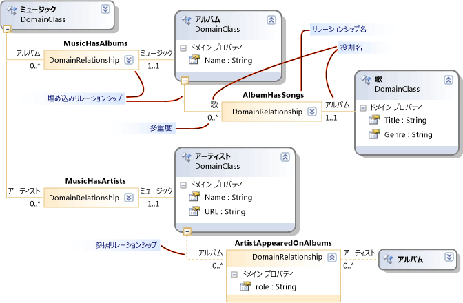

# モデル、クラス、およびリレーションシップについて
ドメイン固有言語 (DSL) は、DSL 定義ファイルと、ユーザーが記述するカスタム プログラム コードによって定義されます。 DSL ソリューションのプログラム コードの大部分は、このファイルから生成されます。

 このトピックでは、DSL 定義の中心となる機能について説明します。

## DSL 定義
 `Dsl\DslDefinition.dsl` を開くと、Visual Studio のウィンドウは次の図のようになります。

 

 DSL 定義ダイアグラムには、DSL 定義の中で最も重要な情報が表示されます。 追加情報 (DslDefinition.dsl の一部でもあります) が DSL エクスプローラーに表示されます。これは、通常、ダイアグラムの横に表示されます。 最も頻繁に行われるタスクにはダイアグラムを使用し、より高度なカスタマイズには DSL エクスプローラーを使用します。

 DSL 定義ダイアグラムには、モデル要素を定義するドメイン クラスと、モデル要素間のリンクを定義するリレーションシップが表示されます。 また、モデル要素をユーザーに表示するために使用されるシェイプとコネクタも表示されます。

 

 ダイアグラムまたは DSL エクスプローラーで DSL 定義の項目を選択すると、その項目に関する情報がプロパティ ウィンドウに表示されます。 [DSL の詳細] ウィンドウに追加情報が表示される場合があります。

### モデルは DSL のインスタンスである
 "*モデル*" は、ユーザーによって作成された DSL のインスタンスです。 モデルには、ユーザーが定義するドメイン クラスのインスタンスであるモデル要素と、ユーザーが定義するドメイン リレーションシップのインスタンスである要素間のリンクが含まれます。 モデルには、モデルの要素とリンクをダイアグラムに表示するシェイプとコネクタを含めることもできます。 DSL 定義には、シェイプ クラス、コネクタ クラス、およびダイアグラム用のクラスが含まれています。

 DSL 定義は "*ドメイン モデル*" とも呼ばれます。 DSL 定義つまりドメイン モデルは、ドメイン固有言語のデザイン時表現であるのに対し、モデルはドメイン固有言語の実行時のインスタンス化です。

## ドメイン クラスでモデル要素を定義する
 ドメイン クラスはドメイン内のさまざまな要素を作成するために使用され、ドメイン リレーションシップは要素間のリンクです。 これらは要素とリンクのデザイン時表現であり、モデルの作成時にデザイン固有言語のユーザーによってインスタンス化されます。

 この図は、音楽ライブラリ DSL のユーザーによって作成されたモデルを示したものです。 音楽アルバムは、曲のリストが含まれるボックスで表されます。 アーティストは角が丸いボックスによって表され、関わっているアルバムに接続されています。

 

 DSL 定義は、2 つの側面に分かれています。 モデル ダイアグラム上でのモデル要素の外観は、シェイプ クラスとコネクタ クラスを使用して定義されます。 モデルに含まれる情報は、ドメイン クラスとドメイン リレーションシップを使用して定義されます。

 次の図は、音楽ライブラリの DSL 定義におけるドメイン クラスとリレーションシップを示したものです。

 

 この図には、Music、Album、Artist、Song という 4 つのドメイン クラスが示されています。 ドメイン クラスによって、Name、Title などのドメイン プロパティが定義されています。 インスタンス モデルでは、これらのプロパティの一部の値がダイアグラムに表示されます。

 クラスの間には、MusicHasAlbums、MusicHasArtists、AlbumbHasSongs、ArtistAppearedOnAlbums というドメイン リレーションシップがあります。 リレーションシップには、1..1、0..* などのカーディナリティがあります。 たとえば、すべての Song は AlbumHasSongs リレーションシップを通じて厳密に 1 つの Album に関連付けられている必要があります。 すべての Album は、任意の数の Song を含むことができます。

### DSL 定義ダイアグラムの再配置
 この図に示すように、ドメイン クラスは DSL 定義ダイアグラムに複数回表示される場合があることに注意してください。 常に 1 つのメイン ビューがあり、いくつかの "*参照*" ビューが含まれることがあります。

 DSL 定義ダイアグラムを再配置するには、次のようにします。

- メイン ビューと参照ビューを入れ替えるには、 **[ここにツリーを表示]** と **[ツリーの分割]** コマンドを使用します。 これらのコマンドを表示するには、1 つのドメイン クラスを右クリックします。

- ドメイン クラスとシェイプ クラスを並べ替えるには、Ctrl + ↑キーと Ctrl + ↓キーを使用します。

- クラスを折りたたんだり展開したりするには、各シェイプの右上にあるアイコンを使用します。

- ツリーの一部を折りたたむには、ドメイン クラスの下部にあるマイナス記号 (-) をクリックします。

## 継承
 ドメイン クラスは、継承を使用して定義できます。 継承の派生を作成するには、継承ツールをクリックし、派生クラスをクリックしてから、基底クラスをクリックします。 モデル要素には、それ自体のドメイン クラスで定義されているすべてのプロパティと共に、基底クラスから継承されたすべてのプロパティが設定されます。 また、リレーションシップのロールも継承します。

 継承は、リレーションシップ、シェイプ、コネクタの間で使用することもできます。 継承は同じグループ内に保持する必要があります。 シェイプでドメイン クラスから継承することはできません。

## ドメイン リレーションシップ
 モデル要素は、リレーションシップによってリンクできます。 リンクは常にバイナリであり、厳密に 2 つの要素を結び付けます。 ただし、どの要素も他のオブジェクトへのリンクを多数持つことができ、同じ要素ペアの間に複数のリンクが存在していてもかまいません。

 要素の異なるクラスを定義できるのと同様に、異なるクラスのリンクを定義できます。 リンクのクラスは、"*ドメイン リレーションシップ*" と呼ばれます。 ドメイン リレーションシップにより、そのインスタンスが接続できる要素のクラスが指定されます。 リレーションシップの各端は "*ロール*" と呼ばれ、ドメイン リレーションシップにより、リレーションシップ自体に加えて、2 つのロールの名前が定義されています。

 ドメイン リレーションシップには、埋め込みリレーションシップと参照リレーションシップの 2 種類があります。 DSL 定義ダイアグラムでは、埋め込みリレーションシップは各ロールの実線で示され、参照リレーションシップは破線で示されます。

### 埋め込みリレーションシップ
 ルートを除く、モデル内のすべての要素は、1 つの埋め込みリンクのターゲットになります。 したがって、モデル全体により、埋め込みリンクの 1 つのツリーが形成されます。 埋め込みリレーションシップは、包含または所有権を表します。 このように関連付けられている 2 つのモデル要素は、親と子とも呼ばれます。 子は親に埋め込まれている、と言います。

 埋め込みリンクは、通常、ダイアグラムのコネクタとして明示的には示されません。 代わりに、通常は、包含によって表されます。 モデルのルートはダイアグラムによって表され、それに埋め込まれている要素はダイアグラム上のシェイプとして表示されます。

 この例では、ルート クラス Music には Album への埋め込みリレーションシップ MusicHasAlbums があり、Album には Song への埋め込み AlbumHasSongs があります。 Song は、各 Album 内のリストの項目として表示されます。 また、Music には Artist クラスへの埋め込み MusicHasArtists があり、そのインスタンスもダイアグラム上のシェイプとして表示されます。

 既定では、埋め込まれた要素は、その親が削除されると自動的に削除されます。

 モデルが XML 形式でファイルに保存されると、ユーザーがシリアル化をカスタマイズしていない限り、埋め込まれた要素は親の内部に入れ子になります。

> [!NOTE]
> 埋め込みは継承とは異なります。 埋め込みリレーションシップでの子は、親のプロパティを継承しません。 埋め込みは、モデル要素間のリンクの一種です。 継承はクラス間の関係であり、モデル要素間のリンクは作成されません。

### 埋め込みルール
 モデルのルートを除き、インスタンス モデルのすべての要素は、厳密に 1 つの埋め込みリンクのターゲットである必要があります。

 したがって、ルート クラス以外のすべての非抽象ドメイン クラスは、少なくとも 1 つの埋め込みリレーションシップのターゲットである必要があります。つまり、基底クラスから埋め込みを継承する必要があります。 クラスは 2 つ以上の埋め込みのターゲットになることができますが、そのインスタンス モデル要素は一度に 1 つの親しか持つことができません。 ターゲットからソースへのカーディナリティは、0..1 または 1..1 でなければなりません。

### エクスプローラーに埋め込みツリーが表示される
 DSL 定義によってエクスプローラーも作成され、モデル ダイアグラムと共にユーザーに表示されます。

 

 シェイプが定義されていない要素も含めて、エクスプローラーにはモデル内のすべての要素が表示されます。 要素と埋め込みリレーションシップは表示されますが、参照リレーションシップは表示されません。

 要素のドメイン プロパティの値を表示するには、モデル ダイアグラムまたはモデル エクスプローラーで要素を選択して、プロパティ ウィンドウを開きます。 ダイアグラムに表示されていないものも含め、すべてのドメイン プロパティが表示されます。 この例では、各 Song には Title と Genre の両方がありますが、ダイアグラムには Title の値しか表示されていません。

## 参照リレーションシップ
 参照リレーションシップは、埋め込まれていないすべての種類のリレーションシップを表します。

 ダイアグラムでは、通常、参照リレーションシップはシェイプ間のコネクタとして表示されます。

 モデルの XML 表現では、2 つの要素間の参照リンクは "*モニカー*" を使用して表されます。 つまり、モニカーはモデル内の各要素を一意に識別する名前です。 各モデル要素の XML ノードには、リレーションシップの名前と、他の要素のモニカーを指定するノードが含まれています。

## ロール
 各ドメイン リレーションシップには、ソース ロールとターゲット ロールという 2 つのロールがあります。

 次の図で、**Publisher** ドメイン クラスと **PublisherCatalog** ドメイン リレーションシップの間の線はソース ロールです。 ドメイン リレーションシップと **Album** ドメイン クラスの間の線はターゲット ロールです。

 

 リレーションシップに関連付けられている名前は、モデルをトラバースするプログラム コードを記述するときに特に重要です。 たとえば、DSL ソリューションをビルドすると、生成された Publisher クラスには、Album のコレクションである Catalog プロパティがあります。 Album クラスには、Publisher クラスの単一のインスタンスである Publisher プロパティがあります。

 DSL 定義でリレーションシップを作成すると、プロパティ名とリレーションシップ名には既定値が与えられます。 ただし、これらは変更できます。

## カーディナリティ
 カーディナリティにより、ドメイン リレーションシップで同じロールを持つことができる要素の数が指定されます。 この例では、**Catalog** ロールでの 0 から多 (0..\*) のカーディナリティ設定によって、**Publisher** ドメイン クラスの任意のインスタンスは、指定した任意の数の **PublisherCatalog** リレーションシップ リンクを持つことができることが指定されています。

 ロールのカーディナリティを構成するには、ダイアグラムで入力するか、 **[プロパティ]** ウィンドウで `Multiplicity` プロパティを変更します。 このプロパティの設定を次の表に示します。

|カーディナリティの種類|説明|
|-|-|
|0.. * (0 から多)|ドメイン クラスの各インスタンスは、リレーションシップの複数のインスタンスを持つことができ、リレーションシップのインスタンスを持たなくてもかまいません。|
|0..1 (0 から 1)|ドメイン クラスの各インスタンスは、リレーションシップのインスタンスを多くて 1 つ持つことができ、リレーションシップのインスタンスを持たなくてもかまいません。|
|1..1 (1)|ドメイン クラスの各インスタンスは、リレーションシップのインスタンスを 1 つ持つことができます。 ロール クラスの任意のインスタンスから、このリレーションシップのインスタンスを複数作成することはできません。 検証が有効になっている場合、ロール クラスのインスタンスにリレーションシップのインスタンスが存在しないと、検証エラーが表示されます。|
|1..* (1 から多)|このカーディナリティを持つロールのクラスの各インスタンスは、リレーションシップの複数のインスタンスを持つことができ、各インスタンスにはリレーションシップのインスタンスが少なくとも 1 つ存在する必要があります。 検証が有効になっている場合、ロール クラスのインスタンスにリレーションシップのインスタンスが存在しないと、検証エラーが表示されます。|

## クラスとしてのドメイン リレーションシップ
 リンクはストアでは LinkElement のインスタンスとして表され、これは ModelElement の派生クラスです。 これらのプロパティは、ドメイン モデル ダイアグラムのドメイン リレーションシップで定義できます。

 また、リレーションシップを他のリレーションシップのソースまたはターゲットにすることもできます。 ドメイン モデル ダイアグラムで、ドメイン リレーションシップを右クリックし、 **[クラスとして表示]** をクリックします。 新しいクラス ボックスが表示されます。 その後、それにリレーションシップを接続できます。

 ドメイン クラスの場合と同様に、継承によってリレーションシップを部分的に定義できます。 派生リレーションシップを選択し、プロパティ ウィンドウで **[Base Relationship]** を設定します。

 派生リレーションシップにより、その基本リレーションシップが特殊化されます。 それによってリンクされるドメイン クラスは、基本リレーションシップによってリンクされたクラスから派生しているか、それと同じものである必要があります。 派生リレーションシップのリンクがモデル内に作成されると、派生リレーションシップと基本リレーションシップの両方のインスタンスになります。 プログラム コードでは、基底クラスまたは派生クラスのいずれかによって生成されたプロパティを使用して、リンクの反対側の端に移動できます。

## こちらもご覧ください

- [ドメイン固有言語ツールの用語集](/previous-versions/bb126564(v=vs.100))