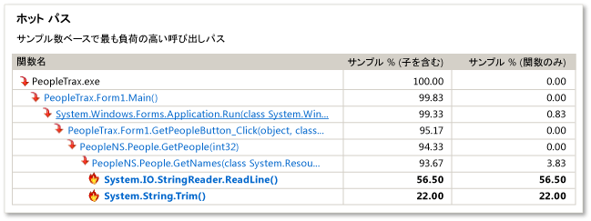
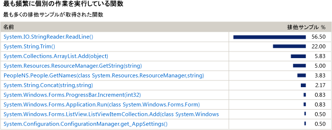
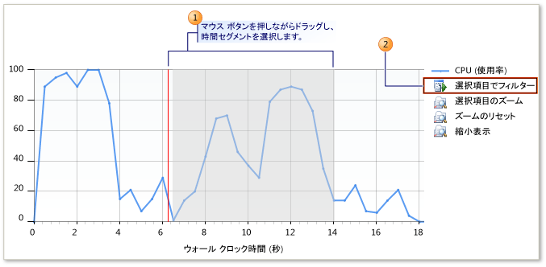

# CPU サンプリングの初心者向けガイド
Visual Studio プロファイリング ツールを使用して、アプリケーションでパフォーマンスの問題を分析することができます。 以下の手順では、**サンプリング データ** の使用方法を示します。

> [!NOTE]
> インストルメンテーション サポートなど、特別な機能を必要としない限り、以前の CPU サンプリング ツールではなく、[診断ツール] ウィンドウの [[CPU 診断]](../profiling/beginners-guide-to-performance-profiling.md) ツールの使用をお勧めします。

 **サンプリング** は、統計情報を基準としたプロファイリング方式で、アプリケーション内で最も多くのユーザー モード作業を実行している関数を特定できます。 アプリケーションの実行速度を上げるために最適化する必要のある場所を調べるには、まずサンプリングを実行することをお勧めします。

 **サンプリング** 方式では、アプリケーションで実行されている関数についての情報が、指定した間隔で収集されます。 プロファイリングの実行が終了すると、プロファイリング データの **[概要]** ビューに、アプリケーションでのほとんどの作業が行われている **ホット パス** という最もアクティブな関数のコール ツリーが表示されます。 また、このビューには個別の作業を最も多く実行していた関数の一覧が表示され、サンプリング セッションの特定のセグメントに焦点を当てるために使用できるタイムライン グラフが提供されます。

 **サンプリング** で必要なデータを得ることができない場合は、プロファイリング ツールに用意された他の収集方法を使用して、必要に応じた別の種類の情報を取得できます。 これらの他の方法の詳細については、「[方法: 収集方法を選択する](../profiling/how-to-choose-collection-methods.md)」を参照してください。

> [!TIP]
> Windows 関数を呼び出すコードをプロファイルする場合は、最新の .*pdb* ファイルを入手しておく必要があります。 これらのファイルがない場合、レポート ビューに暗号のようなわかりにくい Windows 関数名が一覧表示されます。 必要なファイルがあることを確認する方法の詳細については、「[方法: Windows シンボル情報を参照する](../profiling/how-to-reference-windows-symbol-information.md)」を参照してください。

## パフォーマンス セッションの作成と実行
 分析対象のデータを取得するには、まずパフォーマンス セッションを作成して、そのセッションを実行する必要があります。 **パフォーマンス ウィザード** を使用すると、その両方を実行できます。

 Windows デスクトップ アプリまたは ASP.NET アプリをプロファイルしていない場合、他のプロファイリング ツールの 1 つを使用する必要があります。 [プロファイリング ツールの概要](../profiling/profiling-feature-tour.md)に関するページをご覧ください。

#### パフォーマンス セッションを作成して実行するには

1. Visual Studio でソリューションを開きます。 構成を [リリース] に設定します。 (ツールバーで、既定で **[デバッグ]** に設定されている **[ソリューション構成]** ボックスを見つけます。 これを **[リリース]** に変更します。)

    > [!IMPORTANT]
    > 使用しているコンピューターの管理者でない場合、プロファイラーを使用している間は Visual Studio を管理者として実行する必要があります。 Visual Studio アプリケーションのアイコンを右クリックしてから、**[管理者として実行]** をクリックします。

2. **[デバッグ]** メニューで、**[プロファイラー]** を選択し、**[パフォーマンス プロファイラー]** を選択します。

3. **[パフォーマンス ウィザード]** オプションを選択して、**[開始]** をクリックします。

4. **[CPU サンプリング (推奨)]** オプションを選択して、**[完了]** をクリックします。

5. アプリケーションが起動し、プロファイラーによるデータの収集が開始されます。

6. パフォーマンス上の問題が存在する可能性のある機能を実行します。

7. 通常の方法でアプリケーションを終了します。

     アプリケーションの実行が終了すると、Visual Studio のメイン ウィンドウにプロファイリング データの **[概要]** ビューが表示され、**パフォーマンス エクスプローラー** のウィンドウに新しいセッションのアイコンが表示されます。

## 手順 2: サンプリング データの分析
 パフォーマンス セッションの実行が終了すると、Visual Studio のメイン ウィンドウにプロファイリング レポートの **[概要]** ビューが表示されます。

 ここでは、まず **ホット パス** を調べてから、最も多くの作業を行っている関数の一覧を調べ、最後に **[概要] ビューのタイムライン** を使用して他の関数を個別に調べることをお勧めします。 また、**[エラー一覧]** ウィンドウでプロファイリングに関する推奨事項と警告を確認することもできます。

 ただし、サンプリング方式で必要な情報を得ることができない場合もあります。 たとえば、サンプルが収集されるのは、アプリケーションがユーザー モードのコードを実行しているときだけです。 このため、入出力処理など一部の機能は、サンプリングではキャプチャされません。 プロファイリング ツールには、重要なデータを個別に分析するための収集方法がいくつか用意されています。 他の方法の詳細については、「[方法: 収集方法を選択する](../profiling/how-to-choose-collection-methods.md)」を参照してください。

 図中の番号は、前に示した各手順に対応しています。

 

#### サンプリング データを分析するには

1. **[概要]** ビューの **[ホット パス]** には、アプリケーションのコール ツリーのうち、包括サンプルの値が最も高い分岐が表示されます。 これは、データ収集時点で最も頻繁に実行された実行パスです。 包括値が高いということは、そのコール ツリーを生成したアルゴリズムを最適化できる可能性があることを示します。 そのため、パス内の最も下位にあるコード内の関数を調べます。 ただし、パスにはシステム関数や外部モジュールの関数が含まれている場合もあります。

     

    1. **[包括サンプル]** は、その関数、およびその関数によって呼び出された関数によって実行された作業の量を示します。 包括カウントが高い関数は、全体的に見て最も負荷の高い関数です。

    2. **[排他サンプル]** は、関数本体内のコードによって実行された作業の量を示しますが、その関数から呼び出された関数によって実行された作業は含まれません。 排他カウントが高い部分は、関数自体の中でパフォーマンス上のボトルネックとなっている可能性があります。

2. 関数名をクリックして、プロファイリング データの **[関数の詳細]** ビューを表示します。 **[関数の詳細]** ビューには、選択した関数のプロファイリング データをグラフィカルに示した図が表示され、その関数を呼び出したすべての関数、および選択した関数によって呼び出されたすべての関数が示されます。

    - 呼び出し元関数および呼び出し先関数のブロックのサイズは、その関数によって行われた呼び出し、またはその関数に対する呼び出しの相対的な頻度を表します。

    - 呼び出し元関数または呼び出し先関数の名前をクリックすると、その関数の詳細情報が [関数の詳細] ビューに表示されます。

    - **[関数の詳細]** ウィンドウの下側のウィンドウには、関数のコード本体が表示されます。 コードを調べてパフォーマンスを最適化できる可能性があることがわかった場合は、ソース ファイル名をクリックして、Visual Studio エディターでそのファイルを開きます。

3. 分析を続けるには、**[表示]** ドロップダウン リストの **[概要]** をクリックして、**[概要]** ビューに戻ります。 次に **[最も頻繁に個別の作業を実行している関数]** の関数を調べます。 この一覧には、排他サンプルの値が最も高い関数が表示されます。 これらの関数の関数本体のコードは、非常に多くの作業を実行していたコードであるため、最適化できる可能性があります。 特定の関数をさらに分析するには、関数名をクリックして、**[関数の詳細]** ビューで表示します。

     

     プロファイリング実行の調査をさらに続けるには、**[概要]** ビューのタイムラインを使用して、選択したセグメントから **[ホット パス]** と **[最も頻繁に個別の作業を実行している関数]** を表示することにより、プロファイリング データの特定のセグメントを再分析します。 たとえば、タイムラインの比較的小規模なピーク部分を個別に調べることより、プロファイリング実行全体の分析ではわからなかった負荷の高いコール ツリーや関数が明らかになる場合があります。

     セグメントを再分析するには、**概要ビューのタイムライン** のボックス内のセグメントを選択し、**[選択項目でフィルター]** をクリックします。

     

4. プロファイラーでは、プロファイリング実行を改善する方法の提案と、考えられるパフォーマンスの問題の特定を行うために規則のセットも使用します。 問題が見つかった場合は、**[エラー一覧]** ウィンドウに警告が表示されます。 **[エラー一覧]** ウィンドウを開くには、**[表示]** メニューの **[エラー一覧]** をクリックします。

    - **[関数の詳細]** ビューで警告が発生した関数を確認するには、警告をダブルクリックします。

    - 警告に関する詳細を表示するには、エラーを右クリックし、**[エラーのヘルプを表示]** をクリックします。

## 手順 3: コードの修正とセッションの再実行
 1 つ以上の関数を特定して最適化したら、プロファイリングを再実行してデータを比較することにより、変更によってアプリケーションのパフォーマンスにどのような違いが生じたかを確認できます。

#### コードを修正してプロファイラーを再実行するには

1. コードを変更します。

2. **パフォーマンス エクスプローラー** を開くには、**[デバッグ]** メニューで、**[プロファイラー]**、**[パフォーマンス エクスプローラー]**、**[パフォーマンス エクスプローラーの表示]** の順にクリックします。

3. **パフォーマンス エクスプローラー** で、再実行するセッションを右クリックし、**[プロファイルを使用して起動]** をクリックします。

4. セッションを再実行すると、そのセッションに対応する別のデータ ファイルが、**パフォーマンス エクスプローラー** の *[レポート]* フォルダーに追加されます。 前のプロファイリング データと新しいプロファイリング データの両方を選択して右クリックし、**[パフォーマンス レポートの比較]** をクリックします。

     新しいレポート ウィンドウが開き、比較の結果が表示されます。 比較ビューの使用方法の詳細については、「[方法: パフォーマンス データ ファイルを比較する](../profiling/how-to-compare-performance-data-files.md)」を参照してください。

## 関連項目
- [パフォーマンス エクスプローラー](../profiling/performance-explorer.md)
- [はじめに](../profiling/getting-started-with-performance-tools.md)
- [概要](../profiling/overviews-performance-tools.md)
- [Visual Studio のプロファイル](../profiling/index.yml)
- [プロファイル ツールの概要](../profiling/profiling-feature-tour.md)
