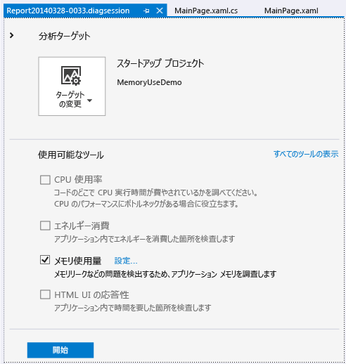
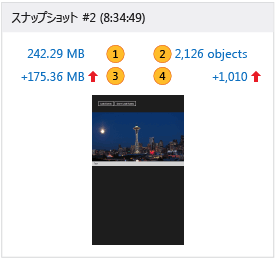
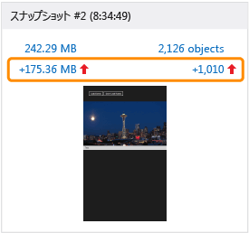

# デバッガーなしでメモリ使用量を分析する

**メモリ使用量**ツールでは、アプリのメモリ使用量を監視します。 ツールを使用して、Visual Studio で積極的に開発を行っているシナリオによるリアルタイムのメモリへの影響を調べることできます。 アプリのメモリ状態の詳細なスナップショットを取得し、そのスナップショットを比較してメモリの問題の根本原因を見つけることができます。

**メモリ使用量**ツールは、デバッガーの有無に関わらず実行できます。 次の手順では、Visual Studio **パフォーマンス プロファイラー**でデバッガーなしで**メモリ使用量**ツールを使用する方法を示します。

>[!NOTE]
>- .NET Core アプリのメモリ使用量を測定するには、デバッガーと共に**メモリ使用量**ツールを使用する必要があります。 手順については、「[Profile memory usage in Visual Studio](memory-usage.md)」 (Visual Studio でのメモリ使用量のプロファイリング) を参照してください。
>- JavaScript や HTML UWP アプリでメモリ使用量を分析するには、**パフォーマンス プロファイラー**で [JavaScript メモリ](../profiling/javascript-memory.md) ツールを使用します。

## メモリ使用量診断セッション

**メモリ使用量診断セッションを開始するには:**

1. Visual Studio で、C# ユニバーサル Windows (UWP) プロジェクトを開きます。

1. メニュー バーで、**[デバッグ]** > **[パフォーマンス プロファイラー]** の順に選びます。

1. **[メモリ使用量]**、**[開始]** の順に選択します。

   

### メモリ使用量の監視

診断セッションを開始すると、アプリが起動し、**診断ツール** ウィンドウにアプリのメモリ使用量のタイムライン グラフが表示されます。

タイムライン グラフには、アプリの実行中のメモリの変動が示されます。 グラフの急な上下動は、通常、何らかのコードでデータが収集または作成され、処理が終わったときにデータが破棄されていることを示します。 大きな上下動は、最適化できる可能性がある領域を示しています。 より重大な問題は、使われたまま返されないメモリが増えることです。これは、メモリが効率的に使われていないか、メモリ リークが起きていることを示す場合があるためです。

### アプリのメモリ状態のスナップショットを取得する

アプリでは数多くのオブジェクトが使用されますが、1 つのシナリオを集中的に分析することができます。 メモリの問題を検出して調べることもできます。 診断セッション中にスナップショットを取得し、特定の時点のメモリ使用量をキャプチャすることができます。 メモリの問題が起きる前にアプリのベースライン スナップショットを取得し、初めて問題が起きた後でもう 1 回スナップショットを取得し、シナリオを繰り返せる場合は追加のスナップショットを取得することをお勧めします。

スナップショットを収集するには、メモリ データをキャプチャしたいときに **[スナップショットの取得]** を選択します。

###   診断セッションを閉じる

レポートを作成せずに監視セッションを停止する場合は、単に診断ウィンドウを閉じます。 スナップショットの収集が完了したとき、またはスナップショットを取得したときにレポートを生成するには、**[コレクションの停止]** を選択します。

![[コレクションの停止]](../profiling/media/memuse__stopcollection.png "[コレクションの停止]")

##  メモリ使用量レポート

データ収集を停止すると、**メモリ使用量**ツールでアプリが停止され、**メモリ使用量**の概要ページが表示されます。

###  メモリ使用量のスナップショット

**[スナップショット]** ウィンドウの数値は、各スナップショットが取得されたときのメモリ内のバイトとオブジェクト、およびあるスナップショットとその前のものとの相違を示します。

数値は、新しい Visual Studio ウィンドウで詳細な**メモリ使用量**レポート ビューを開くリンクになっています。 [スナップショットの詳細レポート](#snapshot-details-reports)には、1 つのスナップショット内の種類とインスタンスが表示されます。 [スナップショットの相違 (diff) レポート](#snapshot-difference-diff-reports)では、2 つのスナップショット内の種類とインスタンスが比較されます。

  

|||
|-|-|
||スナップショット取得時のメモリ内のバイトの合計数。   このリンクを選択すると、スナップショットの詳細レポートが各種類のインスタンスの合計サイズ順に並べ替えて表示されます。|
||スナップショット取得時のメモリ内のオブジェクトの合計数。   このリンクを選択すると、スナップショットの詳細レポートが各種類のインスタンス数の順に並べ替えて表示されます。|
||このスナップショットと前のスナップショットとのメモリ オブジェクトの合計サイズの差。    正の数はこのスナップショットのメモリ サイズが前のものより大きいことを意味し、負の数はサイズがより小さいことを意味します。 **[ベースライン]** は、スナップショットが診断セッションで最初のものであることを意味します。 **[No Difference]\(相違なし\)** は、差が 0 であることを意味します。   このリンクを選択すると、スナップショットの相違レポートが各種類のインスタンスの合計サイズの差の順に並べ替えて表示されます。|
||このスナップショットと前のスナップショットとのメモリ オブジェクトの合計数の差。   このリンクを選択すると、スナップショットの相違レポートが各種類のインスタンスの合計数の差の順に並べ替えて表示されます。|

## メモリ使用量のスナップショット レポート

 **メモリ使用量**の概要ページでスナップショット リンクのいずれかを選択すると、新しいページにスナップショット レポートが開きます。

スナップショット レポートでは、**[オブジェクトの種類]** エントリを展開して子エントリを表示することができます。 インスタンス名は、メモリ使用量ツールで生成される一意の ID です。

**[オブジェクトの種類]** が青色の場合は、それを選択し、別のウィンドウで、ソース コードのオブジェクトに移動することができます。

識別できない種類や、理解できないコードに関連する種類は、.NET Framework、オペレーティング システム、あるいはコンパイラのオブジェクトと考えられます。 これらのオブジェクトは、オブジェクトの所有権の継承に関連する場合、**メモリ使用量**ツールに表示されます。

スナップショット レポートでは:

- **[マネージド ヒープ]** ツリーに、レポート内の種類とインスタンスが表示されます。 種類またはインスタンスを選ぶと、選んだ項目の **[ルートのパス]** ツリーと **[参照されたオブジェクト]** ツリーが表示されます。

- **[ルートのパス]** ツリーには、種類またはインスタンスを参照するオブジェクトのチェーンが表示されます。 .NET Framework のガベージ コレクターは、オブジェクトへの参照がすべて解放された場合にのみ、オブジェクトのメモリをクリーンアップします。

- **[参照された型]** ツリーまたは **[参照されたオブジェクト]** ツリーには、選んだ型またはインスタンスによって参照されるオブジェクトが表示されます。

###   レポート ツリーのフィルター

アプリの多くの種類は、アプリ開発者にとってあまり重要ではありません。 スナップショット レポート フィルターでは、**[マネージド ヒープ]** ツリーと **[ルートのパス]** ツリーのこれらの種類のほとんどを非表示にすることができます。

-  ツリーを種類名でフィルター処理するには、**[フィルター]** ボックスに名前を入力します。 このフィルターでは大文字と小文字は区別されず、指定された文字列が種類名のどこかに含まれていれば認識されます。

-  **[フィルター]** ドロップダウンで **[小さいオブジェクトを折りたたむ]** を選択すると、**[サイズ (バイト)]** が合計メモリの 0.5% 未満の種類が非表示になります。

-  **[フィルター]** ドロップダウンの **[マイ コードのみ]** を選択すると、外部コードによって生成されたほとんどのインスタンスが非表示になります。 外部の種類は、オペレーティング システムまたはフレームワーク コンポーネントに属しているか、コンパイラによって生成されます。

## スナップショットの詳細レポート

 スナップショットの詳細レポートでは、診断セッションで得られた 1 つのスナップショットについて説明されます。 レポートを開くには、スナップショット ウィンドウでサイズまたはオブジェクトのリンクを選択します。

 

両方のリンクで同じレポートが開きます。 **[マネージド ヒープ]** ツリーを最初に表示したときの並べ替え順序だけが異なります。 サイズ リンクでは、**[包括サイズ (バイト)]** 列でレポートが並べ替えられます。 オブジェクト リンクでは、**[カウント]** 列でレポートが並べ替えられます。 レポートが開いた後で並べ替え列や順序を変更することができます。

###   [マネージド ヒープ] ツリー (スナップショットの詳細レポート)
 **[マネージド ヒープ]** ツリーには、メモリ内に保持されているオブジェクトの種類が一覧表示されます。 種類名を展開すると、サイズ順に、その種類の最大のインスタンスが 10 個表示されます。 種類またはインスタンスを選ぶと、選んだ項目の **[ルートのパス]** ツリーと **[参照されたオブジェクト]** ツリーが表示されます。

 ![[マネージド ヒープ] ツリー](../profiling/media/memuse__snapshotdetails_managedheaptree.png "[マネージド ヒープ] ツリー")

スナップショットの詳細レポートの **[マネージド ヒープ]** ツリーには、次の列があります。

|||
|-|-|
|**オブジェクトの種類**|型またはオブジェクト インスタンスの名前。|
|**カウント**|型のオブジェクト インスタンス数。 インスタンスの場合、**[カウント]** は常に 1 です。|
|**サイズ (バイト)**|種類の場合は、スナップショット内のその種類のすべてのインスタンスのサイズ (インスタンスに含まれているオブジェクトのサイズは除く)。   インスタンスの場合は、オブジェクトのサイズ (インスタンスに含まれているオブジェクトのサイズは除く)。 |
|**包括サイズ (バイト)**|種類のインスタンスのサイズ、または単一インスタンスのサイズ (含まれているオブジェクトのサイズを含む)。|
|**Module**|オブジェクトを含むモジュール。|

###   [ルートのパス] ツリー (スナップショットの詳細レポート)
**[ルートのパス]** ツリーには、種類またはインスタンスを参照するオブジェクトのチェーンが表示されます。 .NET Framework のガベージ コレクターは、オブジェクトへの参照がすべて解放された場合にのみ、オブジェクトのメモリをクリーンアップします。

**[ルートのパス]** ツリーの種類の場合、その種類への参照を保持するオブジェクトの数が **[参照数]** 列に示されます。

![種類の [ルートのパス] ツリー](../profiling/media/memuse_snapshotdetails_type_pathstoroottree.png "種類の [ルートのパス] ツリー")

###   [参照された型] ツリーまたは [参照されたオブジェクト] ツリー (スナップショットの詳細レポート)
**[参照された型]** ツリーまたは **[参照されたオブジェクト]** ツリーには、選んだ型またはインスタンスによって参照されるオブジェクトが表示されます。

![インスタンスの [参照されたオブジェクト] ツリー](../profiling/media/memuse_snapshotdetails_referencedobjects_instance.png "インスタンスの [参照されたオブジェクト] ツリー")

スナップショットの詳細レポートの **[参照された型]** ツリーには、次の列があります。 **[参照されたオブジェクト]** ツリーには、**[参照数]** 列はありません。

|||
|-|-|
|**オブジェクトの種類**または**インスタンス**|種類またはインスタンスの名前。|
|**参照数**|種類の場合は、その種類のオブジェクト インスタンスの数。|
|**サイズ (バイト)**|種類の場合は、その種類のすべてのインスタンスのサイズ (種類に含まれているオブジェクトのサイズは除く)。   インスタンスの場合は、オブジェクトのサイズ (オブジェクトに含まれているオブジェクトのサイズは除く)。|
|**包括サイズ (バイト)**|種類のインスタンスの合計サイズ、またはインスタンスのサイズ (含まれているオブジェクトのサイズを含む)。|
|**Module**|オブジェクトを含むモジュール。|

## スナップショットの相違 (diff) レポート

スナップショットの相違 (diff) レポートには、指定したスナップショットと前のスナップショットの変更点が表示されます。 相違レポートを開くには、スナップショット ウィンドウで相違リンクのいずれかを選択します。

両方のリンクで同じレポートが開きます。 レポートの **[マネージド ヒープ]** ツリーを最初に表示したときの並べ替え順序だけが異なります。 サイズ リンクでは、**[包括サイズの相違 (バイト)]** 列でレポートが並べ替えられます。 オブジェクト リンクでは、**[数の相違]** 列でレポートが並べ替えられます。 レポートが開いた後で並べ替え列や順序を変更することができます。

 

###   [マネージド ヒープ] ツリー (スナップショットの相違レポート)

 **[マネージド ヒープ]** ツリーには、メモリ内に保持されているオブジェクトの種類が一覧表示されます。 型名を展開すると、サイズ順に、その型の最大のインスタンス 10 個が表示されます。 種類またはインスタンスを選ぶと、選んだ項目の **[ルートのパス]** ツリーと **[参照されたオブジェクト]** ツリーが表示されます。

 ![相違レポートにある種類の [マネージド ヒープ] ツリー](../profiling/media/memuse_snapshotdiff_type_heap.png "相違レポートにある種類の [マネージド ヒープ] ツリー")

スナップショットの相違レポートの **[マネージド ヒープ]** ツリーには、次の列があります。

|||
|-|-|
|**オブジェクトの種類**|型またはオブジェクト インスタンスの名前。|
|**カウント**|指定したスナップショットに含まれる型のインスタンス数。 インスタンスの場合、**[カウント]** は常に 1 です。|
|**数の相違**|型の場合は、指定したスナップショットと前のスナップショットとの、型のインスタンス数の差。 インスタンスの場合、このフィールドは空白です。|
|**サイズ (バイト)**|指定したスナップショット内のオブジェクトのサイズ (オブジェクト内のオブジェクトのサイズは除く)。 型の場合、**[サイズ (バイト)]** と **[包含サイズ (バイト)]** は型インスタンスの合計サイズです。|
|**合計サイズの相違 (バイト)**|種類の場合は、指定したスナップショットと前のスナップショットとの、その種類のインスタンスの合計サイズの差 (インスタンス内のオブジェクトのサイズは除く)。 インスタンスの場合、このフィールドは空白です。|
|**包括サイズ (バイト)**|指定したスナップショット内のオブジェクトのサイズ (オブジェクト内のオブジェクトのサイズを含む)。|
|**包括サイズの相違 (バイト)**|種類の場合は、指定したスナップショットと前のスナップショットとの、その種類のすべてのインスタンスのサイズの差 (オブジェクト内のオブジェクトのサイズを含む)。 インスタンスの場合、このフィールドは空白です。|
|**Module**|オブジェクトを含むモジュール。|

###   [ルートのパス] ツリー (スナップショットの相違レポート)

**[ルートのパス]** ツリーには、種類またはインスタンスを参照するオブジェクトのチェーンが表示されます。 .NET Framework のガベージ コレクターは、オブジェクトへの参照がすべて解放された場合にのみ、オブジェクトのメモリをクリーンアップします。

**[ルートのパス]** ツリーの種類の場合、その種類への参照を保持するオブジェクトの数が **[参照数]** 列に示されます。 前のスナップショットからの数の差は、**[Reference Diff]\(参照の相違\)** 列に示されます。

 ![相違レポートの [ルートのパス] ツリー](../profiling/media/memuse_snapshotdiff_pathstoroot_instance_all.png "相違レポートの [ルートのパス] ツリー")

###   [参照された型] ツリーまたは [参照されたオブジェクト] ツリー (スナップショットの相違レポート)

**[参照された型]** ツリーまたは **[参照されたオブジェクト]** ツリーには、選んだ型またはインスタンスによって参照されるオブジェクトが表示されます。

![相違レポートの [参照された型]](../profiling/media/memuse_snapshotdiff_referencedtypes.png "相違レポートの [参照された型]")

スナップショットの相違レポートの **[参照された型]** ツリーには、次の列があります。 **[参照されたオブジェクト]** ツリーには、**[インスタンス]**、**[サイズ (バイト)]**、**[包括サイズ (バイト)]**、および **[モジュール]** という列があります。

|||
|-|-|
|**オブジェクトの種類**または**インスタンス**|型またはオブジェクト インスタンスの名前。|
|**参照数**|指定したスナップショットに含まれる型のインスタンス数。|
|**参照数の相違**|型の場合は、指定したスナップショットと前のスナップショットとの、型のインスタンス数の差。|
|**サイズ (バイト)**|指定したスナップショット内のオブジェクトのサイズ (オブジェクト内のオブジェクトのサイズは除く)。 型の場合、**[サイズ (バイト)]** と **[包含サイズ (バイト)]** は型インスタンスの合計サイズです。|
|**合計サイズの相違 (バイト)**|種類の場合は、指定したスナップショットと前のスナップショットとの、その種類のインスタンスの合計サイズの差 (インスタンス内のオブジェクトのサイズは除く)。 |
|**包括サイズ (バイト)**|指定したスナップショット内のオブジェクトのサイズ (オブジェクト内のオブジェクトのサイズを含む)。|
|**包括サイズの相違 (バイト)**|種類の場合は、指定したスナップショットと前のスナップショットとの、その種類のすべてのインスタンスのサイズの差 (オブジェクト内のオブジェクトのサイズを含む)。|
|**Module**|オブジェクトを含むモジュール。|

## 関連項目
- [JavaScript メモリ](../profiling/javascript-memory.md)
- [Visual Studio のプロファイル](../profiling/index.md)
- [プロファイル ツールの概要](../profiling/profiling-feature-tour.md)
- [C++、C#、または Visual Basic を使った UWP アプリのパフォーマンスのベスト プラクティス](/previous-versions/windows/apps/hh750313\(v\=win.10\))
- [Visual Studio で新しいメモリ使用量ツールを使用するメモリの問題の診断](http://go.microsoft.com/fwlink/p/?LinkId=394706)