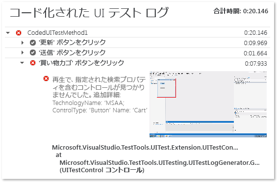

# <a name="analyzing-coded-ui-tests-using-coded-ui-test-logs"></a>コード化された UI テスト ログを使用したコード化された UI テストの分析

コード化された UI テスト ログは、コード化された UI テストの実行に関する重要な情報にフィルターを適用して記録します。 問題をすばやくデバッグできるような形式で、ログが表示されます。

[!INCLUDE [coded-ui-test-deprecation](includes/coded-ui-test-deprecation.md)]

## <a name="step-1-enable-logging"></a>手順 1: ログの有効化

シナリオに応じて、以下のいずれかのメソッドを使用してログを有効にします。

- ターゲット .NET Framework バージョン 4 のテスト プロジェクトに、*App.config* ファイルが含まれていない。

   1. *QTAgent32_40.exe.config* ファイルを開きます。 既定では、ファイルは *%ProgramFiles(x86)%\Microsoft Visual Studio\2017\Enterprise\Common7\IDE* にあります。

   2. EqtTraceLevel の値を、目的のログ レベルに変更します。

   3. ファイルを保存します。

- ターゲット .NET Framework バージョン 4.5 のテスト プロジェクトに、*App.config* ファイルが含まれていない。

   1. *QTAgent32.exe.config* ファイルを開きます。 既定では、ファイルは *%ProgramFiles(x86)%\Microsoft Visual Studio\2017\Enterprise\Common7\IDE* にあります。

   2. EqtTraceLevel の値を、目的のログ レベルに変更します。

   3. ファイルを保存します。

- テスト プロジェクトに *App.config* ファイルが含まれている。

    - *App.config* ファイルをプロジェクトで開き、構成ノードに次のコードを追加します。

      ```xml
      <system.diagnostics>
        <switches>
          <add name="EqtTraceLevel" value="4" />
        </switches>
      </system.diagnostics>`
      ```

- テスト コード自体からログを有効にする。

   <xref:Microsoft.VisualStudio.TestTools.UITesting.PlaybackSettings.LoggerOverrideState%2A> = HtmlLoggerState.AllActionSnapshot;

## <a name="step-2-run-your-coded-ui-test-and-view-the-log"></a>手順 2: コード化された UI テストを実行してログを表示する

*QTAgent32.exe.config* ファイルに変更を加えてコード化された UI テストを実行すると、**テスト エクスプローラー**の結果に、出力リンクが表示されます。 トレース レベルが "verbose" に設定されていると、ログ ファイルはテストが失敗した場合だけでなく、テストが成功した場合にも生成されます。

1.  **[テスト]** メニューの **[ウィンドウ]** を選択し、**[テスト エクスプローラー]** を選択します。

2.  **[ビルド]** メニューの **[ソリューションのビルド]** をクリックします。

3.  **テスト エクスプローラー**で、実行するコード化された UI テストを選択し、ショートカット メニューを開いて **[選択したテストの実行]** を選択します。

     自動テストが実行され、成功したか失敗したかが示されます。

    > [!TIP]
    > **テスト エクスプローラー**を表示するには、**[テスト]**、**[Windows]** の順に選択し、**[テスト エクスプローラー]** を選択します。

4.  **テスト エクスプローラー**の結果で、**[出力]** リンクを選択します。

     

     この操作によって表示されるテストの出力に、操作ログへのリンクが含まれています。

     

5.  *UITestActionLog.html* リンクを選択します。

     Web ブラウザーにログが表示されます。

     

## <a name="see-also"></a>関連項目

- [UI オートメーションを使用してコードをテストする](../test/use-ui-automation-to-test-your-code.md)
- [方法: Microsoft Visual Studio からテストを実行する](https://msdn.microsoft.com/Library/1a1207a9-2a33-4a1e-a1e3-ddf0181b1046)