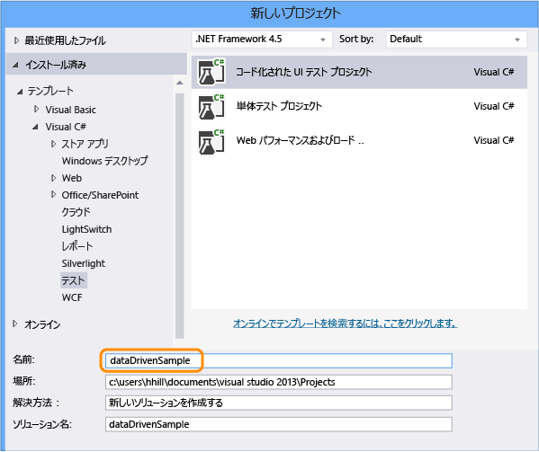
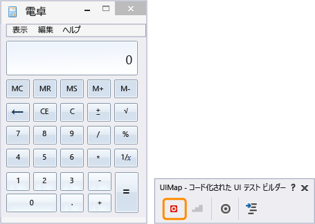
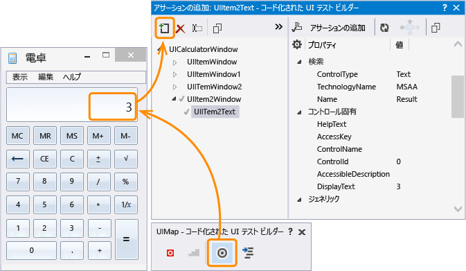
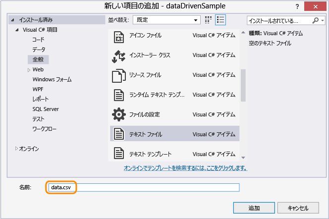
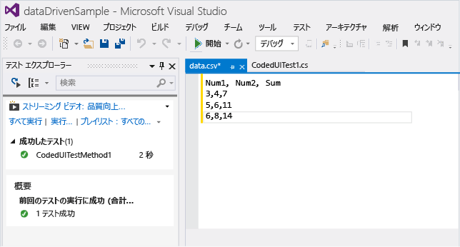
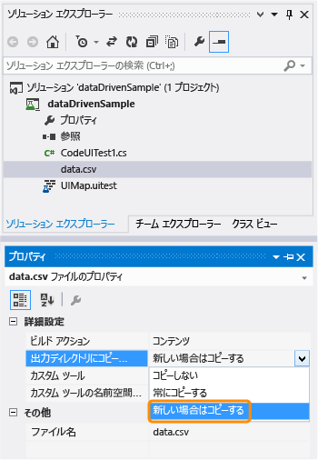
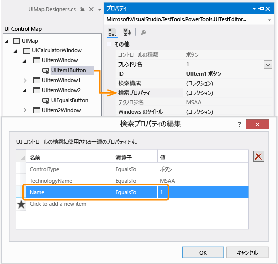

# <a name="create-a-data-driven-coded-ui-test"></a>データ ドリブンのコード化された UI テストの作成

さまざまな条件をテストするには、パラメーター値を変えながら複数回テストを実行します。 これを行う場合、データ ドリブンのコード化された UI テストが便利な方法です。 データ ソースにパラメーター値を定義し、データ ソース内の各行はコード化された UI テストのイテレーションとします。 テスト全体の結果は、すべてのイテレーションの結果に基づきます。 たとえば、1 つのテスト イテレーションが失敗した場合、テスト全体の結果は失敗となります。

**必要条件**

- Visual Studio Enterprise
- コード化された UI テストのコンポーネント

## <a name="create-a-test-project"></a>テスト プロジェクトを作成する

このサンプルでは、Windows 電卓アプリケーション上で実行されるコード化された UI テストを作成します。 2 つの数値を加算し、アサーションを使用して合計が正しいことを検証します。 次に、アサーションおよび 2 つの数値のパラメーター値をデータ ドリブンになるようにコーディングし、コンマ区切り値 (*.csv*) ファイルに保存します。

### <a name="step-1---create-a-coded-ui-test"></a>ステップ 1 - コード化された UI テストを作成する

1.  プロジェクトを作成します。

     

   > [!NOTE]
   > **[コード化された UI テスト プロジェクト]** テンプレートが表示されない場合は、[コード化された UI テスト コンポーネントをインストール](../test/use-ui-automation-to-test-your-code.md#install-the-coded-ui-test-component)する必要があります。

2.  アクションを記録することを選択します。

     

3.  電卓アプリを開き、テストの記録を開始します。

     

4.  1 と 2 を加算し、レコーダーを一時停止し、テスト メソッドを生成します。 後で、このユーザー入力の値をデータ ファイルからの値に置換することになります。

     

     テスト ビルダーを閉じます。 メソッドがテストに追加されます。

    ```csharp
    [TestMethod]
    public void CodedUITestMethod1()
    {
        // To generate code for this test, select "Generate Code for Coded UI Test" from the shortcut menu and select one of the menu items.
        this.UIMap.AddNumbers();
    }
    ```

5.  `AddNumbers()` メソッドを使用して、テストが実行されていることを確認します。 前に示したテスト メソッドにカーソルを置き、コンテキスト メニューを開き、**[テストの実行]** を選択します。 (キーボード ショートカット: **Ctrl** + **R**、**T**)。

     テストの合格または失敗を示すテスト結果が、[テスト エクスプローラー] ウィンドウに表示されます。 [テスト エクスプローラー] ウィンドウを開くには、**[テスト]** メニューの **[Windows]** を選択し、**[テスト エクスプローラー]** を選択します。

6.  予期される値を検証するテストでのアサーション パラメーター値のためにデータ ソースを使用する場合もあるため、2 つの数値の合計が正しいことを検証するアサーションを追加してみます。 前に示したテスト メソッドにカーソルを置き、コンテキスト メニューを開き、**[コード化された UI テストのコードの生成]**、**[コード化された UI テスト ビルダーの使用]** の順に選択します。

     合計を表示する電卓のテキスト コントロールをマップします。

     

7.  合計の値が正しいことを検証するアサーションを追加します。 値が **3** である **[DisplayText]** プロパティを選択し、**[アサーションの追加]** を選択します。 **AreEqual** 比較演算子を使用し、比較値が **3** であることを確認します。

     

8.  アサーションを構成した後、ビルダーからコードを再生成します。 これにより、検証用の新しいメソッドが作成されます。

     

     `ValidateSum` メソッドは、`AddNumbers` メソッドの結果を検証するため、コード ブロックの末尾に移動します。

    ```csharp
    public void CodedUITestMethod1()
    {
        // To generate code for this test, select "Generate Code for Coded UI Test" from the shortcut menu and select one of the menu items.
        this.UIMap.AddNumbers();
        this.UIMap.ValidateSum();
    }
    ```

9. `ValidateSum()` メソッドを使用して、テストが実行されていることを確認します。 前に示したテスト メソッドにカーソルを置き、コンテキスト メニューを開き、**[テストの実行]** を選択します。 (キーボード ショートカット: **Ctrl** + **R**、**T**)。

     この時点では、すべてのパラメーター値はそのメソッドに定数として定義されます。 次に、テストがデータ ドリブンになるようにデータ セットを作成してみます。

### <a name="step-2---create-a-data-set"></a>ステップ 2 - データ セットを作成する

1.  dataDrivenSample プロジェクトにテキスト ファイルを追加し、その名前を「`data.csv`」にします。

     

2.  この *.csv* ファイルに次のデータを設定します。

    |Num1|Num2|Sum|
    |-|-|-|
    |3|4|7|
    |5|6|11|
    |6|8|14|

     データを追加した後、ファイルが次のように表示されます。

     

3.  正しいエンコーディングを使用して *.csv* ファイルを保存することが重要です。 **[ファイル]** メニューで、**[保存オプションの詳細設定]** を選択し、エンコード方式として **[Unicode (UTF-8 シグネチャなし) - コードページ 65001]** を選択します。

4.  *.csv* ファイルは出力ディレクトリにコピーする必要があり、そのようにしないとテストを実行できません。 これをコピーするには、**[プロパティ]** ウィンドウを使用します。

     

     データ セットを作成したので、次にデータをテストにバインドしてみます。

### <a name="step-3---add-data-source-binding"></a>ステップ 3 - データ ソース バインドを追加する

1.  データ ソースをバインドするには、テスト メソッドのすぐ上にある既存の `DataSource` 属性内に `[TestMethod]` 属性を追加します。

    ```csharp
    [DataSource("Microsoft.VisualStudio.TestTools.DataSource.CSV", "|DataDirectory|\\data.csv", "data#csv", DataAccessMethod.Sequential), DeploymentItem("data.csv"), TestMethod]
    public void CodedUITestMethod1()
    {
        // To generate code for this test, select "Generate Code for Coded UI Test" from the shortcut menu and select one of the menu items.
        this.UIMap.AddNumbers();
        this.UIMap.ValidateSum();
    }
    ```

     データ ソースがこのテスト メソッドで使用できるようになりました。

    > [!TIP]
    > XML、SQL Express、Excel など他の種類のデータ ソースを使用するサンプルについては、Q & A のセクションにある[データ ソース属性のサンプル](#CreateDataDrivenCUIT_QA_DataSourceAttributes)を参照してください。

2.  テストを実行します。

     テストは、3 つのイテレーションを実行することに注意してください。 これは、バインドされたデータ ソースに 3 行のデータが含まれているためです。 ただし、テストでは定数パラメーター値が引き続き使用され、毎回 3 の合計に 1 + 2 が加算されます。

     次に、データ ソース ファイル内の値を使用するようにテストを構成します。

### <a name="step-4---use-the-data-in-the-coded-ui-test"></a>ステップ 4 - コード化された UI テストでデータを使用する

1.  *CodedUITest.cs* ファイルの先頭に `using Microsoft.VisualStudio.TestTools.UITesting.WinControls` を追加します。

    ```csharp
    using System;
    using System.Collections.Generic;
    using System.Text.RegularExpressions;
    using System.Windows.Input;
    using System.Windows.Forms;
    using System.Drawing;
    using Microsoft.VisualStudio.TestTools.UITesting;
    using Microsoft.VisualStudio.TestTools.UnitTesting;
    using Microsoft.VisualStudio.TestTools.UITest.Extension;
    using Keyboard = Microsoft.VisualStudio.TestTools.UITesting.Keyboard;
    using Microsoft.VisualStudio.TestTools.UITesting.WinControls;
    ```

2.  データ ソースからの値を適用する `TestContext.DataRow[]` メソッドに `CodedUITestMethod1()` を追加します。 データ ソースの値は、コントロール `SearchProperties` を使用して UIMap コントロールに割り当てられている定数をオーバーライドします。

    ```csharp
    public void CodedUITestMethod1()
    {
        // To generate code for this test, select "Generate Code for Coded UI Test" from the shortcut menu and select one of the menu items.
        this.UIMap.UICalculatorWindow.UIItemWindow.UIItem1Button.SearchProperties[WinButton.PropertyNames.Name] = TestContext.DataRow["Num1"].ToString();this.UIMap.UICalculatorWindow.UIItemWindow21.UIItem2Button.SearchProperties[WinButton.PropertyNames.Name] = TestContext.DataRow["Num2"].ToString();
        this.UIMap.AddNumbers();
        this.UIMap.ValidateSumExpectedValues.UIItem2TextDisplayText = TestContext.DataRow["Sum"].ToString();
        this.UIMap.ValidateSum();
    }
    ```

     どの検索プロパティにデータをコーディングするかを確認するには、コード化された UI テスト エディターを使用します。

    -   UIMap.uitest ファイルを開きます。

         

    -   UI アクションを選択し、対応する UI コントロールのマップを確認します。 マップがどのようにコードに対応するかに注意します (たとえば、`this.UIMap.UICalculatorWindow.UIItemWindow.UIItem1Button`)。

         

    -   [プロパティ] ウィンドウで、**[検索プロパティ]** を開きます。 検索プロパティ **[名前]** の値は、データ ソースを使用してコードで操作される対象です。 たとえば、`SearchProperties` には各データ行の最初の列の値 (`UIItem1Button.SearchProperties[WinButton.PropertyNames.Name] = TestContext.DataRow["Num1"].ToString();`) が割り当てられます。 3 つのイテレーションのために、このテストでは検索プロパティの **[名前]** の値を 3、5、6 の順に変更します。

         

3.  ソリューションを保存します。

### <a name="step-5---run-the-data-driven-test"></a>ステップ 5 - データ ドリブン テストを実行する

1.  テストを再実行して、テストがデータ ドリブンになったことを確認します。

     テストでは、*.csv* ファイル内の値を使用して、3 つのイテレーションが実行されます。 検証も機能し、テストはテスト エクスプローラーで渡されたとおりに表示されます。

## <a name="q--a"></a>Q & A

###  <a name="CreateDataDrivenCUIT_QA_DataSourceAttributes"></a> SQL Express や XML など他のデータ ソースの種類のデータ ソースの属性とは何ですか。

次の表に示したサンプルのデータ ソース文字列を使用できます。コードにコピーし、必要なカスタマイズを行ってください。

**データ ソースの型と属性**

-   CSV

     `[DataSource("Microsoft.VisualStudio.TestTools.DataSource.CSV", "|DataDirectory|\\data.csv", "data#csv", DataAccessMethod.Sequential), DeploymentItem("data.csv"), TestMethod]`

-   Excel

     `DataSource("System.Data.Odbc", "Dsn=ExcelFiles;Driver={Microsoft Excel Driver (*.xls)};dbq=|DataDirectory|\\Data.xls;defaultdir=.;driverid=790;maxbuffersize=2048;pagetimeout=5;readonly=true", "Sheet1$", DataAccessMethod.Sequential), DeploymentItem("Sheet1.xls"), TestMethod]`

-   Team Foundation Server でのテスト ケース

     `[DataSource("Microsoft.VisualStudio.TestTools.DataSource.TestCase", "http://vlm13261329:8080/tfs/DefaultCollection;Agile", "30", DataAccessMethod.Sequential), TestMethod]`

-   XML

     `[DataSource("Microsoft.VisualStudio.TestTools.DataSource.XML", "|DataDirectory|\\data.xml", "Iterations", DataAccessMethod.Sequential), DeploymentItem("data.xml"), TestMethod]`

-   SQL Express

     `[DataSource("System.Data.SqlClient", "Data Source=.\\sqlexpress;Initial Catalog=tempdb;Integrated Security=True", "Data", DataAccessMethod.Sequential), TestMethod]`

### <a name="q-why-cant-i-modify-the-code-in-the-uimapdesigner-file"></a>Q: UIMap.Designer ファイルでコードを変更できないのはなぜですか?

**A**: UIMapDesigner.cs ファイルでコードを変更しても、[UIMap - コード化された UI テスト ビルダー] を使用してコードを生成するたびに変更が上書きされます。 このサンプルも含めてほとんどの場合、テストでデータ ソースを使用できるようにするためのコード変更は、テストのソース コード ファイル (CodedUITest1.cs) に対して行うことができます。

記録されたメソッドを変更する必要がある場合は、メソッドを UIMap.cs ファイルにコピーし、メソッド名を変更する必要があります。 UIMap.cs ファイルを使用すると、UIMapDesigner.cs ファイルのメソッドやプロパティをオーバーライドできます。 Coded UITest.cs ファイルの元のメソッドへの参照を削除し、変更したメソッド名に置き換える必要があります。

## <a name="see-also"></a>関連項目

- <xref:Microsoft.VisualStudio.TestTools.UITest.Common.UIMap.UIMap>
- <xref:Microsoft.VisualStudio.TestTools.UnitTesting.Assert>
- [UI オートメーションを使用してコードをテストする](../test/use-ui-automation-to-test-your-code.md)
- [コード化された UI テストを作成する](../test/use-ui-automation-to-test-your-code.md)
- [コード化された UI テストのベスト プラクティス](../test/best-practices-for-coded-ui-tests.md)
- [コード化された UI テストと操作の記録でサポートされている構成とプラットフォーム](../test/supported-configurations-and-platforms-for-coded-ui-tests-and-action-recordings.md)