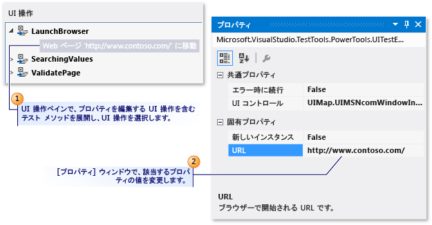
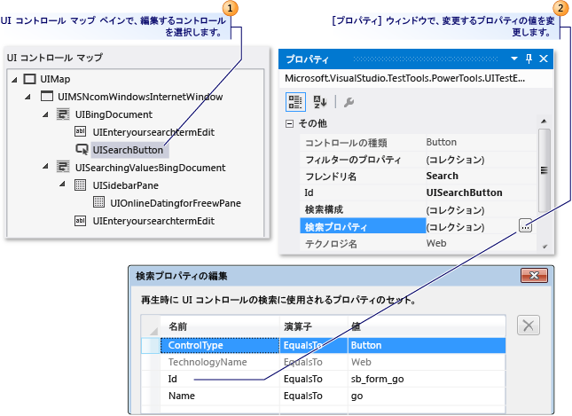
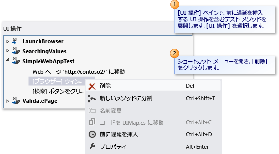
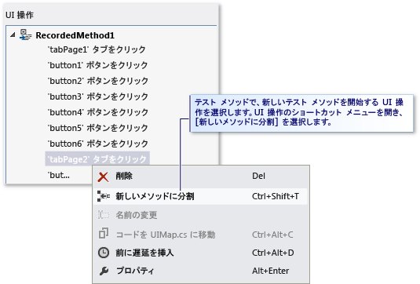
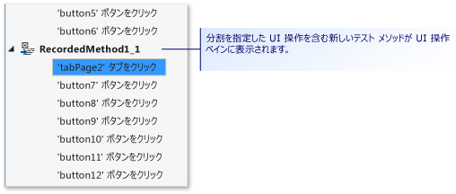
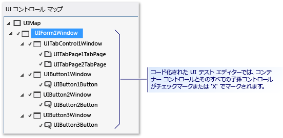
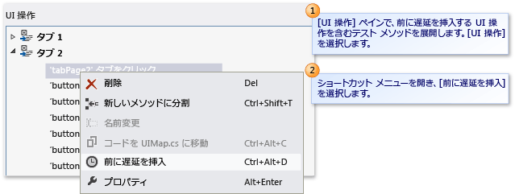
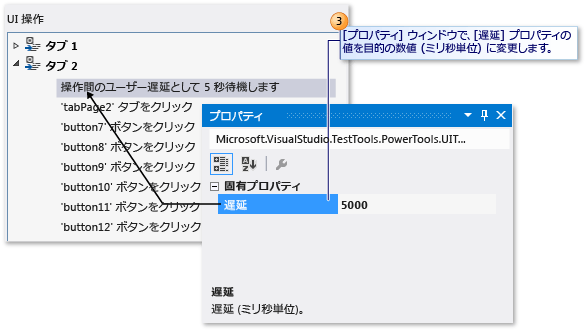

# コード化された UI テスト エディターを使用したコード化された UI テストの編集
コード化された UI テスト エディターを使用すると、コード化された UI テストを簡単に変更できます。 コード化された UI テスト エディターを使用して、テスト メソッドや UI 操作のプロパティを検索、表示、および編集できます。 また、対応するコントロールを表示および編集するための UI コントロール マップを使用できます。  
  
 **必要条件**  
  
-   Visual Studio Enterprise  
  
## この操作を行う理由  
 コード化された UI テスト エディターを使用することは、コード化された UI テスト メソッドのコードをコード エディターを使用して編集するよりも効率的です。 コード化された UI テスト エディターでは、ツール バーとショートカット メニューを使用して、UI 操作とコントロールに関連付けられているプロパティ値をすばやく検出して修正することができます。 たとえば、コード化された UI テスト エディターのツール バーを使用して、次のコマンドを実行できます。  
  
   
  
1.  [検索](../ide/finding-and-replacing-text.md) : UI 操作とコントロールを見つけることができます。  
  
2.  [削除](#CodedUITestEditor_DeleteUIActions) : 不要な UI 操作を削除します。  
  
3.  **名前の変更** : テスト メソッドとコントロールの名前を変更します。  
  
4.  **プロパティ** : 選択した項目のプロパティ ウィンドウが開きます。  
  
5.  [新しいメソッドに分割](#CodedUITestEditor_SplitMethods) : UI 操作をモジュール化できます。  
  
6.  [コードの移動](#CodedUITestEditor_MoveMethods) : テスト メソッドにカスタム コードを追加します。  
  
7.  [前に遅延を挿入](#CodedUITestEditor_InsertDelay) : ミリ秒単位で指定された UI 操作の前に一時停止を追加します。  
  
8.  [UI コントロールの検索](#CodedUITestEditor_LocateUIControl) : テスト対象のアプリケーションの UI におけるコントロールの位置を特定します。  
  
9. [すべてを検索](#CodedUITestEditor_LocateDecendants): コントロール プロパティ、およびアプリケーションのコントロールに対すると重要な変更を検証します。  
  
## 操作方法  
 [!INCLUDE[vs_dev11_long](../data-tools/includes/vs_dev11_long_md.md)]では、コード化された UI テスト プロジェクトのコード化された UI テストと結合した UIMap.uitest ファイルを開くと、コード化された UI テストがコード化された UI テスト エディターに自動的に表示されます。 次の手順では、エディターのツール バーとショートカット メニューを使用してテスト メソッド、UI 操作のプロパティ、コントロールを検索および編集する方法について説明します。  
  
## コード化された UI テストを開く  
 コード化された UI テスト エディターを使用して、Visual C# および Visual Basic ベースのコード化された UI テストを表示および編集できます。  
  
   
  
 ソリューション エクスプローラーで、 **[UIMap.uitest]** のショートカット メニューを開き、 **[開く]**をクリックします。 コード化された UI テスト エディターに、コード化された UI テストが表示されます。 これで、コード化された UI テストの記録されたメソッド、操作、および対応するコントロールを表示および編集できるようになります。  
  
> [!TIP]
>  **[UI 操作]** ウィンドウでメソッド内にある UI 操作を選択すると、対応するコントロールが強調表示されます。 UI 操作またはコントロール プロパティも変更できます。  
  
 コード化された UI テスト エディターが*表示されません* 。  
 Visual Studio Enterprise の 2012 よりも前のバージョンを使用している可能性があります。 コード化された UI テスト エディターは、MSDN サブスクリプションを備えた Visual Studio 2010 Feature Pack 2 でも使用できます。 [!INCLUDE[crdefault](../test/includes/crdefault_md.md)]「[Microsoft Visual Studio 2010 Feature Pack 2](http://go.microsoft.com/fwlink/?LinkID=204119)」を参照してください。  
  
##  UI 操作プロパティとそれに対応するコントロールのプロパティを変更する  
 コード化された UI テスト エディターを使用すると、テスト メソッドですべての UI 操作をすばやく検索および表示できます。 エディターで UI 操作を選択すると、対応するコントロールが自動的に強調表示されます。 同様に、コントロールを選択すると、関連付けられた UI 操作が強調表示されます。 UI 操作またはコントロールを選択すると、[プロパティ] ウィンドウを使用して対応するプロパティを変更することが容易になります。  
  
   
UI 操作のプロパティの編集  
  
 UI 操作のプロパティを **[UI 操作]** ウィンドウで変更する場合は、プロパティを編集する対象の UI 操作を含むテスト メソッドを展開し、UI 操作を選択してから [プロパティ] ウィンドウを使用してプロパティを変更します。  
  
 たとえば、サーバーが使用できないときに "**Web ページ 'http://Contoso1/default.aspx' に移動**" というメッセージを表示する UI 操作が Web ブラウザーに関連付けられている場合は、URL を `'http://Contoso2/default.aspx'` に変更できます。  
  
   
コントロールのプロパティの編集  
  
 コントロールのプロパティの変更は、UI 操作のプロパティの場合と同じ方法で実行します。 **[UI コントロール マップ]** ウィンドウで、編集するコントロールを選択し、[プロパティ] ウィンドウを使用してプロパティを変更します。  
  
 たとえば、開発者がテスト対象のアプリケーションのソース コードでボタン コントロールの **(ID)** プロパティを "idSubmit" から "idLogin" に変更している可能性があるとします。 アプリケーションで **(ID)** プロパティを変更すると、コード化された UI テストでボタン コントロールを検索できずに失敗します。 この場合、テスト担当者は、 **[検索プロパティ]** コレクションを開き、開発者がアプリケーションで使用した新しい値に合わせて **Id** プロパティを変更できます。 また、テスト担当者は、**[フレンドリ名]** プロパティの値を "Submit" から "Login" に変更することもできます。 この変更を実行すると、コード化された UI テスト エディターでの関連付けられた UI 操作が "'Submit' ボタンをクリック" から "'Login' ボタンをクリック" に更新されます。  
  
 変更が完了したら、 **ツール バーの** [保存] [!INCLUDE[vsprvs](../code-quality/includes/vsprvs_md.md)] をクリックすることで、UIMap.Designer ファイルに変更を保存します。  
  
 *その他に知っておく必要があること*  
 **ヒント**  
  
-    [プロパティ] ウィンドウが表示されていない場合は、**Alt** キーを押したまま **Enter** キーを押すか、**F4** キーを押します。  
  
-    実行したプロパティの変更を元に戻すには、**[編集]** メニューの **[元に戻す]** を選択するか、Ctrl キーを押しながら Z キーを押します。  
  
-    コード化された UI テスト エディターのツール バーにある **[検索]** ボタンを使用すると、Visual Studio の検索と置換ツールを開くことができます。 そうすれば、検索コントロールを使用して、コード化された UI テスト エディターで UI 操作を検索できます。 たとえば、"'Login' ボタンをクリック" を検索できます。 これは、大規模なテストの場合に便利です。 コード化された UI テスト エディターでは検索と置換ツールの置換機能を使用できないことに注意してください。 詳細については、「[テキストの検索と置換](../ide/finding-and-replacing-text.md)」の「検索コントロール」を参照してください。  
  
-   テスト対象のアプリケーションの UI におけるコントロールの位置を表示するのが難しい場合があります。 コード化された UI テスト エディターの機能の 1 つとして、UI コントロール マップに一覧表示されているコントロールを選択し、テスト対象のアプリケーションにおけるそのコントロールの位置を表示することができます。 [!INCLUDE[crdefault](../test/includes/crdefault_md.md)]「[テスト対象のアプリケーションで UI コントロールを検索する](#CodedUITestEditor_LocateUIControl)」(このトピックの後の方) を参照してください。  
  
-   編集するコントロールを含むコンテナー コントロールを拡張する必要が生じる場合があります。 [!INCLUDE[crdefault](../test/includes/crdefault_md.md)]「[コントロールとその子孫を検索する](#CodedUITestEditor_LocateDecendants)」(このトピックの後の方) を参照してください。  
  
##  不要な UI 操作を削除する  
 コード化された UI テストの不要な UI 操作を簡単に削除できます。  
  
   
  
 **[UI 操作]** ウィンドウで、削除する UI 操作を含むテスト メソッドを展開します。 UI 操作のショートカット メニューを開き、 **[削除]**をクリックします。  
  
##   テスト メソッドを 2 つの異なるメソッドに分割する  
 テスト メソッドを分割し、UI 操作を調整またはモジュール化することができます。 たとえば、テストには 2 個のコンテナー コントロールの UI 操作を含む単一のテスト メソッドが存在する場合があります。 UI 操作は、1 個のコンテナーで対応する 2 種類のメソッドにおいてより適切にモジュール化される可能性があります。  
  
   
  
   
  
 **[UI 操作]** ウィンドウで、2 種類の異なるメソッドに分割するテスト メソッドを展開し、新しいテスト メソッドを開始する UI 操作を選択します。 UI 操作のショートカット メニューを開いて **[新しいメソッドに分割]**をクリックするか、コード化された UI テスト エディターのツール バーにある **[新しいメソッドに分割]** をクリックします。 新しいテスト メソッドが [UI 操作] ウィンドウに表示されます。 これには、分割を指定したアクションを先頭とする UI 操作が含まれています。  
  
 メソッドの分割が完了したら、 **ツール バーの** [保存] [!INCLUDE[vsprvs](../code-quality/includes/vsprvs_md.md)] をクリックし、UIMap.Designer ファイルに変更を保存します。  
  
 *その他に知っておく必要があること*  
 **重要な問題**  
  
-    **警告:** メソッドを分割する場合は、引き続きそれらの UI 操作を含めるのであれば、既存のメソッドを呼び出すコードを変更し、作成しようとしている新しいメソッドも呼び出すようにする必要があります。 メソッドを分割すると、Microsoft Visual Studio のダイアログ ボックスが表示されます。 既存のメソッドを呼び出すコードを変更し、作成しようとしている新しいメソッドも呼び出すコードにする必要があることを示す警告が表示されます。 **[はい]**をクリックします。  
  
 **ヒント**  
  
-    分割を元に戻すには、**[編集]** メニューの **[元に戻す]** をクリックするか、Ctrl キーを押しながら Z キーを押します。  
  
-    新しいメソッドの名前を変更できます。 [UI 操作] ウィンドウでメソッドを選択し、コード化された UI テスト エディターのツール バーにある **[名前の変更]** をクリックします。  
  
     - または -  
  
     新しいテスト メソッドのショートカット メニューを開き、 **[名前の変更]**をクリックします。  
  
     Microsoft Visual Studio のダイアログ ボックスが表示されます。 メソッドを参照しているコードを変更する必要があることを示す警告が表示されます。 **[はい]**をクリックします。  
  
##   カスタマイズを容易にするためにテスト メソッドを UIMap ファイルへ移動する  
 コード化された UI テストのテスト メソッドにカスタム コードが必要であることが判明した場合は、そのテスト メソッドを UIMap.cs ファイルまたは UIMap.vb ファイルに移動する必要があります。 それ以外の場合、コード化された UI テストが再コンパイルされるたびにコードが上書きされます。 メソッドを移動しない場合は、テストが再コンパイルするたびにカスタム コードが上書きされます。  
  
 **[UI 操作]** ウィンドウで、テスト コードの再コンパイル時に上書きされないカスタム コード機能を容易にするために、UIMap.cs ファイルまたは UIMap.vb ファイルに移動するテスト メソッドを選択します。 次に、コード化された UI テスト エディターのツール バーにある **[コードの移動]** をクリックするか、テスト メソッドのショートカット メニューを開いて **[コードの移動]**をクリックします。 テスト メソッドが UIMap.uitest ファイルから削除され、[UI Actions] (UI 操作) ペインに表示されなくなります。 移動したテスト ファイルを編集するには、ソリューション エクスプローラーから UIMap.cs ファイルまたは UIMap.vb ファイルを開きます。  
  
 メソッドの移動が完了したら、 **ツール バーの** [保存] [!INCLUDE[vsprvs](../code-quality/includes/vsprvs_md.md)] をクリックし、UIMap.Designer ファイルに変更を保存します。  
  
 *その他に知っておく必要があること*  
 **重要な問題**  
  
-    **警告:** メソッドを移動すると、コード化された UI テスト エディターを使用してそのメソッドを編集できなくなります。 カスタム コードを追加し、コード エディターを使って管理する必要があります。 メソッドを移動すると、Microsoft Visual Studio のダイアログ ボックスが表示されます。 メソッドが UIMap.uitest ファイルから UIMap.cs ファイルまたは UIMap.vb ファイルに移動すること、およびコード化された UI テスト エディターを使用してメソッドを編集できなくなることを示す警告が表示されます。 **[はい]**をクリックします。  
  
 **ヒント**  
  
-    移動を元に戻すには、**[編集]** メニューの **[元に戻す]** をクリックするか、Ctrl キーを押しながら Z キーを押します。 ただし、その場合は UIMap.cs ファイルまたは UIMap.vb ファイルからコードを手動で削除する必要があります。  
  
##   テスト対象のアプリケーションで UI コントロールを検索する  
 テスト対象のアプリケーションの UI におけるコントロールの位置を表示するのが難しい場合があります。 コード化された UI テスト エディターの機能の 1 つとして、UI コントロール マップに一覧表示されているコントロールを選択し、テスト対象のアプリケーションにおけるそのコントロールの位置を表示することができます。 テスト対象のアプリケーションで **[UI コントロールの検索]** 機能を使用すると、コントロールに対して行った検索プロパティの変更を確認することもできます。  
  
   
  
   
  
 **[UI コントロール マップ]** ウィンドウで、テストに関連付けられたアプリケーション内で検索するコントロールを選択します。 次に、コントロールのショートカット メニューを開き、 **[UI コントロールの検索]**をクリックします。 テストされているアプリケーションでは、該当するコントロールは青色の枠線で示されます。  
  
 *その他に知っておく必要があること*  
 **重要な問題**  
  
-    **警告**: UI コントロールを検索する前に、テストに関連付けられているアプリケーションが実行されていることを確認してください。  
  
 **ヒント**  
  
-    または、**[すべてを検索]** オプションを使用すると、コンテナーにあるすべてのコントロールを正しく配置できることを確認できます。 このオプションについては、次のセクションで説明します。  
  
##   コントロールとその子孫を検索する  
 コンテナーにあるすべてのコントロールをテスト対象のアプリケーションの UI に正しく配置できることを確認できます。 これは、コンテナーに対して行った検索プロパティの変更を確認するときに便利です。 さらに、テスト対象のアプリケーションの UI を大幅に変更した場合に、既存のコントロール検索プロパティが正しいことを確認できます。  
  
   
  
   
  
 **[UI コントロール マップ]** ウィンドウで、すべての子孫を検索して表示する対象のコンテナー コントロールを選択します。 次に、コントロールのショートカット メニューを開き、 **[すべてを検索]**をクリックします。 コンテナー コントロールとそのすべての子孫のコントロールは、コード化された UI テスト エディターにおいて、緑色のチェック マークまたは赤色の "X" でマークされます。 これらのマークを見れば、テスト対象のアプリケーションでコントロールが正しく配置されているかどうかを確認できます。  
  
 *その他に知っておく必要があること*  
 **重要な問題**  
  
-    **警告:** UI コントロールを検索する前に、テストに関連付けられているアプリケーションが実行されていることを確認してください。  
  
##  UI 操作の前に遅延を挿入する  
 ウィンドウの表示やプログレス バーの非表示などの特定のイベントが発生するまでテストを待機させる必要がある場合があります。 コード化された UI テスト エディターを使用し、UI 操作の前に遅延を挿入することで、この処理を実行できます。 遅延する秒数を指定できます。  
  
   
  
   
  
 **[UI 操作]** ウィンドウで、事前に遅延を挿入する対象の UI 操作を含むテスト メソッドを展開します。 UI 操作を選択します。 次に、UI 操作のショートカット メニューを開き、 **[前に遅延を挿入]**をクリックします。 選択した UI 操作の前に遅延が挿入されて強調表示され、 **"操作間のユーザー遅延として 1 秒待機します"**というテキストが示されます。 [プロパティ] ウィンドウで、 **[遅延]** プロパティの値を目的のミリ秒数に変更します。  
  
 遅延の挿入が完了したら、 **ツール バーの** [保存] [!INCLUDE[vsprvs](../code-quality/includes/vsprvs_md.md)] をクリックすることで、UIMap.Designer ファイルに変更を保存します。  
  
 *その他に知っておく必要があること*  
 **注**  
  
-    UI 操作の前に特定のコントロールを使用できるようにする必要がある場合は、適切な UITestControl.WaitForControlXXX() メソッドを使用してテスト メソッドにカスタム コードを追加することを検討してください。 [!INCLUDE[crdefault](../test/includes/crdefault_md.md)]「[再生中に特定のイベントを待機するようにコード化された UI テストを設定する](../test/making-coded-ui-tests-wait-for-specific-events-during-playback.md)」を参照してください。  
  
 **ヒント**  
  
-    [プロパティ] ウィンドウが表示されていない場合は、Alt キーを押したまま Enter キーを押すか、F4 キーを押します。  
  
## 外部リソース  
  
### ガイダンス  
 [Visual Studio 2012 を使用した継続的配信のためのテスト - 第 2 章: 単体テスト: 内部のテスト](http://go.microsoft.com/fwlink/?LinkID=255188)  
  
### FAQ  
 [Coded UI Tests FAQ - 1 (コード化された UI テストの FAQ - 1)](http://go.microsoft.com/fwlink/?LinkID=230576)  
  
 [Coded UI Tests FAQ - 2 (コード化された UI テストの FAQ - 2)](http://go.microsoft.com/fwlink/?LinkID=230578)  
  
### フォーラム  
 [Visual Studio の UI オートメーションのテスト (CodedUI を含む)](http://go.microsoft.com/fwlink/?LinkID=224497)  
  
## 関連項目

[UI オートメーションを使用してコードをテストする](../test/use-ui-automation-to-test-your-code.md)  
[コード化された UI テストを作成する](../test/use-ui-automation-to-test-your-code.md#VerifyingCodeUsingCUITCreate)  
[データ ドリブンのコード化された UI テストの作成](../test/creating-a-data-driven-coded-ui-test.md)  
[チュートリアル: コード化された UI テストの作成、編集、および保守](../test/walkthrough-creating-editing-and-maintaining-a-coded-ui-test.md)
