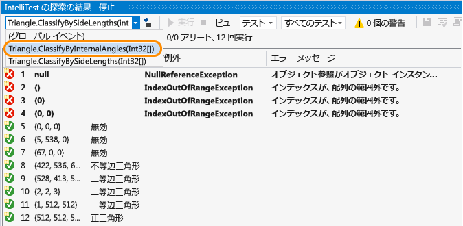
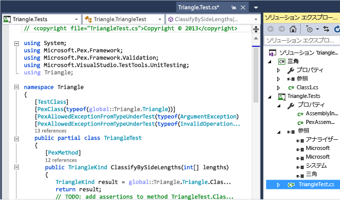

# IntelliTest でのコードの単体テストの生成
IntelliTest はテスト データおよび単体テストのスイートを生成するために .NET コードを確認します。 コードにある各ステートメントについて、そのステートメントを実行するテスト入力が生成されます。 コード内の各条件付き分岐について、ケース分析が実行されます。 たとえば、`if` ステートメント、アサーション、および例外をスローするすべての操作が分析されます。 この分析は、各メソッドのパラメーター化された単体テストのためにテスト データを生成し、高いコード カバレッジを持つ単体テストを作成するために使用されます。

 IntelliTest を実行すると、どのテストが失敗しているかを簡単に把握し、必要なコードを追加して修正できます。 回帰スイートを提供するために、生成されたどのテストをテスト プロジェクトに保存するかを選択できます。 コードを変更する際に、IntelliTest を再実行して、生成されたテストとコードの変更を同期させます。

## 可用性と拡張機能

**[IntelliTest の作成]** および **[IntelliTest の実行]** メニュー コマンドは次のとおりです。

* Visual Studio 2015 以降の Enterprise Edition でのみ使うことができます。

* .NET Framework を対象とする C# コードのみをサポートします。

* [拡張可能](#extend-framework)であり、MSTest、MSTest V2、NUnit、xUnit 形式でのテストの発行をサポートします。

* x64 の構成はサポートしません。

## 探索: IntelliTest を使用してコードを確認し、単体テストを生成する
 単体テストを生成するには、パブリック型でなければなりません。 そうでない場合は、 [単体テストを作成](#NoRun) してから生成する必要があります。

1.  Visual Studio でソリューションを開きます。 次に、テストするメソッドが含まれるクラス ファイルを開きます。

2.  コード内のメソッドを右クリックして **[IntelliTest の実行]** を選択し、メソッドにあるすべてのコード パスに対する単体テストを生成します。

     

     IntelliTest は、異なる入力でコードを何度も実行します。 それぞれの実行は、表の入力テスト データおよび結果出力または例外で示されます。

     ![[精査結果] ウィンドウでのテスト表示](../test/media/pexexplorationresults.png)

     クラス内のすべてのパブリック メソッドに対して単体テストを生成するには、特定のメソッドではなく、クラスで右クリックします。 その後、 **[IntelliTest の実行]** を選択します。 **[探索の結果]** ウィンドウにあるドロップダウン リストを使用して、クラス内の各メソッドの単体テストと入力データを表示します。

     

     合格したテストについて、結果列に報告されている結果が、コードに対する予想と一致していることを確認します。 テストが失敗した場合は、必要に応じてコードを修正します。 IntelliTest を再実行して、修正を検証します。

## 持続: 単体テストを回帰スイートとして保存

1.  パラメーター化された単体テストでテスト プロジェクトに保存するデータの行を選択します。

     ![テストを選択して右クリックし、[保存] を選択](../test/media/savepextests.png)

     テスト プロジェクトと作成されたパラメーター化された単体テストを表示できます。各行に対応する個々の単体テストはテスト プロジェクトの *.g.cs* ファイルに保存され、パラメーター化された単体テストは対応する *.cs* ファイルに保存されます。 単体テストは、テスト エクスプローラーから実行してその結果を表示することができます。これは、手動で作成する他の単体テストと同様です。

     

     その他の必要な参照もテスト プロジェクトに追加されます。

     メソッド コードが変更された場合、IntelliTest を再実行して単体テストを変更と同期させます。

## 支援: IntelliTest を使用してコードの探索に重点を置く

1.  コードが複雑な場合、IntelliTest は、コードの探索に重点を置いて支援します。 たとえば、パラメーターとしてインターフェイスを持つメソッドがあり、複数のクラスがそのインターフェイスを実装している場合であれば、IntelliTest はそれらのクラスを発見して警告を報告します。

     警告を表示してその後の行動を決めます。

     

2.  コードを調査して何をテストするか理解した後、警告を修正して、インターフェイスをテストするためにどのクラスを使用するかを選択できます。

     ![警告を右クリックして [修正] を選択](../test/media/pexfixwarning.png)

     この選択は *PexAssemblyInfo.cs* ファイルに追加されます。

     `[assembly: PexUseType(typeof(Camera))]`

3.  これで IntelliTest を再実行して、修正したクラスだけを使用してパラメーター化された単体テストとテスト データを生成できます。

     

## 指定: コードで指定した正確性プロパティを検証するために IntelliTest を使用する

生成された単体テストで検証する入力と出力の一般的な関係を指定します。 この指定は、テスト メソッドのようになりますが、汎用的に定量化されたメソッドにカプセル化されます。 これは、パラメーター化された単体テスト メソッドであり、IntelliTest で生成されるすべての可能な入力値に対して任意のアサーションを保持する必要があります。

##  Q & A

### Q: アンマネージ コードに IntelliTest を使用できますか。

**A:** いいえ。IntelliTest はマネージド コードでのみ動作します。

### Q: 生成されたテストはどのような場合に合格または失敗しますか。

**A:** 他の単体テストと同様に、例外が発生しなければ合格します。 アサーションが失敗した場合、またはテスト対象のコードがハンドルされない例外をスローした場合には失敗します。

 特定の例外がスローされても合格するテストがある場合、テスト メソッド、テスト クラス、またはアセンブリ レベルの要件に基づいて、次のいずれかの属性を設定できます。

-   **PexAllowedExceptionAttribute**

-   **PexAllowedExceptionFromTypeAttribute**

-   **PexAllowedExceptionFromTypeUnderTestAttribute**

-   **PexAllowedExceptionFromAssemblyAttribute**

### Q: パラメーター化された単体テストに前提事項を追加できますか。

**A:** はい。前提事項は、特定のメソッドの単体テストに、どのテスト データが必要ないかを指定するために使用します。 <xref:Microsoft.Pex.Framework.PexAssume> クラスを使用して前提事項を追加します。 たとえば、長さの変数が NULL ではないという前提事項は次のように追加します。

 `PexAssume.IsNotNull(lengths);`

 前提事項を追加して IntelliTest を再実行した場合、関係ないテスト データは取り除かれます。

### Q: パラメーター化された単体テストにアサーションを追加できますか。

**A:** はい。IntelliTest のプロセスは、単体テストを実行するときにステートメント内のアサートの対象が正しいことを確認します。 テスト フレームワークに付属する <xref:Microsoft.Pex.Framework.PexAssert> クラスまたはアサーション API を使用してアサーションを追加します。 たとえば、2 つの変数が等しいというアサーションを追加できます。

 `PexAssert.AreEqual(a, b);`

 アサーションを追加して IntelliTest を再実行すると、アサーションが有効であることを確認し、有効でない場合はテストに失敗します。

###   Q: IntelliTest を最初に実行しなくてもパラメーター化された単体テストを生成することはできますか。

**A:** はい。それには、クラスまたはメソッドを右クリックして **[IntelliTest の作成]** を選択します。

 ![エディターを右クリックし、[IntelliTest の作成] を選択](../test/media/pexcreateintellitest.png)

 テスト生成時の既定の形式を受け入れるか、プロジェクトまたはテストの名前付け方法を変更します。 新しいテスト プロジェクトを作成するか、既存のプロジェクトにテストを保存することができます。

 ![既定の MSTest での [IntelliTest の作成]](../test/media/pexcreateintellitestmstest.png)

### Q: IntelliTest で他の単体テスト フレームワークを使用することはできますか。

**A:** はい。以下の手順に従って、 [他のフレームワークを検索してインストール](../test/install-third-party-unit-test-frameworks.md)してください。
テスト フレームワークの拡張機能は Visual Studio Marketplace でも手に入ります。

* [テスト ジェネレーター用 NUnit 拡張機能](https://marketplace.visualstudio.com/items?itemName=NUnitDevelopers.TestGeneratorNUnitextension-18371)
* [テスト ジェネレーター用 xUnit.net 拡張機能](https://marketplace.visualstudio.com/items?itemName=BradWilson.xUnitnetTestExtensions)

その後、Visual Studio を再起動し、ソリューションを再度開いてクラスまたはメソッドを右クリックし、 **[IntelliTest の作成]** を選択します。 インストールしたフレームワークを選択します。

これで、IntelliTest を実行すると、個々の単体テストが対応する *.g.cs* ファイル内に生成されます。

### Q: テストの生成方法に関してさらに調べることができますか。

**A:** はい。概要については、この [ブログ投稿](https://blogs.msdn.microsoft.com/devops/2015/07/05/intellitest-one-test-to-rule-them-all/)を読んでください。
