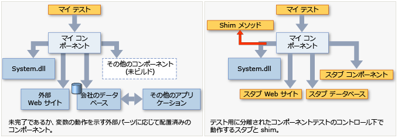

# <a name="isolate-code-under-test-with-microsoft-fakes"></a>Microsoft Fakes を使用したテストでコードを分離する

Microsoft Fakes では、アプリケーションの別の部分を*スタブ*または *shim* で置き換えることにより、テストするコードを分離できます。 これらは、テストの制御下にある小さいコードです。 テストのコードを分離することにより、テストが失敗した場合に、原因が別の場所ではなくそこにあることを確認できます。 また、アプリケーションの別の部分がまだ機能していない場合でも、スタブと shim を使用すると、コードをテストできます。

Fakes には 2 種類のフレーバーがあります。

- [スタブ](#get-started-with-stubs)は、クラスを同じインターフェイスを実装する小さな代用に置き換えます。  スタブを使用するには、各コンポーネントがインターフェイスのみに依存し、その他のコンポーネントには依存しないようにアプリケーションを設計する必要があります ("コンポーネント" とは、1 つのクラス、または一緒に設計され更新される複数のクラスで、通常は 1 つのアセンブリに格納されるもののことです)。

- [shim](#get-started-with-shims) は、アプリケーションのコンパイル済みコードを実行時に変更します。これにより、指定されたメソッド呼び出しを実行する代わりに、テストで提供される shim コードが実行されるようになります。 Shim を使用すると、.NET アセンブリなど、変更できないアセンブリの呼び出しを置き換えることができます。



**必要条件**

- Visual Studio Enterprise
- .NET Framework プロジェクト
- .NET Core および SDK スタイルのプロジェクト サポートは現在プレビュー段階です。 [詳細](/visualstudio/releases/2019/release-notes#microsoft-fakes-for-net-core-and-sdk-style-projects)

> [!NOTE]
> - .NET Standard プロジェクトはサポートされていません。
> - Microsoft Fakes を使用するテストでは、Visual Studio でのプロファイリングは使用できません。

## <a name="choose-between-stub-and-shim-types"></a>スタブ型と shim 型から選択する
通常、Visual Studio プロジェクトはコンポーネントと見なされますが、それは、これらのクラスを同時に開発および更新するためです。 プロジェクトがソリューション内の別のプロジェクトに対して実行する呼び出し、またはプロジェクトが参照する別のアセンブリに対して実行する呼び出しにスタブと shim を使用することを検討します。

一般的なガイドラインとして、Visual Studio ソリューション内の呼び出しにはスタブを使用し、その他の参照先アセンブリの呼び出しには shim を使用します。 これは、独自のソリューション内では、スタブする際に必要な方法でインターフェイスを定義することによってコンポーネントを分離することが適切な方法であるためです。 ただし、一般的には *System.dll* などの外部アセンブリは分離されたインターフェイス定義を伴わないので、代わりに shim を使用する必要があります。

その他の考慮事項:

**パフォーマンス。** shim の場合は実行時にコードを書き直すので、処理速度が遅くなります。 スタブの場合はこのようなパフォーマンス オーバーヘッドがないので、仮想メソッドの場合と同じように高速です。

**静的メソッド、sealed 型。** スタブを使用できるのは、インターフェイスを実装する場合のみです。 したがって、静的メソッド、仮想でないメソッド、シールされた仮想メソッド、sealed 型のメソッドなどにはスタブ型を使用できません。

**内部型。** スタブと shim はいずれも、アセンブリ属性 <xref:System.Runtime.CompilerServices.InternalsVisibleToAttribute> を使用することでアクセス可能になる内部型に使用できます。

**プライベート メソッド。** メソッド シグネチャですべての型が参照可能な場合、Shim はプライベート メソッドの呼び出しを置き換えることができます。 スタブは、参照可能なメソッドのみを置き換えることができます。

**インターフェイスと抽象メソッド。** スタブは、テストに使用できるインターフェイスおよび抽象メソッドの実装を可能にします。 Shim の場合は、メソッド本体がないため、インターフェイスおよび抽象メソッドをインストルメント化することができません。

一般に、コードベース内の依存関係から分離するためにスタブ型を使用することをお勧めします。 これを行うには、インターフェイスの背後にあるコンポーネントを非表示にします。 Shim 型は、テスト可能な API を提供しないサードパーティのコンポーネントから分離する場合に使用できます。

## <a name="get-started-with-stubs"></a>スタブの使用を開始する
より詳細な説明については、「[スタブを使用して単体テストでアプリケーションの各部分を相互に分離する](../test/using-stubs-to-isolate-parts-of-your-application-from-each-other-for-unit-testing.md)」を参照してください。

1. **インターフェイスの挿入**

     スタブを使用するには、アプリケーションの別のコンポーネントのクラスを明示的に示すことがないように、テストするコードを記述する必要があります。 "コンポーネント" とは、1 つのクラス、または一緒に設計され更新される複数のクラスで、通常は 1 つの Visual Studio コンポーネントに格納されるもののことです。 変数とパラメーターは、インターフェイスを使用して宣言される必要があります。別のコンポーネントのインスタンスは、渡されるかファクトリを使用して作成される必要があります。 たとえば、StockFeed がアプリケーションの別のコンポーネントのクラスである場合、これは不適切であると見なされます。

     `return (new StockFeed()).GetSharePrice("COOO"); // Bad`

     代わりに、別のコンポーネントによる実装が可能で、テスト目的でスタブによる実装も可能なインターフェイスを定義します。

    ```csharp
    public int GetContosoPrice(IStockFeed feed) => feed.GetSharePrice("COOO");
    ```

    ```vb
    Public Function GetContosoPrice(feed As IStockFeed) As Integer
     Return feed.GetSharePrice("COOO")
    End Function

    ```

2. **Fakes アセンブリの追加**

    1. **ソリューション エクスプローラー**で、テスト プロジェクトの参照一覧を展開します。 Visual Basic で作業している場合、参照一覧を表示するには、 **[すべてのファイルを表示]** を選択する必要があります。

    2. インターフェイス (たとえば IStockFeed) が定義されているアセンブリへの参照を選択します。 この参照のショートカット メニューで、 **[Fakes アセンブリに追加]** をクリックします。

    3. ソリューションをリビルドします。

3. テストで、スタブのインスタンスを構築し、そのメソッドのためのコードを指定します。

    ```csharp
    [TestClass]
    class TestStockAnalyzer
    {
        [TestMethod]
        public void TestContosoStockPrice()
        {
          // Arrange:

            // Create the fake stockFeed:
            IStockFeed stockFeed =
                 new StockAnalysis.Fakes.StubIStockFeed() // Generated by Fakes.
                     {
                         // Define each method:
                         // Name is original name + parameter types:
                         GetSharePriceString = (company) => { return 1234; }
                     };

            // In the completed application, stockFeed would be a real one:
            var componentUnderTest = new StockAnalyzer(stockFeed);

          // Act:
            int actualValue = componentUnderTest.GetContosoPrice();

          // Assert:
            Assert.AreEqual(1234, actualValue);
        }
        ...
    }
    ```

    ```vb
    <TestClass()> _
    Class TestStockAnalyzer

        <TestMethod()> _
        Public Sub TestContosoStockPrice()
            ' Arrange:
            ' Create the fake stockFeed:
            Dim stockFeed As New StockAnalysis.Fakes.StubIStockFeed
            With stockFeed
                .GetSharePriceString = Function(company)
                                           Return 1234
                                       End Function
            End With
            ' In the completed application, stockFeed would be a real one:
            Dim componentUnderTest As New StockAnalyzer(stockFeed)
            ' Act:
            Dim actualValue As Integer = componentUnderTest.GetContosoPrice
            ' Assert:
            Assert.AreEqual(1234, actualValue)
        End Sub
    End Class

    ```

    ここでの特殊なマジックは、`StubIStockFeed` クラスです。 参照アセンブリのそれぞれのインターフェイスに対して、Microsoft Fakes のメカニズムによってスタブ クラスが生成されます。 スタブ クラスの名前はインターフェイスの名前から派生します。プレフィックスとして "`Fakes.Stub`" が付き、パラメーターの型名が加わります。

    また、イベントおよびジェネリック メソッドについて、プロパティの getter および setter に対してもスタブが生成されます。 詳細については、「[スタブを使用して単体テストでアプリケーションの各部分を相互に分離する](../test/using-stubs-to-isolate-parts-of-your-application-from-each-other-for-unit-testing.md)」を参照してください。

## <a name="get-started-with-shims"></a>shim の使用を開始する
(より詳細な説明については、「[shim を使用して単体テストでアプリケーションを他のアセンブリから分離する](../test/using-shims-to-isolate-your-application-from-other-assemblies-for-unit-testing.md)」を参照してください。)

コンポーネントに `DateTime.Now` の呼び出しが含まれているとします。

```csharp
// Code under test:
    public int GetTheCurrentYear()
    {
       return DateTime.Now.Year;
    }
```

テストの実行中、実際のバージョンでは不都合なことにそれぞれの呼び出しで異なる値が返されるため、`Now` プロパティに shim を使用します。

shim を使用するためにアプリケーション コードを変更したり、特定の方法を記述したりする必要はありません。

1. **Fakes アセンブリの追加**

     **ソリューション エクスプローラー**で、単体テスト プロジェクトの参照を開き、偽装の対象となるメソッドが格納されているアセンブリへの参照を選択します。 この例では、`DateTime` クラスが *System.dll* にあります。  Visual Basic プロジェクトの参照を確認するには、 **[すべてのファイルを表示]** を選択します。

     **[Fakes アセンブリに追加]** をクリックします。

2. **ShimsContext に shim を挿入する**

    ```csharp
    [TestClass]
    public class TestClass1
    {
            [TestMethod]
            public void TestCurrentYear()
            {
                int fixedYear = 2000;

                // Shims can be used only in a ShimsContext:
                using (ShimsContext.Create())
                {
                  // Arrange:
                    // Shim DateTime.Now to return a fixed date:
                    System.Fakes.ShimDateTime.NowGet =
                    () =>
                    { return new DateTime(fixedYear, 1, 1); };

                    // Instantiate the component under test:
                    var componentUnderTest = new MyComponent();

                  // Act:
                    int year = componentUnderTest.GetTheCurrentYear();

                  // Assert:
                    // This will always be true if the component is working:
                    Assert.AreEqual(fixedYear, year);
                }
            }
    }
    ```

    ```vb
    <TestClass()> _
    Public Class TestClass1
        <TestMethod()> _
        Public Sub TestCurrentYear()
            Using s = Microsoft.QualityTools.Testing.Fakes.ShimsContext.Create()
                Dim fixedYear As Integer = 2000
                ' Arrange:
                ' Detour DateTime.Now to return a fixed date:
                System.Fakes.ShimDateTime.NowGet = _
                    Function() As DateTime
                        Return New DateTime(fixedYear, 1, 1)
                    End Function

                ' Instantiate the component under test:
                Dim componentUnderTest = New MyComponent()
                ' Act:
                Dim year As Integer = componentUnderTest.GetTheCurrentYear
                ' Assert:
                ' This will always be true if the component is working:
                Assert.AreEqual(fixedYear, year)
            End Using
        End Sub
    End Class
    ```

    Shim クラスの名前は、元の型名の先頭に `Fakes.Shim` を付けることで構成されます。 パラメーター名がメソッド名に追加されます (System.Fakes へのアセンブリ参照を追加する必要はありません)。

前の例では、静的メソッドに shim を使用しています。 インスタンス メソッドに shim を使用する場合は、型名とメソッド名の間に `AllInstances` を記述します。

```vb
System.IO.Fakes.ShimFile.AllInstances.ReadToEnd = ...
```

参照する 'System.IO.Fakes' アセンブリがありません。 名前空間は、shim の作成プロセスによって生成されます。 ただし、通常どおり、'using' または 'Import' を使用できます。

また、特定のインスタンス、コンストラクター、およびプロパティに shim を作成することもできます。 詳細については、「[shim を使用して単体テストでアプリケーションを他のアセンブリから分離する](../test/using-shims-to-isolate-your-application-from-other-assemblies-for-unit-testing.md)」を参照してください。

## <a name="in-this-section"></a>このセクションの内容
[スタブを使用して単体テストでアプリケーションの各部分を相互に分離する](../test/using-stubs-to-isolate-parts-of-your-application-from-each-other-for-unit-testing.md)

[shim を使用して単体テストでアプリケーションを他のアセンブリから分離する](../test/using-shims-to-isolate-your-application-from-other-assemblies-for-unit-testing.md)

[Microsoft Fakes におけるコード生成、コンパイル、および名前付け規則](../test/code-generation-compilation-and-naming-conventions-in-microsoft-fakes.md)
