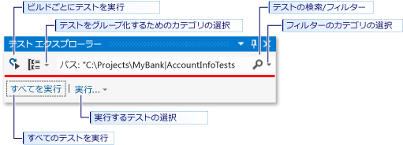

# Visual Studio で単体テストを実行する

このトピックでは、Microsoft Visual Studio でテスト エクスプローラーを使用して単体テストを実行する方法について説明します。

##   単体テスト フレームワークとテスト プロジェクト

Visual Studio には、マネージ コードおよびネイティブ C++ コード用の Microsoft 単体テスト フレームワークが含まれます。 テスト エクスプローラーは、ソリューション内の複数のテスト プロジェクト、および運用コード プロジェクトに含まれるテスト クラスからテストを実行できます。 テスト プロジェクトには、Visual C++ または Visual C# と Visual Basic の単体テスト フレームワークを自由に組み合わせることができます。 テスト対象のコードを .NET Framework 用に記述する場合、対象コードの言語にかかわらず、テスト プロジェクトをどの .NET Framework 言語でも記述できます。 ネイティブ C/C++ コード プロジェクトは、C++ の単体テスト フレームワークを使用してテストする必要があります。

##   テスト エクスプローラーでテストを実行する  
 テスト プロジェクトをビルドすると、テストはテスト エクスプローラーに表示されます。 テスト エクスプローラーが表示されない場合は、Visual Studio メニューの **[テスト]** をクリックし、 **[Windows]**、 **[テスト エクスプローラー]**の順に選択します。  
  
   
  
 テストを実行して、記述し、再実行すると、テスト エクスプローラーに **[失敗したテスト]**、 **[成功したテスト]**、 **[スキップされたテスト]** 、および **[テストを実行しない]**の既定のグループの結果が表示されます。 テスト エクスプローラーでテストをグループ化する方法を変更できます。  
  
 テスト エクスプローラーのツール バーからテストの検索、整理、および実行の作業の多くを実行できます。  
  
   
  
###   テストの実行  
 ソリューション内のすべてのテスト、グループ内のすべてのテスト、または選択した一連のテストを実行できます。 次のいずれかの操作を行います。  
  
-   ソリューション内のすべてのテストを実行するには、 **[すべて実行]**をクリックします。  
  
-   既定のグループ内のすべてのテストを実行するには、 **[実行]** をクリックし、メニューでグループを選択します。  
  
-   実行する個々のテストを選択し、選択したテストのショートカット メニューを開いて、**[選択したテストの実行]** を選択します。  
  
 テストの実行中、テスト エクスプローラー ウィンドウの一番上にある成功/失敗ステータス バーがアニメーション化されます。 テストの実行の終了時に、すべてのテストが成功した場合は、成功/失敗ステータス バーが緑色に変わり、いずれかのテストが失敗した場合は、赤色に変わります。  
  
##   テスト結果の表示  
 テストを実行して、記述し、再実行すると、テスト エクスプローラーに **[失敗したテスト]**、 **[成功したテスト]**、 **[スキップされたテスト]** 、および **[テストを実行しない]**のグループの結果が表示されます。 テスト エクスプローラーの下部の詳細ペインに、テストの実行の概要が表示されます。  
  
###   テストの詳細を表示する  
 個々のテストの詳細を表示するには、そのテストを選択します。  
  
 テストの詳細ペインに次の情報が表示されます。  
  
-   テスト メソッドのソース ファイル名と行番号。  
  
-   テストの状態。  
  
-   テスト メソッドの実行に要した経過時間。  
  
 テストが失敗した場合、詳細ペインには次の情報も表示されます。  
  
-   テストの単体テスト フレームワークによって返されたメッセージ。  
  
-   テストが失敗した時刻のスタック トレース。  
  
###   テスト メソッドのソース コードの表示  
 Visual Studio エディターのテスト メソッドのソース コードを表示するには、テストを選択し、ショートカット メニューの **[テストを開く]** を選択します (キーボードの F12 キー)。  
  
##   テスト一覧の整理  
  
###   テストのグループ化  
 既定では、テスト エクスプローラーに **[失敗したテスト]**、**[成功したテスト]**、**[スキップされたテスト]**、および **[未実行のテスト]** の子ノードとしてテストが表示されます。  
  
|||  
|-|-|  
||これらのテストの実行に要する時間によってテストをグループ化するには、**[グループ化]** ボックスの一覧を開き、**[期間]** を選択します。 元のグループに切り替えるには、**[テスト成果]** を選択します。|  
  
###   テスト一覧の検索およびフィルター処理  
 多数のテストがある場合、テスト エクスプローラーの検索ボックスに入力し、指定した文字列によって一覧をフィルター処理できます。 検索文字列を入力する前に、フィルターの一覧から選択して、フィルターを特定の種類の文字列に制限できます。  
  
   
  
##   単体テストのデバッグ  
 テスト エクスプローラーを使用して、テストのデバッグ セッションを開始できます。 Visual Studio デバッガーを使用してコードをシームレスにステップ実行すると、テスト対象のプロジェクトと単体テストの間を切り替えることができます。 デバッグを開始するには:  
  
1.  Visual Studio エディターで、デバッグする 1 つ以上のテスト メソッドにブレークポイントを設定します。  
  
    > [!NOTE]
    > テスト メソッドを任意の順序で実行できるため、デバッグするすべてのテスト メソッドにブレークポイントを設定します。  
  
2.  テスト エクスプローラーでテスト メソッドを選択し、ショートカット メニューの **[選択したテストのデバッグ]** を選択します。  
  
 デバッガーについて詳しくは、「 [Debugging in Visual Studio](../debugger/debugging-in-visual-studio.md)」をご覧ください。
