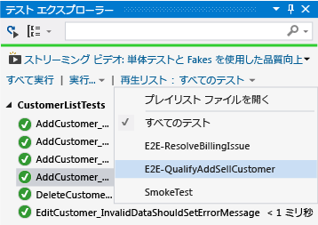

# <a name="run-unit-tests-with-test-explorer"></a>テスト エクスプローラーを使用して単体テストを実行する

テスト エクスプローラーを使用し、Visual Studio またはサード パーティの単体テスト プロジェクトから単体テストを実行します。 テスト エクスプローラーを使用し、テストをカテゴリにまとめたり、テストの一覧にフィルターを適用したり、テストのプレイリストを作成、保存、実行したりすることもできます。 テストをデバッグし、テストのパフォーマンスとコード カバレッジを分析できます。

Visual Studio には、マネージド コードおよびネイティブ コード用の Microsoft 単体テスト フレームワークが含まれます。 ただし、テスト エクスプローラーでは、テスト エクスプローラーのアダプターを実装した単体テスト フレームワークも実行できます。 サードパーティの単体テスト フレームワークのインストールの詳細については、「[サードパーティ製の単体テスト フレームワークをインストールする](../test/install-third-party-unit-test-frameworks.md)」を参照してください。

**テスト エクスプローラー**は、ソリューション内の複数のテスト プロジェクト、および運用コード プロジェクトに含まれるテスト クラスからテストを実行できます。 テスト プロジェクトは別の単体テスト フレームワークを使用できます。 テスト対象のコードを .NET 用に記述する場合、対象コードの言語にかかわらず、.NET も対象とする言語でテスト プロジェクトを記述できます。 ネイティブ C/C++ コード プロジェクトは、C++ の単体テスト フレームワークを使用してテストする必要があります。 詳細については、[C/C++ 用の単体テストの作成](writing-unit-tests-for-c-cpp.md)に関するページを参照してください。

## <a name="run-tests-in-test-explorer"></a>テスト エクスプローラーでテストを実行する


テスト プロジェクトをビルドすると、テストはテスト エクスプローラーに表示されます。 テスト エクスプローラーが表示されない場合は、Visual Studio メニューの **[テスト]** をクリックし、 **[Windows]** 、 **[テスト エクスプローラー]** の順に選択します。


::: moniker range="vs-2017"

::: moniker-end
::: moniker range=">=vs-2019"

::: moniker-end

::: moniker range="vs-2017"
テストを実行して、記述し、再実行すると、テスト エクスプローラーに **[失敗したテスト]** 、 **[成功したテスト]** 、 **[スキップされたテスト]** 、および **[テストを実行しない]** の既定のグループの結果が表示されます。 テスト エクスプローラーでテストをグループ化する方法を変更できます。
::: moniker-end
::: moniker range=">=vs-2019"
テストを実行、書き込み、再実行すると、テスト エクスプローラーには**プロジェクト**、**名前空間**、**クラス**の既定のグループ化の結果が表示されます。 テスト エクスプローラーでテストをグループ化する方法を変更できます。
::: moniker-end

**テスト エクスプローラー**のツール バーからテストの検索、整理、実行の作業の多くを行うことができます。

::: moniker range="vs-2017"

::: moniker-end
::: moniker range=">=vs-2019"

::: moniker-end

### <a name="run-tests"></a>テストの実行

::: moniker range="vs-2017"
ソリューション内のすべてのテスト、グループ内のすべてのテスト、または選択した一連のテストを実行できます。 次のいずれかの操作を行います。

- ソリューション内のすべてのテストを実行するには、 **[すべて実行]** をクリックします。

- 既定のグループ内のすべてのテストを実行するには、 **[実行]** をクリックし、メニューでグループを選択します。

- 実行する個々のテストを選択し、選択したテストの右クリック メニューを開いて、 **[選択したテストの実行]** を選択します。

- 個々のテストに実行順序を定める依存関係がない場合、ツール バーにある  トグル ボタンで並列テストの実行を有効にします。 これにより、すべてのテスト実行にかかる時間を著しく短縮できます。

テストの実行中、**テスト エクスプローラー ウィンドウ**の一番上にある**成功/失敗ステータス バー**がアニメーション化されます。 テストの実行の終了時に、すべてのテストが成功した場合は、**成功/失敗ステータス バー**が緑色に変わり、いずれかのテストが失敗した場合は、赤色に変わります。
::: moniker-end
::: moniker range=">=vs-2019"
ソリューション内のすべてのテスト、グループ内のすべてのテスト、または選択した一連のテストを実行できます。 次のいずれかの操作を行います。

- ソリューション内のテストをすべて実行するには、 **[すべて実行]** アイコンを選択します。

- 既定のグループ内のテストをすべて実行するには、 **[実行]** アイコンを選択し、メニューでそのグループを選択します。

- 実行する個々のテストを選択し、選択したテストの右クリック メニューを開いて、 **[選択したテストの実行]** を選択します。

- 個々のテストに実行順序を定める依存関係がない場合、ツール バーの設定メニューで並列テストの実行を有効にします。 これにより、すべてのテスト実行にかかる時間を著しく短縮できます。
::: moniker-end

### <a name="run-tests-after-every-build"></a>各ビルドの後にテストを実行する
::: moniker range="vs-2017"
|Button|説明|
|-|-|
||各ローカル ビルドの後で単体テストを実行するには、標準のメニューの **[テスト]** を選択し、**テスト エクスプローラー**のツール バーの **[ビルド後にテストを実行]** を選択します。|

> [!NOTE]
> 各ビルドの後の単体テスト実行には、Visual Studio 2017 Enterprise または Visual Studio 2019 が必要です。 Visual Studio 2019 では、Enterprise 以外に Community と Professional に含まれています。
::: moniker-end
::: moniker range=">=vs-2019"
各ローカル ビルドの後で単体テストを実行するには、テスト エクスプローラーのツール バーで設定アイコンを開き、 **[ビルド後にテストを実行]** を選択します。
::: moniker-end

## <a name="view-test-results"></a>テスト結果を表示する

テストを実行して、記述し、再実行すると、テスト エクスプローラーに **[失敗したテスト]** 、 **[成功したテスト]** 、 **[スキップされたテスト]** 、および **[テストを実行しない]** のグループの結果が表示されます。 テスト エクスプローラーの下部または横の詳細ウィンドウに、テストの実行の概要が表示されます。

### <a name="view-test-details"></a>テストの詳細を表示する

個々のテストの詳細を表示するには、そのテストを選択します。

::: moniker range="vs-2017"

::: moniker-end
::: moniker range=">=vs-2019"

::: moniker-end

テストの詳細ペインに次の情報が表示されます。

- テスト メソッドのソース ファイル名と行番号。

- テストの状態。

- テスト メソッドの実行に要した経過時間。

テストが失敗した場合、詳細ペインには次の情報も表示されます。

- テストの単体テスト フレームワークによって返されたメッセージ。

- テストが失敗した時刻のスタック トレース。

### <a name="view-the-source-code-of-a-test-method"></a>テスト メソッドのソース コードを表示する

Visual Studio エディターでテスト メソッドのソース コードを表示するには、テストを選択し、右クリック メニューの **[テストを開く]** を選択します (キーボード:**F12** キー)。

## <a name="group-and-filter-the-test-list"></a>テスト リストをグループ化およびフィルター処理する

テスト エクスプローラーを使用すると、テストを定義済みのカテゴリにグループ化できます。 テスト エクスプローラーで実行されるほとんどの単体テスト フレームワークでは、独自のカテゴリおよびカテゴリ/値のペアを定義して、テストをグループ化することができます。 テストのプロパティに対して文字列を照合して、テストの一覧をフィルター処理することもできます。

### <a name="group-tests-in-the-test-list"></a>テストの一覧のテストをグループ化する

::: moniker range="vs-2017"
テストの編成方法を変更するには、 **[グループ化]** ボタン の横にある下向き矢印を選択し、新しいグループ化の条件を選択します。


::: moniker-end
::: moniker range=">=vs-2019"
テスト エクスプローラーを使用すると、テストを階層にグループ化できます。 既定の階層グループは、 **[プロジェクト]** 、 **[名前空間]** 、 **[クラス]** です。 テストの編成方法を変更するには、 **[グループ化]** ボタン  を選択し、新しいグループ化の条件を選択します。


たとえば、優先順位で [グループ化] オプションを選択することで、階層の独自のレベルを定義し、 **[状態]** と **[クラス]** でグループ化することができます。


::: moniker-end

### <a name="test-explorer-groups"></a>テスト エクスプローラーのグループ

::: moniker range="vs-2017"
|グループ化|説明|
|-|-----------------|
|**期間**|実行時間によるテストのグループ化:**高速**、**中**、**低速**|
|**Outcome**|実行結果によるテストのグループ化:**失敗したテスト**、**スキップされたテスト**、**成功したテスト数**|
|**Traits**|ユーザーが定義するカテゴリ/値のペアによるテストのグループ化。 特徴のカテゴリと値を指定する構文は、単体テスト フレームワークによって定義されます。|
|**プロジェクト**|プロジェクトの名前によるテストのグループ化。|
::: moniker-end
::: moniker range=">=vs-2019"
|グループ化|説明|
|-|-----------------|
|**期間**|実行時間によるテストのグループ化: **高速**、**中**、**低速**|
|**状態**|実行結果によるテストのグループ化:**失敗したテスト**、**スキップされたテスト**、**成功したテスト**、**未実行**|
|**ターゲット フレームワーク** | プロジェクトが対象とするフレームワークによるテストのグループ化 |
|**名前空間**|含まれている名前空間によるテストのグループ化|
|**プロジェクト**|含まれているプロジェクトによるテストのグループ化|
|**クラス**|含まれているクラスによるテストのグループ化|
::: moniker-end

### <a name="traits"></a>Traits

通常、特徴はカテゴリ名/値のペアですが、1 つのカテゴリにすることもできます。 特徴は、単体テスト フレームワークによってテスト メソッドとして識別されるメソッドに割り当てることができます。 単体テスト フレームワークは、特徴のカテゴリを定義できます。 特徴のカテゴリに値を追加して、独自のカテゴリ名/値のペアを定義できます。 特徴のカテゴリと値を指定する構文は、単体テスト フレームワークによって定義されます。

**マネージド コード用の Microsoft 単体テスト フレームワークでの特徴の定義**

マネージド アプリケーション用の Microsoft 単体テスト フレームワークで、<xref:Microsoft.VisualStudio.TestTools.UnitTesting.TestPropertyAttribute> 属性の特徴の名前/値のペアを定義します。 テスト フレームワークには、次の定義済みの特徴も含まれています。

|特徴|説明|
|-|-----------------|
|<xref:Microsoft.VisualStudio.TestTools.UnitTesting.OwnerAttribute>|所有者カテゴリは、単体テスト フレームワークによって定義されます。所有者の文字列値を指定する必要があります。|
|<xref:Microsoft.VisualStudio.TestTools.UnitTesting.PriorityAttribute>|優先度カテゴリは、単体テスト フレームワークによって定義されます。優先度の整数値を指定する必要があります。|
|<xref:Microsoft.VisualStudio.TestTools.UnitTesting.TestCategoryAttribute>|TestCategory 属性を使用すると、値なしでカテゴリを指定できます。|
|<xref:Microsoft.VisualStudio.TestTools.UnitTesting.TestPropertyAttribute>|TestProperty 属性を使用すると、特徴のカテゴリ/値のペアを定義できます。|


**C++ 用の Microsoft 単体テスト フレームワークでの特徴の定義**

「[C++ 用の Microsoft 単体テスト フレームワークの使用方法](how-to-use-microsoft-test-framework-for-cpp.md)」をご覧ください。

## <a name="create-custom-playlists"></a>カスタム プレイリストを作成する

::: moniker range="vs-2017"
グループとして実行または表示するテストのリストを作成して保存できます。 プレイリストを選択すると、リスト内のテストがテスト エクスプローラーに表示されます。 テストを複数のプレイリストに追加することができ、既定の **[すべてのテスト]** プレイリストを選択すると、プロジェクトのすべてのテストを使用できます。



**プレイリストを作成するには**、テスト エクスプローラーで 1 つ以上のテストを選択します。 右クリック メニューで、 **[プレイリストに追加]**  >  **[新しいプレイリスト]** を選択します。 **[新しいプレイリストの作成]** ダイアログ ボックスで指定した場所と名前で、ファイルを保存します。

**プレイリストにテストを追加するには**、テスト エクスプローラーで 1 つ以上のテストを選択します。 右クリック メニューで、 **[プレイリストに追加]** をクリックし、テストを追加するプレイリストを選択します。

**プレイリストを開くには**、Visual Studio メニューから **[テスト]** > **[プレイリスト]** を選択し、最近使用されたプレイリストのリストから選択するか、 **[プレイリストを開く]** を選択してプレイリストの名前と場所を指定します。

個々のテストに実行順序を定める依存関係がない場合、ツール バーにある  トグル ボタンで並列テストの実行を有効にします。 これにより、すべてのテスト実行にかかる時間を著しく短縮できます。
::: moniker-end
::: moniker range=">=vs-2019"
グループとして実行または表示するテストのリストを作成して保存できます。 プレイリストを選択すると、リスト内のテストが新しい [テスト エクスプローラー] タブに表示されます。複数のプレイリストにテストを追加できます。

**プレイリストを作成するには**、テスト エクスプローラーで 1 つ以上のテストを選択します。 右クリック メニューで、 **[プレイリストに追加]**  >  **[新しいプレイリスト]** を選択します。


プレイリストが新しい [テスト エクスプローラー] タブで開かれます。このプレイリストを一度使用してから破棄するか、プレイリスト ウィンドウのツール バーにある **[保存]** ボタンをクリックして、プレイリストを保存する名前と場所を選択できます。


**プレイリストを作成するには**、テスト エクスプローラーで 1 つ以上のテストを選択します。 右クリックし、 **[プレイリストに追加]**  >  **[新しいプレイリスト]** を選択します。

**プレイリストを開くには**、Visual Studio ツール バーのプレイリスト アイコンを選択し、メニューから以前に保存したプレイリスト ファイルを選択します。
::: moniker-end

::: moniker range=">=vs-2019"
### <a name="test-explorer-columns"></a>テスト エクスプローラーの列

[グループ](#test-explorer-groups)は、テスト エクスプローラーの列として、特徴、スタックトレース、エラー メッセージ、完全修飾名と共に使用することもできます。 既定では、ほとんどの列が表示されないため、表示する列とその表示順序をカスタマイズできます。


### <a name="filter-sort-and-rearrange-test-columns"></a>テスト列のフィルター処理、並べ替え、再配置

列は、フィルター処理、並べ替え、再配置を行うことができます。
* 特定の特徴にフィルターを適用するには、特徴列の上部にあるフィルター アイコンをクリックします。

  

* 列の順序を変更するには、列ヘッダーをクリックして、左または右にドラッグします。

* 列を並べ替えるには、列ヘッダーをクリックします。 すべての列を並べ替えることはできません。 また、**Shift** キーを押しながら、さらに列ヘッダーをクリックすると、2 つ目の列で並べ替えることもできます。

  
::: moniker-end

## <a name="search-and-filter-the-test-list"></a>テスト リストを検索およびフィルター処理する

テスト エクスプローラーの検索フィルターを使用して、表示および実行するプロジェクトのテスト メソッドを制限することもできます。

**テスト エクスプローラー**の検索ボックスに文字列を入力して **Enter** キーを押すと、完全修飾名にその文字列が含まれるテストだけを表示するようにテスト リストがフィルター処理されます。

異なる条件でフィルター処理するには

1. 検索ボックスの右にあるドロップダウン リストを開きます。

2. 新しい条件を選択します。

3. 引用符の間にフィルターの値を入力します。 文字列に含まれるものではなく、完全に一致するものを検索する場合は、コロン (:) ではなく等号 (=) を使用します。

::: moniker range="vs-2017"

::: moniker-end
::: moniker range=">=vs-2019"

::: moniker-end

> [!NOTE]
> 検索では大文字と小文字を区別せず、指定された文字列が条件の値の一部と一致するかどうかを照合します。

::: moniker range="vs-2017"
|修飾子|説明|
|-|-----------------|
|**特徴**|特徴のカテゴリと値の両方から一致を検索します。 特徴のカテゴリと値を指定する構文は、単体テスト フレームワークによって定義されます。|
|**プロジェクト**|テスト プロジェクト名から一致を検索します。|
|**エラー メッセージ**|失敗したアサートが返すユーザー定義エラー メッセージから一致を検索します。|
|**ファイル パス**|テストのソース ファイルの完全修飾ファイル名から一致を検索します。|
|**Fully Qualified Name**|テストの名前空間、クラス、およびメソッドの完全修飾名から一致を検索します。|
|**出力**|標準出力 (stdout) または標準エラー (stderr) に書き込まれるユーザー定義のエラー メッセージを検索します。 出力メッセージを指定する構文は、単体テスト フレームワークによって定義されます。|
|**Outcome**|テスト エクスプローラーのカテゴリ名で一致を検索する:**失敗したテスト**、**スキップされたテスト**、**成功したテスト数**|
::: moniker-end
::: moniker range=">=vs-2019"
|修飾子|説明|
|-|-----------------|
|**状態**|テスト エクスプローラーのカテゴリ名で一致を検索する:**失敗したテスト**、**スキップされたテスト**、**成功したテスト数**|
|**Traits**|特徴のカテゴリと値の両方から一致を検索します。 特徴のカテゴリと値を指定する構文は、単体テスト フレームワークによって定義されます。|
|**Fully Qualified Name**|テストの名前空間、クラス、およびメソッドの完全修飾名から一致を検索します。|
|**プロジェクト**|テスト プロジェクト名から一致を検索します。|
|**ターゲット フレームワーク**|テスト エクスプローラーのカテゴリ名で一致を検索する:**失敗したテスト**、**スキップされたテスト**、**成功したテスト数**|
|**名前空間**|テスト名前空間から一致を検索します。|
|**クラス**|テスト クラス名から一致を検索します。|
::: moniker-end

フィルター処理結果のサブセットを除外するには、次の構文を使用します。

```
FilterName:"Criteria" -FilterName:"SubsetCriteria"
```

たとえば、`FullName:"MyClass" - FullName:"PerfTest"` の場合、名前に "PerfTest" も含むテストを除いて、名前に "MyClass" を含むすべてのテストを返します。

## <a name="debug-and-analyze-unit-tests"></a>単体テストをデバッグおよび分析する

テスト エクスプローラーを使用して、テストのデバッグ セッションを開始できます。 Visual Studio デバッガーを使用してコードをシームレスにステップ実行すると、テスト対象のプロジェクトと単体テストの間を切り替えることができます。 デバッグを開始するには:

1. Visual Studio エディターで、デバッグする 1 つ以上のテスト メソッドにブレークポイントを設定します。

    > [!NOTE]
    > テスト メソッドを任意の順序で実行できるため、デバッグするすべてのテスト メソッドにブレークポイントを設定します。

2. テスト エクスプローラーでテスト メソッドを選択し、右クリック メニューの **[選択したテストのデバッグ]** を選択します。

   デバッガーについて詳しくは、[Visual Studio でのデバッグ](../debugger/debugger-feature-tour.md)に関するページをご覧ください。

### <a name="diagnose-test-method-performance-issues"></a>テスト メソッドのパフォーマンスの問題を診断する

テスト メソッドに時間がかかる原因を診断するには、テスト エクスプローラーでメソッドを選択し、右クリック メニューの **[選択したテストのプロファイル]** を選択します。 「[パフォーマンス エクスプローラー](../profiling/performance-explorer.md)」を参照してください。

### <a name="analyze-unit-test-code-coverage"></a>単体テストのコード カバレッジを分析する

Visual Studio Enterprise エディションで利用可能な Visual Studio のコード カバレッジ ツールを使用して、単体テストで実際にテスト中の製品コードの量を確認できます。 選択したテストまたはソリューションのすべてのテストのコード カバレッジを実行できます。

ソリューションのテスト メソッドのコード カバレッジを実行するには:

::: moniker range="vs-2017"

1. 一番上のメニュー バーで **[テスト]** を選択し、 **[コード カバレッジの分析]** を選択します。

2. サブメニューから次のいずれかのコマンドを選択します。

    - **[選択されたテスト]** : テスト エクスプローラーで選択したテスト メソッドを実行します。

    - **[All tests (すべてのテスト)]** : ソリューション内のすべてのテスト メソッドを実行します。

::: moniker-end

::: moniker range=">=vs-2019"

* テスト エクスプローラー内を右クリックし、 **[選択されたテストのコード カバレッジの分析]** を選択します。

::: moniker-end

**[コード カバレッジの結果]** ウィンドウに、行、関数、クラス、名前空間、およびモジュールで実行された製品コードのブロックのパーセンテージが表示されます。

詳細については、「[コード カバレッジを使用した、テストされるプロジェクトのコード割合の確認](../test/using-code-coverage-to-determine-how-much-code-is-being-tested.md)」を参照してください。

## <a name="test-shortcuts"></a>テスト ショートカット

テストはテスト エクスプローラーから実行できます。テストのコード エディター内で右クリックし、 **[テストの実行]** を選択するか、Visual Studio の既定の[テスト エクスプローラー ショートカット](../ide/default-keyboard-shortcuts-in-visual-studio.md#bkmk_testexplorerGLOBAL)を使用します。 ショートカットの一部はコンテキストベースです。 つまり、コード エディター内のカーソルの位置に基づいてテストが実行またはデバッグされます。 カーソルがテスト メソッド内にある場合、そのテスト メソッドが実行されます。 カーソルがクラス レベルにある場合、そのクラスのすべてのテストが実行されます。 名前空間レベルの場合も同じことが適用されます。

|頻繁に使用されるコマンド| ショートカット キー|
|-|------------------------|
|TestExplorer.DebugAllTestsInContext|**Ctrl**+**R**、**Ctrl**+**T**|
|TestExplorer.RunAllTestsInContext|**Ctrl**+**R**、**T**|
|TestExplorer.RunAllTests|**Ctrl**+**R**、**A**|
|TestExplorer.RepeatLastRun|**Ctrl**+**R**、**L**|

> [!NOTE]
> 抽象クラスではテストを実行できません。テストは抽象クラスでのみ定義され、インスタンス化されないためです。 抽象クラスでテストを実行するには、抽象クラスから誘導されるクラスを作成します。

## <a name="see-also"></a>関連項目

- [コードの単体テスト](../test/unit-test-your-code.md)
- [64 ビット プロセスとして単体テストを実行する](../test/run-a-unit-test-as-a-64-bit-process.md)
- [テスト エクスプローラーに関する FAQ](test-explorer-faq.md)
