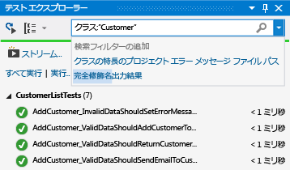

# <a name="run-unit-tests-with-test-explorer"></a>テスト エクスプローラーを使用して単体テストを実行する
テスト エクスプローラーを使用して、Visual Studio またはサードパーティの単体テスト プロジェクトから単体テストを実行し、テストをカテゴリにグループ化し、テスト リストをフィルター処理し、テストのプレイリストを作成、保存、および実行します。 テストをデバッグし、テストのパフォーマンスとコード カバレッジを分析することもできます。  
  
##  <a name="BKMK_Contents"></a> 目次  
 [単体テスト フレームワークとテスト プロジェクト](#BKMK_Unit_test_frameworks_and_test_projects)  
  
 [テスト エクスプローラーでテストを実行する](#BKMK_Run_tests_in_Test_Explorer)  
  
 [テスト結果を表示する](#BKMK_View_test_results)  
  
 [テスト リストをグループ化およびフィルター処理する](#BKMK_Group_and_filter_the_test_list)  
  
 [カスタム プレイリストを作成する](#BKMK_Create_custom_playlists)  
  
 [単体テストをデバッグおよび分析する](#BKMK_Debug_and_analyze_unit_tests)  
  
 [外部リソース](#BKMK_External_resources)  
  
##  <a name="BKMK_Unit_test_frameworks_and_test_projects"></a> 単体テスト フレームワークとテスト プロジェクト  
 Visual Studio には、マネージ コードおよびネイティブ コード用の Microsoft 単体テスト フレームワークが含まれます。 ただし、テスト エクスプローラーでは、テスト エクスプローラーのアダプターを実装した単体テスト フレームワークも実行できます。 サードパーティの単体テスト フレームワークのインストールの詳細については、「[サードパーティ製の単体テスト フレームワークをインストールする](../test/install-third-party-unit-test-frameworks.md)」を参照してください。  
  
 テスト エクスプローラーは、ソリューション内の複数のテスト プロジェクト、および運用コード プロジェクトに含まれるテスト クラスからテストを実行できます。 テスト プロジェクトは別の単体テスト フレームワークを使用できます。 テスト対象のコードを .NET Framework 用に記述する場合、対象コードの言語にかかわらず、.NET Framework も対象とする言語でテスト プロジェクトを記述できます。 ネイティブ C/C++ コード プロジェクトは、C++ の単体テスト フレームワークを使用してテストする必要があります。  
  
  [内容](#BKMK_Contents)  
  
##  <a name="BKMK_Run_tests_in_Test_Explorer"></a> テスト エクスプローラーでテストを実行する  
 [テストを実行する](#BKMK_Run_tests) **&#124;** [各ビルドの後にテストを実行する](#BKMK_Run_tests_after_every_build)  
  
 テスト プロジェクトをビルドすると、テストはテスト エクスプローラーに表示されます。 テスト エクスプローラーが表示されない場合は、Visual Studio メニューの **[テスト]** をクリックし、 **[Windows]**、 **[テスト エクスプローラー]**の順に選択します。  
  
   
  
 テストを実行して、記述し、再実行すると、テスト エクスプローラーに **[失敗したテスト]**、 **[成功したテスト]**、 **[スキップされたテスト]** 、および **[テストを実行しない]**の既定のグループの結果が表示されます。 テスト エクスプローラーでテストをグループ化する方法を変更できます。  
  
 テスト エクスプローラーのツール バーからテストの検索、整理、および実行の作業の多くを実行できます。  
  
   
  
  [内容](#BKMK_Contents)  
  
###  <a name="BKMK_Run_tests"></a> テストの実行  
 ソリューション内のすべてのテスト、グループ内のすべてのテスト、または選択した一連のテストを実行できます。 次のいずれかの操作を行います。  
  
-   ソリューション内のすべてのテストを実行するには、 **[すべて実行]**をクリックします。  
  
-   既定のグループ内のすべてのテストを実行するには、 **[実行]** をクリックし、メニューでグループを選択します。  
  
-   実行する個々のテストを選択し、選択したテストのコンテキスト メニューを開いて、 **[選択したテストの実行]**を選択します。  
  
-   個々のテストに実行順序を定める依存関係がない場合、ツール バーにある  トグル ボタンで並列テストの実行を有効にします。 これにより、すべてのテスト実行にかかる時間を著しく短縮できます。  
  
 テストの実行中、テスト エクスプローラー ウィンドウの一番上にある成功/失敗ステータス バーがアニメーション化されます。 テストの実行の終了時に、すべてのテストが成功した場合は、成功/失敗ステータス バーが緑色に変わり、いずれかのテストが失敗した場合は、赤色に変わります。  
  
  [内容](#BKMK_Contents)  
  
###  <a name="BKMK_Run_tests_after_every_build"></a> 各ビルドの後にテストを実行する  
  
> [!WARNING]
>  各ビルドの後の単体テスト実行は、Visual Studio Enterprise でサポートされます。  
  
|||  
|-|-|  
||各ローカル ビルドの後で単体テストを実行するには、標準のメニューの **[テスト]** を選択し、テスト エクスプローラーのツール バーの **[ビルド後にテストを実行]** を選択します。|  
  
  [内容](#BKMK_Contents)  
  
##  <a name="BKMK_View_test_results"></a> テスト結果を表示する  
 [テストの詳細を表示する](#BKMK_View_test_details) **&#124;** [テスト メソッドのソース コードを表示する](#BKMK_View_the_source_code_of_a_test_method)  
  
 テストを実行して、記述し、再実行すると、テスト エクスプローラーに **[失敗したテスト]**、 **[成功したテスト]**、 **[スキップされたテスト]** 、および **[テストを実行しない]**のグループの結果が表示されます。 テスト エクスプローラーの下部の詳細ペインに、テストの実行の概要が表示されます。  
  
###  <a name="BKMK_View_test_details"></a> テストの詳細を表示する  
 個々のテストの詳細を表示するには、そのテストを選択します。  
  
   
  
 テストの詳細ペインに次の情報が表示されます。  
  
-   テスト メソッドのソース ファイル名と行番号。  
  
-   テストの状態。  
  
-   テスト メソッドの実行に要した経過時間。  
  
 テストが失敗した場合、詳細ペインには次の情報も表示されます。  
  
-   テストの単体テスト フレームワークによって返されたメッセージ。  
  
-   テストが失敗した時刻のスタック トレース。  
  
  [内容](#BKMK_Contents)  
  
###  <a name="BKMK_View_the_source_code_of_a_test_method"></a> テスト メソッドのソース コードを表示する  
 Visual Studio エディターのテスト メソッドのソース コードを表示するには、テストを選択し、コンテキスト メニューの **[テストを開く]** を選択します (キーボードの F12 キー)。  
  
  [内容](#BKMK_Contents)  
  
##  <a name="BKMK_Group_and_filter_the_test_list"></a> テスト リストをグループ化およびフィルター処理する  
 [テスト リストをグループ化する](#BKMK_Grouping_the_test_list) **&#124;** [特徴でグループ化する](#BKMK_Group_by_traits) **&#124;** [テスト リストを検索およびフィルター処理する](#BKMK_Search_and_filter_the_test_list)  
  
 テスト エクスプローラーを使用すると、テストを定義済みのカテゴリにグループ化できます。 テスト エクスプローラーで実行されるほとんどの単体テスト フレームワークでは、独自のカテゴリおよびカテゴリ/値のペアを定義して、テストをグループ化することができます。 テストのプロパティに対して文字列を照合して、テストの一覧をフィルター処理することもできます。  
  
###  <a name="BKMK_Grouping_the_test_list"></a> テスト リストをグループ化する  
 テストの編成方法を変更するには、**[グループ化]** ボタン  の横の下向き矢印をクリックし、新しいグループ化の条件を選択します。  
  
   
  
### <a name="test-explorer-groups"></a>テスト エクスプローラーのグループ  
  
|グループ化|説明|  
|-----------|-----------------|  
|**期間**|実行時間によるテストのグループ化: **[高速]**、 **[通常]**、および **[低速]**。|  
|**Outcome**|実行結果によるテストのグループ化: **[失敗したテスト]**、 **[スキップされたテスト]**、 **[成功したテスト]**。|  
|**Traits**|ユーザーが定義するカテゴリ/値のペアによるテストのグループ化。 特徴のカテゴリと値を指定する構文は、単体テスト フレームワークによって定義されます。|  
|**プロジェクト**|プロジェクトの名前によるテストのグループ化。|  
  
  [内容](#BKMK_Contents)  
  
###  <a name="BKMK_Group_by_traits"></a> 特徴でグループ化する  
 通常、特徴はカテゴリ名/値のペアですが、1 つのカテゴリにすることもできます。 特徴は、単体テスト フレームワークによってテスト メソッドとして識別されるメソッドに割り当てることができます。 単体テスト フレームワークは、特徴のカテゴリを定義できます。 特徴のカテゴリに値を追加して、独自のカテゴリ名/値のペアを定義できます。 特徴のカテゴリと値を指定する構文は、単体テスト フレームワークによって定義されます。  
  
 **マネージ コード用の Microsoft 単体テスト フレームワークでの特徴の定義**  
  
 マネージ アプリケーション用の Microsoft 単体テスト フレームワークで、<xref:Microsoft.VisualStudio.TestTools.UnitTesting.TestPropertyAttribute> 属性の特徴の名前/値のペアを定義します。 テスト フレームワークには、次の定義済みの特徴も含まれています。  
  
|特徴|説明|  
|-----------|-----------------|  
|<xref:Microsoft.VisualStudio.TestTools.UnitTesting.OwnerAttribute>|所有者カテゴリは、単体テスト フレームワークによって定義されます。所有者の文字列値を指定する必要があります。|  
|<xref:Microsoft.VisualStudio.TestTools.UnitTesting.PriorityAttribute>|優先度カテゴリは、単体テスト フレームワークによって定義されます。優先度の整数値を指定する必要があります。|  
|<xref:Microsoft.VisualStudio.TestTools.UnitTesting.TestCategoryAttribute>|TestCategory 属性を使用すると、値なしでカテゴリを指定できます。 TestCategory 属性で定義されるカテゴリは、TestProperty 属性のカテゴリでもあります。|  
|<xref:Microsoft.VisualStudio.TestTools.UnitTesting.TestPropertyAttribute>|TestProperty 属性を使用すると、特徴のカテゴリ/値のペアを定義できます。|  
  
 **C++ 用の Microsoft 単体テスト フレームワークでの特徴の定義**  
  
 特徴を定義するには、 `TEST_METHOD_ATTRIBUTE` マクロを使用します。 たとえば、特徴 `TEST_MY_TRAIT`を定義するには、次のように記述します。  
  
```cpp  
#define TEST_MY_TRAIT(traitValue) TEST_METHOD_ATTRIBUTE(L"MyTrait", traitValue)  
```  
  
 定義された特徴を単体テストで使用するには、次のように記述します。  
  
```  
BEGIN_TEST_METHOD_ATTRIBUTE(Method1)  
    TEST_OWNER(L"OwnerName")  
    TEST_PRIORITY(1)  
    TEST_MY_TRAIT(L"thisTraitValue")  
END_TEST_METHOD_ATTRIBUTE()  
  
TEST_METHOD(Method1)  
{     
    Logger::WriteMessage("In Method1");  
    Assert::AreEqual(0, 0);  
}  
```  
  
### <a name="c-trait-attribute-macros"></a>C++ の特徴の属性マクロ  
  
|マクロ|説明|  
|-----------|-----------------|  
|`TEST_METHOD_ATTRIBUTE(attributeName, attributeValue)`|TEST_METHOD_ATTRIBUTE マクロを使用して、特徴を定義します。|  
|`TEST_OWNER(ownerAlias)`|定義済みの所有者の特徴を使用して、テスト メソッドの所有者を指定します。|  
|`TEST_PRIORITY(priority)`|定義済みの優先度の特徴を使用して、テスト メソッドに相対的な優先度を割り当てます。|  
  
  [内容](#BKMK_Contents)  
  
###  <a name="BKMK_Search_and_filter_the_test_list"></a> テスト リストを検索およびフィルター処理する  
 テスト エクスプローラーのフィルターを使用して、表示および実行するプロジェクトのテスト メソッドを制限できます。  
  
 テスト エクスプローラーの検索ボックスに文字列を入力して Enter キーを押すと、完全修飾名にその文字列が含まれるテストだけを表示するようにテスト リストがフィルター処理されます。  
  
 異なる条件でフィルター処理するには  
  
1.  検索ボックスの右にあるドロップダウン リストを開きます。  
  
2.  新しい条件を選択します。  
  
3.  引用符の間にフィルターの値を入力します。  
  
   
  
> [!NOTE]
>  検索では大文字と小文字を区別せず、指定された文字列が条件の値の一部と一致するかどうかを照合します。  
  
|修飾子|説明|  
|---------------|-----------------|  
|**特徴**|特徴のカテゴリと値の両方から一致を検索します。 特徴のカテゴリと値を指定する構文は、単体テスト フレームワークによって定義されます。|  
|**プロジェクト**|テスト プロジェクト名から一致を検索します。|  
|**エラー メッセージ**|失敗したアサートが返すユーザー定義エラー メッセージから一致を検索します。|  
|**ファイル パス**|テストのソース ファイルの完全修飾ファイル名から一致を検索します。|  
|**Fully Qualified Name**|テストの名前空間、クラス、およびメソッドの完全修飾ファイル名から一致を検索します。|  
|**出力**|標準出力 (stdout) または標準エラー (stderr) に書き込まれるユーザー定義のエラー メッセージを検索します。 出力メッセージを指定する構文は、単体テスト フレームワークによって定義されます。|  
|**Outcome**|テスト エクスプローラーのカテゴリ名から一致を検索します: **[失敗したテスト]**、 **[スキップされたテスト]**、 **[成功したテスト]**。|  
  
 フィルター処理結果のサブセットを除外するには、次の構文を使用します。  
  
```  
FilterName:"Criteria" -FilterName:"SubsetCriteria"  
```  
  
 次に例を示します。  
  
```  
FullName:"MyClass" - FullName:"PerfTest"  
```  
  
 名前に "PerfTest" も含むテストを除いて、名前に "MyClass" を含むすべてのテストを返します。  
  
  [内容](#BKMK_Contents)  
  
##  <a name="BKMK_Create_custom_playlists"></a> カスタム プレイリストを作成する  
 グループとして実行または表示するテストのリストを作成して保存できます。 プレイリストを選択すると、リスト内のテストがテスト エクスプローラーに表示されます。 テストを複数のプレイリストに追加することができ、既定の **[すべてのテスト]** プレイリストを選択すると、プロジェクトのすべてのテストを使用できます。  
  
   
  
 **プレイリストを作成するには**、テスト エクスプローラーで 1 つ以上のテストを選択します。 コンテキスト メニューで、 **[プレイリストに追加]**、 **[新しいプレイリスト]**を選択します。 **[新しいプレイリストの作成]** ダイアログ ボックスで指定した場所と名前で、ファイルを保存します。  
  
 **プレイリストにテストを追加するには**、テスト エクスプローラーで 1 つ以上のテストを選択します。 コンテキスト メニューで、 **[プレイリストに追加]**をクリックし、テストを追加するプレイリストを選択します。  
  
 **プレイリストを開くには**、Visual Studio メニューから [テスト]、[プレイリスト] を選択し、最近使用されたプレイリストのリストから選択するか、[プレイリストを開く] を選択してプレイリストの名前と場所を指定します。  
  
 個々のテストに実行順序を定める依存関係がない場合、ツール バーにある  トグル ボタンで並列テストの実行を有効にします。 これにより、すべてのテスト実行にかかる時間を著しく短縮できます。  
  
  [内容](#BKMK_Contents)  
  
##  <a name="BKMK_Debug_and_analyze_unit_tests"></a> 単体テストをデバッグおよび分析する  
 [単体テストをデバッグする](#BKMK_Debug_unit_tests) **&#124;** [テスト メソッドのパフォーマンスの問題を診断する](#BKMK_Diagnose_test_method_performance_issues) **&#124;** [単体テストのコード カバレッジを分析する](#BKMK_Analyzeunit_test_code_coverage)  
  
###  <a name="BKMK_Debug_unit_tests"></a> 単体テストをデバッグする  
 テスト エクスプローラーを使用して、テストのデバッグ セッションを開始できます。 Visual Studio デバッガーを使用してコードをシームレスにステップ実行すると、テスト対象のプロジェクトと単体テストの間を切り替えることができます。 デバッグを開始するには:  
  
1.  Visual Studio エディターで、デバッグする 1 つ以上のテスト メソッドにブレークポイントを設定します。  
  
    > [!NOTE]
    >  テスト メソッドを任意の順序で実行できるため、デバッグするすべてのテスト メソッドにブレークポイントを設定します。  
  
2.  テスト エクスプローラーでテスト メソッドを選択し、コンテキスト メニューの **[選択したテストのデバッグ]** を選択します。  
  
 デバッガーの詳細については、「[Visual Studio でのデバッグ](../debugger/debugging-in-visual-studio.md)」を参照してください。  
  
  [内容](#BKMK_Contents)  
  
###  <a name="BKMK_Diagnose_test_method_performance_issues"></a> テスト メソッドのパフォーマンスの問題を診断する  
 テスト メソッドに時間がかかる原因を診断するには、エクスプローラーでメソッドを選択し、コンテキスト メニューの [プロファイル] を選択します。 「[パフォーマンス エクスプローラー](../profiling/performance-explorer.md)」を参照してください。  
  
###  <a name="BKMK_Analyzeunit_test_code_coverage"></a> 単体テストのコード カバレッジを分析する  
  
> [!NOTE]
>  単体テストのコード カバレッジは、Visual Studio Enterprise でのみ使用できます。  
  
 Visual Studio のコード カバレッジ ツールを使用して、単体テストで実際にテスト中の製品コードの量を確認できます。 選択したテストまたはソリューションのすべてのテストのコード カバレッジを実行できます。  
  
 ソリューションのテスト メソッドのコード カバレッジを実行するには:  
  
1.  Visual Studio メニューの **[テスト]** を選択し、 **[コード カバレッジの分析]**を選択します。  
  
2.  サブメニューから次のいずれかのコマンドを選択します。  
  
    -   **[選択されたテスト]** : テスト エクスプローラーで選択したテスト メソッドを実行します。  
  
    -   **[All tests (すべてのテスト)]** : ソリューション内のすべてのテスト メソッドを実行します。  
  
 [コード カバレッジの結果] ウィンドウに、行、関数、クラス、名前空間、およびモジュールで実行された製品コードのブロックのパーセンテージが表示されます。  
  
 詳細については、「[コード カバレッジを使用した、テストされるプロジェクトのコード割合の確認](../test/using-code-coverage-to-determine-how-much-code-is-being-tested.md)」を参照してください。  
  
  [内容](#BKMK_Contents)  
  
##  <a name="BKMK_External_resources"></a> 外部リソース  
  
###  <a name="BKMK_Guidance"></a> ガイダンス  
 [Visual Studio 2012 を使用した継続的配信のためのテスト - 第 2 章: 単体テスト: 内部のテスト](http://go.microsoft.com/fwlink/?LinkID=255188)  
  
## <a name="see-also"></a>関連項目  
 [コードの単体テスト](../test/unit-test-your-code.md)   
 [64 ビット プロセスとして単体テストを実行する](../test/run-a-unit-test-as-a-64-bit-process.md)

