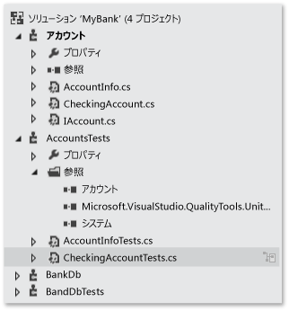
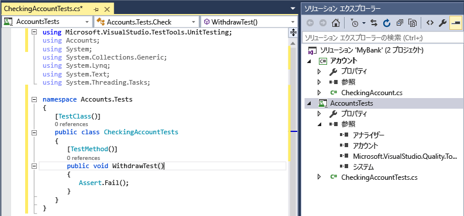

# <a name="unit-test-basics"></a>単体テストの基本

コードが予想どおりに動作することを確認するには、単体テストを作成して実行します。 単体テストと呼ばれる理由は、プログラムの機能を、個々の *単体*としてテストできる独立したテスト可能な動作に分解するためです。 Visual Studio テスト エクスプローラーには、Visual Studio で単体テストを実行して結果を表示するための柔軟で効率的な方法が用意されています。 Visual Studio と共に、マネージド コードおよびネイティブ コード用の Microsoft 単体テスト フレームワークがインストールされます。 *単体テスト フレームワーク* を使用して、単体テストを作成して実行し、テストの結果を報告します。 変更を加えたときは単体テストを再実行し、コードが正しく機能するかテストします。 Visual Studio Enterprise では、[Live Unit Testing](live-unit-testing-intro.md) でこれを自動化できます。この機能は、コード変更で影響のあったテストを検出し、ユーザーが入力している間にバックグラウンドで実行します。

単体テストは、ソフトウェア開発ワークフローの構成要素になったときに、コードの品質に最大の効果をもたらします。 関数またはその他のアプリケーション コードを記述したらすぐに、標準的な入力データ、境界上のデータ、および正しくないデータに対するコードの動作を検証し、コードによる明示的または暗黙的な前提を確認する単体テストを作成してください。 *テスト駆動開発*では、コードを記述する前に単体テストを作成することで、設計ドキュメントと機能仕様の両方として単体テストを使用します。

コードから簡単にテスト プロジェクトとテスト メソッドを生成したり、必要に応じて手動でテストを作成したりできます。 IntelliTest を使用して .NET コードを精査する際は、テスト データと単体テストのスイートを生成できます。 コードにある各ステートメントについて、そのステートメントを実行するテスト入力が生成されます。 [コードの単体テストを生成する](generate-unit-tests-for-your-code-with-intellitest.md)方法をご覧ください。

テスト エクスプローラーは、テスト エクスプローラーのアドオン インターフェイスを実装した、サードパーティ製やオープン ソースの単体テスト フレームワークも実行できます。 Visual Studio 拡張機能マネージャーおよび Visual Studio ギャラリーを使用して、これらのフレームワークの多くを追加できます。 「[サードパーティ製の単体テスト フレームワークをインストールする](../test/install-third-party-unit-test-frameworks.md)」を参照してください。

## <a name="get-started"></a>作業開始

コーディングに直接関係する単体テストの概要については、次のいずれかのトピックを参照してください。

- [チュートリアル: マネージド コードの単体テストを作成し、実行する](../test/walkthrough-creating-and-running-unit-tests-for-managed-code.md)

- [クイック スタート: テスト エクスプローラーによるテスト駆動開発](../test/quick-start-test-driven-development-with-test-explorer.md)

- [Visual Studio で C/C++ 用の単体テストを作成する](../test/writing-unit-tests-for-c-cpp.md)

## <a name="the-mybank-solution-example"></a>MyBank ソリューションの例

このトピックでは、例として `MyBank` という架空のアプリケーションの開発を使用します。 このトピックの説明は、実際のコードがなくても理解できます。 テスト メソッドは C# で記述されており、マネージド コード用の Microsoft 単体テスト フレームワークを使用して提供されます。 ただし、その概念は他の言語やフレームワークに簡単に移行することができます。



`MyBank` アプリケーションのデザイン時の最初の計画には、個々のアカウントおよびアカウントの銀行との取引を表すアカウント コンポーネントと、個々のアカウントを集計および管理する機能を表すデータベース コンポーネントが含まれます。

次の 2 つのプロジェクトを含む `MyBank` ソリューションを作成します。

- `Accounts`

- `BankDb`

`Accounts` プロジェクトのデザイン時の最初の計画には、アカウントに関する基本情報を保持するクラス、アカウントでの資産の預け入れや引き出しなど、任意の種類のアカウントの共通機能を指定するインターフェイス、および当座預金アカウントを表すインターフェイスから派生したクラスが含まれます。 次のソース ファイルを作成して、Accounts プロジェクトを開始します。

- *AccountInfo.cs* は、アカウントの基本情報を定義します。

- *IAccount.cs* は、アカウントで資産の預け入れや引き出しを行うメソッドや、アカウントの残高を取得するメソッドを含む、アカウントの標準の `IAccount` インターフェイスを定義します。

- *CheckingAccount.cs* には、当座預金アカウントの `IAccount` インターフェイスを実装する `CheckingAccount` クラスが含まれています。

当座預金アカウントからの引き出しの際は、引き出される金額がアカウントの残高より少ないことを確認する必要があります。 そのため、この条件をチェックするメソッドで、 `IAccount.Withdraw` の `CheckingAccount` メソッドをオーバーライドします。 メソッドは次のようになります。

```csharp
public void Withdraw(double amount)
{
    if(m_balance >= amount)
    {
        m_balance -= amount;
    }
    else
    {
        throw new ArgumentException(amount, "Withdrawal exceeds balance!")
    }
}
```

少しコードがあるので、テストしましょう。

## <a name="create-unit-test-projects-and-test-methods"></a>単体テスト プロジェクトとテスト メソッドを作成する

ほとんどの場合、コードから単体テスト プロジェクトと単体テスト スタブを生成する方が手軽です。 また、必要に応じて単体テスト プロジェクトとテストを手動で作成することもできます。

### <a name="generate-unit-test-project-and-unit-test-stubs"></a>単体テスト プロジェクトと単体テスト スタブを生成する

1. コード エディター ウィンドウで、右クリックしてコンテキスト メニューから **[単体テストの作成]** を選択します。

    

2. **[OK]** をクリックして、既定値をそのまま使用して単体テストを作成するか、単体テスト プロジェクトと単体テストの作成と名前付けに使用される値を変更します。 単体テスト メソッドに既定で追加されるコードを選択することができます。

    ![エディター内を右クリックし、[単体テストの作成] を選択](../test/media/createunittestsdialog.png)

3. 新しい単体テスト プロジェクトでは、クラス内のすべてのメソッドに単体テスト スタブが作成されます。

    

4. ここで、先に進み、単体テストを有意義なものにするための [コードを単体テスト メソッドに追加する](#write-your-tests) 方法と、コードを徹底的にテストするために追加する追加の単体テストについて確認します。

### <a name="create-the-unit-test-project-and-unit-tests-manually"></a>単体テスト プロジェクトと単体テストを手動で作成する

通常、単体テスト プロジェクトは 1 つのコード プロジェクトの構造を反映します。 MyBank の例で、2 つの単体テスト プロジェクト `AccountsTests` および `BankDbTests` を `MyBanks` ソリューションに追加します。 テスト プロジェクトの名前は任意ですが、標準の名前付け規則を採用することをお勧めします。

**単体テスト プロジェクトをソリューションに追加するには**

1. **[ファイル]** メニューの **[新規作成]** をクリックし、**[プロジェクト]** をクリックします (キーボード: **Ctrl** + **Shift** + **N**)。

2. **[新しいプロジェクト]** ダイアログ ボックスで、**[インストール済み]** ノードを展開して、テスト プロジェクトで使用する言語を選択し、**[テスト]** をクリックします。

3. Microsoft 単体テスト フレームワークの 1 つを使用するには、プロジェクト テンプレートの一覧から **[単体テスト プロジェクト]** を選択します。 それ以外の場合は、使用する単体テスト フレームワークのプロジェクト テンプレートを選択します。 この例の `Accounts` プロジェクトをテストするために、プロジェクトの名前を `AccountsTests`に設定します。

   > [!WARNING]
   > すべてのサードパーティ製およびオープン ソースの単体テスト フレームワークに、Visual Studio プロジェクトのテンプレートが用意されているわけではありません。 プロジェクトの作成については、フレームワークのドキュメントを参照してください。

4. この例の単体テスト プロジェクトで、テスト対象のコード プロジェクトへの参照を Accounts プロジェクトに追加します。

   コード プロジェクトへの参照を作成する方法は次のとおりです。

   1.  **ソリューション エクスプローラー**でプロジェクトを選択します。

   2.  **[プロジェクト]** メニューの **[参照の追加]** をクリックします。

   3.  **[参照マネージャー]** ダイアログ ボックスで、**[ソリューション]** ノードを開き、**[プロジェクト]** を選択します。 コード プロジェクトの名前を選択し、ダイアログ ボックスを閉じます。

各単体テスト プロジェクトには、コード プロジェクト内のクラス名を反映したクラスが含まれています。 この例では、 `AccountsTests` プロジェクトに次のクラスが含まれています。

-   `AccountInfoTests` クラスには、 `AccountInfo` プロジェクトの `Accounts` クラス用の単体テスト メソッドが含まれています。

-   `CheckingAccountTests` クラスには、`CheckingAccount` クラス用の単体テスト メソッドが含まれています。

## <a name="write-your-tests"></a>テストを作成する

使用する単体テスト フレームワークと Visual Studio IntelliSense に従って、コード プロジェクトの単体テスト用コードを記述していきます。 ほとんどのフレームワークでは、**テスト エクスプローラー**で実行するには、単体テスト メソッドを識別する特定の属性を追加する必要があります。 フレームワークには、テスト メソッドが成功したか失敗したかを示す手段も用意されています。通常は、Assert ステートメントまたはメソッドの属性を使用します。 他の属性は、各テスト メソッドの前でクラスの初期化時に実行される省略可能な設定メソッド、および各テスト メソッドの後でクラスが破棄される前に実行される終了処理メソッドを識別します。

AAA (Arrange、Act、Assert) のパターンが、テスト対象のメソッドの単体テストを記述する一般的な方法です。

- 単体テスト メソッドの **Arrange** セクションでは、オブジェクトを初期化し、テスト対象のメソッドに渡されるデータの値を設定します。

- **Act** セクションでは、設定されたパラメーターでテスト対象のメソッドを呼び出します。

- **Assert** セクションでは、テスト対象のメソッドの操作が予測どおりに動作することを検証します。

この例の `CheckingAccount.Withdraw` メソッドをテストするために、2 つのテストを記述できます。メソッドの標準動作を検証するテストと、残高を超える引き出しが失敗することを検証するテストです。 `CheckingAccountTests` クラスで、次のメソッドを追加します。

```csharp
[TestMethod]
public void Withdraw_ValidAmount_ChangesBalance()
{
    // arrange
    double currentBalance = 10.0;
    double withdrawal = 1.0;
    double expected = 9.0;
    var account = new CheckingAccount("JohnDoe", currentBalance);
    // act
    account.Withdraw(withdrawal);
    double actual = account.Balance;
    // assert
    Assert.AreEqual(expected, actual);
}

[TestMethod]
[ExpectedException(typeof(ArgumentException))]
public void Withdraw_AmountMoreThanBalance_Throws()
{
    // arrange
    var account = new CheckingAccount("John Doe", 10.0);
    // act
    account.Withdraw(20.0);
    // assert is handled by the ExpectedException
}
```

`Withdraw_ValidAmount_ChangesBalance` は明示的な `Assert` ステートメントを使用してテスト メソッドの成功/失敗を判定し、 `Withdraw_AmountMoreThanBalance_Throws` は `ExpectedException` 属性を使用してテスト メソッドの成功を判定していることに注意してください。 表には出ませんが、単体テスト フレームワークは try/catch ステートメントでテスト メソッドをラップしています。 ほとんどの場合、例外がキャッチされると、テスト メソッドは失敗し、例外は無視されます。 指定された例外がスローされた場合、 `ExpectedException` 属性によってテスト メソッドは成功します。

Microsoft 単体テスト フレームワークの詳細については、次のトピックのいずれかを参照してください。

-   [コードの単体テスト](unit-test-your-code.md)

-   [C/C++ 用の単体テストの記述](writing-unit-tests-for-c-cpp.md)

-   [単体テストでの MSTest フレームワークの使用](using-microsoft-visualstudio-testtools-unittesting-members-in-unit-tests.md)

## <a name="set-timeouts-for-unit-tests"></a>単体テストのタイムアウトを設定する

個々のテスト メソッドで、タイムアウトを設定するには

```csharp
[TestMethod]
[Timeout(2000)]  // Milliseconds
public void My_Test()
{ ...
}
```

許容される最大のタイムアウトを設定するには

```csharp
[TestMethod]
[Timeout(TestTimeout.Infinite)]  // Milliseconds
public void My_Test ()
{ ...
}
```

## <a name="run-tests-in-test-explorer"></a>テスト エクスプローラーでテストを実行する

テスト プロジェクトをビルドすると、テストは**テスト エクスプローラー**に表示されます。 **テスト エクスプローラー**が表示されない場合は、Visual Studio メニューの **[テスト]** をクリックし、**[Windows]**、**[テスト エクスプローラー]** の順に選択します。


テストを実行して、記述し、再実行すると、テスト **エクスプローラー**の既定のビューに **[失敗したテスト]**、**[成功したテスト]**、**[スキップされたテスト]**、および **[テストを実行しない]** グループの結果が表示されます。 グループの見出しを選択して、そのグループ内のすべてのテストを表示するビューを開くことができます。

グローバル レベルで検索ボックスでテキストを照合して、または定義済みのフィルターの 1 つを選択して、任意のビューでテストにフィルターを適用することもできます。 任意に選択したテストをいつでも実行できます。 テスト実行の結果は、エクスプローラー ウィンドウの上部にある成功/失敗ステータス バーですぐにわかります。 テストを選択すると、そのテスト メソッドの結果の詳細が表示されます。

### <a name="run-and-view-tests"></a>テストを実行して表示する

**テスト エクスプローラー**のツール バーは、対象にするテストを検出、編成、実行するのに役立ちます。


**[すべて実行]** を選択してテストをすべて実行することも、 **[実行]** を選択してテストのサブセットを実行することもできます。 一連のテストを実行した後、テスト実行の概要が**テスト エクスプローラー** ウィンドウの下部に表示されます。 テストを選択すると、そのテストの詳細が下部のペインに表示されます。 コンテキスト メニューから **[テストを開く]** を選び (キーボード: **F12** キー)、選択したテストのソース コードを表示します。

個々のテストに実行順序を定める依存関係がない場合、ツール バーにある  トグル ボタンで並列テストの実行を有効にします。 これにより、すべてのテスト実行にかかる時間を著しく短縮できます。

### <a name="run-tests-after-every-build"></a>各ビルドの後にテストを実行する

> [!WARNING]
> 各ビルドの後の単体テスト実行は、Visual Studio Enterprise でのみサポートされます。

|ボタン|説明|
|-|-|
||各ローカル ビルドの後で単体テストを実行するには、標準のメニューの **[テスト]** を選択し、**テスト エクスプローラー**のツール バーの **[ビルド後にテストを実行]** を選択します。|

### <a name="filter-and-group-the-test-list"></a>テスト リストのフィルター処理とグループ化を実行する

多数のテストがある場合は、**テスト エクスプローラー**の検索ボックスに入力し、指定した文字列によって一覧をフィルター処理できます。 フィルターの一覧から選択することで、フィルター イベントをさらに制限できます。


|ボタン|説明|
|-|-|
||カテゴリ別にテストをグループ化するには、 **[グループ化]** をクリックします。|

詳細については、「[テスト エクスプローラーを使用して単体テストを実行する](../test/run-unit-tests-with-test-explorer.md)」を参照してください。

## <a name="qa"></a>Q&A

**Q: 単体テストのデバッグ方法を教えてください。**

**A:** **テスト エクスプローラー**を使用して、自分のテストに対するデバッグ セッションを開始します。 Visual Studio デバッガーを使用してコードをシームレスにステップ実行すると、テスト対象のプロジェクトと単体テストの間を切り替えることができます。 デバッグを開始するには:

1.  Visual Studio エディターで、デバッグする 1 つ以上のテスト メソッドにブレークポイントを設定します。

    > [!NOTE]
    > テスト メソッドを任意の順序で実行できるため、デバッグするすべてのテスト メソッドにブレークポイントを設定します。

2.  **テスト エクスプローラー**でテスト メソッドを選択し、ショートカット メニューから **[選択したテストのデバッグ]** を選択します。

[単体テストのデバッグ](../debugger/debugging-in-visual-studio.md)の詳細を確認してください。

**Q: TDD を使用している場合に、テストからコードを生成する方法を教えてください。**

**A:** IntelliSense を使用して、プロジェクト コードにクラスとメソッドを生成します。 テスト メソッドに、生成するクラスまたはメソッドを呼び出すステートメントを記述し、その呼び出しの下で IntelliSense メニューを開きます。 新しいクラスのコンストラクターへの呼び出しの場合は、メニューから **[新しい型の生成]** を選択し、ウィザードに従ってコード プロジェクトにクラスを挿入します。 メソッドへの呼び出しの場合は、IntelliSense メニューから **[Generate new method (新しいメソッドの生成)]** を選択します。

![[メソッド スタブの生成] の IntelliSense メニュー](../test/media/ute_generatemethodstubintellisense.png)

**Q: テストを実行する入力値として複数のデータ セットを取得する単体テストを作成できますか。**

**A:** はい。 *データ ドリブン テスト メソッド* を使用すると、1 つの単体テスト メソッドである範囲の値をテストすることができます。 テストする変数の値が格納されているデータ ソースとデータ テーブルを指定する、テスト メソッドの `DataSource` 属性を使用します。  メソッドの本体で、 `TestContext.DataRow[`*ColumnName*`]` インデクサーを使用して変数に行の値を割り当てます。

> [!NOTE]
> ここに示すプロシージャは、マネージド コード用の Microsoft 単体テスト フレームワークを使用して記述したテスト メソッドにのみ適用できます。 別のフレームワークを使用している場合は、同等の機能についてフレームワークのドキュメントを参照してください。

たとえば、 `CheckingAccount` という名前の `AddIntegerHelper`クラスに不要なメソッドを追加するとします。 `AddIntegerHelper` は 2 つの整数を追加します。

`AddIntegerHelper` メソッドのデータ ドリブン テストを作成するには、最初に *AccountsTest.accdb* という名前の Access データベースと `AddIntegerHelperData` という名前のテーブルを作成します。 `AddIntegerHelperData` テーブルは、追加の 1 番目と 2 番目のオペランドを指定する列、および予期される結果を指定する列を定義します。 多数の行に適切な値を入力します。

```csharp
[DataSource(
    @"Provider=Microsoft.ACE.OLEDB.12.0;Data Source=C:\Projects\MyBank\TestData\AccountsTest.accdb",
    "AddIntegerHelperData"
)]
[TestMethod()]
public void AddIntegerHelper_DataDrivenValues_AllShouldPass()
{
    var target = new CheckingAccount();
    int x = Convert.ToInt32(TestContext.DataRow["FirstNumber"]);
    int y = Convert.ToInt32(TestContext.DataRow["SecondNumber"]);
    int expected = Convert.ToInt32(TestContext.DataRow["Sum"]);
    int actual = target.AddIntegerHelper(x, y);
    Assert.AreEqual(expected, actual);
}
```

属性付きメソッドは、テーブル内の各行に対して 1 回実行されます。 イテレーションが失敗した場合、**テスト エクスプローラー**がメソッドのテスト失敗を報告します。 メソッドのテスト結果の詳細ペインに、データの行ごとにメソッドの成功/失敗の状態が表示されます。

[データ ドリブン単体テスト](../test/how-to-create-a-data-driven-unit-test.md)の詳細を確認してください。

**Q: 単体テストでテストするコードの量を確認できますか。**

**A:** はい。 Visual Studio のコード カバレッジ ツールを使用して、単体テストで実際にテスト中のコードの量を確認できます。 単体テスト フレームワークによって実行できるネイティブ言語とマネージド言語、およびすべての単体テスト フレームワークがサポートされています。

選択したテストまたはソリューションのすべてのテストのコード カバレッジを実行できます。 **[コード カバレッジの結果]** ウィンドウに、行、関数、クラス、名前空間、およびモジュールで実行された製品コードのブロックのパーセンテージが表示されます。

ソリューション内のテスト メソッドのコード カバレッジを実行するには、Visual Studio のメニューで、 **[テスト]** 、 **[コード カバレッジの分析]** の順に選択します。

カバレッジの結果は、**[コード カバレッジの結果]** ウィンドウに表示されます。


[コード カバレッジ](../test/using-code-coverage-to-determine-how-much-code-is-being-tested.md) の詳細を確認してください。

**Q: 外部依存関係を含むコード内のメソッドをテストすることはできますか。**

**A:** はい。 Visual Studio Enterprise を使用している場合は、Microsoft Fakes は、マネージド コード用の単体テスト フレームワークを使用して記述したテスト メソッドで使用できます。

Microsoft Fakes は、次の 2 つの方法で外部依存関係の代替クラスを作成します。

1.  *スタブ* は、対象の依存関係クラスの親インターフェイスから派生した代替クラスを生成します。 スタブ メソッドは、対象クラスのパブリック仮想メソッドの代わりに使用できます。

2.  *Shim* は、ランタイム インストルメンテーションを使用して、対象メソッドへの呼び出しを仮想でないメソッドの代替 shim メソッドに転換します。

いずれの方法でも、依存関係メソッドへの呼び出しの生成されたデリゲートを使用して、テスト メソッド内の動作を指定します。

詳細については、「 [Microsoft Fakes で単体テスト メソッドを分離する](../test/isolating-code-under-test-with-microsoft-fakes.md)」を参照してください。

**Q: 他の単体テスト フレームワークを使用して単体テストを作成することはできますか。**

**A:** はい。以下の手順に従って、[他のフレームワークを検索してインストール](../test/install-third-party-unit-test-frameworks.md)してください。 Visual Studio を再起動した後、単体テストを作成するためのソリューションをもう一度開き、インストールしたフレームワークを選びます。


選んだフレームワークを使用して、単体テスト スタブが作成されます。