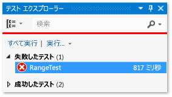

# <a name="unit-testing-visual-c-code-in-a-store-app"></a>ストア アプリの Visual C# コードの単体テスト
このトピックでは、Windows ストア アプリの Visual C# クラスの単体テストを作成する方法の 1 つについて説明します。 Rooter クラスは、指定した数値の平方根の概数を計算する関数を実装することによって、微積分の限界理論の不明瞭なメモリを示します。 Maths アプリケーションではこの関数を使用して、数学で実行できる楽しいことをユーザーに示すことができます。  
  
 このトピックでは、開発の第一歩として単体テストを使用する方法を示します。 この方法ではまず、テスト対象のシステムの特定の動作を検証するテスト メソッドを作成し、テストに合格するコードを記述します。 後述する手順の順序を変更することにより、この方法を逆にして、テストするコードを最初に記述し、単体テストを作成することができます。  
  
 このトピックでは、テストする単体テストと DLL に 1 つの Visual Studio ソリューションと個別のプロジェクトも作成します。 また、DLL プロジェクトに単体テストを直接含めることも、単体テストと DLL ごとに個別のソリューションを作成することもできます。  
  
> [!NOTE]
>  Visual Studio Community、Enterprise、 および Professional には、単体テストの追加機能が備わっています。  
>   
>  -   Microsoft テスト エクスプローラーのアドオン アダプターを作成したサードパーティおよびオープン ソースの単体テスト フレームワークを使用します。 また、テストのコード カバレッジ情報を分析して表示することもできます。  
> -   ビルドの後に毎回テストを実行します。  
> -   VS Enterprise には Microsoft Fakes も含まれています。これは、システムおよびサードパーティの機能をテスト コードに置き換えることにより、自分のコードにテストの重点を置くことができる、マネージ コードの分離フレームワークです。  
>   
>  詳細については、MSDN ライブラリの「[単体テストを使用したコードの検証](http://msdn.microsoft.com/library/dd264975.aspx)」を参照してください。  
  
##  <a name="BKMK_In_this_topic"></a> このトピックの内容  
 [ソリューションと単体テスト プロジェクトを作成する](#BKMK_Create_the_solution_and_the_unit_test_project)  
  
 [テストがテスト エクスプ ローラーで実行されることを確認する](#BKMK_Verify_that_the_tests_run_in_Test_Explorer)  
  
 [Maths プロジェクトに Rooter クラスを追加します。](#BKMK_Add_the_Rooter_class_to_the_Maths_project)  
  
 [アプリケーション プロジェクトにテスト プロジェクトを結合する](#BKMK_Couple_the_test_project_to_the_app_project)  
  
 [テストを繰り返し増やして成功させる](#BKMK_Iteratively_augment_the_tests_and_make_them_pass)  
  
 [失敗したテストをデバッグする](#BKMK_Debug_a_failing_test)  
  
 [コードをリファクタリングする](#BKMK_Refactor_the_code_)  
  
##  <a name="BKMK_Create_the_solution_and_the_unit_test_project"></a> ソリューションと単体テスト プロジェクトを作成する  
  
1.  **[ファイル]** メニューの **[新規作成]** をポイントし、**[新しいプロジェクト]** をクリックします。  
  
2.  **[新しいプロジェクト]** ダイアログ ボックスで **[インストール済み]**、**[Visual C#]** の順に展開し、**[Windows ストア]** をクリックします。 プロジェクト テンプレートの一覧の **[新しいアプリケーション]** をクリックします。  
  
3.  プロジェクトに「`Maths`」という名前を付け、**[ソリューションのディレクトリを作成]** チェックボックスがオンになっていることを確認します。  
  
4.  ソリューション エクスプローラーでソリューション名をクリックし、ショートカット メニューの **[追加]** をクリックし、**[新しい項目]** をクリックします。  
  
5.  **[新しいプロジェクト]** ダイアログ ボックスで **[インストール済み]**、**[Visual C#]** の順に展開し、**[Windows ストア]** をクリックします。 プロジェクト テンプレートの一覧の **[単体テスト ライブラリ (Windows ストア アプリ)]** をクリックします。  
  
       
  
6.  Visual Studio エディターで UnitTest1.cs を開きます。  
  
    ```csharp  
  
    using System;  
    using System.Collections.Generic;  
    using System.Linq;  
    using System.Text;  
    using Microsoft.VisualStudio.TestPlatform.UnitTestFramework;  
    using Maths;  
  
    namespace RooterTests  
    {  
        [TestClass]  
        public class UnitTest1  
  
            [TestMethod]  
            public void TestMethod1()  
            {  
  
            }  
  
    ```  
  
     次の点に注意してください。  
  
    1.  各テストは `[TestMethod]` を使用して定義されます。 テスト メソッドは void を返す必要があり、パラメーターをとることはできません。  
  
    2.  テスト メソッドは `[TestClass]` の属性で装飾されたクラスに配置する必要があります。  
  
         テストの実行時に、各テスト クラスのインスタンスが作成されます。 テスト メソッドが呼び出される順序は決まっていません。  
  
    3.  各モジュール、クラス、またはメソッドの前後に呼び出される特殊なメソッドを定義することができます。 詳細については、MSDN ライブラリの「[単体テストでの Microsoft.VisualStudio.TestTools.UnitTesting のメンバーの使用](../test/using-microsoft-visualstudio-testtools-unittesting-members-in-unit-tests.md)」を参照してください。  
  
##  <a name="BKMK_Verify_that_the_tests_run_in_Test_Explorer"></a> テストがテスト エクスプローラーで実行されることを確認する  
  
1.  **UnitTest1.cs** ファイルの `TestMethod1` のテスト コードを挿入します。  
  
    ```csharp  
  
    [TestMethod]  
    public void TestMethod1()  
    {  
        Assert.AreEqual(0, 0);  
    }  
  
    ```  
  
     `Assert` クラスは、テスト メソッドで結果を確認するために使用するいくつかの静的メソッドを提供することに注意してください。  
  
2.  **[テスト]** メニューの **[実行]** をポイントし、**[すべて実行]** をクリックします。  
  
     テスト プロジェクトがビルドされ、実行されます。 テスト エクスプローラーのウィンドウが表示され、テストが **[成功したテスト]** に表示されます。 ウィンドウの下部の [概要] ウィンドウに、選択したテストに関する詳細情報が表示されます。  
  
       
  
##  <a name="BKMK_Add_the_Rooter_class_to_the_Maths_project"></a> Maths プロジェクトに Rooter クラスを追加します。  
  
1.  ソリューション エクスプローラーでプロジェクト名の **[Maths]** を選択します。 ショートカット メニューの **[追加]** をポイントし、**[クラス]** をクリックします。  
  
2.  クラス ファイルに `Rooter.cs` という名前を付けます。  
  
3.  Rooter クラスの **Rooter.cs** ファイルに次のコードを追加します。  
  
    ```csharp  
  
    public Rooter()  
    {  
    }  
  
    // estimate the square root of a number  
    public double SquareRoot(double x)  
    {  
        return 0.0;  
    }  
  
    ```  
  
     `Rooter` クラスは、コンストラクターと `SqareRoot` エスティメーターのメソッドを宣言します。  
  
4.  `SqareRoot` メソッドは、テスト設定の基本的な構造をテストするための必要最小限の実装にすぎません。  
  
##  <a name="BKMK_Couple_the_test_project_to_the_app_project"></a> アプリケーション プロジェクトにテスト プロジェクトを結合する  
  
1.  RooterTests プロジェクトに Maths アプリケーションへの参照を追加します。  
  
    1.  ソリューション エクスプローラーで、**RooterTests** プロジェクトを選択し、ショートカット メニューの **[参照の追加...]** をクリックします。  
  
    2.  **[参照の追加 - RooterTests]** ダイアログ ボックスの **[ソリューション]** を展開し、**[プロジェクト]** をクリックします。 次に **[Maths]** 項目を選択します。  
  
           
  
2.  使用するステートメントを UnitTest1.cs ファイルに追加します。  
  
    1.  **UnitTest1.cs** を開きます。  
  
    2.  `using Microsoft.VisualStudio.TestPlatform.UnitTestFramework;` 行の下に次のコードを追加します。  
  
        ```csharp  
        using Maths;  
        ```  
  
3.  Rooter 関数を使用するテストを追加します。 **UnitTest1.cpp** に次のコードを追加します。  
  
    ```csharp  
    [TestMethod]  
    public void BasicTest()  
    {  
        Maths.Rooter rooter = new Rooter();  
        double expected = 0.0;  
        double actual = rooter.SquareRoot(expected * expected);  
        double tolerance = .001;  
        Assert.AreEqual(expected, actual, tolerance);  
    }  
  
    ```  
  
4.  ソリューションをビルドします。  
  
     新しいテストがテスト エクスプローラーの **[テストを実行しない]** ノードに表示されます。  
  
5.  テスト エクスプローラーで **[すべて実行]**をクリックします。  
  
       
  
 テストとコード プロジェクトをセット アップして、コード プロジェクトで関数を実行するテストを実行できることを確認しました。 ここで、実際のテストおよびコードの記述を開始できます。  
  
##  <a name="BKMK_Iteratively_augment_the_tests_and_make_them_pass"></a> テストを繰り返し増やして成功させる  
  
1.  新しいテストを追加します。  
  
    ```csharp  
    [TestMethod]  
    public void RangeTest()  
    {  
        Rooter rooter = new Rooter();  
        for (double v = 1e-6; v < 1e6; v = v * 3.2)  
        {  
            double expected = v;  
            double actual = rooter.SquareRoot(v*v);  
            double tolerance = ToleranceHelper(expected);  
            Assert.AreEqual(expected, actual, tolerance);  
        }  
    }  
  
    ```  
  
    > [!TIP]
    >  合格したテスト内容を変更しないことをお勧めします。 代わりに、新しいテストを追加し、テストが合格するようにコードを更新してから別のテストを追加する、という過程を繰り返します。  
    >   
    >  ユーザーが要件を変更したら、正しくなくなったテストを無効にします。 新しいテストを作成し、一度に 1 つずつ、同じ増分方式で処理するようにします。  
  
2.  テスト エクスプローラーで **[すべて実行]**をクリックします。  
  
3.  テストが失敗します。  
  
       
  
    > [!TIP]
    >  そのテストを作成した直後に、各テストが失敗することを検証します。 これは、絶対に失敗しないテストを記述するという簡単なミスを避けることに役立ちます。  
  
4.  新しいテストが成功するように、テスト対象のコードを増やします。 **Rooter.cs** の `SqareRoot` 関数を次のように変更します。  
  
    ```csharp  
    public double SquareRoot(double x)  
    {  
        double estimate = x;  
        double diff = x;  
        while (diff > estimate / 1000)  
        {  
            double previousEstimate = estimate;  
            estimate = estimate - (estimate * estimate - x) / (2 * estimate);  
            diff = Math.Abs(previousEstimate - estimate);  
        }  
        return estimate;  
    }  
  
    ```  
  
5.  ソリューションをビルドし、テスト エクスプ ローラーで **[すべて実行]**を選択します。  
  
     3 つのテストはすべて成功しました。  
  
> [!TIP]
>  一度に 1 つのテストを追加してコードを開発します。 各反復処理の後にすべてのテストが合格することを確認します。  
  
##  <a name="BKMK_Debug_a_failing_test"></a> 失敗したテストをデバッグする  
  
1.  **UnitTest1.cs** に別のテストを追加します。  
  
    ```csharp  
    // Verify that negative inputs throw an exception.  
    [TestMethod]  
    public void NegativeRangeTest()  
    {  
        string message;  
        Rooter rooter = new Rooter();  
        for (double v = -0.1; v > -3.0; v = v - 0.5)  
        {  
            try  
            {  
                // Should raise an exception:  
                double actual = rooter.SquareRoot(v);  
  
                message = String.Format("No exception for input {0}", v);  
                Assert.Fail(message);  
            }  
            catch (ArgumentOutOfRangeException ex)  
            {  
                continue; // Correct exception.  
            }  
            catch (Exception e)  
            {  
                message = String.Format("Incorrect exception for {0}", v);  
                Assert.Fail(message);  
            }  
        }  
    }  
  
    ```  
  
2.  テスト エクスプローラーで **[すべて実行]**をクリックします。  
  
     テストが失敗します。 テスト エクスプローラーでテスト名を選択します。 失敗したアサーションが強調表示されます。 エラー メッセージは、テスト エクスプ ローラーの [詳細] ウィンドウに表示されます。  
  
       
  
3.  テストが失敗した理由を表示するには、関数をステップ実行します。  
  
    1.  `SquareRoot` 関数の先頭にブレークポイントを設定します。  
  
    2.  失敗したテストのショートカット メニューで **[選択したテストのデバッグ]**をクリックします。  
  
         実行がブレークポイントで停止したら、コードをステップ実行します。  
  
    3.  例外をキャッチするには、Rooter メソッドにコードを追加します。  
  
        ```csharp  
        public double SquareRoot(double x)  
        {  
            if (x < 0.0)  
            {  
                throw new ArgumentOutOfRangeException();  
        }  
  
        ```  
  
    1.  テスト エクスプローラーで **[すべて実行]** をクリックして、修正されたメソッドをテストし、回帰が生じていないことを確認します。  
  
 今回は、すべてのテストに合格します。  
  
   
  
##  <a name="BKMK_Refactor_the_code_"></a> コードをリファクタリングする  
 **SquareRoot 関数の中心的な計算を簡素化します。**  
  
1.  結果の実装を変更する  
  
    ```csharp  
    // old code  
    //result = result - (result*result - v)/(2*result);  
    // new code  
    result = (result + v/result) / 2.0;  
  
    ```  
  
2.  **[すべて実行]** をクリックして、リファクタリングされたメソッドをテストし、回帰が生じていないことを確認します。  
  
> [!TIP]
>  安定した一連の適切な単体テストを実行することで、コードを変更したときにバグが生じていないことを確信できます。  
  
 **テスト コードをリファクタリングして、重複したコードを削除します。**  
  
 `RangeTest` メソッドでは、`Assert` メソッドで使用される許容変数の分母をハードコーディングします。 同じ許容値計算を使用するテストを追加する場合、ハードコーディングされた値を複数の場所で使用すると、エラーの原因となる可能性があります。  
  
1.  代わりに、Unit1Test クラスにプライベート メソッドを追加して、許容値を計算し、そのメソッドを呼び出します。  
  
    ```csharp  
    private double ToleranceHelper(double expected)  
    {  
        return expected / 1000;  
    }  
  
    ...  
  
    [TestMethod]  
    public void RangeTest()  
    {  
        ...  
        // old code  
        // double tolerance = expected/1000;  
        // new code  
        double tolerance = ToleranceHelper(expected);  
        Assert.AreEqual(expected, actual, tolerance);  
    }  
    ...  
  
    ```  
  
2.  **[すべて実行]** をクリックして、リファクタリングされたメソッドをテストし、エラーが生じていないことを確認します。  
  
> [!NOTE]
>  テスト クラスにヘルパー メソッドを追加する場合に、メソッドに `[TestMethod]` 属性を追加しないでください。 テスト エクスプローラーでは、実行するメソッドが登録されません。

