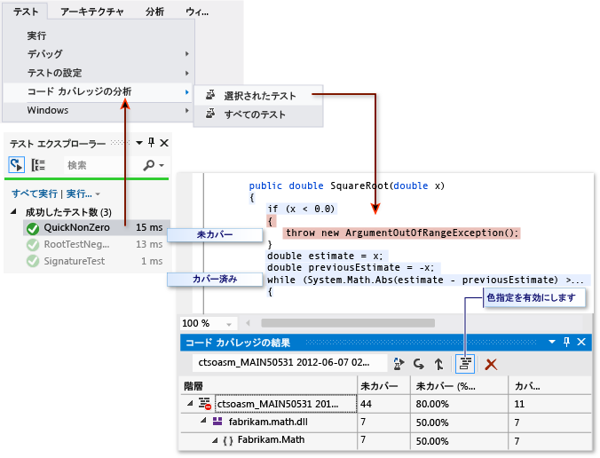

# <a name="use-code-coverage-to-determine-how-much-code-is-being-tested"></a>コード カバレッジを使用した、テストされるコード割合の確認

単体テストなどのコード化されたテストによって実際にテストされるプロジェクトのコードの割合を調べるには、Visual Studio のコード カバレッジ機能を使用できます。 バグから効果的に保護するには、コードの大部分を "カバー" するようにテストを実行する必要があります。

コード カバレッジ分析は、マネージド (CLI) コードにもアンマネージド (ネイティブ) コードにも適用できます。

コード カバレッジは、テスト エクスプローラーを使用してテスト メソッドを実行する場合のオプションです。 結果テーブルには、各アセンブリ、クラス、およびメソッドで実行されたコードの割合が表示されます。 また、ソース エディターには、どのコードがテストされたかが表示されます。

::: moniker range="vs-2017"



::: moniker-end

## <a name="requirements"></a>必要条件

コード カバレッジの機能は、Visual Studio Enterprise エディションでのみ使用できます。

## <a name="analyze-code-coverage"></a>コード カバレッジの分析

::: moniker range="vs-2017"

1. **[テスト]** メニューの **[コード カバレッジの分析]** を選択します。

::: moniker-end

::: moniker range=">=vs-2019"

1. **テスト エクスプローラー**で **[実行]** メニューの **[すべてのテストのコード カバレッジの分析]** を選択します。

   

   **テスト エクスプローラー**が開いていない場合は、 **[テスト]** > **[Windows]** > **[テスト エクスプローラー]** の順に選択するか、**Ctrl**+**E**、**T** キーを押して開きます。

::: moniker-end

2. テストを実行した後、実行された行を表示するには、 **[コード カバレッジの結果]** ウィンドウで ![[コード カバレッジの色分け表示] アイコン](../test/media/codecoverage-showcoloringicon.png) **[コード カバレッジの色分け表示]** を選択します。 既定では、テストの対象となるコードは薄い青で強調表示されます。

   > [!TIP]
   > 色を変更したり、太字を使用したりする場合は、 **[ツール]**  >  **[オプション]**  >  **[環境]**  >  **[フォントおよび色]**  >  **[設定の表示: テキスト エディター]** の順に選択します。 **[表示項目]** の下の "カバレッジ" 項目の設定を調整します。たとえば、 **[カバレッジ - タッチされなかったエリア]** です。
   >
   > 

3. 結果が低カバレッジを示していた場合は、コードのどの部分が実行されていないかを調べ、その部分をカバーするテストをさらに作成します。 開発チームは、通常、約 80% のコード カバレッジを目標にします。 状況によっては、より低いカバレッジでも許容されます。 たとえば、一部のコードが標準テンプレートから生成される場合は、より低いカバレッジでも許容されます。

> [!TIP]
> - コンパイラの最適化をオフにする
> - アンマネージ (ネイティブ) コードを操作している場合は、デバッグ ビルドを使用する
> - 各アセンブリに対して .pdb (シンボル) ファイルを生成する

期待した結果が得られない場合は、「[コード カバレッジのトラブルシューティング](../test/troubleshooting-code-coverage.md)」を参照してください。

コードを更新した後は、コード カバレッジを忘れずに再度実行します。 コードの変更後やテストの実行後に、カバレッジ結果とコードの色分けは自動的には更新されません。

## <a name="report-in-blocks-or-lines"></a>ブロック単位または行単位で報告する

コード カバレッジは、*ブロック*単位でカウントされます。 ブロックは、エントリ ポイントと終了ポイントを 1 つだけ持つ、コードの部分です。  プログラムの制御フローがテストの実行中にブロックを通過すると、そのブロックはカバー済みとしてカウントされます。 ブロックが使用された回数は、結果には影響しません。

テーブル ヘッダーで **[列の追加と削除]** を選択して、結果を行単位で表示することもできます。 行単位での割合の方が、ソース コードで見ることができるフラグメントのサイズに正確に対応するため、一部のユーザーは行単位でのカウントを選びます。 計算の長いブロックは、複数の行にわたっていても、1 つのブロックとしてカウントされます。

> [!TIP]
> 1 行のコードに、複数のコード ブロックを含めることができます。 その場合、テストの実行で行内のすべてのコード ブロックが処理されると、1 行としてカウントされます。 行のすべてのコード ブロックではなく一部だけが処理された場合は、部分行としてカウントされます。

## <a name="manage-code-coverage-results"></a>コード カバレッジの結果を管理する

**[コード カバレッジの結果]** ウィンドウには、通常、最新の実行の結果が表示されます。 結果は、テスト データを変更したり、テストの一部だけを実行したりすると、そのたびに異なります。

コード カバレッジ ウィンドウを使用して、以前の結果や、他のコンピューター上で取得した結果を表示することもできます。

いくつかの実行 (たとえば、異なるテスト データを使用した実行) の結果をマージできます。

- **以前の結果のセットを表示するには**、それをドロップダウン メニューから選択します。 メニューには一時的な一覧が表示され、新しいソリューションを開くとクリアされます。

- **以前のセッションの結果を表示するには**、 **[コード カバレッジの結果のインポート]** を選択し、ソリューションの **TestResults** フォルダーに移動して、 *.coverage* ファイルをインポートします。

   *.coverage* ファイルの生成後、ソース コードを変更した場合は、カバレッジの色分けが正しくない場合があります。

- **結果をテキストとして読みやすくするには**、 **[コード カバレッジの結果のエクスポート]** を選択します。 他のツールで処理したり電子メールで簡単に送信したりすることができる、読める形式の *.coveragexml* ファイルが生成されます。

- **結果を他のユーザーに送信するには**、 *.coverage* ファイルまたはエクスポートされた *.coveragexml* ファイルを送信します。 受け取ったユーザーは、ファイルをインポートできます。 同じバージョンのソース コードを持っていれば、カバレッジの色分けも表示できます。

## <a name="merge-results-from-different-runs"></a>さまざまな実行による結果をマージする

状況によっては、テスト データに応じて、コード内の異なるブロックが使用されます。 そのため、異なるテスト実行の結果を結合する必要がある場合があります。

たとえば、入力が "2" のテストを実行したときに、特定の関数の 50% がカバーされるとします。 入力を "-2" にして再度テストを実行すると、カバレッジの色分けビューで、関数の残りの 50% がカバーされていることがわかるとします。 ここで、2 つのテスト実行の結果をマージすると、レポートやカバレッジの色分けビューで、関数の 100% がカバーされたことが表示されます。

そのためには、![[コード カバレッジ] ウィンドウの [マージ] ボタンのアイコン](../test/media/codecoverage-mergeicon.png) **[コード カバレッジの結果のマージ]** を使用します。 最新の実行またはインポートされた結果を任意の組み合わせで選択できます。 エクスポートされた結果を結合する場合は、まず、それらをインポートする必要があります。

マージ操作の結果を保存するには、 **[コード カバレッジの結果のエクスポート]** を使用します。

### <a name="limitations-in-merging"></a>マージの制限事項

- バージョンが異なるコードのカバレッジ データをマージすると、結果は個別に表示され、結合はされません。 完全に結合された結果を取得するには、同じビルドのコードを使用し、テスト データだけを変更します。

- エクスポートしてからインポートされた結果ファイルをマージした場合は、行単位の結果のみを表示でき、ブロック単位の結果は表示できません。 行データを表示するには、 **[列の追加と削除]** コマンドを使用します。

- ASP.NET プロジェクトのテスト結果をマージした場合は、個別のテストの結果は表示されますが、結合された結果は表示されません。 このようになるのは、ASP.NET の成果物自体だけです。他のアセンブリの結果は結合されます。

## <a name="exclude-elements-from-the-code-coverage-results"></a>コード カバレッジの結果から要素を除外する

コードがテキスト テンプレートから生成された場合のように、コード内の特定の要素をカバレッジのスコアから除外する必要があることがあります。 その場合は、コード要素であるクラス、構造体、メソッド、プロパティ、プロパティ set または get アクセス操作子、およびイベントに、属性 <xref:System.Diagnostics.CodeAnalysis.ExcludeFromCodeCoverageAttribute?displayProperty=fullName> を追加します。

> [!TIP]
> クラスを除外しても、派生クラスは除外されません。

次に例を示します。

```csharp
using System.Diagnostics.CodeAnalysis;
...
public class ExampleClass1
{
    [ExcludeFromCodeCoverage]
    void ExampleMethod() {...}

    [ExcludeFromCodeCoverage] // exclude property
    int ExampleProperty1
    { get {...} set{...}}

    int ExampleProperty2
    {
        get
        {
            ...
        }
        [ExcludeFromCodeCoverage] // exclude setter
        set
        {
            ...
        }
    }

}
[ExcludeFromCodeCoverage]
class ExampleClass2 { ... }
```

```vb
Imports System.Diagnostics.CodeAnalysis

Class ExampleClass1
    <ExcludeFromCodeCoverage()>
    Public Sub ExampleSub1()
        ...
    End Sub

    ' Exclude property
    < ExcludeFromCodeCoverage()>
    Property ExampleProperty1 As Integer
        ...
    End Property

    ' Exclude setter
    Property ExampleProperty2 As Integer
        Get
            ...
        End Get
        <ExcludeFromCodeCoverage()>
        Set(ByVal value As Integer)
            ...
        End Set
    End Property
End Class

<ExcludeFromCodeCoverage()>
Class ExampleClass2
...
End Class
```

```cpp
// A .cpp file compiled as managed (CLI) code.
using namespace System::Diagnostics::CodeAnalysis;
...
public ref class ExampleClass1
{
  public:
    [ExcludeFromCodeCoverage]
    void ExampleFunction1() { ... }

    [ExcludeFromCodeCoverage]
    property int ExampleProperty2 {...}

    property int ExampleProperty2 {
      int get() { ... }
     [ExcludeFromCodeCoverage]
      void set(int value) { ...  }
   }
}

[ExcludeFromCodeCoverage]
public ref class ExampleClass2
{ ... }
```

### <a name="exclude-elements-in-native-c-code"></a>ネイティブ C++ コード内の要素を除外する

C++ コードでアンマネージ (ネイティブ) 要素を除外するには:

```cpp
#include <CodeCoverage\CodeCoverage.h>
...

// Exclusions must be compiled as unmanaged (native):
#pragma managed(push, off)

// Exclude a particular function:
ExcludeFromCodeCoverage(Exclusion1, L"MyNamespace::MyClass::MyFunction");

// Exclude all the functions in a particular class:
ExcludeFromCodeCoverage(Exclusion2, L"MyNamespace::MyClass2::*");

// Exclude all the functions generated from a particular template:
ExcludeFromCodeCoverage(Exclusion3, L"*::MyFunction<*>");

// Exclude all the code from a particular .cpp file:
ExcludeSourceFromCodeCoverage(Exclusion4, L"*\\unittest1.cpp");

// After setting exclusions, restore the previous managed/unmanaged state:
#pragma managed(pop)
```

以下のマクロを使用します。

`ExcludeFromCodeCoverage(` *ExclusionName* `, L"` *FunctionName* `");`

`ExcludeSourceFromCodeCoverage(` *ExclusionName* `, L"` *SourceFilePath* `");`

- *ExclusionName* は任意の一意の名前です。

- *FunctionName* は完全修飾関数名です。 ワイルドカードを含めることができます。 たとえば、クラスのすべての関数を除外するには、`MyNamespace::MyClass::*` と記述します。

- *SourceFilePath* は .cpp ファイルのローカル パスまたは UNC パスです。 ワイルドカードを含めることができます。 たとえば、`\\MyComputer\Source\UnitTests\*.cpp` と記述すると、特定のディレクトリ内のすべてのファイルが除外されます。

- `#include <CodeCoverage\CodeCoverage.h>`

- 除外マクロの呼び出しは、いずれかの名前空間またはクラス内ではなく、グローバル名前空間に配置します。

- 除外は単体テスト コード ファイルまたはアプリケーション コード ファイル内に配置できます。

- 除外は、コンパイラ オプションを設定するか、`#pragma managed(off)` を使用して、アンマネージ (ネイティブ) コードとしてコンパイルする必要があります。

> [!NOTE]
> C++/CLI コード内の関数を除外するには、関数に `[System::Diagnostics::CodeAnalysis::ExcludeFromCodeCoverage]` 属性を適用します。 これは、C# の場合と同じです。

### <a name="include-or-exclude-additional-elements"></a>追加の要素を含めるか、除外する

コード カバレッジ分析の対象となるのは、読み込まれ、 *.dll* または *.exe* ファイルと同じディレクトリ内の *.pdb* ファイルを利用できるアセンブリだけです。 そのため、状況によっては、適切な *.pdb* ファイルのコピーを取得することによって、対象となるアセンブリのセットを拡張できます。

*.runsettings* ファイルを記述すると、コード カバレッジ分析の対象としてどのアセンブリと要素を選択するかをより詳細に制御できます。 たとえば、クラスに属性を追加せずに、特定の種類のアセンブリを除外できます。 詳細については、「[コード カバレッジ分析のカスタマイズ](../test/customizing-code-coverage-analysis.md)」を参照してください。

## <a name="analyze-code-coverage-in-azure-pipelines"></a>Azure Pipelines でコード カバレッジを分析する

コードをチェックインすると、テストがビルド サーバー上で、他のチーム メンバーのテストと共に実行されます。 プロジェクト全体のカバレッジに関する最新の全体像が得られるため、これは Azure Pipelines のコード カバレッジを分析する場合に便利です。 これには、自動化されたシステム テストと、通常は開発用コンピューターでは実行しない、その他のコード化されたテストも含まれます。 詳細については、「[Run unit tests with your builds](/azure/devops/pipelines/test/getting-started-with-continuous-testing?view=vsts)」(自分のビルドで単体テストを実行する) を参照してください。

## <a name="analyze-code-coverage-from-the-command-line"></a>コマンド ラインからコード カバレッジを分析する

コマンド ラインからテストを実行するには、*vstest.console.exe* を使用します。 コード カバレッジは、*vstest.console.exe* ユーティリティのオプションです。

1. 次の手順で Visual Studio の開発者コマンド プロンプトを開始します。

   ::: moniker range="vs-2017"

   Windows の **[スタート]** メニューから、 **[Visual Studio 2017]** > **[開発者コマンド プロンプト for VS 2017]** の順に選択します。

   ::: moniker-end

   ::: moniker range=">=vs-2019"

   Windows の **[スタート]** メニューから、 **[Visual Studio 2019]** > **[開発者コマンド プロンプト for VS 2019]** の順に選択します。

   ::: moniker-end

2. コマンド プロンプトで次のコマンドを実行します。

   ```shell
   vstest.console.exe MyTestAssembly.dll /EnableCodeCoverage
   ```

詳細については、「[VSTest.Console.exe のコマンド ライン オプション](vstest-console-options.md)」を参照してください。

## <a name="troubleshoot"></a>トラブルシューティング

コード カバレッジの結果が表示されない場合、「[コード カバレッジのトラブルシューティング](../test/troubleshooting-code-coverage.md)」の記事が役に立つことがあります。

## <a name="see-also"></a>関連項目

- [コード カバレッジ分析のカスタマイズ](../test/customizing-code-coverage-analysis.md)
- [コード カバレッジのトラブルシューティング](../test/troubleshooting-code-coverage.md)
- [コードの単体テスト](../test/unit-test-your-code.md)
