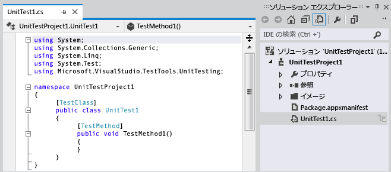
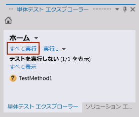

# チュートリアル: UWP アプリ用の単体テストの作成および実行

Visual Studio には、ユニバーサル Windows プラットフォーム (UWP) アプリの単体テストに対するサポートが含まれています。 Visual Studio には、C#、Visual Basic、および C++ 用の単体テスト プロジェクト テンプレートが用意されています。

> [!TIP]
> UWP アプリの開発の詳細については、[UWP アプリの概要](/windows/uwp/get-started/)に関するページを参照してください。

以下では、UWP アプリに対して、単体テストを作成、実行、デバッグする手順について説明します。

## UWP アプリの単体テスト プロジェクトを作成する

::: moniker range=">=vs-2019"

1. Visual Studio を開きます。 スタート ウィンドウで、 **[新しいプロジェクトの作成]** を選択します。

2. **[新しいプロジェクトの作成]** ページの検索ボックスに、「**単体テスト**」と入力します。

   テンプレートの一覧が単体テスト用のものに絞り込まれます。

3. C# または Visual Basic に対して **[単体テスト アプリ (ユニバーサル Windows)]** テンプレートを選択し、 **[次へ]** を選択します。

   

4. 必要に応じて、プロジェクトまたはソリューションの名前と場所を変更し、 **[作成]** を選択します。

5. 必要に応じて、ターゲットと最小プラットフォーム バージョンを変更し、 **[OK]** を選択します。

これらの手順を完了すると、単体テスト プロジェクトが作成され、ソリューション エクスプローラーに表示されます。

::: moniker-end

::: moniker range="vs-2017"

1. **[ファイル]** メニューの **[新しいプロジェクト]** をクリックします。

   **[新しいプロジェクト]** ダイアログ ボックスが表示されます。

2. テンプレートで、単体テストを作成するプログラミング言語を選択した後、関連する Windows ユニバーサルの単体テスト ライブラリを選択します。 たとえば、 **[Visual C#]** 、 **[Windows ユニバーサル]** 、 **[単体テスト ライブラリ (ユニバーサル Windows)]** の順に選択します。

3. (省略可能) **[名前]** テキストボックスに、プロジェクトで使用する名前を入力します。

4. (省略可能) **[位置]** テキストボックスに入力するか、 **[参照]** ボタンを選択することにより、プロジェクトを作成する場所のパスを変更します。

5. (省略可能) **[ソリューション]** 名テキストボックスに、ソリューションで使用する名前を入力します。

6. **[ソリューションのディレクトリを作成]** をクリックしたまま、 **[OK]** をクリックします。

   

   **ソリューション エクスプローラー**に UWP 単体テスト プロジェクトが設定され、コード エディターに UnitTest1 という既定の単体テストが表示されます。

   

::: moniker-end

## 単体テスト プロジェクトの UWP アプリケーション マニフェスト ファイルを編集する

1. **ソリューション エクスプローラー**で、*Package.appxmanifest* ファイルを右クリックし、 **[開く]** を選択します。

2. **マニフェスト デザイナー**で、 **[機能]** タブを選択します。

3. **[機能]** リストで、単体テストを必要とする機能とコードを選択します。 たとえば、単体テストが必要で、テストするコードにインターネットにアクセスする機能が必要な場合は、 **[インターネット]** チェック ボックスをオンにします。

   > [!NOTE]
   > 選択する機能には、単体テストが正しく機能するために必要な機能だけが含まれる必要があります。

   

## UWP アプリの単体テストをコーディングする

コード エディターで、単体テストを編集し、テストに必要なアサートとロジックを追加します。

## 単体テストを実行する

ソリューションをビルドし、テスト エクスプローラーを使用して単体テストを実行するには:

1. **[テスト]** メニューで **[Windows]** を選択し、 **[テスト エクスプローラー]** を選択します。

2. **[ビルド]** メニューの **[ソリューションのビルド]** をクリックします。

   これで、単体テストがテスト エクスプローラーに表示されます。

   > [!NOTE]
   > テスト エクスプローラーの単体テストの一覧を更新するソリューションをビルドする必要があります。

3. **テスト エクスプローラー**で、作成した単体テストを選択します。

4. **[すべて実行]** をクリックします。

   

   > [!TIP]
   > テスト エクスプローラーに一覧表示された 1 つ以上の単体テストを選択し、 **[選択したテストの実行]** を右クリックして選択します。
   >
   > また、 **[選択されたテストをデバッグ]** 、 **[テストを開く]** をクリックし、 **[プロパティ]** オプションを使用できます。
   >
   > 

   単体テストが実行されます。 完了すると、テスト エクスプローラーには、テストの状態、経過時間、およびソースへのリンクが表示されます。

   

## 関連項目

- [Visual Studio での UWP アプリのテスト](../test/unit-test-your-code.md)
- [UWP アプリのビルドとテスト](/azure/devops/pipelines/apps/windows/universal?tabs=vsts)