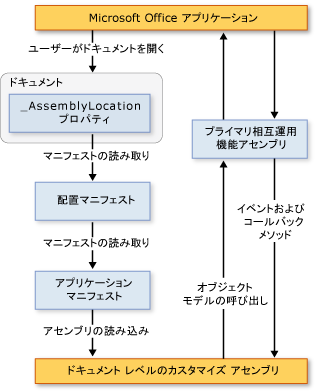

# ドキュメントレベルのカスタマイズのアーキテクチャ
  [!INCLUDE[vs_dev12](../vsto/includes/vs-dev12-md.md)] には、Microsoft Office Word および Microsoft Office Excel のドキュメント レベルのカスタマイズを作成するためのプロジェクトが含まれています。 ここでは、ドキュメント レベルのカスタマイズの次の側面について説明します。

- [カスタマイズについて](#UnderstandingCustomizations)

- [カスタマイズのコンポーネント](#Components)

- [Microsoft Office アプリケーションでのカスタマイズのしくみ](#HowCustomizationsWork)

  [!INCLUDE[appliesto_alldoc](../vsto/includes/appliesto-alldoc-md.md)]

  ドキュメントレベルのカスタマイズの作成に関する一般的な情報については、「 [Office ソリューションの開発の概要 &#40;VSTO&#41;](../vsto/office-solutions-development-overview-vsto.md)」、「 [Word のドキュメントレベルのカスタマイズのプログラミング](../vsto/getting-started-programming-document-level-customizations-for-word.md)の概要」、および「 [Excel のドキュメントレベルのカスタマイズのプログラミング](../vsto/getting-started-programming-document-level-customizations-for-excel.md)」を参照してください。

##  カスタマイズについて
 Visual Studio の Office 開発ツールを使用してドキュメント レベルのカスタマイズをビルドする場合は、特定の文書に関連付けられたマネージド コード アセンブリを作成します。 アセンブリがリンクされている文書やブックは、マネージド コード拡張機能がある、と言い表されます。 詳細については、「 [Office ソリューションの設計と作成](../vsto/designing-and-creating-office-solutions.md)」を参照してください。

 ユーザーがドキュメントを開くと、Microsoft Office アプリケーションによってアセンブリが読み込まれます。 アセンブリが読み込まれると、ドキュメントが開いている間、カスタマイズはイベントに応答できます。 また、ドキュメントが開いている間、カスタマイズはオブジェクト モデルを呼び出し、アプリケーションを自動化して拡張することもできます。 [!INCLUDE[dnprdnshort](../sharepoint/includes/dnprdnshort-md.md)]内の任意のクラスを使用することも可能です。

 アセンブリは、アプリケーションのプライマリ相互運用機能アセンブリを介してアプリケーションの COM コンポーネントとの通信を行います。 詳細については、「 [office プライマリ相互運用機能アセンブリ](../vsto/office-primary-interop-assemblies.md) 」と「 [office ソリューションの開発の概要 &#40;VSTO&#41;](../vsto/office-solutions-development-overview-vsto.md)」を参照してください。

 複数のドキュメント レベルのカスタマイズを同時に開くと、各アセンブリは異なるアプリケーション ドメインに読み込まれます。 このため、1 つのソリューションが正しく動作しない場合でも、それが原因で他のソリューションにエラーが発生することはありません。 ドキュメント レベルのカスタマイズは、1 つのアプリケーション ドメイン内の 1 つのドキュメントと連携するように設計されています。 ドキュメント間のやり取りに対応するようには設計されていません。 アプリケーションドメインの詳細については、「 [アプリケーションドメイン](/dotnet/framework/app-domains/application-domains)」を参照してください。

> [!NOTE]
> Visual Studio の Office 開発ツールを使用して作成するドキュメント レベルのカスタマイズは、エンド ユーザーがアプリケーションを起動したときのみ使用されることを目的としています。 アプリケーションがプログラムで起動された場合 (オートメーション機能を使用する場合など)、カスタマイズは予期したとおりに動作しないことがあります。

### デザイン時および実行時のエクスペリエンス
 ドキュメント レベルのカスタマイズのアーキテクチャを理解すると、ソリューションのデザイン時と実行時におけるエクスペリエンスについて理解を深めることができます。

#### 設計時
 デザイン時のエクスペリエンスには、次のような手順が含まれます。

1. 開発者は、ドキュメント レベルのプロジェクトを [!INCLUDE[vsprvs](../sharepoint/includes/vsprvs-md.md)]で作成します。 このプロジェクトには、ドキュメントと、ドキュメントとは分離して実行されるアセンブリが組み込まれます。 ドキュメントは既に存在している (デザイナーによって作成された) か、プロジェクトと共に新しいドキュメントを作成することができます。

2. 設計者 (プロジェクトを作成する開発者、または他のユーザーのいずれか) は、エンド ユーザー向けにドキュメントの最終的な外観を仕上げます。

#### ランタイム
 実行時のエクスペリエンスには、次のような手順が含まれます。

1. エンド ユーザーが、マネージド コード拡張機能を実装している文書またはブックを開きます。

2. 文書またはブックにより、コンパイルされたアセンブリが読み込まれます。

3. ユーザーが文書またはブックで操作すると、アセンブリがイベントに応答します。

#### 開発者とエンドユーザーの視点の比較
 開発者は主に [!INCLUDE[vsprvs](../sharepoint/includes/vsprvs-md.md)]で作業を行い、エンド ユーザーは Word または Excel で作業を行うため、ドキュメント レベルのカスタマイズを理解するには、次に示す 2 つの視点に立つことが必要です。

|開発者の視点|エンド ユーザーの視点|
|-----------------------------|----------------------------|
|開発者は [!INCLUDE[vsprvs](../sharepoint/includes/vsprvs-md.md)]を使用して、Word および Excel にアクセス可能なコードを記述します。   Word または Excel を実行する実行可能ファイルを作成しているように思えますが、実際の処理は別の方法で行われます。 ドキュメントにはアセンブリが関連付けられており、そのアセンブリへのポインターが含まれています。 ドキュメントを開くと、Word または Excel はアセンブリを検索し、すべてのイベント処理に呼応して動作します。|ソリューションを使用するには、他の Microsoft Office ファイルを開く場合と同様に、文書またはブックを開く (または、テンプレートから新しいドキュメントを作成する) だけです。   アセンブリにより、文書またはブックをカスタマイズできます。たとえば、現在のデータを基に文書やブックを自動生成したり、情報の入力を求めるダイアログ ボックスを表示したりできます。|

### ドキュメントレベルのカスタマイズでサポートされているドキュメント形式
 カスタマイズ プロジェクトを作成するときには、プロジェクト内で使用するドキュメントの形式を選択できます。 詳細については、「 [方法: Visual Studio で Office プロジェクトを作成する](../vsto/how-to-create-office-projects-in-visual-studio.md)」を参照してください。

 Excel および Word のドキュメント レベルのカスタマイズで使用可能なドキュメント形式を、次の表に示します。

|Excel|Word|
|-----------|----------|
|Excel ブック (*.xlsx*)   Excel マクロ有効ブック (*.xlsm*)   Excel バイナリブック (*.xlsb*)   Excel 97-2003 ブック (*.xls*)   Excel テンプレート (*xltx*)   Excel マクロ有効テンプレート (*xltm*)   Excel 97-2003 テンプレート (*.xlt*)|Word 文書 (*.docx*)   Word マクロが有効なドキュメント (*.docm*)   Word 97-2003 文書 (*.doc*)   Word テンプレート (*.dotx*)   Word マクロ有効テンプレート (*normal.dotm*)   Word 97-2003 テンプレート (*.dot*)|

 サポートされている形式のドキュメントに対してだけ、マネージド コード拡張機能を設計する必要があります。 そうしないと、アプリケーションでドキュメントを開くときに、特定のイベントが発生しない可能性があります。 たとえば、 <xref:Microsoft.Office.Tools.Excel.Workbook.Open> EXCEL XML スプレッドシート形式または web ページ (*.htm*) で保存されたブックでマネージコード拡張機能を使用した場合、イベントは発生しません。 *.html*)形式.

### .Xml ファイル名拡張子を持つ Word 文書のサポート
 ドキュメント レベルのプロジェクト テンプレートを使用して、次のファイル形式に基づくプロジェクトを作成することはできません。

- Word XML ドキュメント (*\* xml*)。

- Word 2003 XML ドキュメント (*\* xml*)。

  エンド ユーザーがこれらのファイル形式でカスタマイズを使用できるようにするには、前の表に示した、サポートされているいずれかのファイル形式に基づくカスタマイズを作成して配置します。 カスタマイズをインストールすると、エンドユーザーは Word XML ドキュメント (*\* xml*) 形式または Word 2003 xml ドキュメント (*\* xml*) 形式でドキュメントを保存できるようになり、カスタマイズは想定どおりに動作し続けます。

##  カスタマイズのコンポーネント
 カスタマイズの主要なコンポーネントは、ドキュメントとアセンブリです。 これらのコンポーネントに加えて、Microsoft Office アプリケーションがカスタマイズを検出して読み込むときに重要な役割を果たすものがあります。

### 配置マニフェストとアプリケーションマニフェスト
 カスタマイズは、配置マニフェストとアプリケーション マニフェストを使用して、最新バージョンのカスタマイズ アセンブリを特定し、読み込みます。 配置マニフェストは、最新のアプリケーション マニフェストを指します。 アプリケーション マニフェストは、カスタマイズ アセンブリを指し、エントリ ポイント クラス (1 つまたは複数のクラス) を指定して、アセンブリ内で実行します。 詳細については、「 [Office ソリューションのアプリケーションマニフェストと配置マニフェスト](../vsto/application-and-deployment-manifests-in-office-solutions.md)」を参照してください。

### Visual Studio Tools for Office ランタイム
 Visual Studio の Office developer tools を使用して作成されたドキュメントレベルのカスタマイズを実行するには、エンドユーザーのコンピューターにがインストールされている必要があり [!INCLUDE[vsto_runtime](../vsto/includes/vsto-runtime-md.md)] ます。 [!INCLUDE[vsto_runtime](../vsto/includes/vsto-runtime-md.md)] には、カスタマイズ アセンブリを読み込むアンマネージド コンポーネントが含まれています。また、一連のマネージド アセンブリも含まれています。 これらのマネージド アセンブリにより、カスタマイズ コードがホスト アプリケーションを自動化して拡張するために使用するオブジェクト モデルが提供されます。

 詳細については、「 [Visual Studio tools For Office runtime の概要](../vsto/visual-studio-tools-for-office-runtime-overview.md)」を参照してください。

##  Microsoft Office アプリケーションでのカスタマイズのしくみ
 ユーザーが Microsoft Office カスタマイズの一部であるドキュメントを開くと、アプリケーションはそのドキュメントにリンクされている配置マニフェストを使用して、最新バージョンのカスタマイズ アセンブリを特定し、読み込みます。 配置マニフェストの場所は、 **Assemblylocation** という名前のカスタムドキュメントプロパティに格納されます。 この場所を示す文字列は、ソリューションをビルドするときにプロパティに挿入されます。

 配置マニフェストはアプリケーション マニフェストを指し、アプリケーション マニフェストは最新のアセンブリを指します。 詳細については、「 [Office ソリューションのアプリケーションマニフェストと配置マニフェスト](../vsto/application-and-deployment-manifests-in-office-solutions.md)」を参照してください。

 ドキュメント レベルのカスタマイズに関する基本アーキテクチャを、次の図に示します。

 

> [!NOTE]
> [!INCLUDE[net_v40_short](../sharepoint/includes/net-v40-short-md.md)]を対象とする Office ソリューションでは、ソリューションはプライマリ相互運用機能アセンブリ (PIA: Primary Interop Assembly) を直接呼び出す代わりに、ソリューション アセンブリに埋め込まれた PIA 型情報を使用してホスト アプリケーションのオブジェクト モデルを呼び出します。 詳細については、「 [Office ソリューションの設計と作成](../vsto/designing-and-creating-office-solutions.md)」を参照してください。

### 処理の読み込み
 ユーザーが Microsoft Office ソリューションの一部であるドキュメントを開くと、次の処理が実行されます。

1. Microsoft Office アプリケーションはカスタム ドキュメント プロパティをチェックして、そのドキュメントに関連付けられているマネージド コード拡張機能があるかどうかを調べます。 詳細については、「 [カスタムドキュメントプロパティの概要](../vsto/custom-document-properties-overview.md)」を参照してください。

2. マネージコード拡張機能がある場合、アプリケーションは *VSTOEE.dll* を読み込み、 *VSTOLoader.dll* を読み込みます。 これらは、Visual Studio 2010 Tools for Office runtime のローダーコンポーネントであるアンマネージ Dll です。 詳細については、「 [Visual Studio Tools for Office ランタイムの概要](../vsto/visual-studio-tools-for-office-runtime-overview.md)」を参照してください。

3. *VSTOLoader.dll* はを読み込み、 [!INCLUDE[dnprdnshort](../sharepoint/includes/dnprdnshort-md.md)] のマネージ部分を開始し [!INCLUDE[vsto_runtime](../vsto/includes/vsto-runtime-md.md)] ます。

4. ドキュメントがローカル コンピューター以外の場所から開かれている場合、 [!INCLUDE[vsto_runtime](../vsto/includes/vsto-runtime-md.md)] は、該当する Office アプリケーション用に設定された **[セキュリティ センターの設定]** の **[信頼できる場所]** の一覧にドキュメントの場所が載っていることを確認します。 ドキュメントの場所が信頼できる場所でない場合、カスタマイズは信頼されず、読み込みプロセスはここで停止します。

5. [!INCLUDE[vsto_runtime](../vsto/includes/vsto-runtime-md.md)] は、ソリューションをインストールし (まだインストールされていない場合)、最新のアプリケーション マニフェストと配置マニフェストをダウンロードし、一連のセキュリティ チェックを実行します。 詳細については、「 [Office ソリューションのセキュリティ保護](../vsto/securing-office-solutions.md)」を参照してください。

6. カスタマイズを信頼して実行できる場合、 [!INCLUDE[vsto_runtime](../vsto/includes/vsto-runtime-md.md)] は配置マニフェストとアプリケーション マニフェストを使用して、アセンブリの更新をチェックします。 利用できる新しいバージョンのアセンブリが存在する場合、ランタイムは、クライアント コンピューターの [!INCLUDE[ndptecclick](../vsto/includes/ndptecclick-md.md)] キャッシュに新しいバージョンのアセンブリをダウンロードします。 詳細については、「 [Office ソリューションの配置](../vsto/deploying-an-office-solution.md)」を参照してください。

7. [!INCLUDE[vsto_runtime](../vsto/includes/vsto-runtime-md.md)] は、カスタマイズ アセンブリを読み込むときに使用する、新しいアプリケーション ドメインを作成します。

8. [!INCLUDE[vsto_runtime](../vsto/includes/vsto-runtime-md.md)] は、カスタマイズ アセンブリをアプリケーション ドメインに読み込みます。

9. [!INCLUDE[vsto_runtime](../vsto/includes/vsto-runtime-md.md)] は、カスタマイズ アセンブリ内の **Startup** イベント ハンドラーを呼び出します。 詳細については、「 [Office プロジェクトのイベント](../vsto/events-in-office-projects.md)」を参照してください。

## 関連項目
- [Visual Studio での Office ソリューションのアーキテクチャ](../vsto/architecture-of-office-solutions-in-visual-studio.md)
- [Architecture of VSTO Add-Ins](../vsto/architecture-of-vsto-add-ins.md)
- [Visual Studio Tools for Office ランタイムの概要](../vsto/visual-studio-tools-for-office-runtime-overview.md)
- [セキュリティで保護された Office ソリューション](../vsto/securing-office-solutions.md)
- [Office ソリューションの設計と作成](../vsto/designing-and-creating-office-solutions.md)
- [カスタムドキュメントプロパティの概要](../vsto/custom-document-properties-overview.md)
- [ドキュメントレベルのカスタマイズでのキャッシュされたデータ](../vsto/cached-data-in-document-level-customizations.md)
