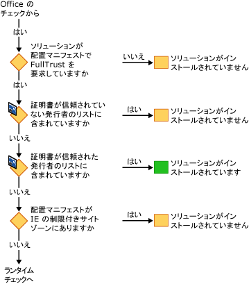
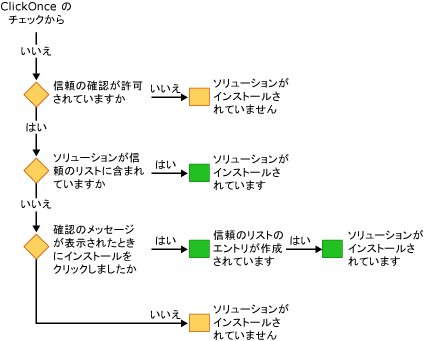

# Office ソリューションをセキュリティで保護する
  Office ソリューションのセキュリティ モデルには、次の複数のテクノロジが含まれています。[!INCLUDE[vsto_runtime](../vsto/includes/vsto-runtime-md.md)]、[!INCLUDE[ndptecclick](../vsto/includes/ndptecclick-md.md)]、Microsoft Office のトラスト センター、および Internet Explorer の制限付きサイト ゾーン。 次のセクションでは、さまざまなセキュリティ機能のしくみについて説明します:

- [Office ソリューションへの信頼の付与](#GrantingTrustToSolutions)

- [ドキュメントへの信頼の付与](#GrantingTrustToDocuments)

- [Windows インストーラー使用時に信頼を付与する](#GrantingTrustWindowsInstaller)

- [Office ソリューションに固有のセキュリティに関する考慮事項](#Security)

- [開発時のセキュリティ](#SecurityDuringDeployment)

- [Visual Studio Tools for Office Runtime](#VisualStudioToolsForOfficeRuntime)

  [!INCLUDE[appliesto_all](../vsto/includes/appliesto-all-md.md)]

##  Office ソリューションに信頼を付与する
 Office ソリューションへの信頼の付与とは、以下の証拠に基づいて Office ソリューションを信頼するように各エンド ユーザーのセキュリティ ポリシーを変更することを意味します。

- 配置マニフェストへの署名に使用する証明書

- 配置マニフェストの URL

  詳細については、「[Office ソリューションへの信頼の付与](../vsto/granting-trust-to-office-solutions.md)」を参照してください。

##  ドキュメントに信頼を付与する
 ドキュメント レベルのカスタマイズでは、ドキュメントを信頼できる場所として指定されたディレクトリに置く必要があります。  詳細については、「[ドキュメントへの信頼の付与](../vsto/granting-trust-to-documents.md)」を参照してください。

##  Windows インストーラー使用時に信頼を付与する
 Windows インストーラーを使用して Program Files ディレクトリに Office ソリューションをインストールする MSI ファイルを作成できますが、これには管理者権限が必要です。 Program Files ディレクトリ内の Office ソリューションの場合、Visual Studio 2010 Tools for Office ランタイムではこれらの Office ソリューションは信頼されているとみなされ、ClickOnce 信頼プロンプトは表示されません。

##  Office ソリューションに固有のセキュリティに関する考慮事項
 [!INCLUDE[net_v40_short](../sharepoint/includes/net-v40-short-md.md)]、[!INCLUDE[net_v45](../vsto/includes/net-v45-md.md)] および Microsoft Office に用意されているセキュリティ機能は、Office ソリューションのさまざまなセキュリティ上の脅威に対する保護に役立てることができます。 詳細については、「[Office ソリューションに関する特定のセキュリティの考慮事項](../vsto/specific-security-considerations-for-office-solutions.md)」を参照してください。

##  開発時のセキュリティ
 Visual Studio では、開発プロセスを容易にするために、プロジェクトをビルドするたびにソリューションの実行およびデバッグに必要なセキュリティ ポリシーが設定されます。 場合によっては、プロジェクトの開発に追加のセキュリティ手順が必要になります。

### ドキュメント レベルのソリューション
 次の種類のプロジェクトを開発する場合は、Microsoft Office アプリケーションの信頼できる場所の一覧にドキュメントの完全修飾パスを追加する必要があります。

- *\\\servername\sharename* などのネットワーク ファイル共有にあるドキュメントレベルのソリューション。

- *.doc* または *.docm* ファイルを使用する Word 用のドキュメントレベルのソリューション。

  ドキュメントの場所を信頼できる場所の一覧に追加するときにサブディレクトリを含めるか、デバッグ用のフォルダーとビルド用のフォルダーそれ自体を含めます。 詳細については、Microsoft Office オンライン ヘルプの記事「[ファイルの信頼できる場所を作成、削除、または変更する](https://support.office.com/article/Create-remove-or-change-a-trusted-location-for-your-files-f5151879-25ea-4998-80a5-4208b3540a62)」を参照してください。

### 一時的な証明書
 Visual Studio では、既存の署名証明書がない場合、一時的な証明書が作成されます。  一時的な証明書は開発時のみ使用し、配置には正式な証明書を購入する必要があります。

 一時的な証明書は、Office プロジェクトを最初にビルドした後に生成されます。 証明書を追加すると、プロジェクトが変更ありとマークされるため、次に **F5** キーを押したときにプロジェクトが再ビルドされます。

 時間の経過と共に多くの一時的な証明書が生成される可能性があるため、一時的な証明書を随時クリアする必要があります。

##  Visual Studio Tools for Office ランタイム
 [!INCLUDE[vsto_runtime](../vsto/includes/vsto-runtime-md.md)] には、発行者の ID とカスタマイズに付与されたアクセス許可を確認する機能があります。 アクセス許可を確認するときには、一連のセキュリティ チェックが実行されます。

### カスタマイズの読み込み時のセキュリティ
 ドキュメント レベルのカスタマイズを読み込むときには、必ず [!INCLUDE[vsto_runtime](../vsto/includes/vsto-runtime-md.md)] によってドキュメントが信頼できる場所の一覧に含まれているかどうかがチェックされます。 また、ランタイムは、ソリューションがアプリケーション マニフェストに FullTrust を必要としているかどうかをチェックします。 カスタマイズの読み込み中に追加のセキュリティ チェックは行われません。

### インストール時のセキュリティ チェックの順序
 Office ソリューションをインストールまたは更新するときには、[!INCLUDE[vsto_runtime](../vsto/includes/vsto-runtime-md.md)] が一連のセキュリティ チェックを所定の順序で実行し、信頼の決定を行います。 ソリューションのインストールまたは更新は、ソリューションが信頼されているとランタイムが判断した場合のみ実行されます。

 インストール プロセスを開始するには、セットアップ プログラムの実行、配置マニフェストを開く、Microsoft Office アプリケーション ホストを開く、または *VSTOInstaller.exe* の実行という 4 つの方法があります。

 最初のセキュリティ チェックはドキュメント レベルのソリューションのみが対象となります。 ドキュメント レベルのソリューションのドキュメントは、信頼できる場所に置く必要があります。 ドキュメントがリモート ネットワーク ファイル共有にあるか、ファイル名拡張子が *.doc* または *.docm* である場合は、ドキュメントの場所を信頼できる場所の一覧に追加する必要があります。 詳細については、「[ドキュメントへの信頼の付与](../vsto/granting-trust-to-documents.md)」を参照してください。

 

 次に、[!INCLUDE[vsto_runtime](../vsto/includes/vsto-runtime-md.md)] と ClickOnce によって一連のセキュリティ チェックが実行されます。 これらのチェックに合格するためには、Office ソリューションが FullTrust アクセス許可を要求し、信頼されない発行元の一覧に含まれていない証明書で署名されていて、Internet Explorer の制限付きサイト ゾーン以外の場所にあることが必要です。 証明書が信頼された発行者の一覧に含まれている場合、ソリューションは直ちにインストールされます。 そうでない場合は、いずれかのチェックで不合格とならなければ、最後のチェックに進みます。

 

 [!INCLUDE[ndptecclick](../vsto/includes/ndptecclick-md.md)] 信頼プロンプトの表示が許可されていてソリューションに信頼が付与されていない場合、ランタイムではエンド ユーザーが信頼の決定を行えるようにします。 ユーザーがソリューションに信頼を付与すると、そのユーザーの信頼のリストにエントリが追加されます。 ユーザーの信頼のリストに追加されたソリューションは、完全に信頼されているため、インストールおよび実行が可能です。

 Visual Studio 2010 以降では、Windows インストーラー (MSI) を使用して Office ソリューションを Program Files ディレクトリにインストールすると、信頼のリストがバイパスされます。 詳細については、「[信頼リストを使用して Office ソリューションを信頼する](../vsto/trusting-office-solutions-by-using-inclusion-lists.md)」を参照してください。

 

## 関連項目

- [Office ソリューションへの信頼の付与](../vsto/granting-trust-to-office-solutions.md)
- [ドキュメントへの信頼の付与](../vsto/granting-trust-to-documents.md)
- [信頼のリストによる Office ソリューションへの信頼の付与](../vsto/trusting-office-solutions-by-using-inclusion-lists.md)
- [方法: 信頼のリストのセキュリティを構成する](../vsto/how-to-configure-inclusion-list-security.md)
- [方法: Office ソリューションに署名する](../vsto/how-to-sign-office-solutions.md)
- [Office ソリューションのセキュリティのトラブルシューティング](../vsto/troubleshooting-office-solution-security.md)
- [Office ソリューション用アプリケーション マニフェスト](../vsto/application-manifests-for-office-solutions.md)
- [Office ソリューション用配置マニフェスト](../vsto/deployment-manifests-for-office-solutions.md)
- [ClickOnce に関するリファレンス](../deployment/clickonce-reference.md)
- [Office ソリューションを配置する](../vsto/deploying-an-office-solution.md)
