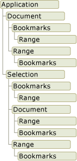

# Word オブジェクト モデルの概要
  Visual Studio で Word ソリューションを開発するときは、Word オブジェクト モデルと対話します。 このオブジェクト モデルは、Word のプライマリ相互運用機能アセンブリで提供されるクラスとインターフェイスで構成されています。これらのクラスとインターフェイスは <xref:Microsoft.Office.Interop.Word> 名前空間に定義されています。  
  
 [!INCLUDE[appliesto_wdalldocapp](../vsto/includes/appliesto-wdalldocapp-md.md)]  
  
 ここでは、Word オブジェクト モデルの概要を簡単に説明します。 Word オブジェクト モデル全体について詳しく説明する資料については、「 [Word オブジェクト モデルの使用](#WordOMDocumentation)」ドキュメントを参照してください。  
  
 Word オブジェクト モデルを使用して特定のタスクを実行する方法については、次のトピックを参照してください。  
  
-   [文書の操作](../vsto/working-with-documents.md)  
  
-   [文書内のテキストの操作](../vsto/working-with-text-in-documents.md)  
  
-   [テーブルの操作](../vsto/working-with-tables.md)  
  
##   Word オブジェクト モデルについて  
 Word では、何百ものオブジェクトが操作対象になります。 これらのオブジェクトは、ユーザー インターフェイスとほぼ同様の階層形式で編成されています。 階層の最上位には、 <xref:Microsoft.Office.Interop.Word.Application> オブジェクトがあります。 このオブジェクトは、Word の現在のインスタンスを表します。 <xref:Microsoft.Office.Interop.Word.Application> オブジェクトには、 <xref:Microsoft.Office.Interop.Word.Document>、 <xref:Microsoft.Office.Interop.Word.Selection>、 <xref:Microsoft.Office.Interop.Word.Bookmark>、および <xref:Microsoft.Office.Interop.Word.Range> オブジェクトが含まれています。 これらの各オブジェクトには数多くのメソッドとプロパティがあり、それらにアクセスしてオブジェクトを処理したり、オブジェクトと対話したりできます。  
  
 次の図は、これらのオブジェクトを Word オブジェクト モデルの階層で一元的に示したものです。  
  
   
  
 一見すると、オブジェクトが重複しているように見えます。 たとえば、 <xref:Microsoft.Office.Interop.Word.Document> オブジェクトと <xref:Microsoft.Office.Interop.Word.Selection> オブジェクトは両方とも <xref:Microsoft.Office.Interop.Word.Application> オブジェクトのメンバーですが、 <xref:Microsoft.Office.Interop.Word.Document> オブジェクトは <xref:Microsoft.Office.Interop.Word.Selection> オブジェクトのメンバーでもあります。 <xref:Microsoft.Office.Interop.Word.Document> オブジェクトと <xref:Microsoft.Office.Interop.Word.Selection> オブジェクトの両方に、 <xref:Microsoft.Office.Interop.Word.Bookmark> オブジェクトと <xref:Microsoft.Office.Interop.Word.Range> オブジェクトが含まれています。 このような重複は、同じ型のオブジェクトにアクセスする方法が複数存在するために生じます。 たとえば、 <xref:Microsoft.Office.Interop.Word.Range> オブジェクトに書式を適用するときにも、現在の選択範囲、特定の段落、セクション、または文書全体を範囲としてアクセスしたいことがあります。  
  
 この後のセクションでは、最上位レベルのオブジェクトとそれらの相互関係について、簡単に説明します。 これらのオブジェクトには次の 5 つが含まれます。  
  
-   Application オブジェクト  
  
-   Document オブジェクト  
  
-   Selection オブジェクト  
  
-   Range オブジェクト  
  
-   Bookmark オブジェクト  
  
 Visual Studio の Office プロジェクトには、Word オブジェクト モデルだけでなく、Word オブジェクト モデルの一部のオブジェクトを拡張する *ホスト項目* と *ホスト コントロール* が用意されています。 ホスト項目とホスト コントロールは、拡張元の Word オブジェクトと同様に動作しますが、データ バインディング機能や付加的なイベントなどの追加機能も備えています。 詳細については、 [Automating Word by Using Extended Objects](../vsto/automating-word-by-using-extended-objects.md) および [Host Items and Host Controls Overview](../vsto/host-items-and-host-controls-overview.md)を参照してください。  
  
### アプリケーション オブジェクト  
 <xref:Microsoft.Office.Interop.Word.Application> オブジェクトは Word アプリケーションを表し、他のすべてのオブジェクトの親になります。 そのメンバーは、通常、Word 全体に適用されます。 このオブジェクトのプロパティとメソッドを使用して、Word の環境を制御できます。  
  
 VSTO アドイン プロジェクトで <xref:Microsoft.Office.Interop.Word.Application> オブジェクトにアクセスするには、 `Application` クラスの `ThisAddIn` フィールドを使用します。 詳細については、「 [Programming VSTO Add-Ins](../vsto/programming-vsto-add-ins.md)。  
  
 ドキュメント レベルのプロジェクトで <xref:Microsoft.Office.Interop.Word.Application> オブジェクトにアクセスするには、 <xref:Microsoft.Office.Tools.Word.Document.Application%2A> クラスの `ThisDocument` プロパティを使用します。  
  
### Document オブジェクト  
 <xref:Microsoft.Office.Interop.Word.Document> オブジェクトは、Word プログラミングの中心となるオブジェクトです。 これは、文書とそのすべてのコンテンツを表します。 文書を開いたり、新しい文書を作成したりすると、新しい <xref:Microsoft.Office.Interop.Word.Document> オブジェクトが作成され、 <xref:Microsoft.Office.Interop.Word.Documents> オブジェクトの <xref:Microsoft.Office.Interop.Word.Application> コレクションに追加されます。 フォーカスがある文書は、作業中のドキュメントと呼ばれます。 これは <xref:Microsoft.Office.Interop.Word._Application.ActiveDocument%2A> オブジェクトの <xref:Microsoft.Office.Interop.Word.Application> プロパティによって表されます。  
  
 Visual Studio の Office 開発ツールには、 <xref:Microsoft.Office.Interop.Word.Document> オブジェクトを拡張する <xref:Microsoft.Office.Tools.Word.Document> 型が用意されています。 この型は、 *オブジェクトのすべての機能に対するアクセスを提供する* ホスト項目 <xref:Microsoft.Office.Interop.Word.Document> であり、追加のイベントと、マネージ コントロールを追加する機能を備えています。  
  
 ドキュメント レベルのプロジェクトを作成する場合は、プロジェクトで生成された <xref:Microsoft.Office.Tools.Word.Document> クラスを使用して `ThisDocument` のメンバーにアクセスできます。 メンバーにアクセスすることができます、<xref:Microsoft.Office.Tools.Word.Document>ホスト項目を使用して、 **Me**または**この**内のコードからのキーワード、`ThisDocument`クラス、またはを使用して`Globals.ThisDocument`外のコードから、 `ThisDocument`クラス。 詳細については、「 [Programming Document-Level Customizations](../vsto/programming-document-level-customizations.md)」を参照してください。 たとえば、文書の最初の段落を選択するには次のコードを使用します。  
  
 [!code-vb[Trin_VstcoreWordAutomation#120](../vsto/codesnippet/VisualBasic/Trin_VstcoreWordAutomationVB/ThisDocument.vb#120)]
 [!code-csharp[Trin_VstcoreWordAutomation#120](../vsto/codesnippet/CSharp/Trin_VstcoreWordAutomationCS/ThisDocument.cs#120)]  
  
 VSTO アドイン プロジェクトでは、実行時に <xref:Microsoft.Office.Tools.Word.Document> ホスト項目を生成できます。 生成されたホスト項目を使用して、関連付けられた文書にコントロールを追加できます。 詳細については、「 [VSTO アドインにおける実行時の Word 文書と Excel ブックの拡張](../vsto/extending-word-documents-and-excel-workbooks-in-vsto-add-ins-at-run-time.md)」を参照してください。  
  
### Selection オブジェクト  
 <xref:Microsoft.Office.Interop.Word.Selection> オブジェクトは、現在選択されている領域を表します。 Word のユーザー インターフェイスで太字のテキストなどの操作を実行するときは、テキストを選択 (強調表示) してから書式を適用します。 <xref:Microsoft.Office.Interop.Word.Selection> オブジェクトは、文書内に常に存在します。 何も選択されていない場合は、挿入ポイントを表します。 1 つの選択範囲で、連続していない複数のテキスト ブロックを囲むこともできます。  
  
### Range オブジェクト  
 <xref:Microsoft.Office.Interop.Word.Range> オブジェクトは、文書内の連続した領域を表し、開始文字位置と終了文字位置によって定義されます。 <xref:Microsoft.Office.Interop.Word.Range> オブジェクトは 1 つに限定されていません。 同じ文書内に複数の <xref:Microsoft.Office.Interop.Word.Range> オブジェクトを定義できます。 <xref:Microsoft.Office.Interop.Word.Range> オブジェクトには次の特徴があります。  
  
-   単独の挿入ポイント、テキストの範囲、または文書全体で構成されます。  
  
-   空白、タブ文字、段落記号などの非印刷文字を含みます。  
  
-   現在の選択範囲によって表される領域、または現在の選択範囲とは異なる領域を表すことができます。  
  
-   常に表示されている選択範囲とは異なり、文書内には表示されません。  
  
-   文書と共に保存されることはなく、コードの実行中にのみ存在します。  
  
 範囲の末尾にテキストを挿入すると、挿入したテキストが含まれるように自動的に範囲が拡張されます。  
  
### コンテンツ コントロール オブジェクト  
 <xref:Microsoft.Office.Interop.Word.ContentControl> は、Word 文書のテキストおよびその他の種類のコンテンツの入力と表示を制御する方法を提供します。 <xref:Microsoft.Office.Interop.Word.ContentControl> は、Word 文書内で使用するために最適化されたさまざまな種類の UI (リッチ テキスト コントロール、日付選択、コンボ ボックスなど) を表示できます。 <xref:Microsoft.Office.Interop.Word.ContentControl> を使用して、ユーザーが文書やテンプレートのセクションを編集できないようにすることもできます。  
  
 Visual Studio は、 <xref:Microsoft.Office.Interop.Word.ContentControl> オブジェクトをさまざまな種類のホスト コントロールに拡張します。 <xref:Microsoft.Office.Interop.Word.ContentControl> オブジェクトがコンテンツ コントロールで利用可能なさまざまな種類の UI を表示するのに対して、Visual Studio は各コンテンツ コントロールに対応するさまざまな型を提供します。 たとえば、 <xref:Microsoft.Office.Tools.Word.RichTextContentControl> を使用してリッチ テキスト コントロールを作成したり、 <xref:Microsoft.Office.Tools.Word.DatePickerContentControl> を使用して日付選択を作成したりできます。 これらのホスト コントロールは、ネイティブな <xref:Microsoft.Office.Interop.Word.ContentControl>と同様に動作しますが、付加的なイベントやデータ バインディング機能を備えています。 詳細については、「 [Content Controls](../vsto/content-controls.md)」を参照してください。  
  
### Bookmark オブジェクト  
 <xref:Microsoft.Office.Interop.Word.Bookmark> オブジェクトは、開始位置と終了位置によって文書内の連続した領域を表します。 ブックマークは、文書内の場所にマークを付けたり、文書内のテキストのコンテナーとして使用したりできます。 <xref:Microsoft.Office.Interop.Word.Bookmark> オブジェクトは、挿入ポイントで構成されますが、文書全体になることもあります。 <xref:Microsoft.Office.Interop.Word.Bookmark> には、 <xref:Microsoft.Office.Interop.Word.Range> オブジェクトとは異なる次の特徴があります。  
  
-   デザイン時に、ブックマークに名前を付けることができます。  
  
-   <xref:Microsoft.Office.Interop.Word.Bookmark> オブジェクトは文書と共に保存されるため、コードの実行を停止したり文書を閉じたりしても、削除されません。  
  
-   ブックマークを非表示にも設定して表示される、<xref:Microsoft.Office.Interop.Word.View.ShowBookmarks%2A>のプロパティ、<xref:Microsoft.Office.Interop.Word.View>オブジェクトを**false**または**true**です。  
  
 Visual Studio は <xref:Microsoft.Office.Interop.Word.Bookmark> ホスト コントロールを提供することで <xref:Microsoft.Office.Tools.Word.Bookmark> オブジェクトを拡張します。 <xref:Microsoft.Office.Tools.Word.Bookmark> ホスト コントロールは、ネイティブな <xref:Microsoft.Office.Interop.Word.Bookmark>と同様に動作しますが、付加的なイベントやデータ バインディング機能を備えています。 Windows フォームのテキスト ボックス コントロールにデータをバインドするのと同じ方法で、文書の Bookmark コントロールにデータをバインドできます。 詳細については、「 [Bookmark Control](../vsto/bookmark-control.md)」を参照してください。  
  
##   Word オブジェクト モデルの使用  
 Word オブジェクト モデルの詳細については、Word プライマリ相互運用機能アセンブリ (PIA) のリファレンス、および Visual Basic for Applications (VBA) オブジェクト モデルのリファレンスを参照してください。  
  
### プライマリ相互運用機能アセンブリのリファレンス  
 Word PIA のリファレンス ドキュメントでは、Word プライマリ相互運用機能アセンブリの型について説明しています。 このドキュメントは、「 [Word 2010 プライマリ相互運用機能アセンブリのリファレンス](http://go.microsoft.com/fwlink/?LinkId=189588)」から入手できます。  
  
 PIA のクラスとインターフェイスの違い、PIA のイベントの実装方法など、Word PIA の設計について詳しくは、「 [Office プライマリ相互運用機能アセンブリのクラスとインターフェイスの概要](http://go.microsoft.com/fwlink/?LinkId=189592)」をご覧ください。  
  
### VBA オブジェクト モデルのリファレンス  
 VBA オブジェクト モデルのリファレンスでは、VBA コードに公開される Word オブジェクト モデルについて説明しています。 詳しくは、「 [Word 2010 オブジェクト モデル リファレンス](http://go.microsoft.com/fwlink/?LinkId=199772)」をご覧ください。  
  
 VBA オブジェクト モデルのリファレンス内のオブジェクトとメンバーはすべて、Word PIA の型とメンバーに対応します。 たとえば、VBA オブジェクト モデルのリファレンス内のドキュメント オブジェクトに対応しています。、 <xref:Microsoft.Office.Interop.Word.Document> 、Word pia のオブジェクト。 VBA オブジェクト モデルのリファレンスでは、ほとんどのプロパティ、メソッド、およびイベントのコード例を紹介しています。ただし、Visual Studio を使用して作成した Word プロジェクトでこのリファレンス内の VBA コードを使用するには、それらを Visual Basic または Visual C# に変換する必要があります。  
  
## 参照  
 [Office プライマリ相互運用機能アセンブリ](../vsto/office-primary-interop-assemblies.md)   
 [拡張オブジェクトによる Word の自動化](../vsto/automating-word-by-using-extended-objects.md)   
 [ドキュメントの操作](../vsto/working-with-documents.md)   
 [ドキュメント内のテキストの操作](../vsto/working-with-text-in-documents.md)   
 [テーブルの操作](../vsto/working-with-tables.md)   
 [Host Items and Host Controls Overview](../vsto/host-items-and-host-controls-overview.md)   
 [Programmatic Limitations of Host Items and Host Controls](../vsto/programmatic-limitations-of-host-items-and-host-controls.md)   
 [Office ソリューションの省略可能なパラメーター](../vsto/optional-parameters-in-office-solutions.md)  
  
  