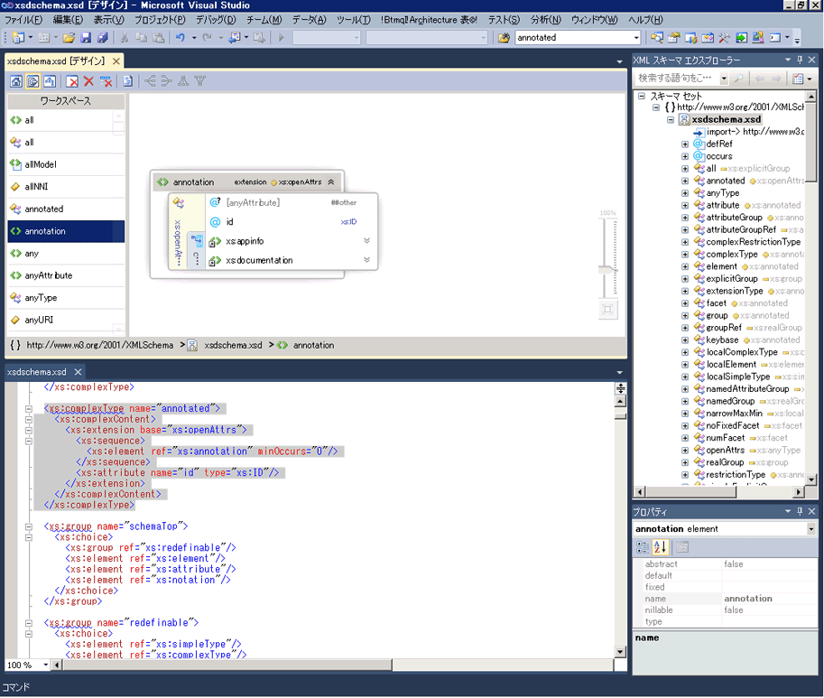

# XML エディターとの統合

XML スキーマデザイナーは、XML エディターと統合されています。 XML エディターで XSD ファイルを変更すると、 [Xml スキーマエクスプローラー](../xml-tools/xml-schema-explorer.md)に変更が反映されます。 [グラフビュー](../xml-tools/graph-view.md)または[コンテンツモデルビュー](../xml-tools/content-model-view.md)が開いている場合は、そこにも変更が反映されます。 XML スキーマデザイナーと XML エディターの間を移動するには、次の方法があります。

- XML エディターでノードを右クリックし、 **[Xml スキーマエクスプローラーで表示]** をクリックします。

- グラフビューと**XML スキーマエクスプローラー**で、ノードをダブルクリックするか、ノードを右クリックして [コードの**表示**] を選択します。 コンテンツモデルビューで、ノードを右クリックし、 **[コードの表示]** を選択します。

次のスクリーンショットは、 **xml スキーマエクスプローラー**で開かれている xml スキーマを示しています。 **XML スキーマエクスプローラー**では、スキーマセットがツリービューで表示されます。 Xml エディターには、 **Xml スキーマエクスプローラー**で現在アクティブになっているノードのテキストビューが表示されます。

XML エディターとグラフィカルデザイナーでコードを並べて表示すると便利な場合があります。 両方のファイルを同時に表示するには、XML エディター内の任意の場所を右クリックし、 **[デザイナーの表示]** をクリックします。 Visual Studio の Windows メニューで、**水平 (または垂直) の新しいタブグループ** を選択します。

## 関連項目

- [XML スキーマ エクスプローラー](../xml-tools/xml-schema-explorer.md)
